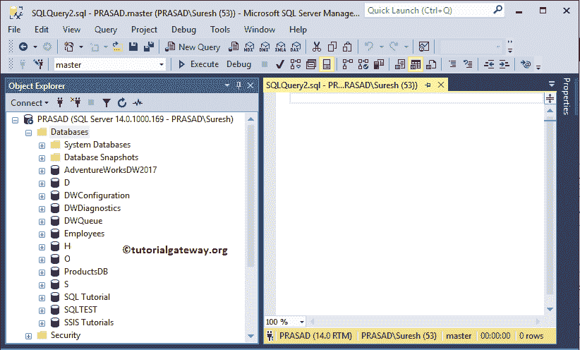
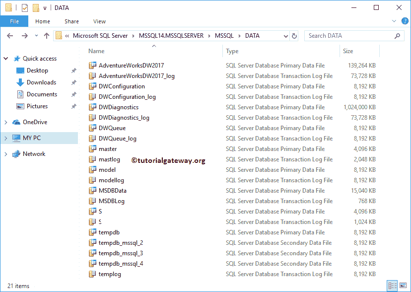
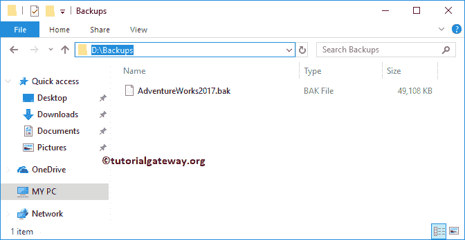
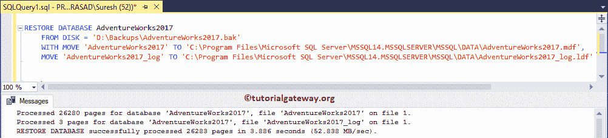
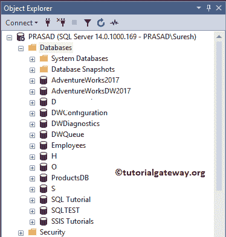
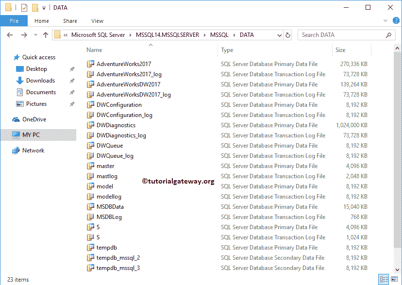
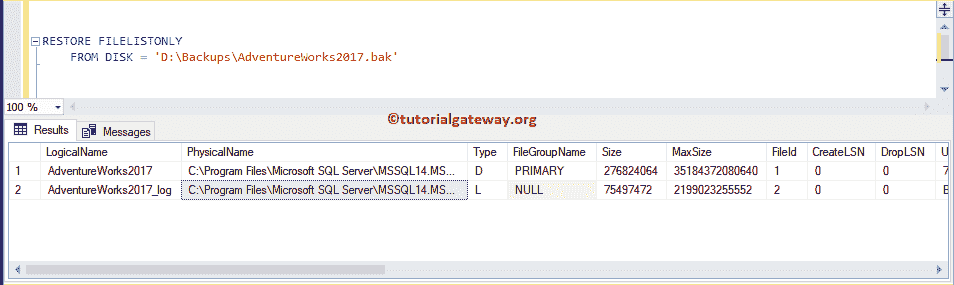

# SQL 还原数据库

> 原文:[https://www.tutorialgateway.org/sql-restore-database/](https://www.tutorialgateway.org/sql-restore-database/)

在本节中，我们将向您解释使用 BAK 文件的 SQL 恢复数据库过程的分步方法。对于这个在 SQL Server 中还原数据库的演示，我们使用了冒险作品 2017 .bak

## 使用 BAK 文件还原数据库

在本例中，我们将使用 BAK 文件来恢复数据库。SQL server 没有 AdventureWorks2017 数据库

提示:创建备份请参考[备份](https://www.tutorialgateway.org/backup-sql-database/)，在 [Sql Server](https://www.tutorialgateway.org/sql/) 中创建定期备份请参考[维护计划](https://www.tutorialgateway.org/sql-maintenance-plan/)。



如您所见，对应于冒险作品 2017 的 MDF 和 LDF 不在 c 盘



我们的硬盘中有一个冒险作品备份文件，我们将使用这个 bak 来恢复一个数据库。



从备份文件还原数据库的语法

```
RESTORE DATABASE DatbaseName
	FROM DISK = 'D:\Backups\BackupFileName.bak'
	WITH MOVE 'LogicalMDFFileName' TO 'location\MDFFileName.mdf',
	MOVE 'LogicalLDFFileName' TO 'location\LDFFileName.ldf'
```

让我使用上面的语法来恢复冒险作品。

```
RESTORE DATABASE AdventureWorks2017
	FROM DISK = 'D:\Backups\AdventureWorks2017.bak'
	WITH MOVE 'AdventureWorks2017' TO 'C:\Program Files\Microsoft SQL Server\MSSQL14.MSSQLSERVER\MSSQL\DATA\AdventureWorks2017.mdf',
	MOVE 'AdventureWorks2017_log' TO 'C:\Program Files\Microsoft SQL Server\MSSQL14.MSSQLSERVER\MSSQL\DATA\AdventureWorks2017_log.ldf'
```

执行查询，并成功附加数据库。



现在你可以看到冒险作品 2017



上述过程已自动将中密度纤维板和 LDF 添加到 c 盘



如果您不知道逻辑名称，请使用恢复文件系统来检索逻辑文件名。

```
RESTORE FILELISTONLY 
	FROM DISK = 'D:\Backups\AdventureWorks2017.bak'
```

