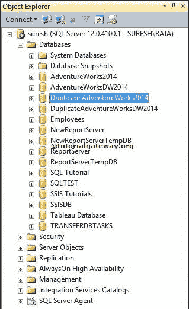
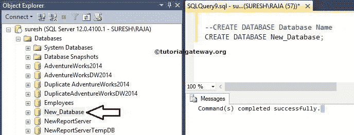
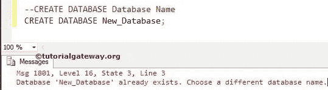
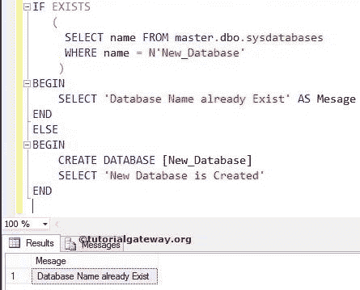
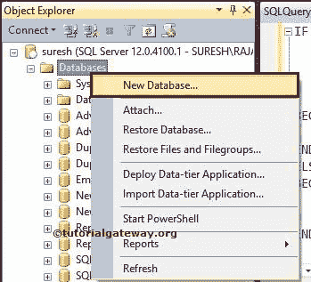
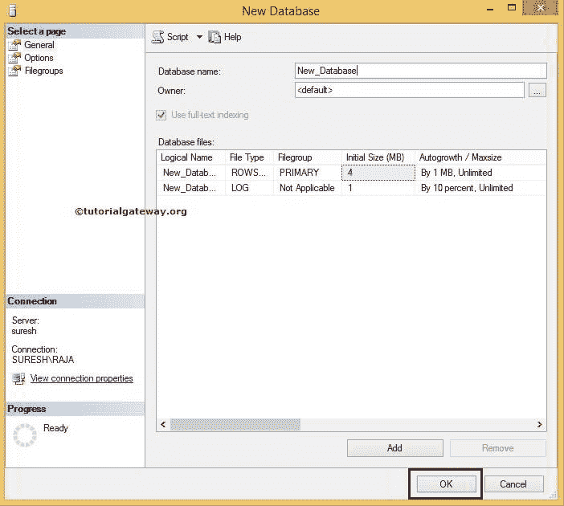
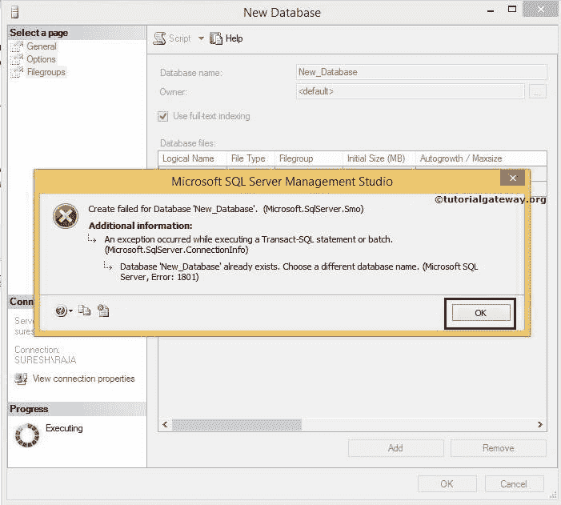
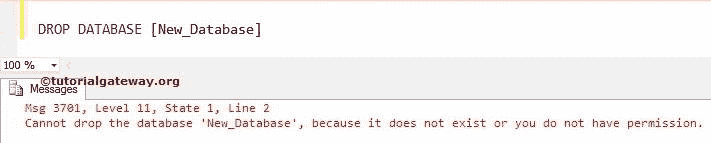

# 如何在 SQL Server 中创建数据库

> 原文：<https://www.tutorialgateway.org/how-to-create-database-in-sql-server/>

Sql Server 中的数据库是我们可以存储业务数据的存储位置。SQL 数据库使用表以规范化的方式存储我们的信息。因此，通过在 Sql Server 中创建数据库，我们可以轻松地选择、更新和删除业务数据。

让我们看看如何在 SQL Server 中创建数据库、重命名和删除数据库，并分别给出一个示例。

## 如何在 SQL Server 实例中创建数据库

在我们开始在 SQL Server 中创建新数据库之前，让我们看看可用数据库的列表。Sql Server 当前实例中可用数据库的列表如下。



创建数据库的语法是:

```
CREATE DATABASE DatabaseName
```

在本例中，我们在 Sql Server 中创建了一个名为 New_Database 的新数据库。所以，在 [SQL Server](https://www.tutorialgateway.org/sql/) 查询窗口中，用 New_Database 替换数据库名。

```
CREATE DATABASE New_Database;
```

单击执行按钮执行创建数据库命令。

SQL 创建数据库命令成功执行，您可以在我们的对象资源管理器中看到 New_Database。如果在 Sql Server 对象资源管理器中没有找到新创建的数据库，请点击



刷新按钮

让我们看看，当我们再次执行相同的创建数据库命令时，会发生什么。它抛出了一个错误:New_database 已经存在。请选择不同的名称。



### 如何检查数据库名称是否存在

在一个组织中，我们可能有也可能没有了解 SQL Server 中可用数据库的权限。因此，检查数据库名称是否已经存在总是明智的。这可以通过两种方式实现:

只有当系统数据库中的 New_database 不可用时，以下语句才会执行 SQL 创建数据库语句

```
IF NOT EXISTS 
   (
     SELECT name FROM master.dbo.sysdatabases 
     WHERE name = N'New_Database'
    )
CREATE DATABASE [New_Database]
```

我们只是将 [If](https://www.tutorialgateway.org/sql-if-else/) [Not Exists](https://www.tutorialgateway.org/sql-not-exists-operator/) 替换为 [If Exists](https://www.tutorialgateway.org/sql-exists-operator/) 并添加了`SELECT`语句来显示消息。以下陈述中涉及的步骤是:

*   如果 New_database 已经存在，那么下面的查询将显示一条消息，说明数据库已经存在
*   仅当系统数据库中的新建数据库不可用时，才执行创建数据库命令

```
IF EXISTS 
   (
     SELECT name FROM master.dbo.sysdatabases 
    WHERE name = N'New_Database'
    )
BEGIN
    SELECT 'Database Name already Exist' AS Message
END
ELSE
BEGIN
    CREATE DATABASE [New_Database]
    SELECT 'New Database is Created'
END
```

它将在系统数据库中检查数据库名称 New_database。

```
 SELECT name FROM master.dbo.sysdatabases 
     WHERE name = N'New_Database'
```

如果数据库不存在，则只执行下面的 create Databse 语句

```
CREATE DATABASE [New_Database]
```

否则，执行以下命令。它将显示一条消息，说明数据库已经存在

```
SELECT 'Database Name already Exist' AS Message
```



## 如何在 SSMS 中创建数据库

要在 SQL server 中创建新数据库，首先打开 [SSMS](https://www.tutorialgateway.org/sql-server-management-studio/)。右键单击数据库文件夹，然后选择新建数据库..



上下文菜单中的选项

选择该选项后，将打开以下窗口。在这里，我们将所有者保留为默认值，数据库名称保留为 New_database，如下所示。单击“确定”在 Sql Server 中创建新数据库



让我们看看当我们用现有名称创建数据库时会发生什么。可以观察到它抛出了一个错误



## 如何在 SQL Server 中删除数据库

要删除 SQL server 中的数据库，我们可以简单地使用以下语法

删除或删除数据库的语法是:

```
DROP DATABASE [DatabaseName]
```

在本例中，我们将删除 New_Database。因此，在查询窗口中，请编写以下 SQL Drop Database 查询

```
DROP DATABASE [New_Database]
```

让我们看看，当我们再次执行相同的 SQL Drop Database 命令时会发生什么:



从上面的截图可以观察到它抛出了一个错误:New_database 不存在。

更好的方法是检查 SQL 数据库名称是否存在。因为有时，你的学院或团队领导可能会删除你试图删除的数据库。

```
IF EXISTS 
   (
     SELECT name FROM master.dbo.sysdatabases 
     WHERE name = N'New_Database'
    )
DROP DATABASE [New_Database]
```

```
Messages
-------
Command(s) completed successfully.
```

以下语句将在系统数据库中检查数据库名称 New_database。

```
 SELECT name FROM master.dbo.sysdatabases 
     WHERE name = N'New_Database'
```

如果数据库存在，那么将只执行以下 SQL drop 数据库语句

```
DROP DATABASE [New_Database]
```

## 如何在 SQL Server 中重命名数据库

要在 SQL server 中重命名数据库，我们可以简单地使用系统存储过程 sp_renamedb

在 Sql Server 中重命名数据库的语法是:

```
SP_RENAMEDB [Old Name],[New Name]
```

在这个例子中，我们用 New_Db 重命名 New_Database。因此，在查询窗口中，请编写以下查询

```
SP_RENAMEDB  [New_Database],[New_Db]
```

```
Messages
-------
The database name 'New_Db' has been set.
```