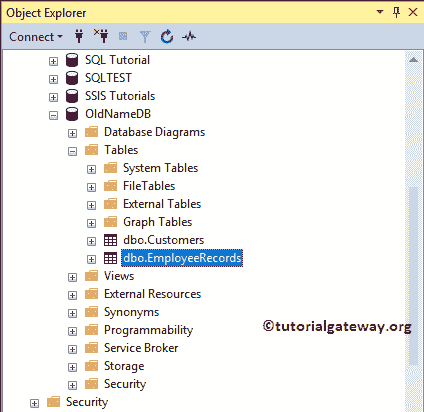
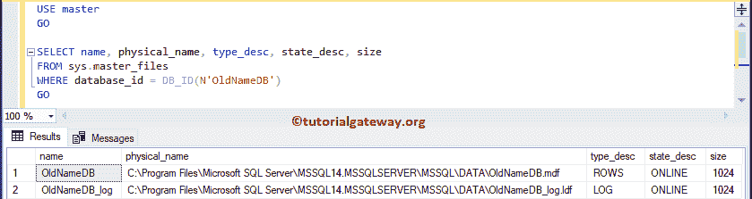
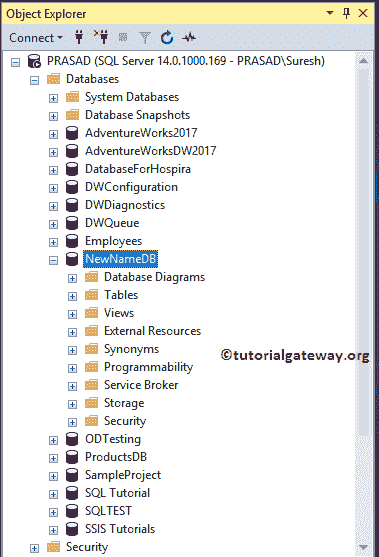
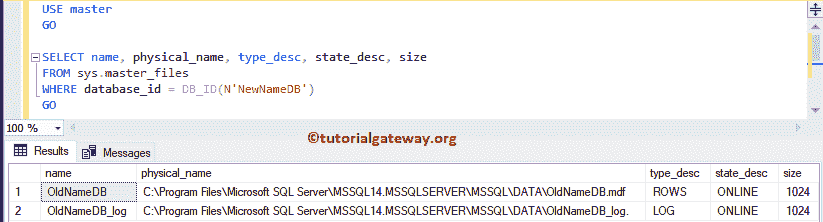
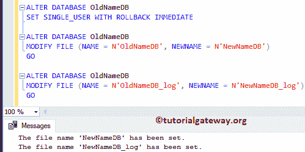
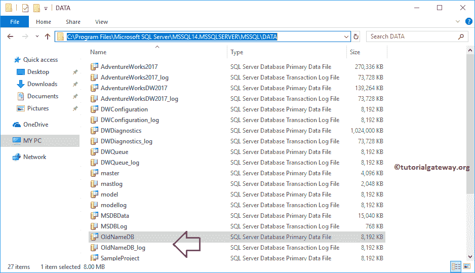
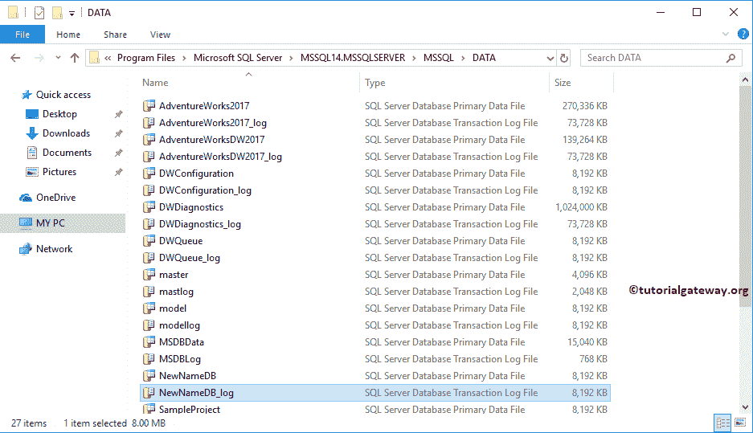
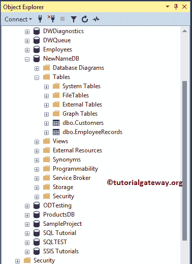
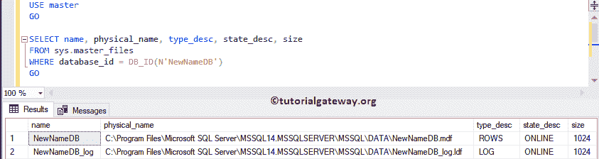

# SQL Server 重命名数据库和文件

> 原文：<https://www.tutorialgateway.org/sql-server-rename-database-along-with-files/>

本节将向您展示如何在 Sql Server 中重命名数据库以及文件(MDF 和 LDF)。在这个 SQL Server 重命名数据库的演示中，我们创建了一个数据库旧名称数据库。



下面的 SQL Server 查询将显示逻辑文件名和数据库的物理位置

```sql
USE master
GO

SELECT name, physical_name, type_desc, state_desc, size 
FROM sys.master_files
WHERE database_id = DB_ID(N'NewNameDB')
GO
```



## SQL Server 重命名数据库

通常，我们使用 sp_renamedb 存储过程来重命名数据库。但是，这只会更改出现在这里的名称。

```sql
EXEC sp_renamedb 'NewNameDB', 'OldNameDB'
```

```sql
Messages
--------
The database name 'NewNameDB' has been set.
```

您可以在 [SQL Server](https://www.tutorialgateway.org/sql/) 对象浏览器

T4 下看到新名称

让我执行下面的[数据库](https://www.tutorialgateway.org/how-to-create-database-in-sql-server/)查询

```sql
USE master
GO

SELECT name, physical_name, type_desc, state_desc, size 
FROM sys.master_files
WHERE database_id = DB_ID(N'NewNameDB')
GO
```

您可以从输出中看到 sp_renamedb 没有更改逻辑数据库名称或代表数据库的文件。



让我将数据库重命名为 OldNameDB，并以指定的方式执行以下操作。

## 重命名数据库和文件

在 SQL Server 中，重命名数据库和文件涉及修改 MDF 和 LDF 文件名。它将修改数据库的逻辑名称。

```sql
-- Set the database to Single User
ALTER DATABASE OldNameDB 
SET SINGLE_USER WITH ROLLBACK IMMEDIATE

ALTER DATABASE OldNameDB 
MODIFY FILE (NAME = N'OldNameDB', NEWNAME = N'NewNameDB')
GO

ALTER DATABASE OldNameDB 
MODIFY FILE (NAME = N'OldNameDB_log', NEWNAME = N'NewNameDB_log')
GO
```



它将分离旧名称数据库。分离数据库后，您可以修改物理位置中的文件名

```sql
USE master
GO

EXEC sp_detach_db @dbname = N'OldNameDB'
GO
```

```sql
Messages
--------
Commands completed successfully.
```

自己导航到数据库的位置



我们重新命名了 MDF，而 LDF 命名



它将在 SQL Server 中使用我们之前更改过的文件名创建一个名为 NewNameDB 的新数据库

```sql
USE master
GO

CREATE DATABASE NewNameDB ON
(FILENAME = N'C:\Program Files\Microsoft SQL Server\MSSQL14.MSSQL Server\MSSQL\DATA\NewNameDB.mdf'),
(FILENAME = N'C:\Program Files\Microsoft SQL Server\MSSQL14.MSSQL Server\MSSQL\DATA\NewNameDB_log.ldf') 
FOR ATTACH
GO
```

```sql
Messages
--------
Commands completed successfully.
```

现在你可以看到数据库有了一个新名字



让我看看逻辑文件名和文件

```sql
USE master
GO

SELECT name, physical_name, type_desc, state_desc, size 
FROM sys.master_files
WHERE database_id = DB_ID(N'NewNameDB')
GO
```



我想，我忘了将数据库设置为多用户

```sql
ALTER DATABASE NewNameDB SET MULTI_USER
GO
```

```sql
Messages
--------
Commands completed successfully.
```