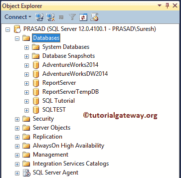
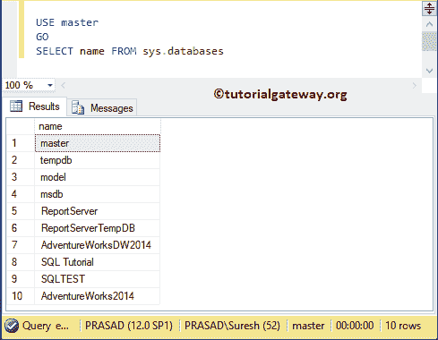
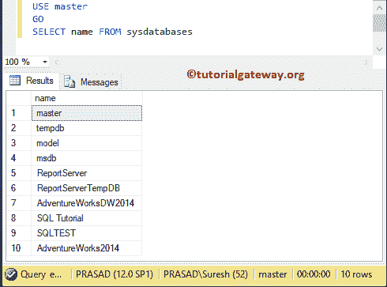
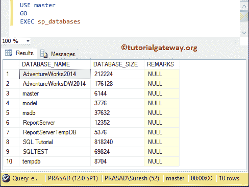
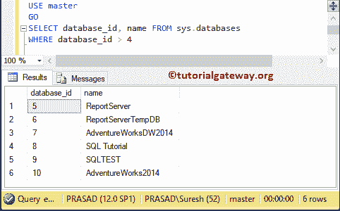
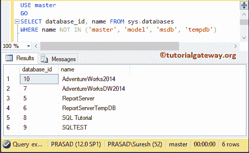

# 从 SQL 服务器获取数据库名称

> 原文：<https://www.tutorialgateway.org/get-database-names-from-sql-server/>

在本文中，我们将通过一个例子展示如何编写一个从 SQL Server 获取数据库名称的 SQL 查询。在当前实例中可用的数据库列表。



## 获取数据库名称示例 1

在这里，我们将向您展示如何在 Sql Server 中获取数据库名称

```
USE master
GO
SELECT name FROM sys.databases
```



您也可以使用 sysdatabases 来获取 SQL Server 中的数据库列表。

```
USE master
GO
SELECT name FROM sysdatabases
```



或者，使用 sp_databases [存储过程](https://www.tutorialgateway.org/stored-procedures-in-sql/)获取 [Sql Server](https://www.tutorialgateway.org/sql/) 中的数据库列表。

```
USE master
GO
EXEC sp_databases
```



## 获取数据库名称示例 2

在这个例子中，我们将限制结果。我的意思是，我们将在没有系统数据库的服务器中获得数据库名称。如果您知道数据库 id，请使用以下查询显示除系统数据库之外的数据库列表

```
USE master
GO
SELECT database_id, name FROM sys.databases
WHERE database_id > 4
```



或者，尝试[不在](https://www.tutorialgateway.org/sql-not-in-operator/)操作器中

```
USE master
GO
SELECT database_id, name FROM sys.databases
WHERE name NOT IN ('master', 'model', 'msdb', 'tempdb')
```

