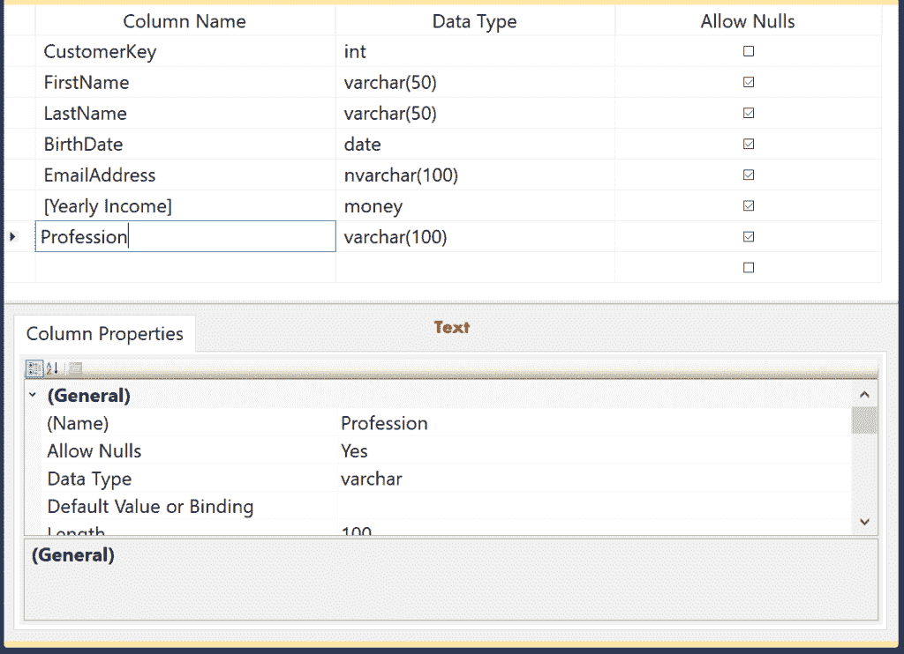

# 创建表

> 原文：<https://www.tutorialgateway.org/sql-create-table/>

众所周知，SQL 使用表来存储和管理数据。SQL Server 表是行和列的组合。为了创建表，我们必须使用 SQL 创建表语句。SQL Server 创建表的基本语法是

```
CREATE TABLE [TableName]
(
    Column_Name1 Data_Type(Size) [NULL | NOT NULL],
    Column_Name2 Data_Type(Size) [NULL | NOT NULL],
     …
    Column_NameN Data_Type(Size) [NULL | NOT NULL]
);
```

Sql Server 创建表语法项

*   如果你写已经存在的名字，它会抛出一个错误
*   列名:空或非空表中的唯一列。
*   数据类型:列将保存的有效数据类型。例如，整数、货币、Varchar、Nvarchar 和日期
*   大小:像 Varchar、nvarchar、char 这样的数据类型需要大小，所以请在这里提供有效的数字
*   空值或非空值:如果选择空值选项，则该列将同时接受正常值和空值。否则，它将抛出一个错误，说列不应该为空

## SQL 创建表示例

在这个 SQL create table 语句示例中，我们在数据库中创建了一个名为 Customer 的新表

```
CREATE TABLE [Customer]
(
  [CustomerKey] [int] NOT NULL,
  [Name] [varchar](150) NULL,
  [DateOfBirth] [date] NULL,
  [EmailAddress] [nvarchar](50) NULL,
  [Profession] [nvarchar](100) NULL
)
GO
```

该命令成功执行，您可以在对象资源管理器中看到新创建的表。

```
Messages
-------
Command(s) completed successfully.
```

从上面的 Sql Server 创建表代码中，您可以观察到我们声明了 5 列:

*   我们的第一列是整数数据类型的客户标识，它不允许空值。
*   名称列属于 Varchar 数据类型，它允许空值。我们还将大小指定为 150，这意味着这两列最多可以接受 150 个字符
*   第三列是日期数据类型的日期，允许空值。这将允许我们只输入日期值
*   电子邮件地址和职业列属于非空数据类型，它将允许空值。

注意:在 [SQL Server](https://www.tutorialgateway.org/sql/) 中开始创建表之前，建议[检查表是否存在](https://www.tutorialgateway.org/how-to-check-if-a-table-exists-in-sql-server/)。

让我向您展示对象资源管理器中新创建的表。请展开“列”文件夹以查看可用的列。如果没有找到，请单击对象资源管理器中的刷新按钮。


### 创建带有标识列的表

在这个 SQL create table 示例中，我们创建了一个带有标识列的表。为此，我们将“客户密钥”列定义为“身份”列。这将自动生成从 1 开始并递增 1 的数字。(如果需要，这是可选的您可以完全删除 IDENTITY (1，1)部分)

```
CREATE TABLE [Customer11]
(
  [CustomerKey] [int] IDENTITY(1,1) NOT NULL,
  [FirstName] [varchar](50) NULL,
  [LastName] [varchar](50) NULL,
  [BirthDate] [date] NULL,
  [EmailAddress] [nvarchar](50) NULL,
  [Yearly Income] [money] NULL,
  [Profession] [nvarchar](100) NULL
)
GO
```

```
Messages
-------
Command(s) completed successfully.
```

见新创建的


### 用主键创建表

如何在 Sql Server 中用主键列创建表？我们刚刚将主关键字添加到客户关键字中。这将在客户键列上创建主键。

```
CREATE TABLE [Customer111]
(
  [ID] [int] IDENTITY(1,1) NOT NULL,
  [CustomerKey] [int] NOT NULL PRIMARY KEY,
  [FirstName] [varchar](50) NOT NULL ,
  [LastName] [varchar](50) NULL,
  [BirthDate] [date] NULL,
  [EmailAddress] [nvarchar](50) NULL,
  [Yearly Income] [money] NULL,
  [Profession] [nvarchar](100) NULL
)
GO
```


### 创建包含所有约束的表

SQL create Table 语句创建具有标识列、主键约束、唯一键和检查约束的表？。建议参考[主键](https://www.tutorialgateway.org/sql-primary-key/)、[唯一键](https://www.tutorialgateway.org/sql-unique-constraint/)、[默认约束](https://www.tutorialgateway.org/sql-default-constraint/)、[检查约束](https://www.tutorialgateway.org/sql-check-constraint/)文章。如你所见，

*   姓氏将接受唯一值。
*   如果用户没有为“专业”列提供值，那么 SQL 会将“软件开发人员”写入默认值
*   检查约束检查年龄值是否在 0 到 100 之间

```
CREATE TABLE [Customer11111]
(
  [ID] [int] IDENTITY(1,1) NOT NULL,
  [CustomerKey] [int] NOT NULL PRIMARY KEY,
  [FirstName] [varchar](50) NOT NULL ,
  [LastName] [varchar](50) NOT NULL UNIQUE,
  [Age] [int] NULL,
  [EmailAddress] [nvarchar](50) NULL,
  [Yearly Income] [money] NULL,
  [Profession] [nvarchar](100) NOT NULL DEFAULT ('Software Developer'),
  CONSTRAINT CK_Customer11111_Age CHECK([Age] > 0 AND [Age] <= 100)
)
GO
```

```
Messages
-------
Command(s) completed successfully.
```

如果在对象资源管理器中展开表定义，您可以看到所有这些约束


### 从另一个表创建表

它提供[选择进入语句](https://www.tutorialgateway.org/sql-select-into-statement/)来使用现有的表和数据(如果有的话)创建一个表..我们将要使用的数据


以下查询使用员工定义创建新表 Customer111111，并插入员工中存在的所有记录

```
SELECT  [EmpID], [FirstName], [LastName], [Education]
 ,[Occupation], [YearlyIncome], [Sales], [HireDate]
 INTO [SQL Tutorial].[dbo].[Customer1111111]
  FROM [SQL Tutorial].[dbo].[Employee]
```

```
Messages
-------
(14 row(s) affected)
```

这里面的数据

```
SELECT  [EmpID], [FirstName], [LastName], [Education]
 ,[Occupation], [YearlyIncome], [Sales], [HireDate]
  FROM [SQL Tutorial].[dbo].[Customer1111111]
```


## 在管理工作室中创建表

在[管理工作室](https://www.tutorialgateway.org/sql-server-management-studio/)对象浏览器中，展开要在 Sql Server 中创建表的[数据库](https://www.tutorialgateway.org/how-to-create-database-in-sql-server/)文件夹。请选择“表格”文件夹，右键单击它将打开上下文菜单。选择新建选项，然后选择表格..选项。


它将打开以下窗口，键入列名、[数据类型和复选框，以决定该列是否允许空值。如您所见，我们添加了 7 个不同数据类型的列。](https://www.tutorialgateway.org/sql-data-types/)

[](https://www.tutorialgateway.org/sql-data-types/)

### 使用管理工作室添加标识列

让我向您展示，如何使用 Management Studio 向已创建的表中添加标识列。首先，选择列并转到列属性选项卡。请在“身份规范”属性中将“身份”选项从默认的“否”更改为“是”。


完成后，请单击保存按钮并重命名表名。


单击确定完成保存。写下面的 [Select 语句](https://www.tutorialgateway.org/sql-select-statement/)检查表中是否保存了所有的列名。


提示:您可以使用 [INSERT 语句](https://www.tutorialgateway.org/sql-insert-statement/)，或者[INSERT in](https://www.tutorialgateway.org/sql-insert-into-select-statement/)将数据插入到这个新创建的语句中。

## 创建本地和全局临时

在这里，我们创建本地和全局临时或临时表。请参考[温度表](https://www.tutorialgateway.org/temp-table-in-sql-server/)一文。

```
-- Local Temp
CREATE TABLE # LocalTemp
(
 [ID] [int] IDENTITY(1,1) NOT NULL,
 [Name] [nvarchar](255) NULL,
 [Occupation] [nvarchar](255) NULL,
 [Sales] [float] NULL
)
GO

-- Global Temp
CREATE TABLE ## GlobalTemp
(
 [ID] [int] IDENTITY(1,1) NOT NULL,
 [Name] [nvarchar](255) NULL,
 [Occupation] [nvarchar](255) NULL,
 [YearlyIncome] [float] NULL,
 [Sales] [float] NULL
)
GO
```

