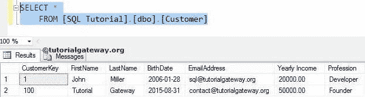
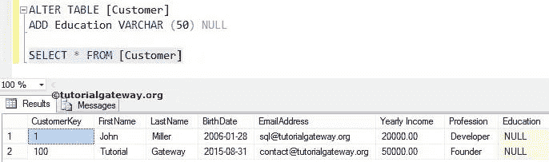
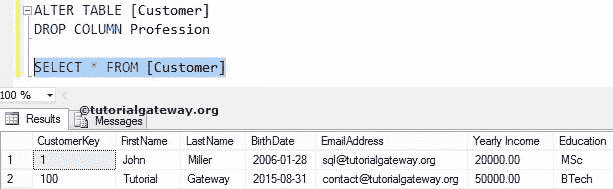
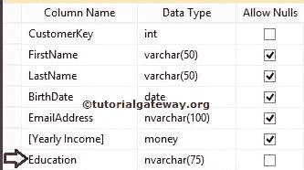
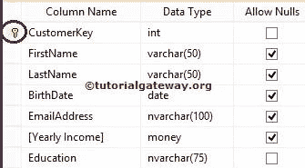

# SQL 更改表

> 原文：<https://www.tutorialgateway.org/sql-alter-table/>

SQL 更改表语句用于更改表。SQL Server 变更表包括添加新列、修改现有列、删除现有列、添加或删除索引、删除和添加约束(如主键)到现有表。

## SQL 更改表示例

以下是 Alter Table 添加、修改和删除列和约束的一些示例。让我们通过一个实例来看看如何使用这个语句来更改表定义。对于这个查询，我们使用客户。



### SQL 更改表添加新列

要向现有表中添加新列，请使用以下语法

```
ALTER TABLE [Table_Name]
ADD [New_Column_Name] Data_Type (Length) NULL | NOT NULL
```

我们将向现有的表客户添加教育专栏

```
ALTER TABLE [Customer]

ADD Education VARCHAR (50) NULL
```

从上面的代码 [SQL Server](https://www.tutorialgateway.org/sql/) 片段来看，教育列属于 varchar 数据类型，数据长度为 50，允许空值。



### SQL 更改表删除列

要从 SQL 表中删除现有列，请使用以下语法

```
ALTER TABLE [Table_Name]
DROP COLUMN [Column_Name]
```

我们将从客户表中删除名为 Profession 的现有列。

```
ALTER TABLE [Customer]

DROP COLUMN Profession
```



### 更改表更改列数据类型

要更改或修改表中的现有列数据类型，请使用以下语法

```
-- change Column data type
ALTER TABLE [Table_Name]
ALTER COLUMN [Column_Name] Data_Type NULL |NOT NULL
```

在这里，我们将教育列数据类型从 Varchar 更改为 Nvarchar，长度从 50 更改为 75

```
-- change data type
ALTER TABLE [Customer]
ALTER COLUMN Education NVARCHAR(75)
```

要更改空功能以限制空值或允许空值，请使用以下代码。

```
-- change Column data type
ALTER TABLE [Customer]
ALTER COLUMN Education NVARCHAR(75) NOT NULL
```



我们成功地更改了 SQL 表中现有列的数据类型、长度和空值处理。

### 添加主键

要向现有列添加主键和外键，请使用以下 SQL Server alter table 添加约束语法

```
-- Add primary key
ALTER TABLE [Customer]
ADD CONSTRAINT [Constraint_Name] PRIMARY KEY ([Column_Name])
```

向客户键列添加主键约束

```
-- Add primary key
ALTER TABLE [Customer]
ADD CONSTRAINT PrimaryKey PRIMARY KEY ( [CustomerKey] )
```



### SQL 更改表删除约束

要删除或删除现有列上的主键和外键，请使用 Alter Table Drop 约束语法

```
-- Drop Constraint
ALTER TABLE [Customer]
DROP CONSTRAINT [Constraint_Name]
```

删除以前在客户键列上创建的主键约束。

```
--  Drop Constraint 
ALTER TABLE [Customer] DROP CONSTRAINT PrimaryKey
```