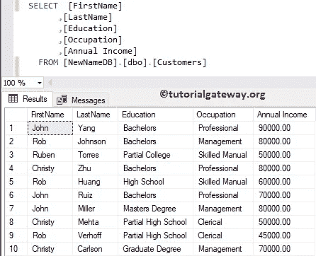
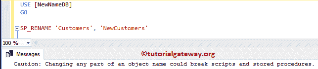
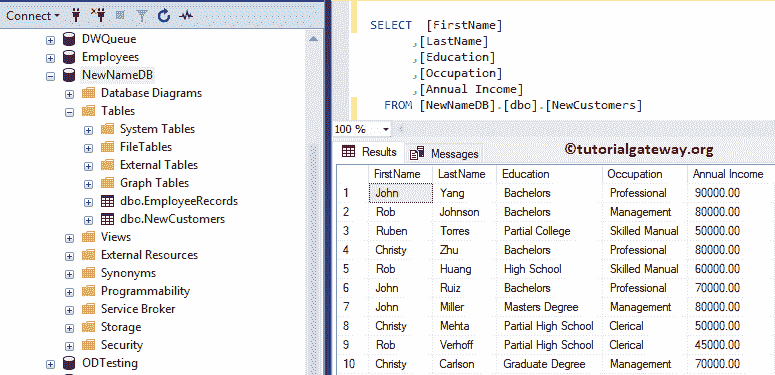
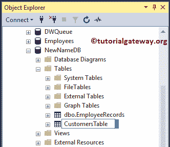
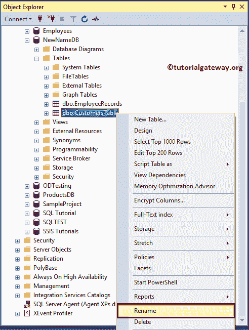
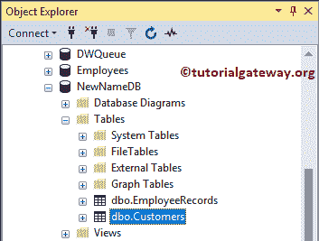

# SQL 重命名表

> 原文：<https://www.tutorialgateway.org/sql-rename-table/>

如何用实例重命名 SQL Server 中的表？。为了证明这一点，我们使用下面显示的客户。



## SQL 重命名表名示例

有一个名为 SP_RENAME 的存储过程可以重命名表名。在这个 SQL 重命名表的例子中，我们将使用这个 sp 来更改客户。在现有的 sp_rename 上使用该语法如下所示。

```
SP_RENAME '[Old Table Name]', '[New Table Name]'
```

我们使用上面的 sp_rename 语法将客户更改为新客户





## 使用 SQL 管理工作室

如果可以进入[管理工作室](https://www.tutorialgateway.org/sql-server-management-studio/)，双击 [SQL Server](https://www.tutorialgateway.org/sql/) 表可以更改名称。让我把名字改成客户表



### 方法 2

在对象资源管理器中，转到它所在的数据库。接下来，请右键单击它，并从上下文菜单中选择重命名。



我们将名称更改为“客户”，从下图中，您可以看到新的。

