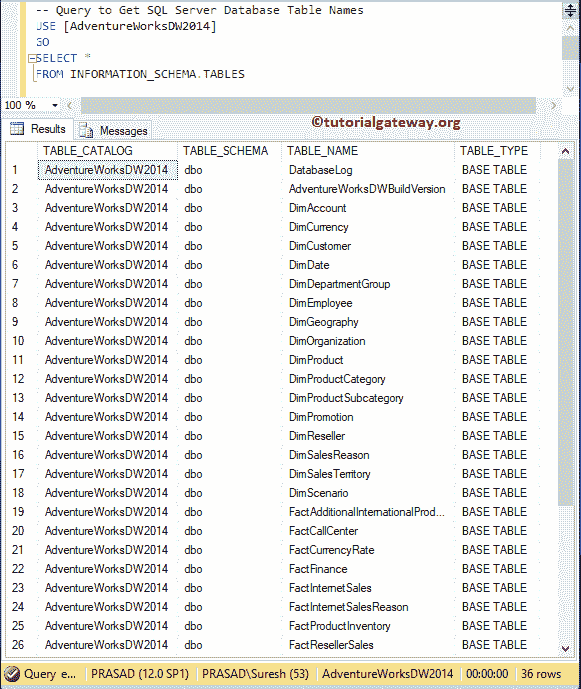
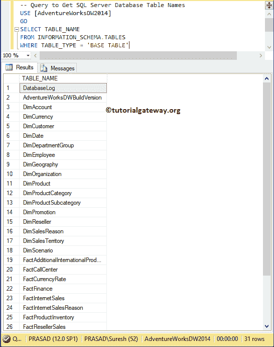
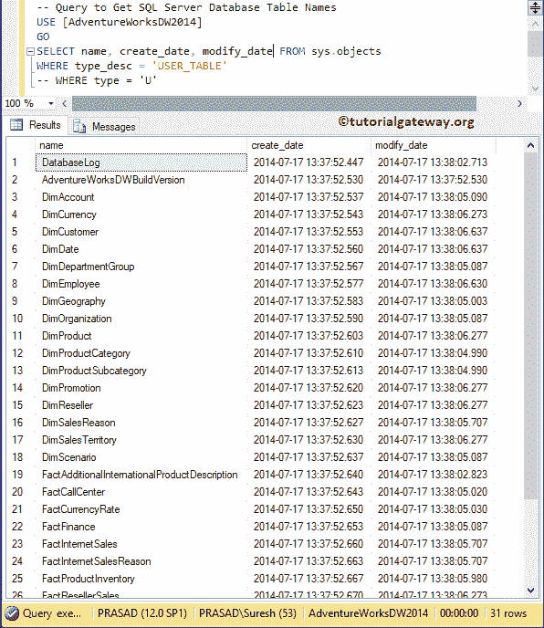
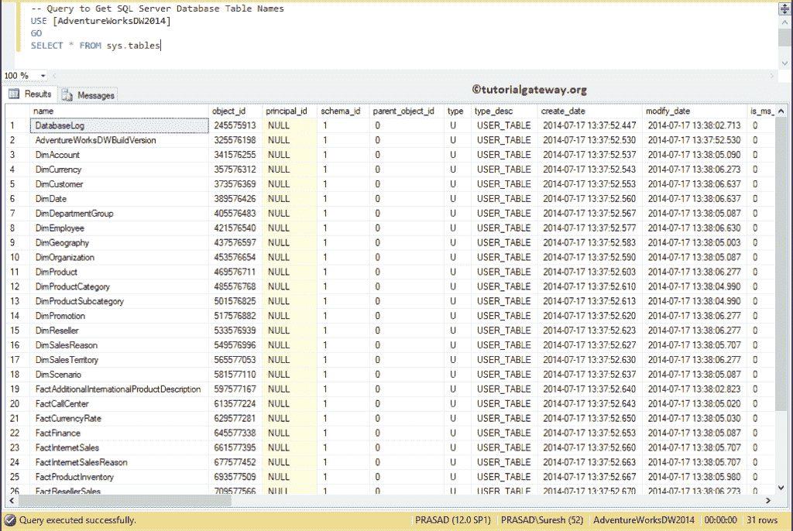
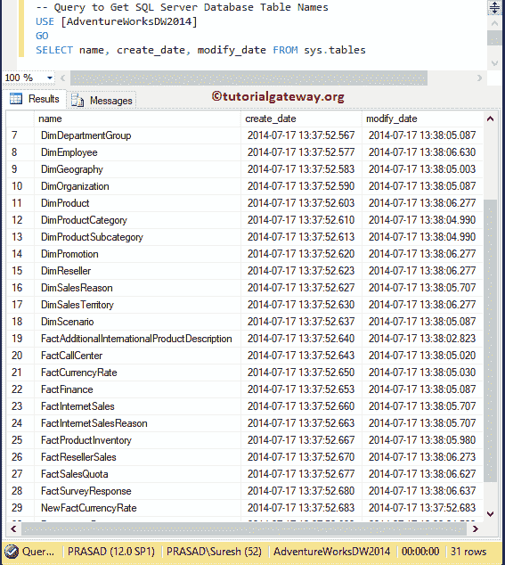

# 从 SQL Server 数据库获取表名

> 原文：<https://www.tutorialgateway.org/get-table-names-from-sql-server-database/>

在本文中，我们将通过示例向您展示如何编写一个 SQL 查询来从 SQL Server 数据库中获取表名。

## 从 SQL Server 数据库获取表名示例 1

为了在 Sql Server 数据库演示中获得表名列表，我们使用了 [AdventureWorks DW](https://www.tutorialgateway.org/download-and-install-adventureworks-database/) 数据库。在这个 SQL 示例查询中，我们将向您展示如何获取数据库中的表名列表。

```sql
-- Query to Get SQL Server Database Table Names
USE [AdventureWorksDW2014]
GO
SELECT *
FROM INFORMATION_SCHEMA.TABLES
```



您也可以使用 [`WHERE`子句](https://www.tutorialgateway.org/sql-where-clause/)和 information_schema 表来限制 [SQL](https://www.tutorialgateway.org/sql/) 服务器中的表名列表。

```sql
-- Query to Get SQL Server Database Table Names
USE [AdventureWorksDW2014]
GO
SELECT TABLE_NAME
FROM INFORMATION_SCHEMA.TABLES
WHERE TABLE_TYPE = 'BASE TABLE'
```



## 获取数据库中的表名示例 2

在本例中，我们使用 sys.objects 表来查找 SQL Server 中的表名列表。

```sql
-- Query to Get SQL Server Database Table Names
USE [AdventureWorksDW2014]
GO
SELECT name, create_date, modify_date FROM sys.objects
WHERE type_desc = 'USER_TABLE'
-- WHERE type = 'U'
```



我们使用 sys.tables 表来查找表名列表。

```sql
USE [AdventureWorksDW2014]
GO
SELECT * FROM sys.tables
```



您也可以使用下面显示的查询从 sys.tables 中选择所需的列。这样，您可以看到所需的列，如表名、创建日期和表修改日期等。

```sql
USE [AdventureWorksDW2014]
GO
SELECT name, create_date, modify_date FROM sys.tables
```

