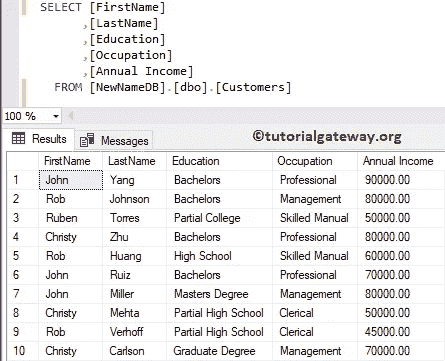
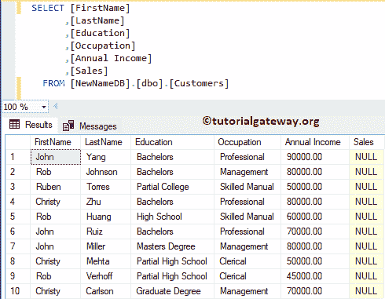
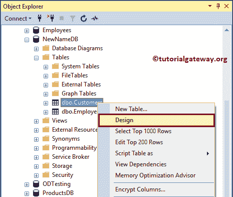
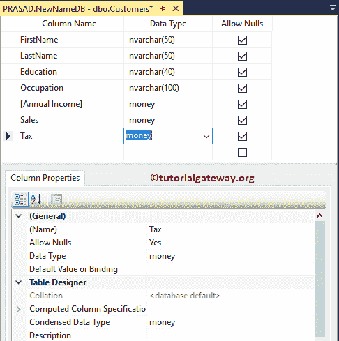
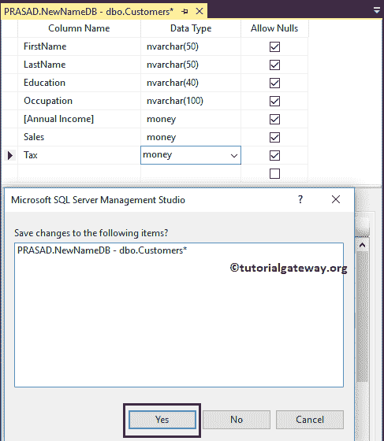
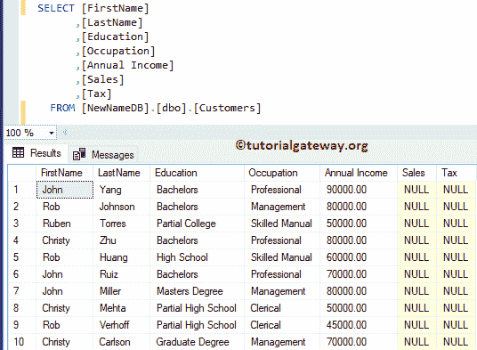

# SQL 添加列

> 原文：<https://www.tutorialgateway.org/sql-add-column/>

在 SQL 中，添加列用于向现有表中添加新列。在本演示中，我们使用了客户。



## SQL 添加列示例

要向现有表中添加新表，请使用以下 transact-SQL Alter table Add Column 语法。

```sql
ALTER TABLE [Table_Name]
ADD [New_Column] Data_Type (Length) NULL | NOT NULL
```

让我插入允许现有客户为空的销售

```sql
USE [NewNameDB]
GO

ALTER TABLE Customers
ADD Sales MONEY NULL
```

```sql
Messages
-------
Commands completed successfully.
```

在上面的[服务器](https://www.tutorialgateway.org/sql/)代码中，我们添加了货币销售[数据类型](https://www.tutorialgateway.org/sql-data-types/)，它将允许空值。可以看到新的 col



### 利用 SSMS

在[Management Studio](https://www.tutorialgateway.org/sql-server-management-studio/)中，右键点击表格，选择设计。



选择“设计”选项将在设计模式下打开表格。让我插入一个名为货币税数据类型的新列。



单击关闭按钮将显示弹出窗口。请选择“是”按钮保存更改。



现在你可以看到新加入的税。

