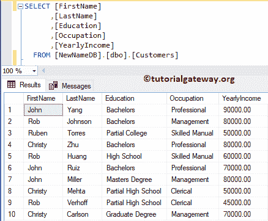
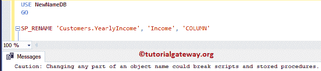
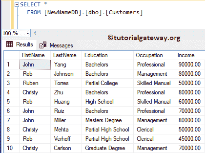
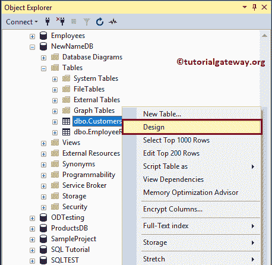
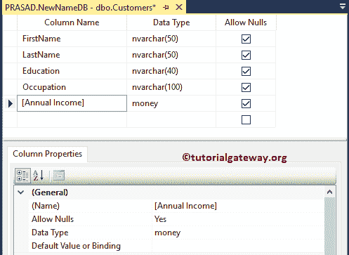
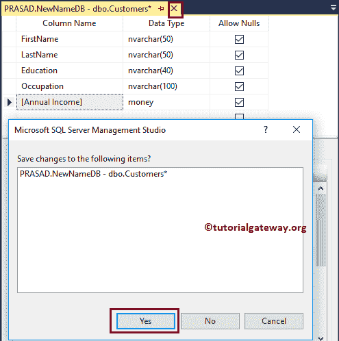
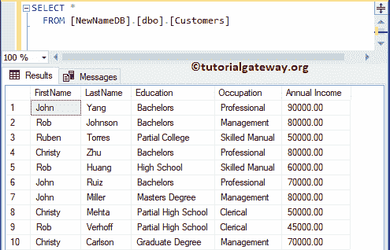

# SQL 重命名列

> 原文：<https://www.tutorialgateway.org/sql-rename-column/>

在 SQL Server 中，有一个名为 SP_RENAME 的标准存储过程来重命名列名。这种方法的语法是

```
SP_RENAME '[Table Name].[Old Column Name]', '[New Column Name]', COLUMN'
```

## SQL 重命名列示例

在本例中，我们将使用这个 SP_RENAME 存储过程更改名称。为了演示 SQL 重命名列，我们使用下表。



我们使用上面指定的[服务器](https://www.tutorialgateway.org/sql/)语法或[存储过程](https://www.tutorialgateway.org/stored-procedures-in-sql/)将 YearlyIncome 重命名为新名称:Income

```
USE NewNameDB
GO

SP_RENAME 'Customers.YearlyIncome', 'Income', 'COLUMN'
```





见变化

## 使用 SSMS 重命名列

如果可以进入[管理工作室](https://www.tutorialgateway.org/sql-server-management-studio/)，那么右键点击表格，从上下文菜单中选择设计，改变列名。



选择“设计”选项将在设计模式下打开表格。让我把收入改为年收入



单击关闭按钮，并从显示的弹出窗口中选择是按钮，以保存您在设计窗口中所做的更改。



查看更改后的名称。

