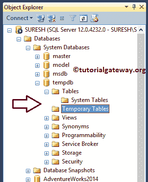

# SQL 服务器中的临时表

> 原文:[https://www.tutorialgateway.org/temp-table-in-sql-server/](https://www.tutorialgateway.org/temp-table-in-sql-server/)

SQL Server 中的临时表或临时表可以在运行时创建，并执行普通表可以执行的所有操作。SQL Server 中有两种类型的临时表，它们是本地临时表和全局临时表。让我们看看如何在 SQL Server 中同时使用本地和全局临时表。下面的列表向您展示了我们可以在哪里使用 SQL 临时表:

*   当我们处理复杂连接时，存储临时数据。
*   它们对于替换昂贵的游标很有用。我们可以使用它们来存储结果集数据，并从中操作数据。
*   当我们在存储过程中进行大量的行操作时，可以使用这个 SQL 临时表。请记住，如果我们在存储过程中为中间结果创建这个，它只适用于该服务点。这意味着您不能在存储过程之外调用它们。

## 在 SQL Server 中创建本地临时表

SQL 本地临时表的名称以哈希(“#”)符号开头，并存储在 tempdb 中。SQL 本地临时表仅在当前连接中可用。如果用户断开与当前实例的连接或关闭查询窗口，则 SQL 本地临时表会自动删除。

### SQL Server 语法中的本地临时表

Sql 服务器中本地临时表背后的语法

```
CREATE TABLE #[LocalTableName]
(
    Column_Name1 Data_Type(Size) [NULL | NOT NULL],
    Column_Name2 Data_Type(Size) [NULL | NOT NULL],
     …
    Column_NameN Data_Type(Size) [NULL | NOT NULL]
);
```

这里，SQL 本地临时表的 LocalTableName 应该以#开头。请记住，请提供唯一的名称。如果您给现有的名称，它将抛出一个错误

让我们创建一个名为 LocalTemp 的 SQL 本地临时表。

```
CREATE TABLE #LocalTemp
(
	[ID] [int] IDENTITY(1,1) NOT NULL,
	[FirstName] [nvarchar](255) NULL,
	[LastName] [nvarchar](255) NULL,
	[Occupation] [nvarchar](255) NULL,
	[YearlyIncome] [float] NULL,
	[Sales] [float] NULL
)
```

我们创建了一个临时选项卡，并声明了 6 列。这里，我们的第一列是整数数据类型的标识，它不允许空值。我们还将这个 [SQL Server](https://www.tutorialgateway.org/sql/) 列定义为 Identity，从 1 开始，递增 1。请刷新对象资源管理器，查看在


新建的本地临时表

### 将数据插入到 SQL Server 的本地临时表中

让我在临时数据库中使用 [INSERT 语句](https://www.tutorialgateway.org/sql-insert-statement/)创建的 SQL 本地临时表中插入一些随机记录或示例记录。

```
INSERT INTO #LocalTemp (
	    [FirstName], [LastName], [Occupation], [YearlyIncome], [Sales])
VALUES ('Tutorial', 'Gateway', 'Education', 10000, 200)
      ,('Imran', 'Khan', 'Skilled Professional', 15900, 100)
      ,('Doe', 'Lara', 'Management', 15000, 60)
      ,('Ramesh', 'Kumar', 'Professional', 65000, 630)
```

我们成功地在 SQL Server 的本地临时表中插入了 4 条随机记录。


### 从本地临时表中选择数据

让我使用 [SELECT 语句](https://www.tutorialgateway.org/sql-select-statement/)来选择 Sql Server 中本地临时表中存在的记录。

```
SELECT [FirstName], 
       [LastName], 
       [Occupation], 
       [YearlyIncome], 
       [Sales] 
FROM #LocalTemp
```


到目前为止，您可能想知道为什么我要在一个查询窗口中编写 Create、Insert 和 Select 语句？。因为 SQL 本地临时表将持续一个会话，如果您试图从新的查询窗口调用这个表，那么它将抛出一个错误。例如，让我从一个新的查询窗口


调用#LocalTemp

正如您所看到的，Sql Server 中的本地临时表抛出了一个错误，指出无效的对象名#LocalTemp。现在，让我关闭所有现有的查询窗口，并从对象资源管理器刷新 tempdb



从上面的截图中，可以看到它并不包含我们的#LocalTemp。

## 在 SQL Server 中创建全局临时表

SQL 全局临时表的名称以双哈希(“##”)符号开头，并存储在 tempdb 中。这些就像是永久的，并且在该实例中所有用户都可以使用。如果所有用户从他们的会话断开连接，SQL 全局临时表将自动删除。

### 全局临时表语法

Sql Server 中全局临时表背后的语法

```
CREATE TABLE ##[Global Temp Table Name]
(
    Column_Name1 Data_Type(Size) [NULL | NOT NULL],
    Column_Name2 Data_Type(Size) [NULL | NOT NULL],
     …
    Column_NameN Data_Type(Size) [NULL | NOT NULL]
);
```

SQL 全局临时表名应以##开头。请提供唯一的，否则会引发错误。让我们创建一个名为全局临时表的 SQL 全局临时表。

```
CREATE TABLE ##GlobalTemp
(
	[ID] [int] IDENTITY(1,1) NOT NULL,
	[FirstName] [nvarchar](255) NULL,
	[LastName] [nvarchar](255) NULL,
	[Education] [nvarchar](255) NULL,
	[Occupation] [nvarchar](255) NULL,
	[YearlyIncome] [float] NULL,
	[Sales] [float] NULL
)
```

我们为此声明了 7 列。请参阅 Sql Server 中新创建的全局临时表。


### 将数据插入全局临时文件

让我在 Sql Server 的全局临时表中插入一些示例或随机记录，该表是我们使用 [INSERT 语句](https://www.tutorialgateway.org/sql-insert-statement/)在临时数据库中创建的。

```
INSERT INTO ##GlobalTemp (
	    [FirstName], [LastName], [Education], [Occupation], [YearlyIncome], [Sales])
VALUES ('Tutorial', 'Gateway', 'Masters Degree', 'Teaching', 12000, 200)
      ,('Imran', 'Khan', 'Bachelors', 'Skilled Professional', 13900, 100)
      ,('Doe', 'Lara', 'Degree', 'Management', 25000, 60)
      ,('Ramesh', 'Kumar', 'Bachelors', 'Professional', 35400, 630)
```


### 从 SQL Server 中的全局临时表中选择

在这里，我们成功地将 4 条随机记录插入到##GlobalTemp 中。让我使用 [SELECT 语句](https://www.tutorialgateway.org/sql-select-statement/)来选择在 Sql Server 的全局临时表中出现的记录。

```
SELECT [ID],
       [FirstName], 
       [LastName], 
       [Education], 
       [Occupation],
       [YearlyIncome], 
       [Sales] 
FROM ##GlobalTemp
```


接下来，让我从一个新的查询窗口


调用 SQL 中的##Global Temp 表

它显示的是记录，而不是抛出错误。现在，让我关闭所有现有的查询窗口，并从对象浏览器


刷新 tempdb

现在您可以看到 tempdb 数据库中没有。请参考[光标](https://www.tutorialgateway.org/static-cursor-in-sql-server/)和[存储过程](https://www.tutorialgateway.org/stored-procedures-in-sql/)文章。