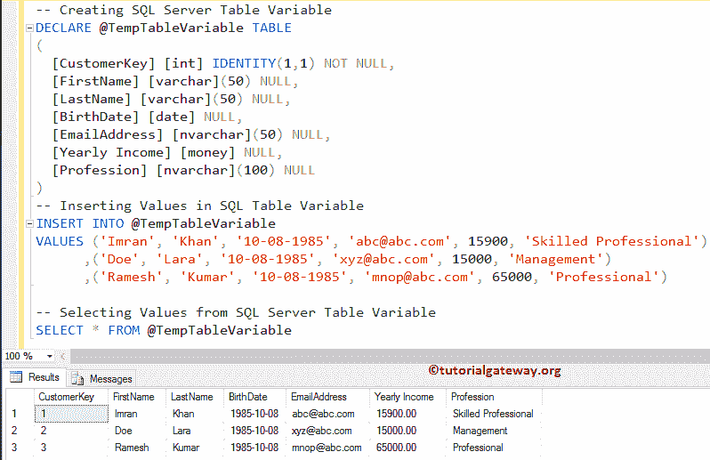
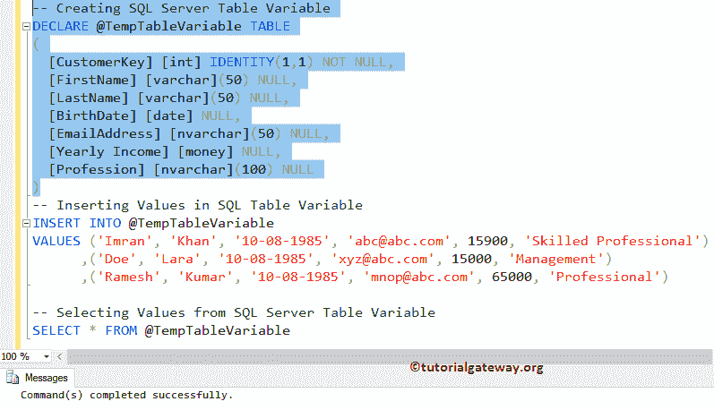
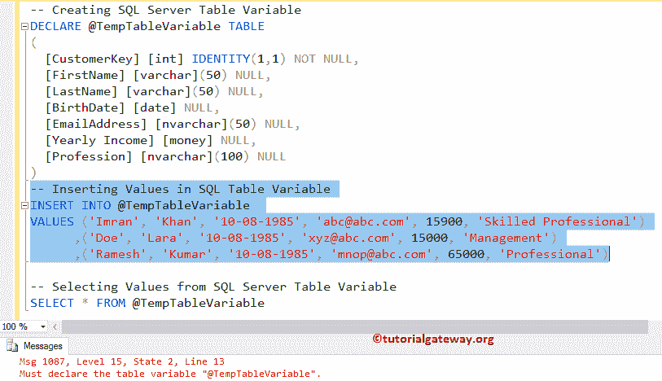

# SQL Server 中的表变量

> 原文：<https://www.tutorialgateway.org/table-variable-in-sql-server/>

SQL Server 中的表变量像表一样存储一组记录。表变量是临时表的最佳选择。像局部变量一样，表变量的作用域仅限于用户定义的函数或存储过程。

与临时表相比，SQL Table 变量非常快，建议在数据量较少的情况下使用它。表变量的语法类似于创建表语句。

```sql
DECLARE @Table_Variable_Name TABLE
(
    Column_Name1 Data_Type(Size) [NULL | NOT NULL],
    Column_Name2 Data_Type(Size) [NULL | NOT NULL],
     …
    Column_NameN Data_Type(Size) [NULL | NOT NULL]
);
```

## 创建 Sql 表变量示例

让我们看看如何在 [SQL Server](https://www.tutorialgateway.org/sql/) 中创建一个表变量，如何在其中插入新的记录。以及，如何从中选择记录。

提示:不能将其用作输入或输出参数。

```sql
DECLARE @TempTableVariable TABLE
(
  [CustomerKey] [int] IDENTITY(1,1) NOT NULL,
  [FirstName] [varchar](50) NULL,
  [LastName] [varchar](50) NULL,
  [BirthDate] [date] NULL,
  [EmailAddress] [nvarchar](50) NULL,
  [Yearly Income] [money] NULL,
  [Profession] [nvarchar](100) NULL
)
-- Inserting Values
INSERT INTO @TempTableVariable 
VALUES ('Imran', 'Khan', '10-08-1985', '[email protected]', 15900, 'Skilled Professional')
      ,('Doe', 'Lara', '10-08-1985', '[email protected]', 15000, 'Management')
      ,('Ramesh', 'Kumar', '10-08-1985', '[email protected]', 65000, 'Professional')

-- Selecting Values
SELECT * FROM @TempTableVariable
```



我们一起执行所有语句。让我告诉你当我们独立运行它们时会发生什么。

申报这个不会有任何问题！



输出



注意:你不需要任何 [DELETE](https://www.tutorialgateway.org/sql-delete-statement/) 或者 DROP 语句来删除这个。当数据库引擎退出作用域时，它将自动删除。

我希望你理解它的范围。请参考[临时](https://www.tutorialgateway.org/temp-table-in-sql-server/)、[用户定义函数](https://www.tutorialgateway.org/user-defined-functions-in-sql/)、[存储过程](https://www.tutorialgateway.org/stored-procedures-in-sql/)和[创建表](https://www.tutorialgateway.org/sql-create-table/)。