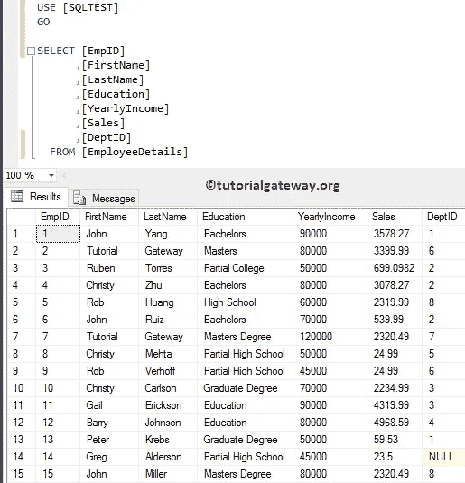
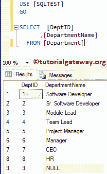
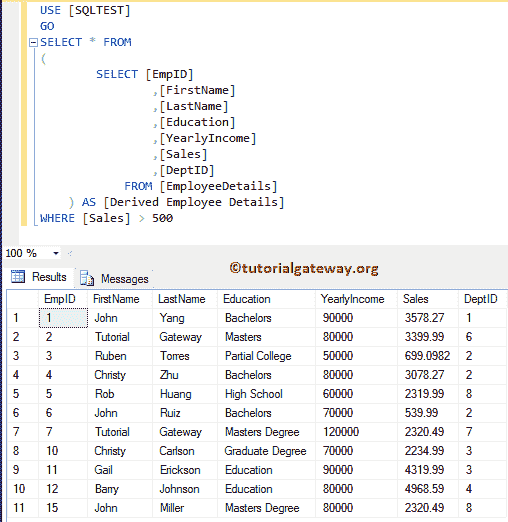
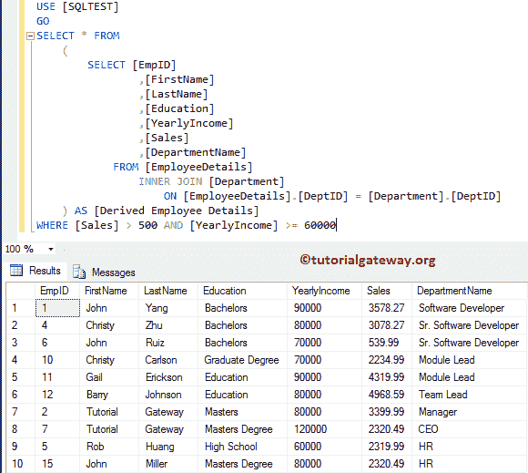
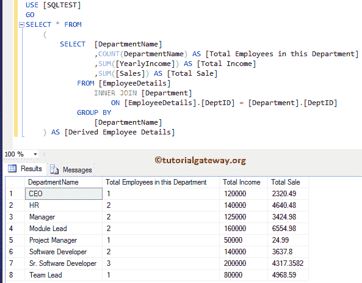
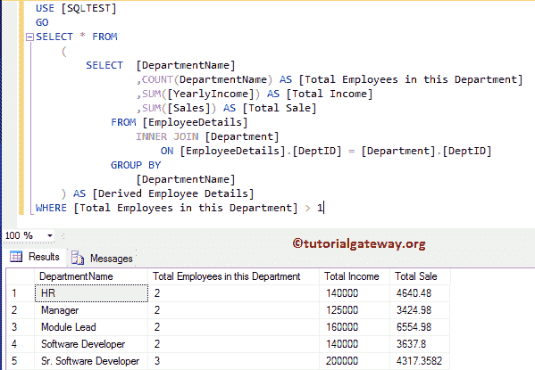
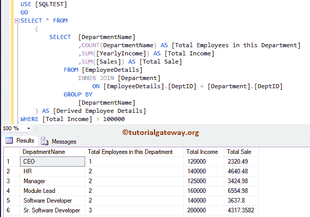

# SQL 派生表

> 原文：<https://www.tutorialgateway.org/sql-derived-table/>

SQL 派生表只不过是在 From 子句中使用的子查询。对于这个 SQL Server 派生表示例，我们将使用[SQL 测试]数据库中的两个表(员工详细信息和部门)。员工详细信息表中的数据为:



部门表中的数据为:



## SQL 派生表示例 1

这是一个演示 SQL Server 派生表的简单示例。下面的 [SQL](https://www.tutorialgateway.org/sql/) 查询将显示雇员表中销售额大于 500 的所有列。

```
USE [SQLTEST]
GO
SELECT * FROM
(
	SELECT [EmpID]
		,[FirstName]
		,[LastName]
		,[Education]
		,[YearlyIncome]
		,[Sales]
		,[DeptID]
	FROM [EmployeeDetails]
) AS [Derived Employee Details]
WHERE [Sales] > 500
```

第一个 SELECT *语句是从内部`SELECT`语句或[子查询](https://www.tutorialgateway.org/sql-subquery/)中派生列。



## SQL 派生表示例 2

在本例中，我们将在派生表中使用[连接](https://www.tutorialgateway.org/sql-joins/)概念。以下查询将显示销售金额大于 500，年收入大于或等于 60000 的员工和部门表中的所有匹配列。对于这个 SQL 派生表的演示，我们使用的是[内部连接](https://www.tutorialgateway.org/sql-inner-join/)。

```
USE [SQLTEST]
GO
SELECT * FROM
	(
		SELECT [EmpID]
			,[FirstName]
			,[LastName]
			,[Education]
			,[YearlyIncome]
			,[Sales]
			,[DepartmentName]
		FROM [EmployeeDetails]
		INNER JOIN [Department]
			ON [EmployeeDetails].[DeptID] = [Department].[DeptID]
	) AS [Derived Employee Details]
WHERE [Sales] > 500 AND [YearlyIncome] >= 60000
```



## SQL Server 派生表示例 3

以下查询统计了每个部门中的员工总数、他们的销售额和年薪总额。

对于这个 SQL server 派生表示例，我们使用[内部连接](https://www.tutorialgateway.org/sql-inner-join/)从雇员和部门表中获取一列。接下来，我们使用 [GROUP BY 子句](https://www.tutorialgateway.org/sql-group-by-clause/)来聚合列。请参考[聚合函数](https://www.tutorialgateway.org/sql-aggregate-functions/)。

```
USE [SQLTEST]
GO
SELECT * FROM
(
	SELECT  [DepartmentName]
		,COUNT(DepartmentName) AS [Total Employees in this Department]
		,SUM([YearlyIncome]) AS [Total Income]
		,SUM([Sales]) AS [Total Sale]
	FROM [EmployeeDetails]
	INNER JOIN [Department]
	ON [EmployeeDetails].[DeptID] = [Department].[DeptID]
        GROUP BY [DepartmentName]
) AS [Derived Employee Details]
```



在这个 SQL 派生表示例中，我们只是添加了`WHERE`子句来限制雇员。它显示员工数大于 1 的部门名称。

```
USE [SQLTEST]
GO
SELECT * FROM
	(
		SELECT  [DepartmentName]
		  ,COUNT(DepartmentName) AS [Total Employees in this Department]
			,SUM([YearlyIncome]) AS [Total Income]
			,SUM([Sales]) AS [Total Sale]
		FROM [EmployeeDetails]
		INNER JOIN [Department]
		ON [EmployeeDetails].[DeptID] = [Department].[DeptID]
		GROUP BY [DepartmentName]
	) AS [Derived Employee Details]
WHERE [Total Employees in this Department] > 1
```



以下 SQL Server 派生表查询显示员工总收入大于 100000 的部门名称。

```
USE [SQLTEST]
GO
SELECT * FROM
	(
		SELECT  [DepartmentName]
		  ,COUNT(DepartmentName) AS [Total Employees in this Department]
			,SUM([YearlyIncome]) AS [Total Income]
			,SUM([Sales]) AS [Total Sale]
		FROM [EmployeeDetails]
		INNER JOIN [Department]
		ON [EmployeeDetails].[DeptID] = [Department].[DeptID]
		GROUP BY [DepartmentName]
	) AS [Derived Employee Details]
WHERE [Total Income] > 100000
```

