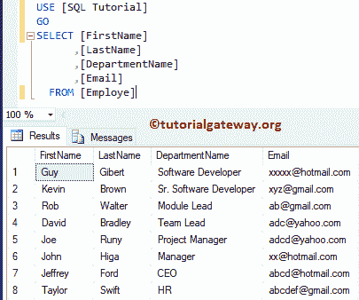

# SQL 数据长度

> 原文:[https://www.tutorialgateway.org/sql-datalength/](https://www.tutorialgateway.org/sql-datalength/)

SQL DATALENGTH 用于返回表示指定表达式的字节数。SQL Server 中数据长度的语法是

```
SELECT DATALENGTH (String_Expression)
FROM [Source]
```

这个 Sql Server 数据长度函数对于 VARCHAR、NVARCHAR、VARBINARY、TEXT、NTEXT 和 IMAGE 数据类型非常有用，因为这些数据类型将存储数据长度。对于这个 SQL Server 示例，我们将使用下表



## SQL 数据长度示例

数据长度函数用于返回表示给定表达式的字节数。下面的查询将显示使用它的多种方法。

[SQL Server](https://www.tutorialgateway.org/sql/) 代码的前四行用于声明[数据类型](https://www.tutorialgateway.org/sql-data-types/) Varchar 和 Nvarchar 的字符串变量，并为这两个变量分配相同的数据。

在下面的两个语句中，我们使用了数据长度函数来计算两个变量的数据长度。我们还使用 [SQL ALIAS](https://www.tutorialgateway.org/sql-alias/) 列为该结果分配了一个新名称“数据长度”。

在下一行中，我们直接在字符串上使用它。

```
DECLARE @String_Exp VARCHAR(50)
SET @String_Exp = 'Learn SQL Server' 

DECLARE @Str_Exp NVARCHAR(50)
SET @Str_Exp = 'Learn SQL Server' 

SELECT DATALENGTH(@String_Exp) AS 'Data Length' 
SELECT DATALENGTH(@Str_Exp) AS 'Data Length'

--Finding directly
SELECT DATALENGTH('SQL Server Tutorial') AS 'Data Length'
SELECT DATALENGTH('SQL Server') AS 'Data Length'
```


函数还允许您查找一列中的字节数。在本例中，我们将找到部门名称和电子邮件列的数据长度。

```
SELECT [FirstName]
      ,[LastName]
      ,[DepartmentName]
      ,DATALENGTH([DepartmentName]) AS [Dept Data Length]
      ,[Email]
      ,DATALENGTH([Email]) AS [Email Data Length]
 FROM [Employe]
```

