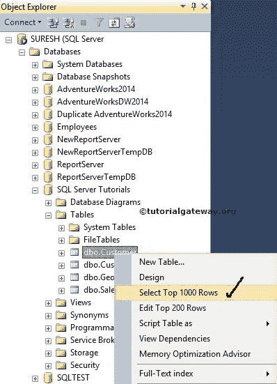

# SQL 选择语句

> 原文:[https://www.tutorialgateway.org/sql-select-statement/](https://www.tutorialgateway.org/sql-select-statement/)

SQL SELECT 语句从一个或多个数据库表中检索数据。在本文中，我们将通过一个例子展示如何在 SQL Server 中编写 SELECT 语句。SQL SELECT 语句的语法是:

```
SELECT [Column Names]
FROM Source
```

列:从表中选择一个或多个数字。

SQL SELECT 语句返回表中的所有记录。如果要限制行，请使用 WHERE 子句或 TOP 子句。要从多个数据库表中挑选数据，可以使用连接。

我们使用这些数据来解释 SQL 选择语句。


## 选择所有列示例

在这个 SQL select 语句示例中，我们使用星号(*)选择客户表中的所有列。在此语句中，*是表示源表中所有可用列的快捷方式。

```
SELECT *
FROM [Customer]
```


### SQL SELECT * FROM 的问题

*   Select * from 语句将从表中检索所有列。大多数情况下，我们不需要表中的所有列。因此，请避免使用*来选择所有的列名。
*   select * from 将以默认顺序选择列。有时我们可能需要在显示 cols 时更改它们的顺序。
*   如果基础表中有任何更改(重新排序列、删除或添加列)，将不会反映使用 SELECT *创建的视图。

请不要实时使用 SQL SELECT * FROM 语句，即使是为了检索表中的所有列。第二种方法，将所有列名放在 SELECT 关键字之后。例如，上面的查询与以下相同:

```
SELECT [FirstName]
      ,[LastName]
      ,[YearlyIncome]
      ,[Education]
      ,[Occupation]
FROM [Customer]
```


## 选择几列

实际上，将所有列放在一个表中并不是这样。所以，你可以在这个语句中限制它们。因为会有一些列，比如条形码、rowguid、照片等。，这可能不需要。

为此，该语句允许我们从表中选择很少或任何特定的列，方法是将所需的列名放在 SELECT 关键字之后。

```
SELECT [FirstName]
      ,[LastName]
      ,[Occupation]
      ,[YearlyIncome]
FROM [Customer]
```


注意:如果我们忘记了列之间的逗号，那么 [SQL Server](https://www.tutorialgateway.org/sql/) 将第二列作为第一列的[别名](https://www.tutorialgateway.org/sql-alias/)名称。所以，请小心

## 管理工作室示例

在[管理工作室](https://www.tutorialgateway.org/sql-server-management-studio/)中，导航至所需的数据库，然后选择所需的表格。右键点击表格会打开带有不同选项的上下文菜单



从上面的上下文菜单中，我们必须选择前 1000 行选项。该选项为我们生成 SQL 选择语句。要查看所有记录，请从上述声明中删除 [TOP 条款](https://www.tutorialgateway.org/sql-top-clause/) (Top 1000)。

