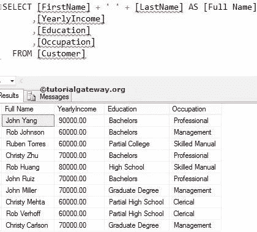

# SQL 别名

> 原文:[https://www.tutorialgateway.org/sql-alias/](https://www.tutorialgateway.org/sql-alias/)

SQL 别名用于临时重命名表名和列标题。在 SQL Server 中，有时列名对用户来说并不友好。所以，我们必须改变它们。

例如，我们将[名字]存储为[名字]或[名字]。当我们读取名字数据时，看到这样的列标题是令人讨厌的。因此，我们使用这个别名概念，并将它们重命名为更方便用户的名称(例如[名字]或[名字])。编写 SQL 别名列名或同义词的语法是

```
SELECT [Column_Name] AS [Name]
FROM [Table_Name]

--OR You can Simply Write without using AS Keyword
SELECT [Column_Name] [Name]
FROM [Table_Name]
```

在查询中，别名、别名关键字是可选的。这取决于你是否包括它。我们使用这些数据来解释 SQL 别名列名。


## SQL 别名示例

在这个 SQL ALIAS 列名或同义词的例子中，我们将重命名上面指定的表中的<font color="#000000">标题</font>，以便于阅读。我们将把[名字]改名为[名字]，把[姓氏]改名为[姓氏]，把[年收入]改名为[年收入]，把[职业]改名为[职业]

```
SELECT [FirstName] AS [First Name]
      ,[LastName] AS [Last Name]
      ,[YearlyIncome] AS [Yearly Income]
      ,[Education]
      ,[Occupation] AS [Profession]
  FROM [Customer]
```


我们添加了[名字]和[姓氏] [SQL](https://www.tutorialgateway.org/sql/) 列来创建全名。接下来，我们将[全名]指定为别名。

```
SELECT [FirstName] + ' ' + [LastName] AS [Full Name]
      ,[YearlyIncome] 
      ,[Education]
      ,[Occupation] 
FROM [Customer]
```



我们还可以将别名应用于计算列(数学计算)。在本例中，我们将向您展示如何将同义词应用于计算字段。

```
SELECT [FirstName] 
      ,[LastName] 
      ,([YearlyIncome]  + 15000) AS Income
      ,[Education]
      ,[Occupation]
  FROM [Customer]
```

我们在[yearly yncome]列的每一条记录中添加了 15000，并将其重命名为收入。

