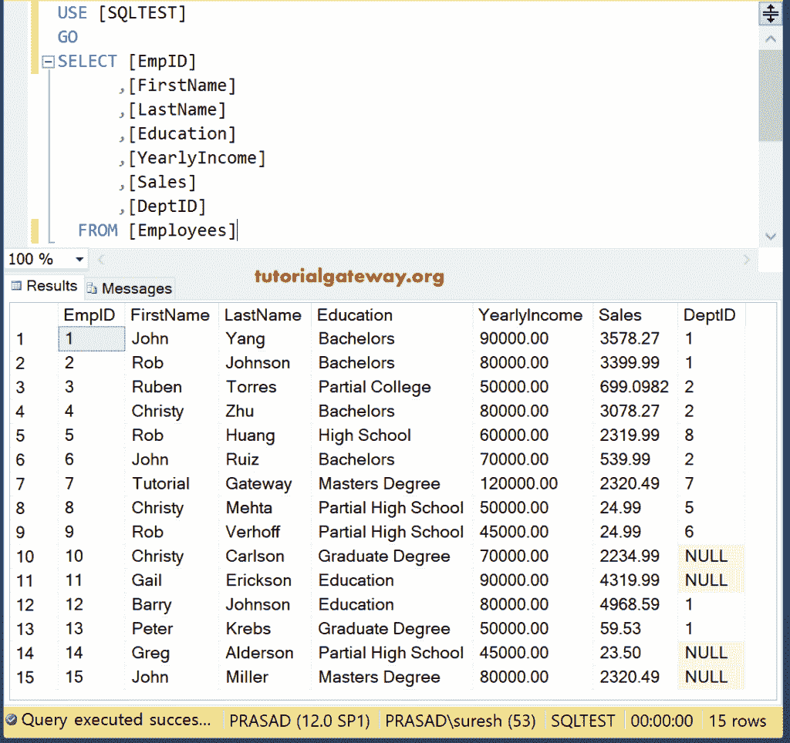

# 选择不同的语句

> 原文：<https://www.tutorialgateway.org/sql-select-distinct-statement/>

SQL SELECT DISTINCT 语句从`SELECT`语句的指定列中检索唯一的记录(通过删除重复项)。SQL Server SELECT DISTINCT 的语法是:

```
SELECT DISTINCT [Column Names]
FROM Source
WHERE Conditions -- This is Optional
```

*   独特:返回独特的列
*   列:它允许我们从表中选择列的数量。它可能是一个或多个。
*   来源:数据库中的一个或多个表。[连接](https://www.tutorialgateway.org/sql-joins/)用于连接 [SQL Server](https://www.tutorialgateway.org/sql/) 中的多个表。

我们使用以下数据来解释 SQL Server Select Distinct。



## 选择不同的单列

在本例中，我们[选择](https://www.tutorialgateway.org/sql-select-statement/)教育栏中的唯一记录。

```
SELECT DISTINCT [Education]
  FROM [Employees]
```


## 选择不同的多列

当我们在多列上使用此语句时，`SELECT`语句返回多列的唯一组合，而不是唯一的单个记录。在本例中，我们选择了“教育”栏和“年收入”栏中的唯一组合记录。

```
SELECT DISTINCT [Education]
 ,[YearlyIncome]
  FROM [Employees]
```


虽然我们在`SELECT`语句中使用了关键字，但它返回了重复项，因为

*   单身汉和 7 万英镑是一个独特的组合
*   单身汉和 80000 是一个独特的组合
*   单身汉和 90000 是一个独特的组合

## SQL 独特的 WHERE 子句

使用 SQL distinct 和 [WHERE 子句](https://www.tutorialgateway.org/sql-where-clause/)。以下唯一语句将返回年收入大于 50000 的唯一教育值

```
SELECT DISTINCT [Education]
 ,[YearlyIncome]
  FROM [Employees]
  WHERE YearlyIncome > 50000
```


SQL DISTINCT 将空记录视为有效的独特记录。因此，请使用任何非空函数([非空](https://www.tutorialgateway.org/sql-is-not-null/))来移除空值

## SQL 不同组示例

还允许我们将聚合函数与[分组依据子句](https://www.tutorialgateway.org/sql-group-by-clause/)一起使用。以下 Sql 唯一查询按教育程度对员工进行分组。接下来，它为每个教育组找到唯一的年收入总和。

```
SELECT [Education]
 ,SUM(DISTINCT  YearlyIncome) AS [Total Income]
  FROM [Employees]
  GROUP BY [Education]
```


让我们从上面的查询中删除关键字。

```
SELECT [Education]
 ,SUM(YearlyIncome) AS [Total Income]
  FROM [Employees]
  GROUP BY [Education]
```

查看年收入的差异。因为它在寻找所有记录的总和(而不是独特的记录)。


## 计数示例

这是最常见的问题之一。本示例计算并返回每个教育组中独特的员工标识。

```
SELECT [Education]
 ,COUNT(DISTINCT EmpID) AS [Total Employees]
  FROM [Employees]
  GROUP BY [Education]
```


这里，我们使用了带有 Distinct 关键字的[计数函数](https://www.tutorialgateway.org/sql-count-function/)，没有。这个独特的 SQL 示例显示了结果集之间的差异。

```
SELECT [Education]
 ,COUNT(DISTINCT DeptID) AS [Total Dept Ids]
 ,COUNT(DeptID) AS [Total Ids]
  FROM [Employees]
  GROUP BY [Education]
```


## 空示例

SQL Server 选择不同语句将空视为一个不同的关键字。

```
SELECT DISTINCT DeptID
  FROM [Employees]
```

