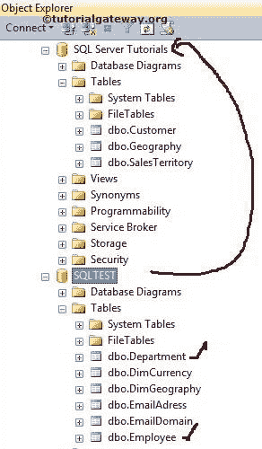
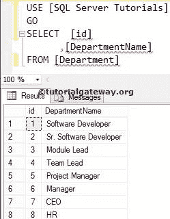
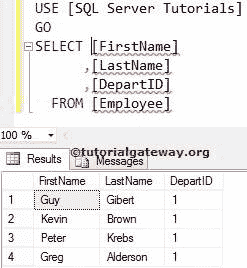
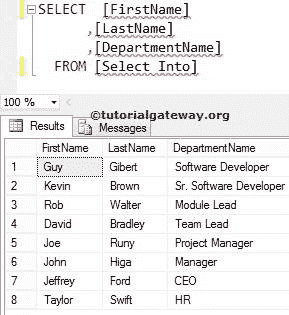

# 选择进入语句

> 原文：<https://www.tutorialgateway.org/sql-select-into-statement/>

SQL SELECT INTO 语句可用于将数据插入表中。SQL 中的 select into 首先创建一个新表。然后，该 SQL SELECT INTO 将`SELECT`语句选择的行插入到新表中。

如果我们没有创建目标表，那么 SQL Server Select Into 语句可以方便地将数据插入到目标表中。如果您有一个现有的表，那么使用[插入`SELECT`语句](https://www.tutorialgateway.org/sql-insert-into-select-statement/)。

## SQL 选择进入语法

SQL Server 选择输入可以写成:

```
SELECT [Column Names]
INTO [New_Table]
FROM Source
WHERE Condition --This is optional
```

*   列:它允许我们从表中选择列数。它可能是一个或多个。
*   New_Table:请为 [SQL Server](https://www.tutorialgateway.org/sql/) 指定完全合格的唯一名称。
*   来源:数据库中存在一个或多个表。使用 [JOINS](https://www.tutorialgateway.org/sql-joins/) 连接多个。

从下面的截图中，您可以看到我们在 SQL Server 数据库教程中没有任何部门或员工表。我们的任务是[从【SQLTEST】数据库中选择](https://www.tutorialgateway.org/sql-select-statement/)该表中的数据，并使用 SQL SELECT INTO 语句将其插入【SQL Server 教程】数据库。



员工内部的数据是


部门表中的数据是


## 插入所有列

这里，我们选择了部门中的所有列，并将它们插入到 SQL Server 数据库中。

```
SELECT [id]
      ,[DepartmentName]
INTO [SQLServer Tutorials].[dbo].[Department]
FROM [SQLTEST].[dbo].[Department]
```

或者我们也可以使用星号(*)。但是使用星号并不是一个好的做法，所以一定要提供列名。

```
SELECT *
INTO [SQLServer Tutorials].[dbo].[Department]
FROM [SQLTEST].[dbo].[Department]
```

上面的查询创建了一个新的[部门]，并插入了来自源数据的所有记录。SQL 执行消息:

```
Messages
-------
(8 rows(s) affected)
```

让我们看看用目标数据库中的数据创建的表是否



在本例中，我们选择了员工中的几个列，并将它们插入到[SQL Server 教程]数据库中。这里，我们也使用 [WHERE 子句](https://www.tutorialgateway.org/sql-where-clause/)来限制行。

```
SELECT [FirstName]
      ,[LastName]
      ,[DepartID]
INTO [SQLServer Tutorials].[dbo].[Employee]
FROM [SQLTEST].[dbo].[Employee]
WHERE [DepartID] = 1
```

上面的查询创建了一个名为[雇员]的新表，并从源数据中插入[名字]、[姓氏]和[部门]列，其中[部门]值等于 1。

```
Messages
-------
(4 rows(s) affected)
```

让我们看看这个表是否是用目标数据库中的数据创建的



## 从多个表中插入数据

本示例使用“员工”和“部门”中的列。接下来，将它们插入[SQL Server 教程]数据库。这里，我们使用 [INNER JOIN](https://www.tutorialgateway.org/sql-inner-join/) 使用 id 列连接两个表。

```
SELECT EMP.[FirstName]
      ,EMP.[LastName]
      ,DEPT.[DepartmentName]
INTO [SQLServer Tutorials].[dbo].[Select Into]
FROM [SQLTEST].[dbo].[Employee] EMP
INNER JOIN
[SQLTEST].[dbo].[Department] DEPT ON
EMP.id = DEPT.id
```

```
Messages
-------
(8 rows(s) affected)
```

让我们看看目的数据库中的数据是否创建

