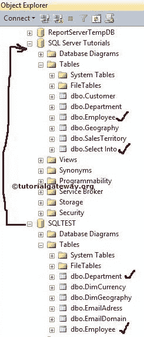
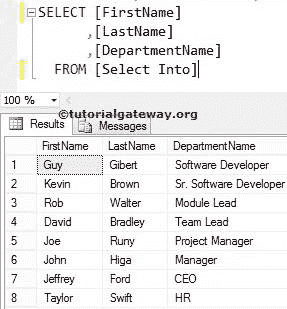

# 插入选择语句

> 原文：<https://www.tutorialgateway.org/sql-insert-into-select-statement/>

SQL 插入选择语句可用于将数据插入表中。此 Sql Server 插入选择语句将把选择语句选择的记录放入现有表中。

如果目标中有现有的表，那么将选定的数据插入到目标表中会非常有用。如果没有创建，使用[选择进入语句](https://www.tutorialgateway.org/sql-select-into-statement/)

## SQL 插入语句语法

SQL Server 插入选择语句的语法是

```
INSERT INTO [DestinationTable] ([Column Names])
SELECT [Column Names]
FROM Source
WHERE Condition --This is optional
```

*   列:允许我们从 [SQL Server](https://www.tutorialgateway.org/sql/) 表中选择列数。它可能是一个或多个。
*   目标表:请提供完全限定名和列名。
*   来源:数据库中存在一个或多个表。使用 [JOINS](https://www.tutorialgateway.org/sql-joins/) 连接多个表。

这里，我们有选择和员工表，它们是空的。我们的任务是[使用 SQL INSERT INTO SELECT 语句选择【SQLTEST】数据库中员工和部门表中的数据，并将其放入【SQL Server 教程】数据库。](https://www.tutorialgateway.org/sql-select-statement/)

[](https://www.tutorialgateway.org/sql-select-statement/)

员工表里面的数据是


部门内部的数据是


## 插入选择语句以插入所有列

我们将选择雇员表中的所有列，并将它们插入数据库中的[雇员]表。

```
INSERT INTO [dbo].[Employee]([FirstName],[LastName],[DepartID])
SELECT [FirstName],[LastName],[DepartID]
FROM [Employee]
```

如果我们知道源表中的列数与 SELECT 语句中的列数完全匹配，那么我们可以忽略目标表的列名。这意味着上面的 SQL 插入选择也可以写成:

```
INSERT INTO [dbo].[Employee]
SELECT [FirstName],[LastName],[DepartID]
FROM [Employee]
```

提示:忽略列名不是好的做法，所以请始终提供列名。

上述查询将从源中选择[名字]、[姓氏]和[部门]列，并插入到数据库的[员工]中。

```
(15 rows(s) affected)
```

让我们看看语句是否将所选数据加载到目的地


## 插入到少列的选择语句中

这里，我们选择雇员表中的几个列，并将它们放入目标表中。虽然我们在目标表中有三列，但是让我们只插入[名字]和[姓氏]。

```
INSERT INTO [dbo].[Employee]([FirstName],[LastName])
SELECT [FirstName],[LastName]
FROM [Employee]
```

从下面的截图中，您可以看到数据只插入了[名字]和[姓氏]列，空值插入了[部门]列


此 SQL Insert Into Select 语句示例选择员工中的几行，并将其放入目标表中。这里我们将使用 [WHERE 子句](https://www.tutorialgateway.org/sql-where-clause/)来限制行。

```
INSERT INTO [dbo].[Employee]([FirstName],[LastName],[DepartID])
SELECT [FirstName],[LastName],[DepartID]
FROM [Employee]
WHERE [DepartID] = 2
```

上面的查询将在[雇员]表中添加源数据的[名字]、[姓氏]和[部门]列，其中[部门]值等于 2。

```
(3 rows(s) affected)
```

让我们看看上面的 transact-SQL 查询是否将选择的数据加载到目标表中


## 插入到从多个表中选择

在此 SQL Server 插入选择语句示例中，我们选择“员工”表和“部门”表中的列，然后将它们插入[选择到]表中。这里我们使用 [INNER JOIN](https://www.tutorialgateway.org/sql-inner-join/) 使用 id 列连接两个表。

```
INSERT INTO [dbo].[Select Into]([FirstName],[LastName],[DepartmentName])
SELECT EMP.[FirstName]
      ,EMP.[LastName]
      ,DEPT.[DepartmentName]
FROM [Employee] EMP
INNER JOIN
[Department] DEPT ON
EMP.id = DEPT.i
```

```
(8 rows(s) affected)
```

让我们看看这个语句是否将所选数据加载到目标中。

