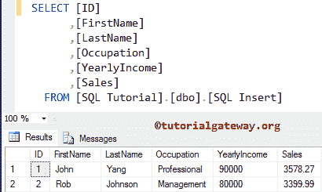
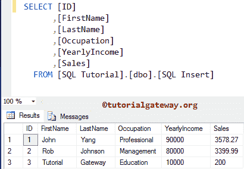
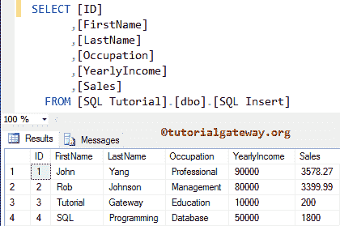
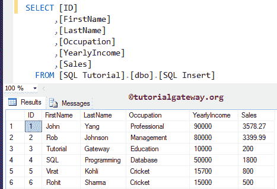
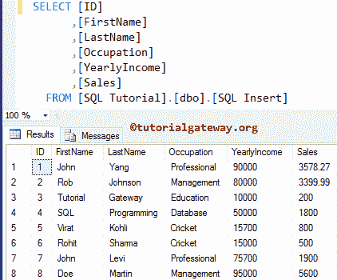
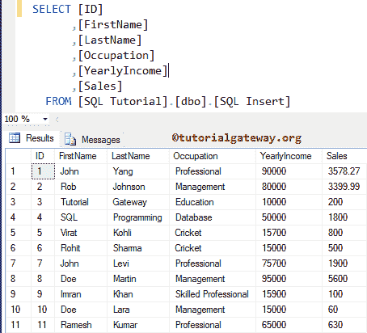
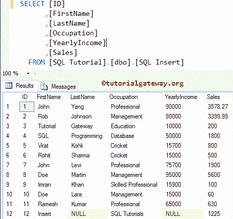
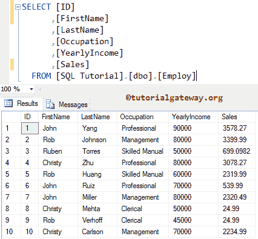
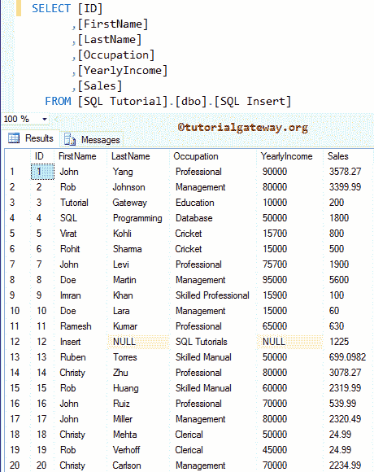

# SQL 插入语句

> 原文:[https://www.tutorialgateway.org/sql-insert-statement/](https://www.tutorialgateway.org/sql-insert-statement/)

SQL INSERT 语句向表中添加新记录或将数据加载到 SQL 表中。这个语句的语法是

```
INSERT INTO [DestinationTable] ([Column1], [Column2],..., [ColumnN])
VALUES ([Column1_Value], [Column2_Value],..., [ColumnN_Value])
```

*   目标表:完全限定表名来放置记录
*   第 1 列…..列数:从表格中选择列数。
*   列 1 _ 值…..列值:要放置的值。例如，为列 1 加载的列 1 _ 值。如果省略字段名，则必须按照目标表结构定义的顺序指定 column_values(字段值)

我们可以将这个 Sql Server 插入语句写成，

```
INSERT INTO [DestinationTable]
VALUES ([Column1_Value], [Column2_Value],..., [ColumnN_Value])
```

这个表保存了两条记录，我们将对其执行插入操作。



## SQL 插入语句示例

这个 SQL Insert 语句示例以更传统的方式将新记录放入表中。这里，我们没有加载 ID 值，因为它是一个标识列，它将自动更新

```
INSERT INTO [dbo].[SQLInsert] (
	[FirstName], [LastName], [Occupation], [YearlyIncome], [Sales])
VALUES ('Tutorial', 'Gateway', 'Education', 10000, 200)
```



如果我们将所有列的数据加载到目标中，那么我们可以忽略目标的列名(语法 2)。这意味着上面的 SQL Server Insert 语句也可以写成:

```
INSERT INTO [dbo].[SQLInsert] 
VALUES ('SQL', 'Programming', 'Database', 50000, 1800)
```

提示:忽略列名不是好的做法。所以，一定要在 [SQL Server](https://www.tutorialgateway.org/sql/) 中提供列名。

上面的查询将数据放入[名字]、[姓氏]、[职业]、[年份]和[销售]列。每当省略字段名时，必须按照目标[表](https://www.tutorialgateway.org/sql-create-table/)结构定义的顺序指定 column_values(字段值)。这意味着 SQL 值将放在[名字]列等。



### 如何在表格中插入多条记录？

这个 Sql Server Insert 语句示例以更传统的方式将多条记录加载到一个表中。

```
INSERT INTO [SQLInsert] 
VALUES ('Virat', 'Kohli', 'Cricket', 15700, 800)
INSERT INTO [dbo].[SQLInsert] 
VALUES ('Rohit', 'Sharma', 'Cricket', 15000, 500)
```



加载多条记录的最古老方法。

```
INSERT INTO [SQLInsert] 
SELECT 'John', 'Levi', 'Professional', 75700, 1900
UNION ALL
SELECT 'Doe', 'Martin', 'Management', 95000, 5600
```



这里，我们使用最流行的方法将多条记录放入表中。此 SQL 插入语句将在 SQL Server 2008 和更高版本中工作

```
INSERT INTO [SQLInsert] 
VALUES ('Imran', 'Khan', 'Skilled Professional', 15900, 100)
      ,('Doe', 'Lara', 'Management', 15000, 60)
      ,('Ramesh', 'Kumar', 'Professional', 65000, 630)
```



### 如何在表中插入几条记录？

在这个 Sql Server Insert 语句示例中，我们将几条记录放入一个表中。请记住，当您向目标加载少量记录时，必须指定列名。

```
INSERT INTO [dbo].[SQLInsert] (
	 [FirstName], [Occupation], [Sales])
VALUES ('Insert', 'SQL Tutorials', 1225)
```

上述查询将数据放入[名字]、[职业]和[销售]列。剩余的列中会添加空值。



## 插入选择语句

我们用于查询的雇主



在这个 SQL Insert 语句示例中，我们从“雇主”中选择行，并将它们加载到目标中。这里，我们使用 [WHERE 子句](https://www.tutorialgateway.org/sql-where-clause/)来限制行。

```
INSERT INTO [dbo].[SQLInsert] 
	SELECT [FirstName], [LastName], [Occupation], [YearlyIncome], [Sales]
	FROM Employ
	WHERE ID > 2
```

上面的查询将源中[标识]值大于 2 的[名字]、[姓氏]、[职业]、[年份]和[销售]列添加到目标中。

请参考[插入选择语句](https://www.tutorialgateway.org/sql-insert-into-select-statement/)一文。让我们看看所选数据是否加载到目的地。

