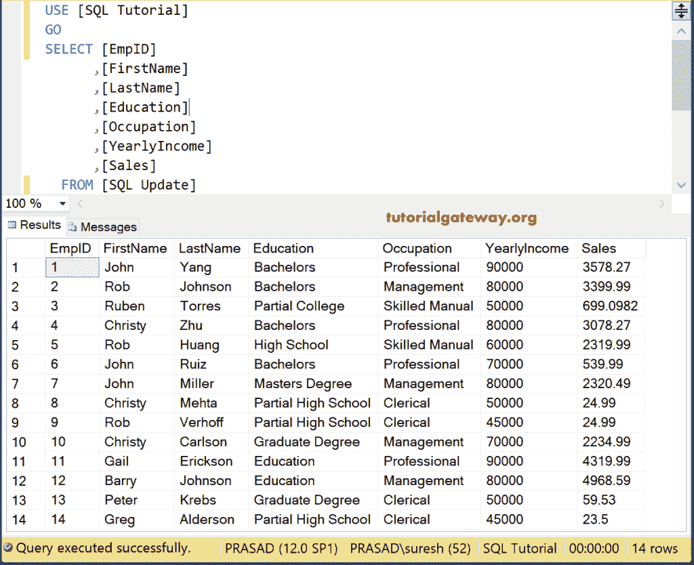
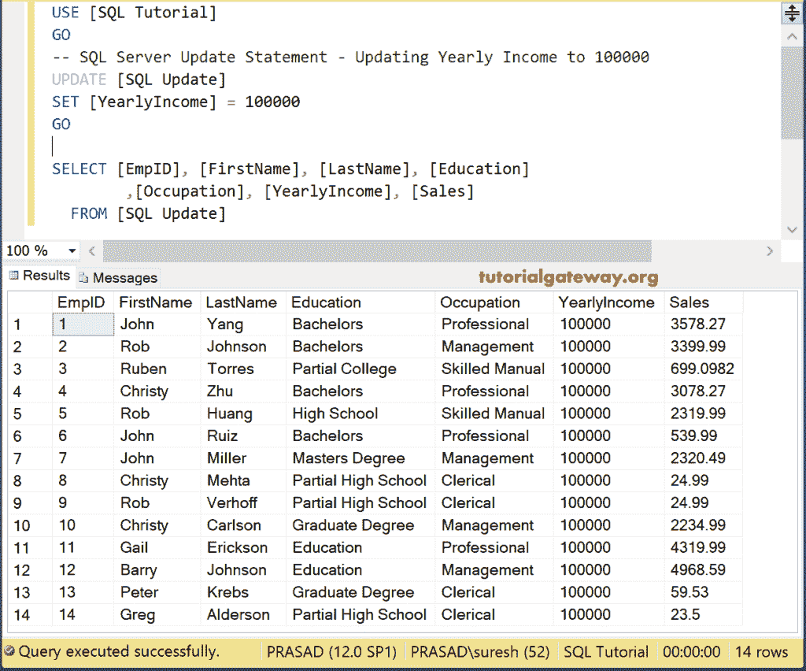
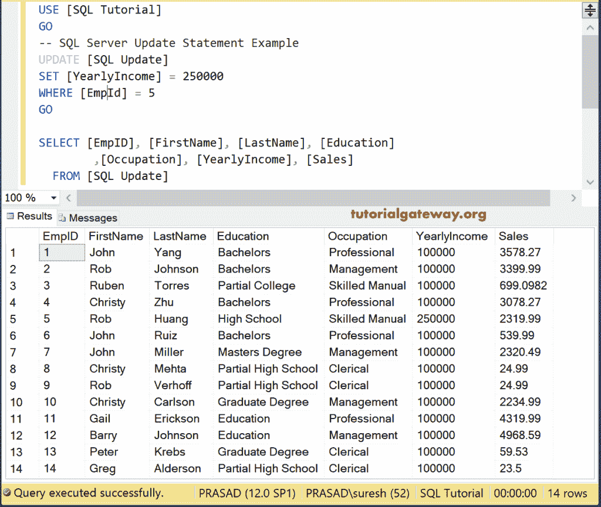
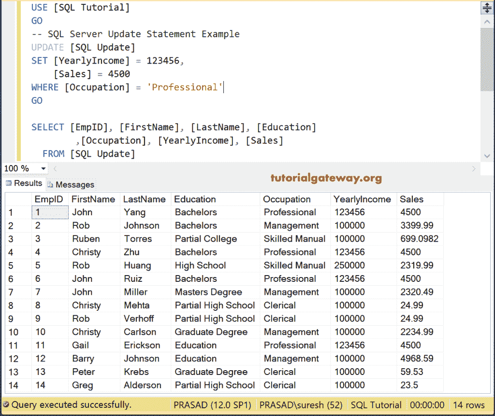
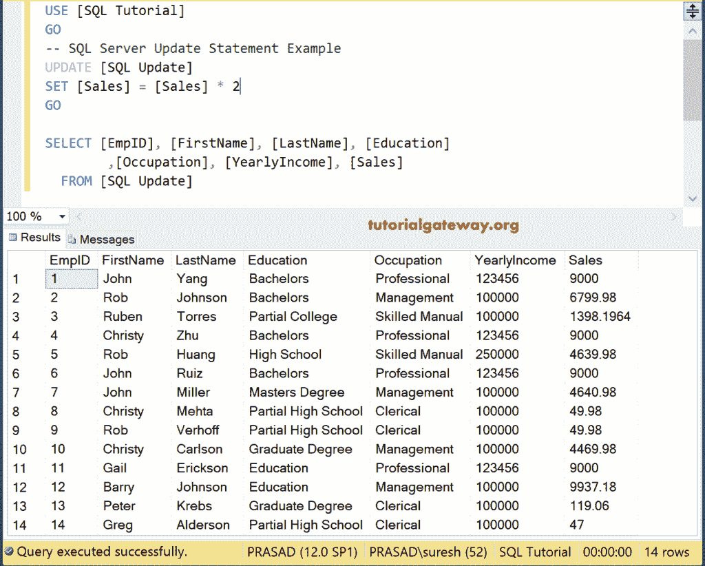
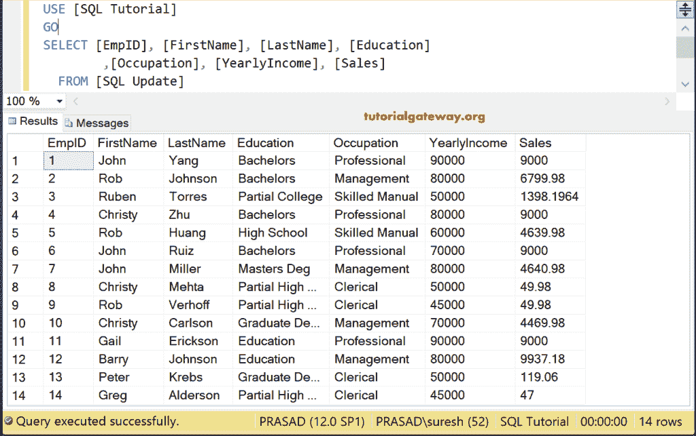
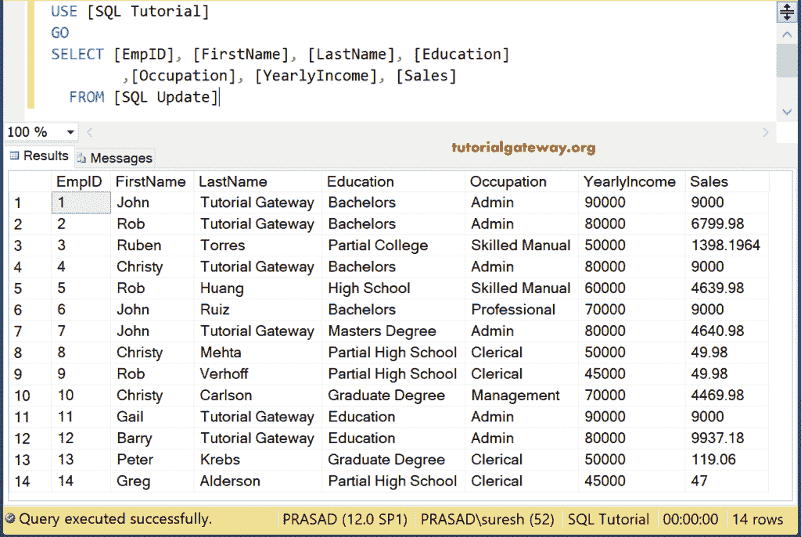
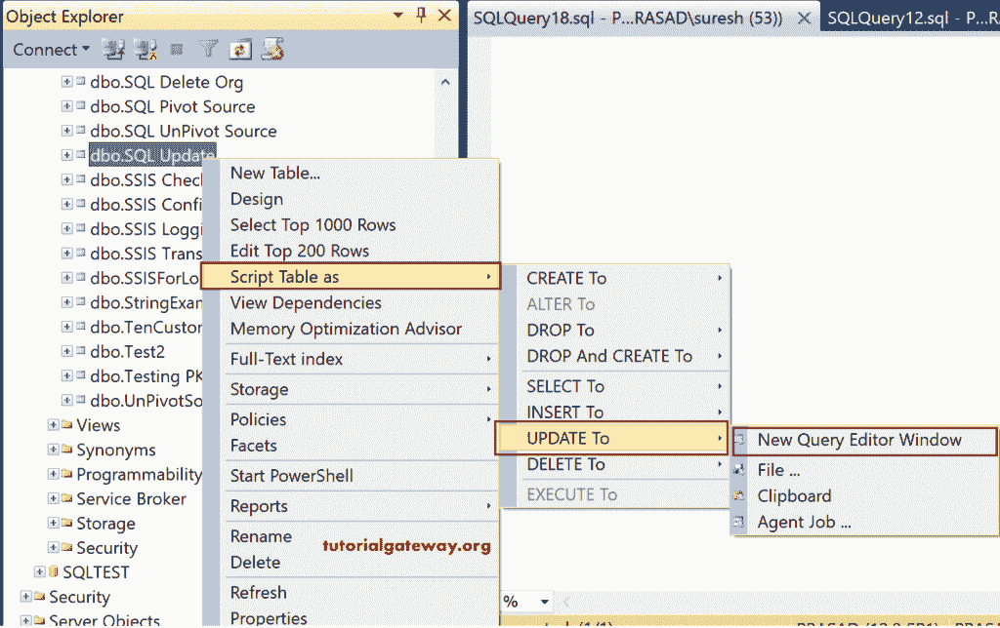
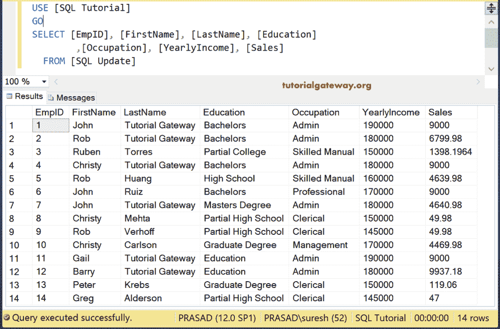

# SQL 更新语句

> 原文：<https://www.tutorialgateway.org/sql-update-statement/>

SQL UPDATE 语句用于用新数据更新现有记录。SQL Server 更新语句的语法是

```
UPDATE [Table_Name] 
SET [Column1] = [Value1], 
    [Column2] = [Value2],
    [ColumnN] = [ValueN]
WHERE Condition
```

*   列 1…列 n:要更改的列名。
*   值 1…值 n:提供列的新值。
*   条件:在这里，我们必须提供过滤器或条件。如果条件为真，则只有 SQL Server update 语句会更改记录。

我们将在这个表上执行不同类型的 SQL 更新操作。



## SQL 更新语句示例

让我们看看如何编写 SQL UPDATE 语句。我们将改变所有员工的年收入。

```
UPDATE [SQLUpdate]
SET [YearlyIncome] = 100000
```

以上查询将所有员工的年收入替换为 10 万



这里，我们没有指定 [WHERE 条件](https://www.tutorialgateway.org/sql-where-clause/)。这就是为什么[服务器](https://www.tutorialgateway.org/sql/)改变了所有 15 条记录。这是实时环境中最关键的方法，因为如果忘记了`WHERE`子句，就会破坏客户端数据

在本例中，我们替换一个单独的列或记录。

```
UPDATE [SQLUpdate]
SET [YearlyIncome] = 250000
WHERE [EmpId] = 5
```

看到了吧，ID 值= 5



的员工有 25 万的【年收入】

## SQL 更新多列

在本例中，我们将更改多个列或记录。

```
UPDATE [SQLUpdate]
SET [YearlyIncome] = 123456,
    [Sales] = 4500
WHERE [Occupation] = 'Professional'
```

从下图中可以看到，SQL 更新语句将职业为专业的所有记录的[年收入]更新为 123456，销售额为 4500。



## 用新值更新

假设政府将所有商品和服务(或任何特定商品)的税收提高到 0.5%。然后我们可以用这个语句用一个新的值来改变这些值。或者你想提高商品的价格，那么你可以使用它。

```
UPDATE [SQLUpdate]
SET [Sales] = [Sales] * 2
```



## 如何在 SQL 中从另一个表更新？

在这个 SQL Server update 语句示例中，我们展示了如何使用另一个表中的记录来更改一个表。这里，我们用另一个表中的数据刷新了一个表中的记录。

```
UPDATE [SQLUpdate]
SET [YearlyIncome] = ( 
			SELECT [YearlyIncome] FROM [SQLUpdates] AS Tab1
			WHERE [SQLUpdate].[FirstName] = [Tab1].[FirstName]
			AND 
			[SQLUpdate].[LastName] = [Tab2].[LastName])
```

```
Messages
--------
(14 row(s) affected)
```

让我看看数据



## SQL Server 更新存储过程

在这个例子中，我们在一个[存储过程](https://www.tutorialgateway.org/stored-procedures-in-sql/)中使用这个语句。对于表中年收入大于或等于 80000 的所有记录，我们将姓氏更改为教程网关，职业更改为管理员。

```
IF OBJECT_ID ( 'sp_UpdateEmployees', 'P' ) IS NOT NULL   
    DROP PROCEDURE sp_UpdateEmployees;  
GO

CREATE PROCEDURE sp_UpdateEmployees
AS
BEGIN
	SET NOCOUNT ON;
	UPDATE [SQLUpdate] SET [LastName] = N'Tutorial Gateway',
	                         [Occupation] = N'Admin'
        WHERE [YearlyIncome] >= 80000

END
GO
```

```
Messages
-------
Command(s) completed successfully.
```

让我使用 EXEC 命令(Execute Command)来执行[存储过程](https://www.tutorialgateway.org/update-stored-procedure-in-sql-server/)

```
EXEC dbo.sp_UpdateEmployees

GO
```

```
Messages
-------
Command(s) completed successfully.
```

现在，让我们看看存储过程的执行是否改变了姓氏和职业

```
SELECT [EmpID], [FirstName], [LastName], [Education]
 ,[Occupation], [YearlyIncome], [Sales]
  FROM [SQLUpdate]
```



## 管理工作室的 SQL 更新语句

如果可以访问管理工作室，请使用智能感知生成语句。为此，右键单击该表，然后选择脚本表为->更新到->新建查询编辑器窗口



选择“新建查询编辑器窗口”选项后，它将生成如下所示的语句查询。如您所见，它显示了它将接受的所有列名和数据类型。你要做的就是用你需要的值替换<>，改变 where 条件。[管理工作室](https://www.tutorialgateway.org/sql-server-management-studio/)生成的代码为:

```
UPDATE [dbo].[SQLUpdate]
   SET [FirstName] = <FirstName, nvarchar(255),>
      ,[LastName] = <LastName, nvarchar(255),>
      ,[Education] = <Education, nvarchar(255),>
      ,[Occupation] = <Occupation, nvarchar(255),>
      ,[YearlyIncome] = <YearlyIncome, float,>
      ,[Sales] = <Sales, float,>
 WHERE <Search Conditions,,>
GO
```

为了演示的目的，让我给员工年收入一栏加上 10 万。

```
UPDATE [dbo].[SQLUpdate]
   SET [YearlyIncome] = [YearlyIncome] + 100000
GO
```

```
Messages
--------
(14 row(s) affected)
```

让我给你看看更改的信息或记录。

