# SQL `DELETE`语句

> 原文：<https://www.tutorialgateway.org/sql-delete-statement/>

SQL `DELETE`语句从表或视图中删除一个或多个现有记录。SQL Server `DELETE`语句的语法是

```
DELETE FROM [Table_Name] 
WHERE Condition
```

条件:提供过滤器或条件。如果条件为真，则只有 SQL Server `DELETE`语句会删除记录。

我们在 SQL Server 中使用此表执行删除的不同操作类型是

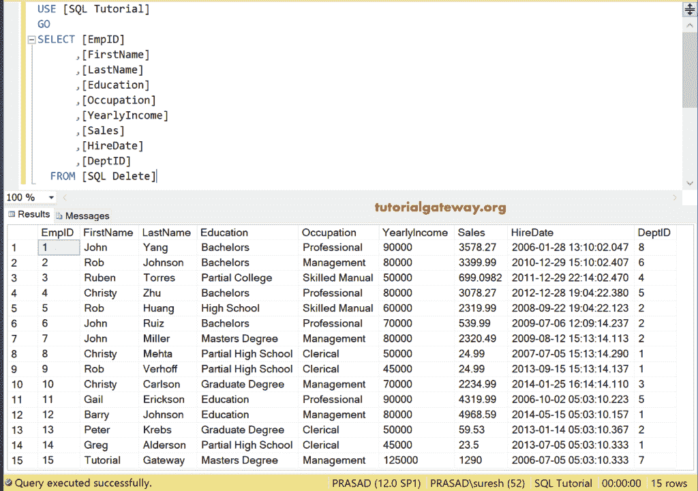

## SQL 删除单一记录

我们将从表中删除一条记录。为此，我们使用 [`WHERE`子句](https://www.tutorialgateway.org/sql-where-clause/)来限制此语句，以消除单个记录。如果省略`WHERE`子句，它将删除表中的所有行。

```
DELETE FROM [SQLDelete]
  WHERE [EmpID] = 2
```

它删除了员工记录，其 ID 值= 103

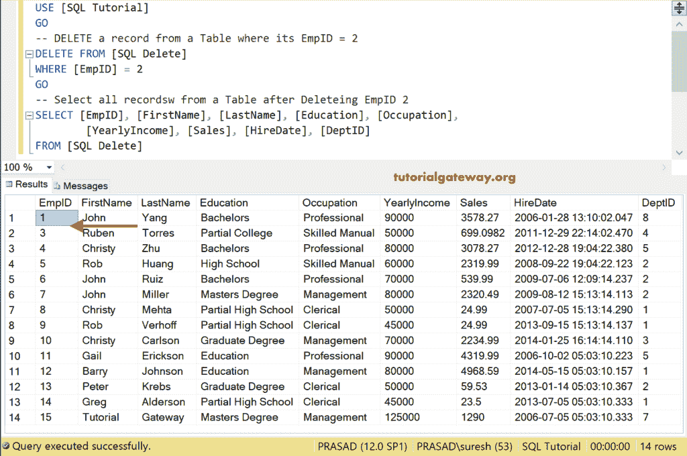

### SQL 删除多条记录

在这个删除多条记录的例子中，我们在`WHERE`子句中使用[和](https://www.tutorialgateway.org/sql-and-or-operators/)运算符在开始删除记录之前检查多个条件。

```
DELETE FROM [SQLDelete]
  WHERE [Education] = 'Partial High School' AND
        [YearlyIncome] = 45000
```

去掉所有记录，学历为部分高中，年收入为 45000

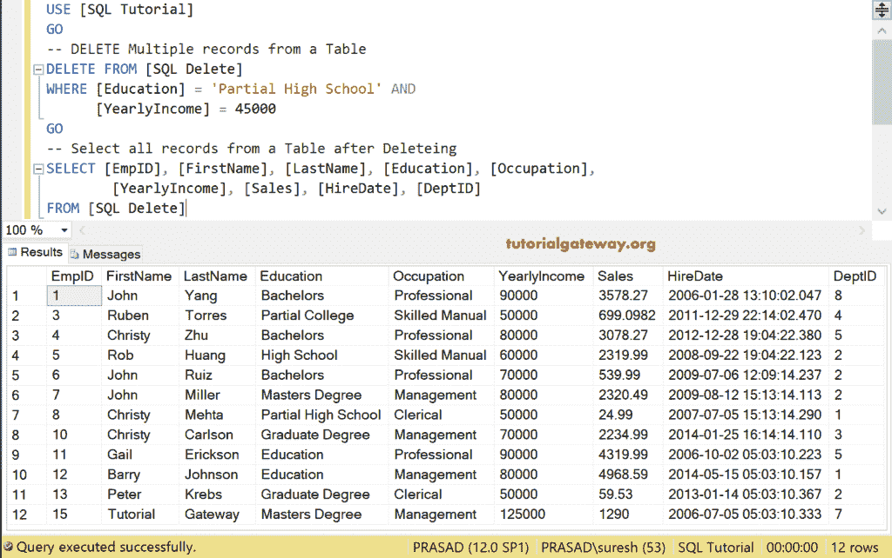

### 删除顶子句

在这个 Sql Server `DELETE`语句示例中，我们从表中删除了第一条记录，它的年收入小于或等于 5000。对于这个 [Sql Server](https://www.tutorialgateway.org/sql/) 的例子，我们使用的是 SQL Select TOP。

```
DELETE TOP (1) 
FROM [SQLDelete]
  WHERE [YearlyIncome] <= 50000
```

它会检查年收入小于等于 5000 的记录，然后 [`TOP`子句](https://www.tutorialgateway.org/sql-top-clause/)会选择第一条记录。

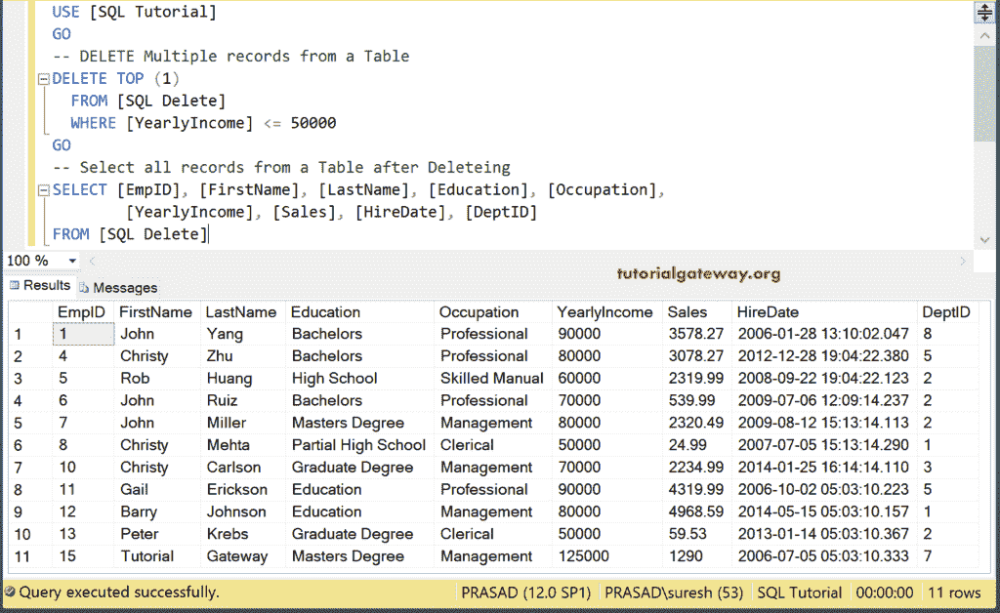

让我根据另一个表中的部门名称从表中删除记录。为此，我们使用[内连接](https://www.tutorialgateway.org/sql-inner-join/)和`DELETE`语句来连接两个表。部门表中的数据。

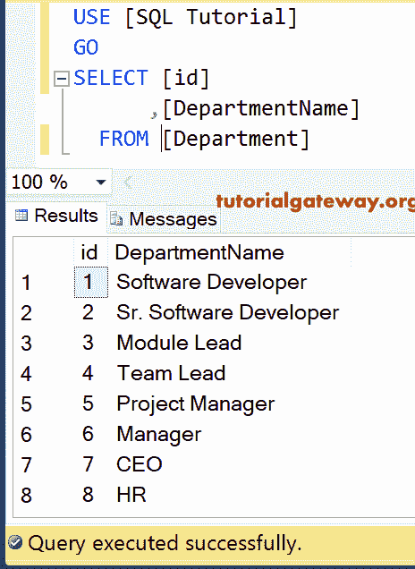

密码

```
DELETE del
FROM [SQLDelete] AS del
INNER JOIN
      Department AS dept ON
  del.[DeptID] = dept.id
WHERE dept.DepartmentName = 'Sr. Software Developer'
```

它删除了所有的记录，这些记录的部门名称是高级软件开发人员。请记住，部门名称来自部门表。

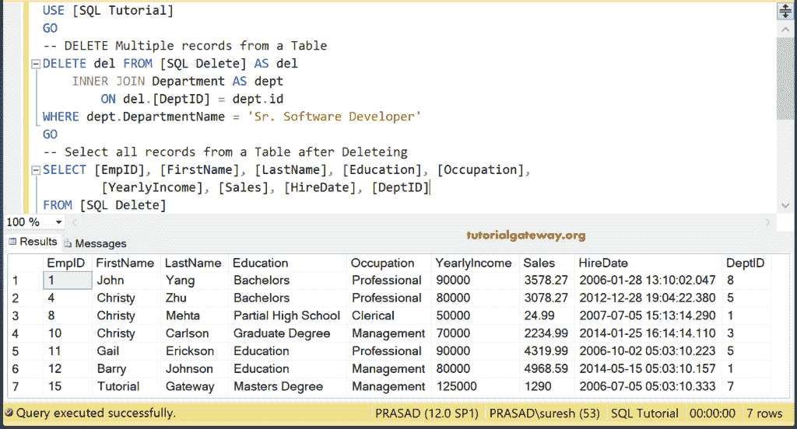

### 子查询

在这个带有子查询示例的 SQL `DELETE`语句中，让我们根据另一个表中的部门名称从表中取出行。为此，我们使用[子查询](https://www.tutorialgateway.org/sql-subquery/)。

```
DELETE FROM [SQLDelete]
WHERE [DeptID] IN
 (
   SELECT id FROM Department
     WHERE DepartmentName = 'Module Lead'
 )
```

从部门名称为模块领导的[删除]表中删除所有记录。

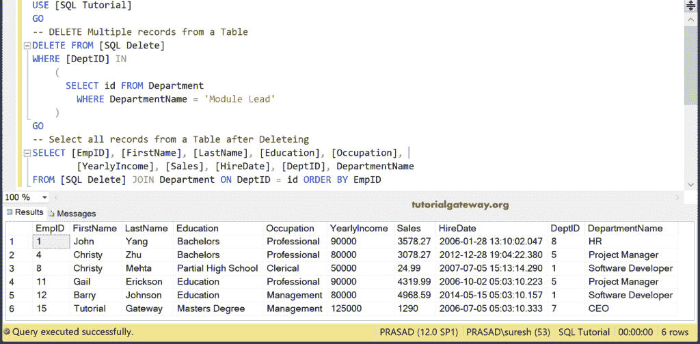

### 删除所有列

在这个 Sql Server `DELETE`语句示例中，我们将删除所有列

```
DELETE FROM [SQLDelete]
```

注意:如果您不小心忘记了 [`WHERE`子句](https://www.tutorialgateway.org/sql-where-clause/)，那么您将从 Source 中删除所有记录。

## 使用Management Studio

如果您可以访问 [SQL Server](https://www.tutorialgateway.org/sql/) 中的[Management Studio](https://www.tutorialgateway.org/sql-server-management-studio/)，请使用智能感知编写此语句。为此，右键单击表格- >选择脚本表格为- >删除至- >新查询编辑器窗口

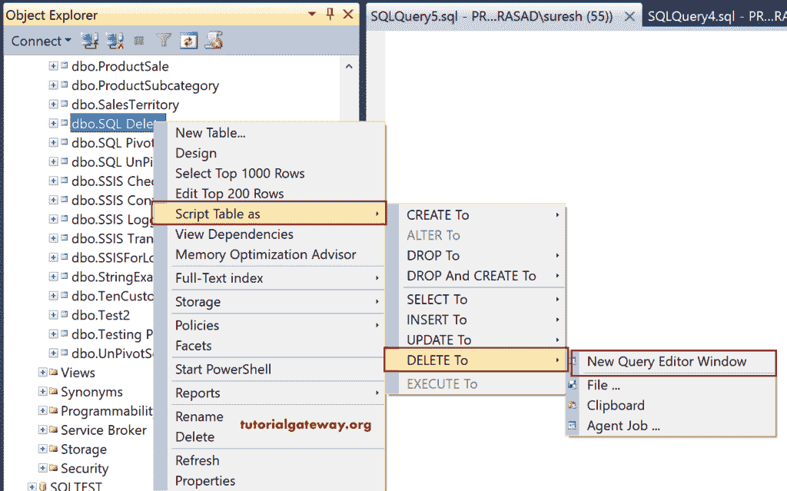

它将为选定的表生成语句，代码为

```
DELETE FROM [dbo].[SQLDelete]
      WHERE <Search Conditions,,>
GO
```

让我们添加搜索条件

```
DELETE FROM [dbo].[SQLDelete]
      WHERE [EmpID] = 1
```

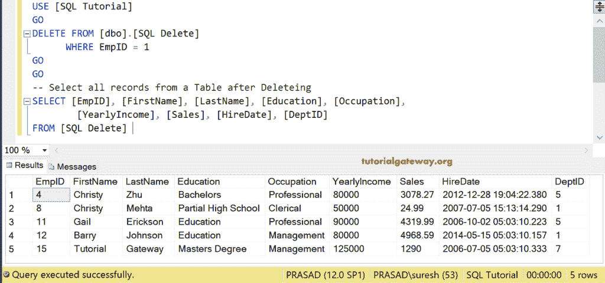

## SQL Server 删除存储过程

让我们看看如何在一个[存储过程](https://www.tutorialgateway.org/stored-procedures-in-sql/)中使用这个语句。在这里，我们将删除职业等于文书或年收入小于或等于 60000 英镑的记录

```
IF OBJECT_ID ( 'sp_DeleteEmpRecords', 'P' ) IS NOT NULL   
    DROP PROCEDURE sp_DeleteEmpRecords;  
GO

CREATE PROCEDURE sp_DeleteEmpRecords
AS
	BEGIN
		SET NOCOUNT ON;

		DELETE FROM [SQLDelete]
		WHERE Occupation = 'Clerical' OR
			YearlyIncome <= 60000
	END
GO
```

```
Messages
-------
Command(s) completed successfully.
```

让我使用执行命令来执行存储过程

```
EXEC dbo.sp_DeleteEmpRecords
GO
```

```
Messages
-------
Command(s) completed successfully.
```

现在，让我们看看存储过程的执行是否删除了表中的行

```
-- Select all records from a Table after executing SP
SELECT [EmpID], [FirstName], [LastName], [Education], [Occupation], 
   [YearlyIncome], [Sales], [HireDate], [DeptID]
FROM [SQLDelete]
```

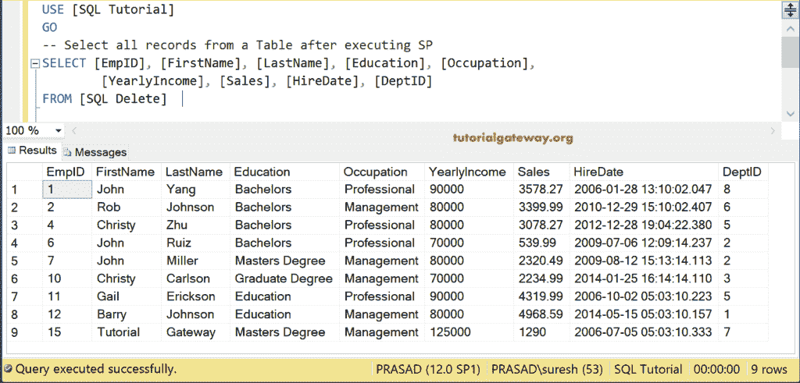

## 示例之间

这个 Sql Server `DELETE`语句示例使用运算符删除两个日期之间的记录。

```
DELETE 
FROM [SQLDelete]
WHERE [HireDate] BETWEEN '2016-01-27- AND '2007-01-28'
```

```
Messages
-------
(3 row(s) affected)
```

以上查询将删除所有雇佣日期在 2006-01-27 和 2007-01-28

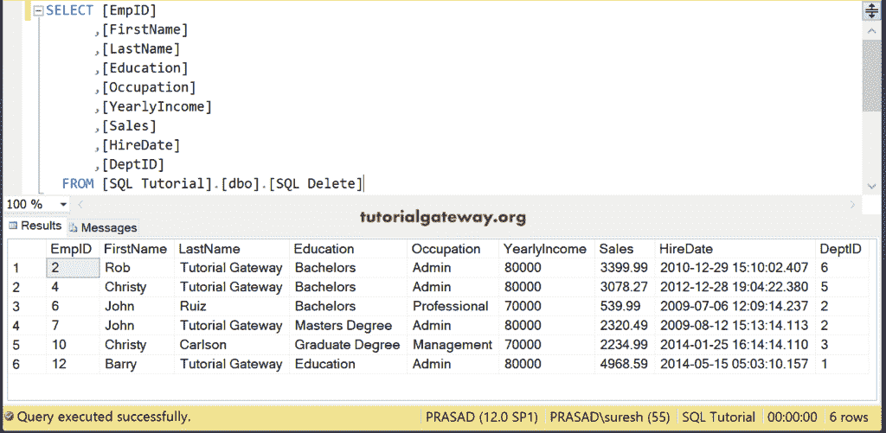

之间的记录

### SQL 删除(如果存在)示例

从表中删除记录时，检查记录是否存在始终是一个很好的做法。在这里，我们将使用 [EXISTS](https://www.tutorialgateway.org/sql-exists-operator/) 运算符来对照部门表检查删除表中的记录。如果它们存在，并且它们的姓氏是“教程网关”，则删除该记录。

```
DELETE FROM [SQLDelete]
WHERE EXISTS (
      SELECT * FROM Department
      WHERE [SQLDelete].DeptID = Department.id
      AND [SQLDelete].LastName = 'Tutorial Gateway'
```

```
Messages
-------
(4 row(s) affected)
```

而剩下的数据[查看](https://www.tutorialgateway.org/views-in-sql-server/)则是

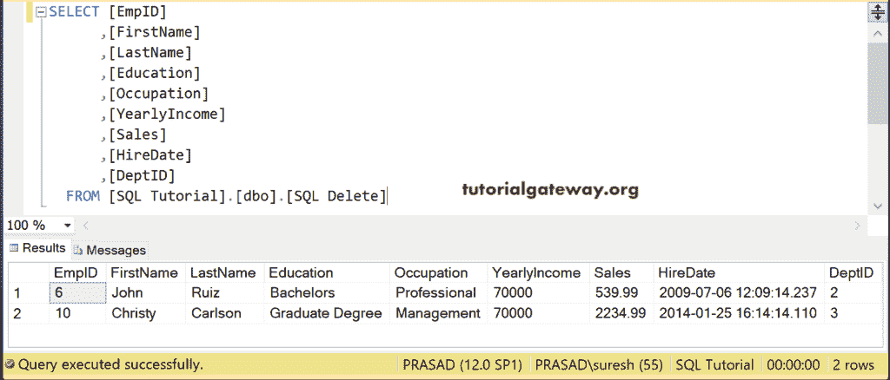T4】

### SQL 删除为空示例

我们用于此 Sql Server 删除为空的数据是

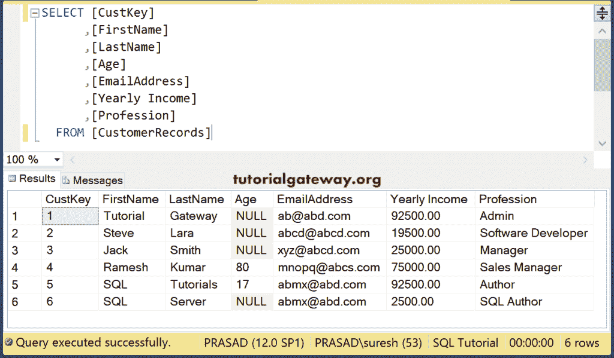

在本例中，我们将删除年龄为空的所有员工。为此，我们使用了[为空](https://www.tutorialgateway.org/sql-is-null-function/)运算符。

```
DELETE 
FROM [SQLDelete]
WHERE [Age] IS NULL
```

```
Messages
-------
(4 row(s) affected)
```

而剩下的数据是

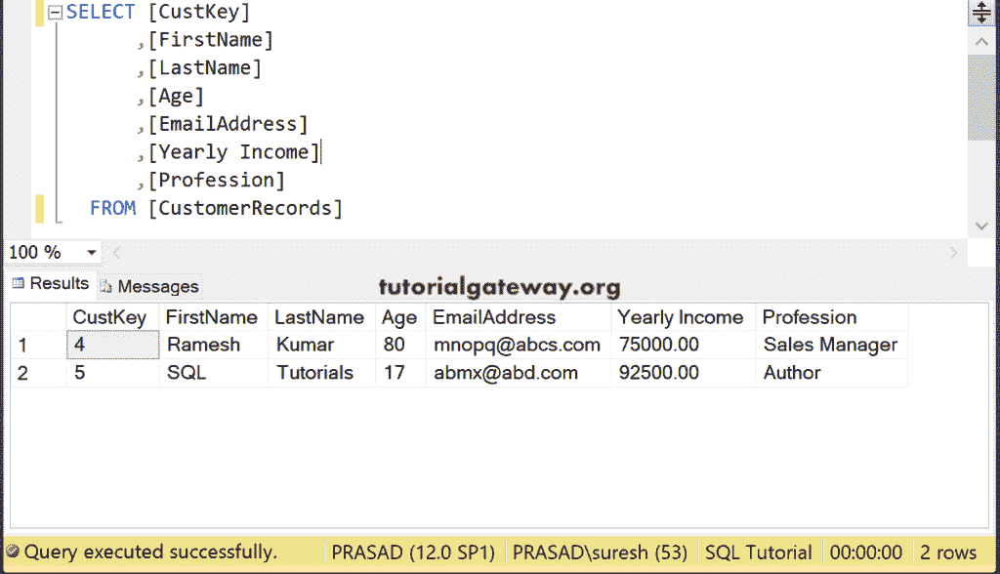