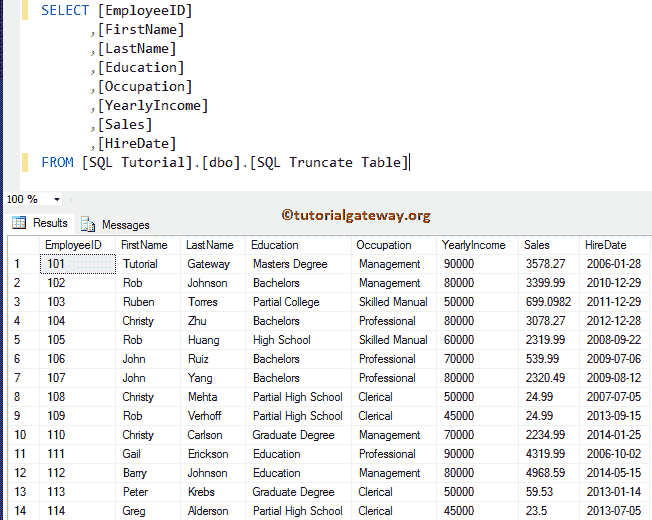
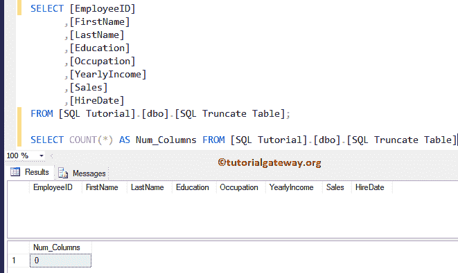

# SQL 截断表

> 原文：<https://www.tutorialgateway.org/sql-truncate-table/>

SQL TRUNCATE Table 语句删除表或指定分区中的所有记录。SQL Server 中的截断表类似于不带 Where 子句的删除命令。让我告诉你如何写这份声明。在这个例子之前，让我展示一下这个语句的语法。

```
TRUNCATE TABLE Database_Name.Schema_Name.Table_Name
```

*   数据库名称:包含它的数据库。
*   模式名:它的模式。
*   表名:名称。

## SQL 截断表的优点

Sql Server Truncate Table 语句将从指定行的所有行中删除数据，但结构、约束、列和索引将保持不变。不需要 Where 子句

*   与对应的 DELETE 语句相比，该语句使用较少的事务。因为这个语句释放了用于存储记录/数据的数据页。事务日志将存储这些页面释放。
*   它在表级别执行锁定(速度更快)，但不是在每一行。
*   应用此语句后，将剩下零页。
*   如果表包含标识列，该列的计数器将重置为第一个值。例如，我们有 ID INT IDENTITY(1，1)，它包含 100 行/记录，我们对 ID 执行了 TRUNCATE 表。此截断语句将删除标识中的行或所有记录，并将标识重置为 1。

我们在下面



上执行操作

提示:请参考 [SQL Server](https://www.tutorialgateway.org/sql/) 中[删除语句](https://www.tutorialgateway.org/sql-delete-statement/)和 [Where 子句](https://www.tutorialgateway.org/sql-where-clause/)的文章。

在这个 Sql Server 截断示例中，我们将删除上面指定的数据库表。

```
TRUNCATE TABLE [SQLTruncateTable]
```

```
SELECT [EmployeeID]
      ,[FirstName]
      ,[LastName]
      ,[Education]
      ,[Occupation]
      ,[YearlyIncome]
      ,[Sales]
      ,[HireDate]
FROM [SQLTruncateTable];

SELECT COUNT(*) AS Num_Columns FROM [SQLTruncateTable]
```

