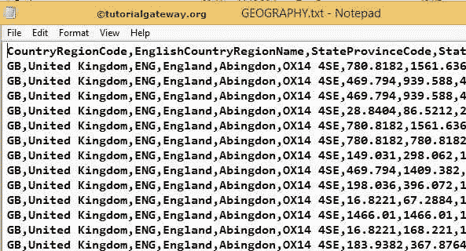
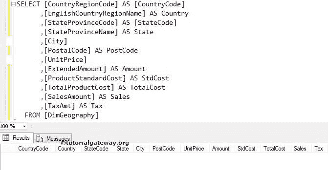
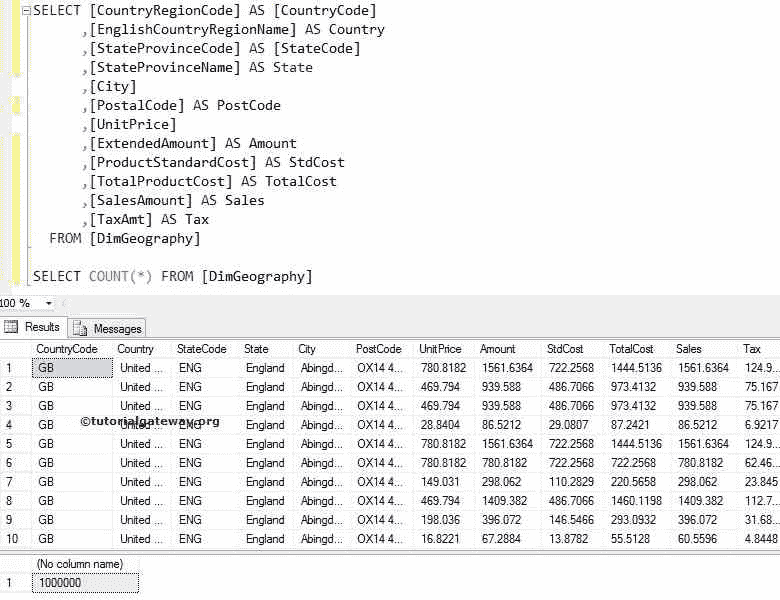

# 在 SQLServer中批量插入

> 原文：<https://www.tutorialgateway.org/bulk-insert-in-sql-server/>

SQL Server 中的批量插入(简称为 BCP)将非常有助于将大量数据从文本文件或 CSV 文件快速传输到 SQL Server 表或视图。

## SQL Server 中的批量插入示例

在这个 SQL Server 大容量插入示例中，我们将向您展示如何将文本文件中的数据传输到 SQL 表。

我们有一个名为 GEOGRAPHY.txt 的平面文件，包含 1000000 行。我们的任务是使用 Sql Server 批量`INSERT`语句插入该文本文件中的所有行。



我们的 [SQL Server](https://www.tutorialgateway.org/sql/) 表是:



为了将文本文件或 CSV 文件中的数据传输到 SQL 表，首先，请打开您的 SSMS并编写以下查询

```
-- Example for BCP in SQL Server
BULK INSERT [DimGeography] 
      FROM 'F:\MS BI\FILE EXAMPLES\Geography.txt' 
  WITH  
    ( 
       DATAFILETYPE    = 'char', 
       FIELDTERMINATOR = ',', 
       ROWTERMINATOR   = '\n' 
    );
```

```
Messages
-------
(1000000 row(s) affected)
```

如果你想分多批发送数据，那么就使用 ROWS _ PER _ BATCH

让我们打开 [SSMS](https://www.tutorialgateway.org/sql-server-management-studio/)查看目的表。我们可以成功地将文本文件中的数据复制到 SQL server，或者不使用此 SQL Server 批量插入。

