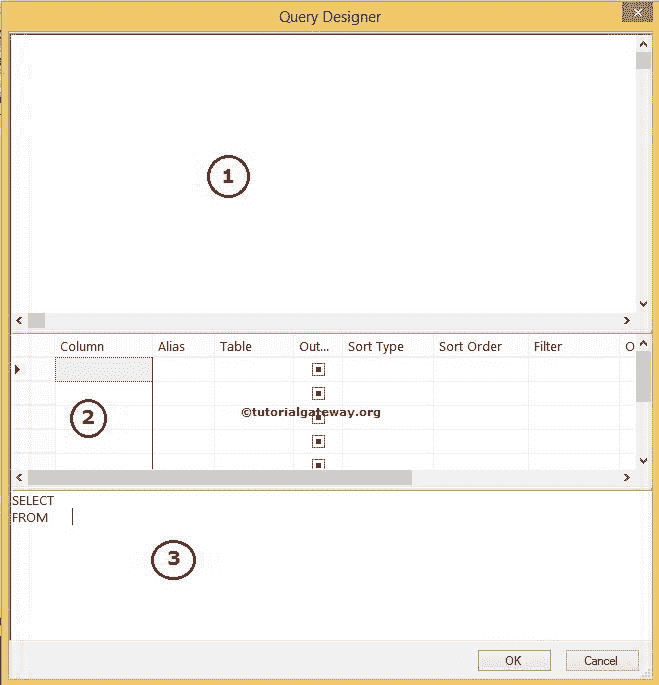
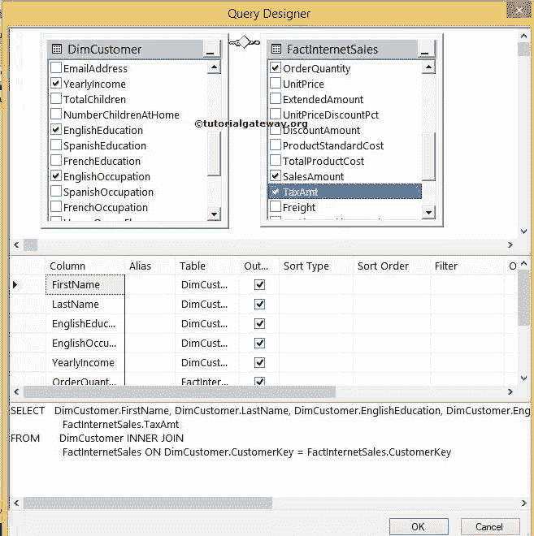

# SQL 查询生成器

> 原文：<https://www.tutorialgateway.org/sql-query-builder/>

“查询生成器”或“设计器”使开发人员能够轻松设计查询。如果您不知道如何编写查询，会发现很难执行排序、分组和连接操作。或者，如果您发现设计复杂的查询很有挑战性，那么使用这个 SQL 查询生成器，使用图形用户界面来设计您想要的查询。

## SQL 查询生成器示例

在我们开始使用这个简单的 SQL 查询设计器或生成器之前，我们必须选择数据库。


右键单击该窗口上的空白区域将打开上下文菜单。请从中选择“在编辑器中设计查询...”选项。


单击该选项后，它将在单独的窗口中打开查询设计器。在设计任何东西之前，您应该了解 SQL 查询生成器中存在的不同窗格。

1.  图表窗格:该窗格用于选择表、视图或函数。查询设计器将根据数据库关系自动连接表。选择所需的表后，我们可以通过选中这些列来选择所需的列。
2.  网格窗格:所有选定的列都将显示在该窗格中。这个查询设计器窗格便于应用排序(按 ASC 排序和按 DESC 排序)以及对列名进行分组(分组语句)
3.  SQL 窗格: [SQL](https://www.tutorialgateway.org/sql/) 查询设计器会在这个窗格中自动为我们创建语句。



右键单击“SQL 查询设计器图表”窗格，然后选择“添加表”..选项添加所需的表。


从下面的截图中，您可以看到我们选择了 DimCustomers 表。


让我们再添加一个表(FactInternetSales)来显示 [SQL 连接](https://www.tutorialgateway.org/sql-inner-join/)。


如您所见，它使用 CustomerKey 列自动连接了两个表，DimCustomers 和 FactInternetSales。


请通过在图表窗格中选中标记列名来选择所需的列。

在这个 SQL 查询生成器示例中，我们从两个表



中选择了名字、姓氏、学历、职业、年收入、销售额、税额和订单数量列

### SQL 查询设计器别名示例

网格窗格中的别名列用于应用[别名](https://www.tutorialgateway.org/sql-alias/)功能。在 SQL 查询设计器网格窗格中，请根据您的要求更改列名。


### SQL 查询生成器排序示例

网格中的排序类型属性用于申请 [SQL ORDER BY](https://www.tutorialgateway.org/sql-order-by-clause/) 功能。在 SQL 查询设计器的网格窗格中，请将排序类型更改为升序或降序。

我们正在使用 SQL Server 查询生成器对名字升序和年收入降序进行排序。

请根据您的要求更改排序选项。对于本例，SQL 查询生成器将首先按照升序按名字对数据进行排序。然后按年收入降序对数据进行排序。


### SQL 查询生成器分组

通常，SQL 查询生成器不会在第二个区域中显示任何分组选项。要执行[`GROUP BY`](https://www.tutorialgateway.org/sql-group-by-clause/)，请右键单击查询设计器中的空间，并从上下文菜单中选择添加`GROUP BY`选项


我们使用查询设计器对名、姓、学历和职业进行分组。对于其余的列，我们计算了诸如年收入、销售额、税额和计算订单数量之和等汇总


### SQL 查询设计器过滤器

我们正在销售金额上添加超过 1000 个过滤器。由于我们对汇总数据总和(销售额)应用过滤条件，因此 SQL Server 查询生成器使用 [`Having`子句](https://www.tutorialgateway.org/sql-having-clause/)，否则将使用 [`WHERE`子句](https://www.tutorialgateway.org/sql-where-clause/)


单击“确定”按钮关闭查询设计器。下面的代码片段将向您展示最终生成的 Transact-SQL 查询。

```
SELECT DimCustomer.FirstName AS [First Name], 
       DimCustomer.LastName AS [Last Name], 
       DimCustomer.EnglishEducation AS Education, 
       DimCustomer.EnglishOccupation AS Occupation, 
       SUM(DimCustomer.YearlyIncome) AS [Anual Income], 
       COUNT(FactInternetSales.OrderQuantity) AS [Total Orders], 
       SUM(FactInternetSales.SalesAmount) AS Sales, 
       SUM(FactInternetSales.TaxAmt) AS Tax
FROM DimCustomer INNER JOIN
       FactInternetSales ON 
     DimCustomer.CustomerKey = FactInternetSales.CustomerKey
GROUP BY DimCustomer.FirstName, DimCustomer.LastName, 
         DimCustomer.EnglishEducation, DimCustomer.EnglishOccupation
HAVING   (SUM(FactInternetSales.SalesAmount) > 1000)
ORDER BY [First Name], SUM(DimCustomer.YearlyIncome) DESC 
```

通过单击顶部的执行按钮，让我们看看由简单构建器设计的查询是否正在完美地执行。

