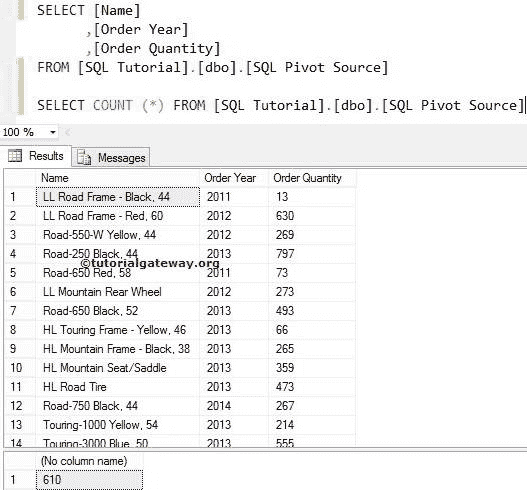
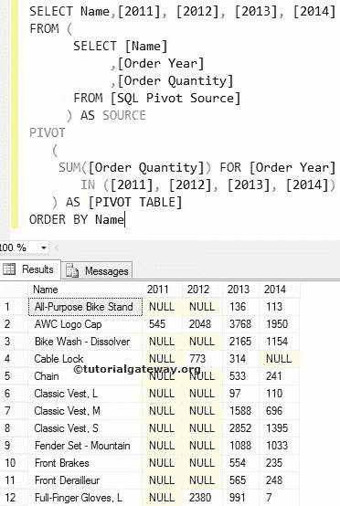
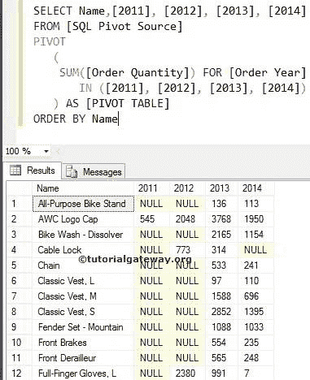
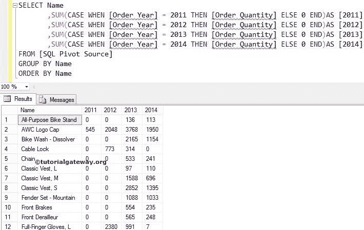

# SQL 透视

> 原文：<https://www.tutorialgateway.org/sql-pivot/>

在 SQL 中，透视是将行值转换为列名或简单地说，旋转表的最有用的运算符之一。旋转表或 SQL 透视表时，分组或聚合中必须包含剩余的列值。我们使用下面的查询，使用 SQL Server 数据透视表将行转换为列。

```
USE AdventureWorks2014
GO
SELECT PROD.Name,
       YEAR(OrdHead.OrderDate) AS [Order Year],
       SUM(Details.OrderQty) AS [Order Quantity]
  FROM Sales.SalesOrderDetail AS Details
     INNER JOIN
       Production.Product AS PROD ON
          Details.ProductID = PROD.ProductID
     INNER JOIN 
       Sales.SalesOrderHeader AS OrdHead ON
         Details.SalesOrderID = OrdHead.SalesOrderID
GROUP BY 
         PROD.Name,
         YEAR(OrdHead.OrderDate)
ORDER BY [Order Year]
```

虽然上面的查询很容易理解，但我们正在将数据复制到一个新表中，以避免进一步复杂化。它还将允许您更加专注于 SQL Server 透视子句。

为此，我们在 SQL Server 中使用了 SELECT INTO 语句。下面的截图显示了我们的新表格数据。我们使用透视功能将行数据转换为列



## SQL 透视运算符示例

在本例中，我们将使用 pivot 将行中的日历年信息转换为单独的列。在这里，“名称”列将保持不变，订单数量将根据年份进行区分

```
SELECT Name,[2011], [2012], [2013], [2014]
FROM (
      SELECT [Name]
           ,[Order Year]
           ,[Order Quantity]
      FROM [SQLPivotSource]
     ) AS SOURCE
PIVOT 
   ( 
    SUM([Order Quantity]) FOR [Order Year] 
	 IN ([2011], [2012], [2013], [2014])
   ) AS [PIVOT TABLE] 
ORDER BY Name
```



对 SOURCE 的 Select 查询将首先执行，它将从数据透视表中提取名称、订单年份和订单数量信息。请参考 [SQL Server](https://www.tutorialgateway.org/sql/) 中的[`SELECT`语句](https://www.tutorialgateway.org/sql-select-statement/)和[选择进入语句](https://www.tutorialgateway.org/sql-select-into-statement/)。

接下来，SOURCE 之后的剩余查询将使用聚合函数 sum 和 Pivot SQL 将行转换为列。在这个查询中，下面的语句将显示输出

```
SELECT Name,[2011], [2012], [2013], [2014]
```

如果您想在原始数据上应用相同的功能，您必须使用以下查询

```
USE AdventureWorks2014
GO
SELECT Name,[2011], [2012], [2013], [2014]
 FROM 
   (
    SELECT PROD.Name,
           YEAR(OrdHead.OrderDate) as OrderYear,
           SUM(Details.OrderQty) AS OrderQuantity
    FROM Sales.SalesOrderDetail AS Details
     INNER JOIN Production.Product AS PROD 
       ON Details.ProductID = PROD.ProductID
     INNER JOIN Sales.SalesOrderHeader AS OrdHead 
       ON Details.SalesOrderID = OrdHead.SalesOrderID
     GROUP BY PROD.Name,YEAR(OrdHead.OrderDate)
    ) AS SOURCE
PIVOT( SUM(OrderQuantity) FOR OrderYear 
        IN ([2011], [2012], [2013], [2014])
       ) AS pivotable 
ORDER BY Name
```

## 方法 2

如果您从一个表中获取所有的源信息。如果数据不包含任何[连接](https://www.tutorialgateway.org/sql-joins/)和[分组](https://www.tutorialgateway.org/sql-group-by-clause/)，在源表上使用以下查询。这是 SQL Server 透视方法 1 的简短版本

```
SELECT Name,[2011], [2012], [2013], [2014]
FROM [SQLPivot Source]
PIVOT 
   ( 
    SUM([Order Quantity]) FOR [Order Year] 
      IN ([2011], [2012], [2013], [2014])
   ) AS [PIVOT TABLE] 
ORDER BY Name
```



## SQL 透视替代方案

这个可选的透视查询示例纯粹是为了面试的目的。通常，为了在面试中测试你的编码技能，他们可能会问你一个问题:如何在不使用的情况下将行转换为列。

```
SELECT 
    Name
   ,SUM(CASE WHEN [Order Year] = 2011 THEN [Order Quantity] ELSE 0 END)AS [2011]
   ,SUM(CASE WHEN [Order Year] = 2012 THEN [Order Quantity] ELSE 0 END)AS [2012]
   ,SUM(CASE WHEN [Order Year] = 2013 THEN [Order Quantity] ELSE 0 END)AS [2013]
   ,SUM(CASE WHEN [Order Year] = 2014 THEN [Order Quantity] ELSE 0 END)AS [2014]  
FROM [SQLPivot Source]    
GROUP BY Name
ORDER BY Name
```



如果要在原始数据上应用相同的功能，必须使用以下查询

```
USE AdventureWorks2014
GO
SELECT 
   PROD.Name
  ,SUM(CASE WHEN YEAR(OrdHead.OrderDate) = 2011 THEN (Details.OrderQty) ELSE 0 END)AS [2011]
  ,SUM(CASE WHEN YEAR(OrdHead.OrderDate) = 2012 THEN (Details.OrderQty) ELSE 0 END)AS [2012]
  ,SUM(CASE WHEN YEAR(OrdHead.OrderDate) = 2013 THEN (Details.OrderQty) ELSE 0 END)AS [2013]
  ,SUM(CASE WHEN YEAR(OrdHead.OrderDate) = 2014 THEN (Details.OrderQty) ELSE 0 END)AS [2014]
FROM Sales.SalesOrderDetail AS Details
  INNER JOIN Production.Product AS PROD 
    ON Details.ProductID = PROD.ProductID
  INNER JOIN Sales.SalesOrderHeader AS OrdHead 
    ON Details.SalesOrderID = OrdHead.SalesOrderID
GROUP BY PROD.Name
ORDER BY Name
```