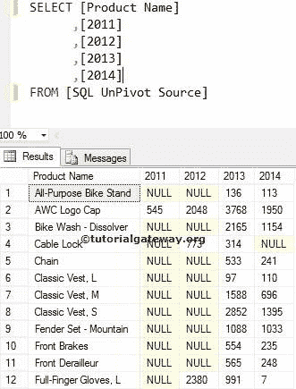
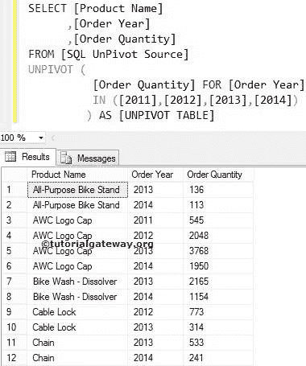
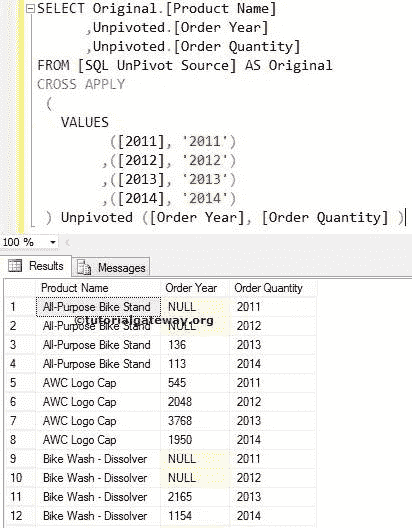
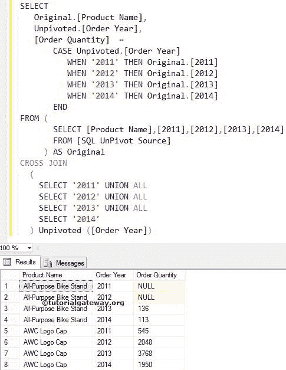
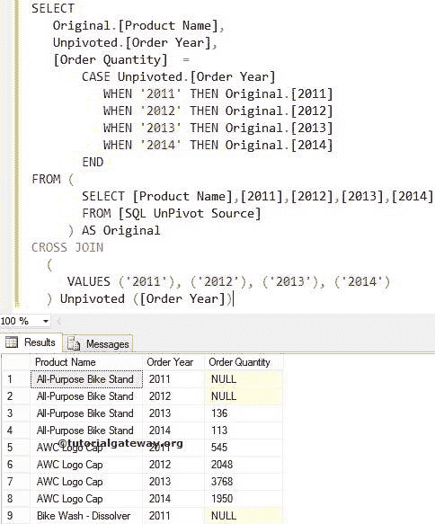
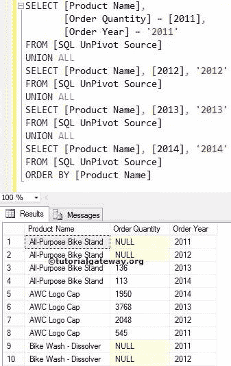

# 在 SQL 中取消固定

> 原文：<https://www.tutorialgateway.org/unpivot-in-sql/>

SQL Unpivot 是将列名转换为行值的最有用的运算符之一。或者说，将透视表旋转到常规表。让我们通过示例来看看如何在 SQL Server 中使用 Unpivot 将列名转换为行值。

下面的 SQL 源截图显示了我们表格中的数据。使用此透视数据，我们将把列名(2011、2012、2013 和 2013)转换或取消转换为行值



## 在 SQL 示例中取消固定

在本例中，我们将使用这个内置运算符将列名(2011、12、13 和 2014)转换为行值。我们必须将其与运算符中的 [SQL 一起使用。在这个](https://www.tutorialgateway.org/sql-in-operator/) [SQL](https://www.tutorialgateway.org/sql/) 示例中，产品名称列的值将保持不变。然而，订单数量在订单年度重新排列精子。

```
SELECT [Product Name]
      ,[Order Year]
      ,[Order Quantity]
FROM [SQLUnPivot Source]
UNPIVOT (
          [Order Quantity] FOR [Order Year] 
          IN ([2011],[2012],[2013],[2014]) 
	) AS [UNPIVOT TABLE]
```



## SQL UNPIVOT 替代方案

如果面试官愿意测试你的编码技巧，那么你可以期待其他方法来实现 SQL Server 中的 Unpivot 功能

### 使用交叉应用值作为替代

在这个例子中，我们使用十字应用来取消上面指定的[旋转](https://www.tutorialgateway.org/sql-pivot/)表。

```
SELECT Original.[Product Name] 
      ,Unpivoted.[Order Year]
      ,Unpivoted.[Order Quantity]     
FROM [SQLUnPivot Source] AS Original
CROSS APPLY 
 (
   VALUES 
         ([2011], '2011')
        ,([2012], '2012')
        ,([2013], '2013')
        ,([2014], '2014')
 ) Unpivoted ([Order Year], [Order Quantity] )
```



### 将替代案例语句与交叉连接一起取消固定

使用[案例陈述](https://www.tutorialgateway.org/sql-case-statement/)和[交叉连接](https://www.tutorialgateway.org/sql-cross-join/)来实现取消固定功能

```
SELECT 
   Original.[Product Name],
   Unpivoted.[Order Year],
   [Order Quantity]  = 
       CASE Unpivoted.[Order Year]
          WHEN '2011' THEN Original.[2011]
          WHEN '2012' THEN Original.[2012]
          WHEN '2013' THEN Original.[2013]
          WHEN '2014' THEN Original.[2014]
       END
FROM (
       SELECT [Product Name],[2011],[2012],[2013],[2014]
       FROM [SQLUnPivot Source]
     ) AS Original
CROSS JOIN 
  (
    SELECT '2011' UNION ALL
    SELECT '2012' UNION ALL
    SELECT '2013' UNION ALL
    SELECT '2014'
  ) Unpivoted ([Order Year])
```



上述转换柱代码的简化版本为:

```
SELECT 
   Original.[Product Name],
   Unpivoted.[Order Year],
   [Order Quantity]  = 
       CASE Unpivoted.[Order Year]
          WHEN '2011' THEN Original.[2011]
          WHEN '2012' THEN Original.[2012]
          WHEN '2013' THEN Original.[2013]
          WHEN '2014' THEN Original.[2014]
       END
FROM (
       SELECT [Product Name],[2011],[2012],[2013],[2014]
	   FROM [SQLUnPivot Source]
     ) AS Original
CROSS JOIN 
  (
     VALUES ('2011'), ('2012'), ('2013'), ('2014')
  ) Unpivoted ([Order Year])
```

使用 Values 关键字，而不是使用旧的和传统的 Union All。



### 联合所有取消固定替代方案

在这个例子中，我们使用[联合所有](https://www.tutorialgateway.org/sql-union-all/)作为替代。这可能不是理想的方法，但你明白了。

```
SELECT [Product Name], 
       [Order Quantity] = [2011], 
       [Order Year] = '2011' 
FROM [SQLUnPivot Source]
UNION ALL
SELECT [Product Name], [2012], '2012' 
FROM [SQLUnPivot Source]
UNION ALL
SELECT [Product Name], [2013], '2013' 
FROM [SQLUnPivot Source]
UNION ALL
SELECT [Product Name], [2014], '2014' 
FROM [SQLUnPivot Source]
ORDER BY [Product Name]
```

