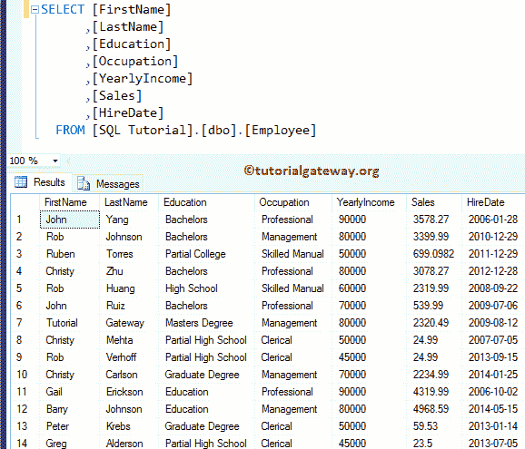
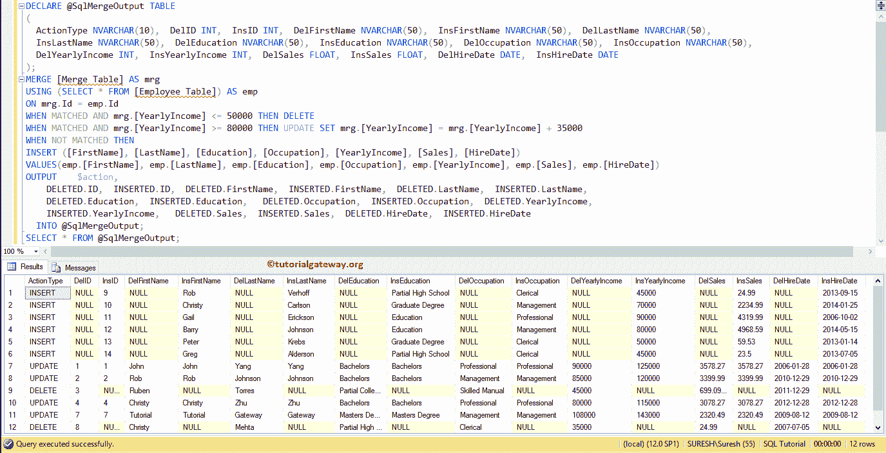

# SQL `MERGE`语句

> 原文：<https://www.tutorialgateway.org/sql-merge-statement/>

SQL MERGE:微软在 SQL Server 2008 中引入了 `MERGE`语句，在一条语句中执行 INSERT、DELETE 和 UPDATE。SQL `MERGE`语句用于根据源表中的数据修改目标表中的数据。

这意味着 SQL Server `MERGE`语句将所需的表与目标表或视图连接起来，然后对它们执行所需的操作。

## SQL MERGE 语法

用于在目标表中执行插入、更新和删除行的 SQL Server `MERGE`语句的语法。

```
MERGE [Destination table] AS ds
USING  [Source Table] AS st -- Include the columns Name
ON ds.[Common column] = st.[Common Column]
-- It's not about matching, You have to add the expressions
WHEN MATCHED THEN INSERT | DELETE | UPDATE
WHEN NOT MATCHED THEN INSERT | DELETE | UPDATE 
```

从上面的语法来看，它会检查匹配关键字后的表达式并进行操作。在 SQL Server 中使用此 MERGE 的基本规则是:

1.  在 SQL Server `MERGE`语句中，必须指定要对其执行插入、删除或更新操作的表名或视图。
2.  要在 USING 子句中加入的数据源。
3.  ON 子句用于连接源表和目标表。在这里，您必须指定用于连接两个表的公共列名。
4.  您可以根据我们从 WHEN 子句中得到的结果(当不匹配时和当匹配时)来执行删除、插入或更新操作。
5.  在同一个 Matched 子句中，不能多次更新同一个变量
6.  你必须使用分号(；)来终止此语句。
7.  如果在 SQL Server `MERGE`语句后使用@@ROWCOUNT，那么它将返回插入、删除和更新的行数。

在这个 SQL 合并语句示例演示中，我们使用了两个表(雇员表和合并表)。



而[MergeTable]表有 8 条记录。


## SQL 合并示例

以下 Sql Server 合并查询使用[雇员]表对[合并表]执行插入、删除和更新操作

```
MERGE [MergeTable] AS mrg
USING (SELECT * FROM [Employee Table]) AS emp
ON mrg.Id = emp.Id
WHEN MATCHED AND mrg.[YearlyIncome] <= 50000 THEN DELETE
WHEN MATCHED AND mrg.[YearlyIncome] >= 80000 THEN 
   UPDATE SET mrg.[YearlyIncome] = mrg.[YearlyIncome] + 35000
WHEN NOT MATCHED THEN
INSERT ([FirstName]
           ,[LastName]
           ,[Education]
           ,[Occupation]
           ,[YearlyIncome]
           ,[Sales]
           ,[HireDate])
VALUES(emp.[FirstName]
           ,emp.[LastName]
           ,emp.[Education]
           ,emp.[Occupation]
           ,emp.[YearlyIncome]
           ,emp.[Sales]
           ,emp.[HireDate]);
GO
```


首先，我们在 Sql Server Merge 子句中使用上表。这意味着，我们希望在 MergeTable 上执行插入、删除和更新操作。

接下来，我们使用 [SQL Server](https://www.tutorialgateway.org/sql/) USING 子句中的【雇员表】。这意味着我们希望将[合并表]与该数据源连接起来。

```
USING (SELECT * FROM [Employee Table]) AS emp
```

它检查年收入小于或等于 50000 英镑的员工。如果为真，则从[合并表]中删除这些记录。实时地，您也可以使用它从[合并表]中删除值与源表不匹配的记录。

```
WHEN MATCHED AND mrg.[YearlyIncome] <= 50000 THEN DELETE
```

下一个语句检查年收入是否大于或等于 80000 的员工。如果匹配，则通过向[合并表]中的每条记录添加 35000 来更新这些记录的集合。请参考 [SQL `UPDATE`语句](https://www.tutorialgateway.org/sql-update-statement/)一文。

```
WHEN MATCHED AND mrg.[YearlyIncome] >= 80000 THEN 
   UPDATE SET mrg.[YearlyIncome] = mrg.[YearlyIncome] + 35000
```

下一条语句将把不匹配的记录从[雇员]表插入[合并表]。请参考 [SQL `INSERT`语句](https://www.tutorialgateway.org/sql-insert-statement/)文章了解功能。

```
WHEN NOT MATCHED THEN
INSERT ( .....
          ........)
```

## SQL 合并语句示例 2

以下查询是使用 SQL 合并语句的最佳方法。无论何时执行合并操作，请尝试将代码放入[事务](https://www.tutorialgateway.org/sql-transaction/) (BEGIN TRAN …..回滚 TRAN)。如果任何操作失败，它会将所有内容回滚到原始状态。

```
BEGIN TRAN;
MERGE [Merge Table] AS mrg
USING (SELECT * FROM [Employee Table]) AS emp
ON mrg.Id = emp.Id
WHEN MATCHED AND mrg.[YearlyIncome] <= 50000 THEN DELETE
WHEN MATCHED AND mrg.[YearlyIncome] >= 80000 THEN UPDATE SET mrg.[YearlyIncome] = mrg.[YearlyIncome] + 35000
WHEN NOT MATCHED THEN
INSERT ([FirstName]
           ,[LastName]
           ,[Education]
           ,[Occupation]
           ,[YearlyIncome]
           ,[Sales]
           ,[HireDate])
VALUES(emp.[FirstName]
           ,emp.[LastName]
           ,emp.[Education]
           ,emp.[Occupation]
           ,emp.[YearlyIncome]
           ,emp.[Sales]
           ,emp.[HireDate])
OUTPUT $action, inserted.*, deleted.*; -- Only to show the Actions 
ROLLBACK TRAN;
GO
```

通常，OUTPUT 子句返回我们在表中插入、删除和更新的数据的副本。这就是为什么我们使用输出子句和 SQL Server 合并语句来显示查询。


下面的语句代码将对打印的操作结果提供更多的控制。

## 例 3

在这个 SQL Server 合并示例中，我们声明了表变量@SqlMergeOutput，其中的列表示对每一列的删除和插入操作。

例如，DelFirstName 是在[名字]上捕获删除操作，InsLastName 是在[姓氏]上捕获插入操作。请参考 [SQL `DELETE`语句](https://www.tutorialgateway.org/sql-delete-statement/)一文。

```
DECLARE @SqlMergeOutput TABLE
(
  ActionType NVARCHAR(10),
  DelID INT,
  InsID INT,
  DelFirstName NVARCHAR(50),
  InsFirstName NVARCHAR(50),
  DelLastName NVARCHAR(50),
  InsLastName NVARCHAR(50),
  DelEducation NVARCHAR(50),
  InsEducation NVARCHAR(50),  
  DelOccupation NVARCHAR(50),
  InsOccupation NVARCHAR(50),
  DelYearlyIncome INT,
  InsYearlyIncome INT,
  DelSales FLOAT,
  InsSales FLOAT,
  DelHireDate DATE,
  InsHireDate DATE
);
MERGE [Merge Table] AS mrg
USING (SELECT * FROM [Employee Table]) AS emp
ON mrg.Id = emp.Id
WHEN MATCHED AND mrg.[YearlyIncome] <= 50000 THEN DELETE
WHEN MATCHED AND mrg.[YearlyIncome] >= 80000 THEN UPDATE SET mrg.[YearlyIncome] = mrg.[YearlyIncome] + 35000
WHEN NOT MATCHED THEN
INSERT ([FirstName]
           ,[LastName]
           ,[Education]
           ,[Occupation]
           ,[YearlyIncome]
           ,[Sales]
           ,[HireDate])
VALUES(emp.[FirstName]
           ,emp.[LastName]
           ,emp.[Education]
           ,emp.[Occupation]
           ,emp.[YearlyIncome]
           ,emp.[Sales]
           ,emp.[HireDate])
OUTPUT $action,  
    DELETED.ID,
    INSERTED.ID,
    DELETED.FirstName,
    INSERTED.FirstName,
    DELETED.LastName,
    INSERTED.LastName,
    DELETED.Education,
    INSERTED.Education,
    DELETED.Occupation,
    INSERTED.Occupation,
    DELETED.YearlyIncome,
    INSERTED.YearlyIncome,
    DELETED.Sales,
    INSERTED.Sales,
    DELETED.HireDate,
    INSERTED.HireDate 
  INTO @SqlMergeOutput;

SELECT * FROM @SqlMergeOutput;
```

