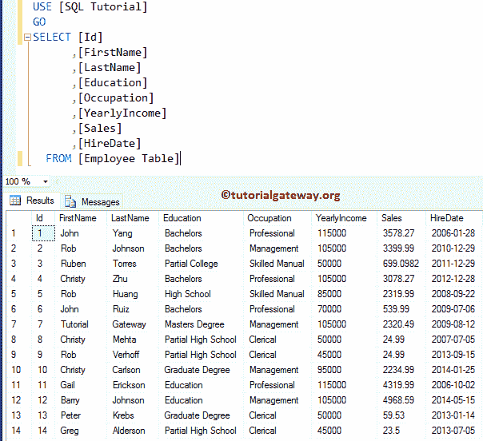
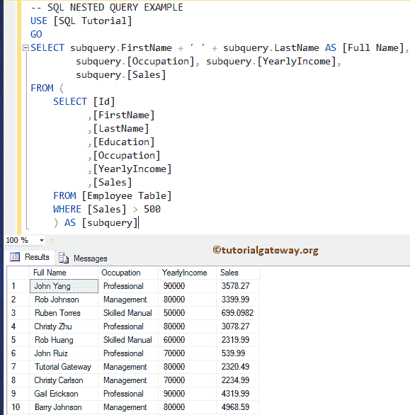

# SQL 子查询

> 原文：<https://www.tutorialgateway.org/sql-subquery/>

SQL 子查询也称为内部查询、嵌套查询，或者内部选择是嵌套在另一个查询中的查询。SQL 子查询可以嵌套在 SELECT、INSERT、DELETE 或 UPDATE 语句中，也可以嵌套在另一个子查询中。

通常，我们在`WHERE`子句中主要使用 SQL Server 子查询。这类似于 WHERE 表达式 NOT IN，或者 IN 子查询，等等。对于 SQL Server 子查询演示，我们使用雇员表。



编写 SQL 子查询或嵌套查询的基本规则

*   SQL 子查询必须包含在括号内。
*   除非使用 TOP 子句，否则不能在子查询中使用 ORDER BY 子句
*   子查询必须包含常规的`SELECT`语句和 FROM 子句
*   您还可以在其中使用可选的`WHERE`子句、GROUP BY 子句和 HAVING 子句。
*   您不能在子查询中包含 COMPUTE 或 FOR BROWSE 子句
*   子查询可以嵌套在外部 SELECT、INSERT、DELETE 或 UPDATE 语句的 WHERE 或 HAVING 子句中。
*   SQL Server 允许您嵌套多达 32 层的子查询，称为嵌套查询。也可能有所不同

## `SELECT`语句中的 SQL 子查询

在这个简单的例子中，我们将在`SELECT`语句中编写一个 SQL 子查询。

```
SELECT subquery.FirstName + ' ' + subquery.LastName AS [Full Name],
 subquery.[Occupation], subquery.[YearlyIncome],
 subquery.[Sales]
FROM (
       SELECT [Id]
              ,[FirstName]
       ,[LastName]
       ,[Education]
       ,[Occupation]
       ,[YearlyIncome]
       ,[Sales]
 FROM [Employee Table]
    WHERE [Sales] > 500
    ) AS [subquery]
```

内部查询返回员工表中所有销售金额大于 500


的记录

主查询提取，或从子查询中选择所需的列(内部)



### SQL `SELECT`语句中的子查询示例 2

微软[服务器](https://www.tutorialgateway.org/sql/)也允许我们在 [`SELECT`语句](https://www.tutorialgateway.org/sql-select-statement/)中添加或使用这个作为列表达式。让我们在 SQL`SELECT`语句中编写一个子查询。

提示:因为我们使用它作为列表达式，所以它必须为主记录返回的每个记录返回一个值。

```
SELECT [Id]
      ,[FirstName]
      ,[LastName]
      ,[Education]
      ,[Occupation]
      ,[YearlyIncome]
      ,
      (
         SELECT SUM([YearlyIncome]) FROM [Employee Table]
	 WHERE [Occupation] = 'Professional' OR [Occupation] = 'Management'
      ) AS [Total Income]
      ,[Sales]
      ,[HireDate]
FROM [Employee Table]
WHERE [Occupation] = 'Professional' OR [Occupation] = 'Management'
```


##`WHERE`子句中的 SQL 子查询

我们也可以在`WHERE`子句中使用一个 SQL 子查询作为表达式。一般来说，我们在中写 WHERE 表达式[而不是](https://www.tutorialgateway.org/sql-not-in-operator/)中写[。在本例中，我们展示了如何在`WHERE`子句中编写一个 SQL 子查询。](https://www.tutorialgateway.org/sql-in-operator/)

```
SELECT [Id]
      ,[FirstName]
      ,[LastName]
      ,[Education]
      ,[Occupation]
      ,[YearlyIncome]
      ,[Sales]
      ,[HireDate]
  FROM [Employee Table]
  WHERE [Sales] >= (
		      SELECT AVG([Sales]) FROM [Employee Table]
                   )
```

首先，它将执行 [`WHERE`子句](https://www.tutorialgateway.org/sql-where-clause/)中的内部查询。在嵌套查询中，我们找到了销售金额的平均值。接下来，主表将选择雇员表中的所有记录，其销售额大于平均销售额(通过嵌套查询返回)。


## SQL 子查询自子句

SQL Server 子查询也可以在 FROM 子句中使用，这可以帮助我们返回多条记录。它展示了如何在 FROM 子句中编写一个 SQL 子查询。

```
SELECT sub.Occupation,
       SUM(sub.YearlyIncome) AS Income,
	   SUM(sub.Sales) AS TotalSale
FROM (
	SELECT [Id]
	  ,[FirstName]
	  ,[LastName]
	  ,[Education]
	  ,[Occupation]
	  ,[YearlyIncome]
	  ,[Sales]
	FROM [Employee Table]
   	WHERE [Sales] > 500
	) AS sub
GROUP BY sub.Occupation
```

首先，将执行 SQL 嵌套查询，它将选择雇员表中存在的所有记录，其销售额大于 500。

在主查询中，我们对职业进行分组，并汇总子查询返回的年收入、销售额。我建议你参考[分组条款](https://www.tutorialgateway.org/sql-group-by-clause/)。


## 案例语句中的 SQL 子查询

让我们看看如何在 Case 语句中编写一个 SQL Server 嵌套查询。

```
SELECT [Id]
      ,[FirstName] + SPACE(2) + [LastName] AS FullName
      ,[Education]
      ,[Occupation]
      ,[YearlyIncome]
      ,[Sales]
      ,CASE WHEN 
        (
	   SELECT AVG([Sales]) FROM [Employee Table] 
	)  <= emp.[Sales] THEN 'He is Performing Good'
	                  ELSE 'He is Under Performing'
	END AS Remarks
      ,[HireDate]
  FROM [Employee Table] AS emp
```

首先，它执行子查询，并将在该表中找到销售金额的平均值。接下来，我们使用 [CASE 语句](https://www.tutorialgateway.org/sql-case-statement/)来检查销售额是否高于平均销售额(1970.9055)。如果表达式返回真，则返回“他表现良好”，否则返回“他表现不佳”作为“备注”列的输出。

接下来，主查询选择员工表中的所有记录，以及我们从案例陈述中获得的备注列。这里，我们使用 [`SPACE()`函数](https://www.tutorialgateway.org/sql-space-function/)返回名和姓之间的两个空格


## SQL Server 中的相关子查询

所有上述指定的查询都是非相关子查询，因为它们独立运行。让我们看看如何在 SQL server 中编写相关子查询。这些类型的子查询是相互依赖的。我的意思是，内部查询依赖于主查询，反之亦然。

```
SELECT [Id]
      ,[FirstName] + SPACE(2) + [LastName] AS FullName
      ,[Education]
      ,[Occupation]
      ,[YearlyIncome]
      ,[Sales]
      ,CASE WHEN 
        (
	    SELECT AVG([Sales]) FROM [Employee Table] AS sub
	    WHERE sub.Id = emp.Id
	) <= emp.[Sales] THEN 'He is Performing Good'
	                 ELSE 'He is Under Performing'
       END AS Remarks
      ,[HireDate]
  FROM [Employee Table] AS emp
```

虽然它给出的结果与上述[案例语句](https://www.tutorialgateway.org/sql-case-statement/)示例相同，但它对多个员工表 Id 运行了多次。因为子查询需要`WHERE`子句中的员工标识。

```
WHERE sub.Id = emp.Id
```

好，让我独立运行 SQL 嵌套查询。

```
Messages
-------
Msg 4104, Level 16, State 1, Line 13
The multi-part identifier "emp.Id" could not be bound.
```

如你所见，这是一个错误。现在，让我们运行整个代码


## 更新语句中的子查询

它也可以用在更新语句中。它展示了如何在更新语句中编写嵌套查询来更新雇员表中的记录。

```
UPDATE [Employee Table]
SET [YearlyIncome] = [YearlyIncome] + 25000
WHERE [Sales] > (
		   SELECT AVG([Sales]) FROM [Employee Table]
                )
```

上面嵌套的例子在 [UPDATE 语句](https://www.tutorialgateway.org/sql-update-statement/)中会通过给每个人增加 25000(类似奖金的东西)来更新年收入，其销售额大于平均销售额。


## 删除语句中的子查询

我们也可以在 DELETE 语句中使用子查询。在删除语句中编写一个 SQL 子查询，从雇员表中删除行。

```
DELETE FROM [Employee Table]
WHERE [Sales] < (
		    SELECT AVG([Sales]) FROM [Employee Table]
                )
```

以上 [DELETE 语句](https://www.tutorialgateway.org/sql-delete-statement/)将删除员工表中销售额小于平均销售额的记录或行。这里我们使用嵌套查询来获得平均销售额。


## 插入语句中的子查询

嵌套查询也应用于插入到`SELECT`语句中。如何在 SQL Insert 语句中编写子查询，将新记录插入到员工表中。

```
-- Nested EXAMPLE

INSERT INTO [Employee Table] ([FirstName]
      ,[LastName]
      ,[Education]
      ,[Occupation]
      ,[YearlyIncome]
      ,[Sales]
      ,[HireDate])
SELECT [FirstName]
      ,[LastName]
      ,[Education]
      ,[Occupation]
      ,[YearlyIncome]
      ,[Sales]
      ,[HireDate] 
	  FROM [SQL Tutorial].[dbo].[Employee Table2] 
	  WHERE [Sales] < 1950
```

嵌套在[`INSERT SELECT`语句](https://www.tutorialgateway.org/sql-insert-into-select-statement/)中的输出是

