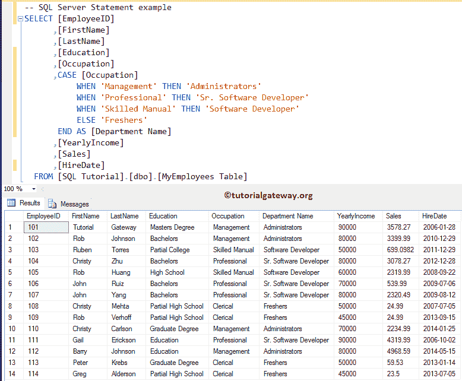
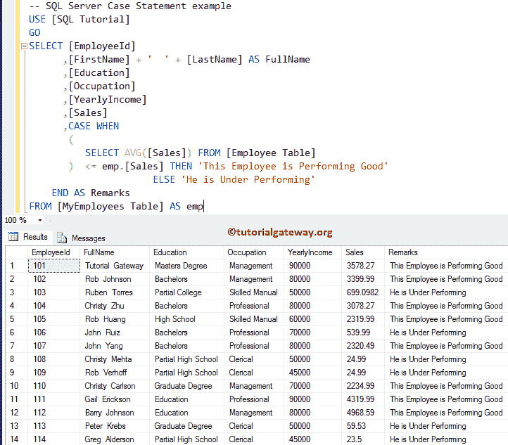
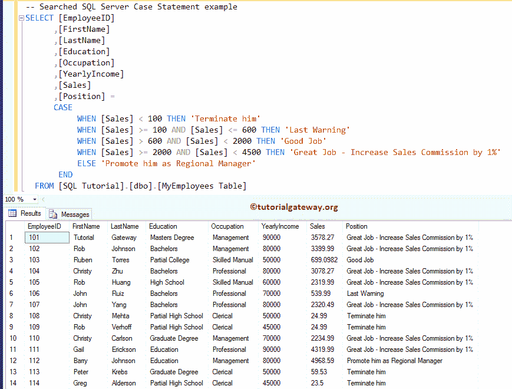
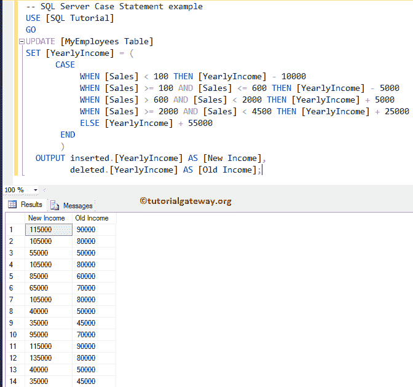
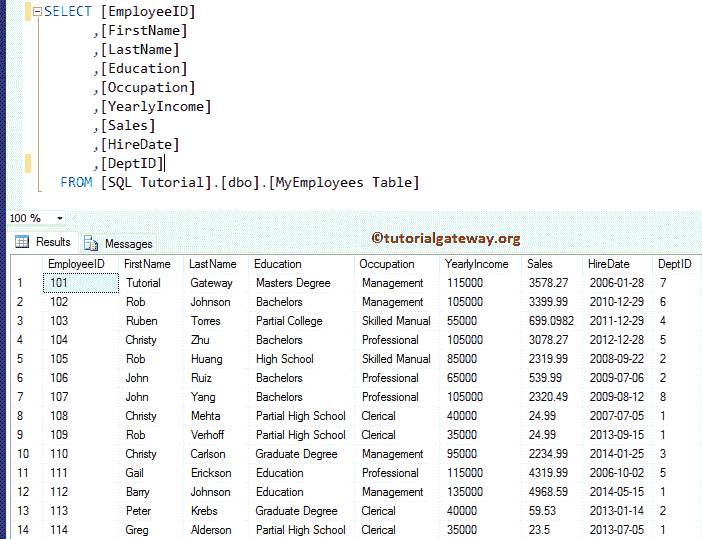

# SQL `case`语句

> 原文：<https://www.tutorialgateway.org/sql-case-statement/>

SQL Case 语句类似于控制流语句(类似于 IF ELSE)。此 SQL Server Case 语句评估“何时”中提供的一系列条件表达式，并返回结果集。有两种类型的 SQL Server `case`语句，它们是:

简单语句:SQL 简单大小写表达式将 input_expression 与一系列 test _ expressions 进行比较，后跟 WHEN 关键字。一旦找到匹配项，它将返回相应的 result_expression，后跟 THEN 关键字。如果不匹配，SQL Server Case 语句将返回 default_expression。

搜索 SQL Case 语句:这对于执行更强大和复杂的比较非常有用。它有一系列后跟 WHEN 关键字的布尔表达式，SQL Server Case 语句将计算其中的条件

*   如果条件为真，那么它将返回 result_expression，后跟 then 关键字。
*   如果没有匹配，它将返回 ELSE 块中提供的 default_expression

## SQL `case`语句语法

SQL Server `case`语句的语法是

```
CASE Input_Expression
     WHEN test_expression THEN result_expression
     .........
     ELSE default_expression
END

-- Searched Syntax
CASEWHEN Boolean_expression THEN result_expression
     .........
     ELSE default_expression
END
```

SQL Server 案例的参数有:

*   输入表达式:要检查的有效表达式。例如，它可以是您要对其执行操作的任何列。
*   test_expression:您必须指定一个表达式。它会将值或表达式与输入表达式进行比较，如果为真，结果表达式将返回。
*   result_expression:请提供表达式。如果测试表达式等于输入表达式，那么这个表达式值将返回。如果它们不相等，则默认表达式。
*   布尔表达式:提供要在搜索操作中使用的有效布尔表达式。

对于 SQL Server 演示中的这个 CASE 语句，我们使用了雇员表。


## SQL 案例示例

让我们在 SQL Server 中编写一个简单的 case 语句。下面的查询将检查 MyEmployees 表中的每一行

*   职业=管理，如果为真，则将管理员指定为部门名称
*   职业=专业，如果为真，则指定高级软件开发人员为部门名称
*   职业=熟练手册，如果是真的，则指定软件开发人员为部门名称
*   如果以上所有条件都不满足， [SQL Server](https://www.tutorialgateway.org/sql/) 会将新鲜者指定为部门名称

```
SELECT [EmployeeID]
      ,[FirstName]
      ,[LastName]
      ,[Education]
      ,[Occupation]
      ,CASE[Occupation]
	   WHEN 'Management' THEN 'Administrators'
	   WHEN 'Professional' THEN 'Sr. Software Developer'
	   WHEN 'Skilled Manual' THEN 'Software Developer'
	   ELSE 'Freshers'
	END AS [Department Name]
      ,[YearlyIncome]
      ,[Sales]
      ,[HireDate]
  FROM [MyEmployees Table]
```



## 子查询示例

本示例在 SQL Server 的 Case 语句中使用子查询。首先，[子查询](https://www.tutorialgateway.org/sql-subquery/)将执行并找到销售额的平均值。接下来，它将检查销售额是否大于平均销售额(1970.9055)，如果为真，则“此员工表现良好”将被分配到备注列。否则，它将分配“他表现不佳”。与 [IF ELSE](https://www.tutorialgateway.org/sql-if-else/) 条件相同。

```
SELECT [EmployeeId]
      ,[FirstName] + '  ' + [LastName] AS FullName
      ,[Education]
      ,[Occupation]
      ,[YearlyIncome]
      ,[Sales]
      ,CASE 
        WHEN (SELECT AVG([Sales]) FROM [Employee Table]) 
                 <= emp.[Sales] THEN 'This Employee is Performing Good'
	ELSE 'He is Under Performing'
	END AS Remarks
FROM [MyEmployees Table] AS emp
```



## 已搜索的 SQL `case`语句示例

让我在 SQL Server 中编写一个搜索到的或带有多个值的 Case 语句。

```
SELECT [EmployeeID]
      ,[FirstName]
      ,[LastName]
      ,[Education]
      ,[Occupation]
      ,[YearlyIncome]
      ,[Sales]
      ,[Position] = 
         CASE 
	   WHEN [Sales] < 100 THEN 'Terminate him'
	   WHEN [Sales] >= 100 AND [Sales] <= 600 THEN 'Last Warning'
	   WHEN [Sales] > 600 AND [Sales] < 2000 THEN 'Good Job'
	   WHEN [Sales] >= 2000 AND [Sales] < 4500 THEN 'Great Job - Increase Sales Commission by 1%'
	   ELSE 'Promote him as Regional Manager'
	 END
  FROM [MyEmployees Table]
```



## 更新中的 SQL `case`语句

如何使用 SQL Sever case 语句用新值更新[my employees Table]中的记录？。OUTPUT 子句返回我们在表中插入、删除和更新的数据的副本。这里，我们使用 OUTPUT 子句在一个地方显示旧的年收入值和更新的收入值

```
UPDATE [MyEmployees Table]
SET [YearlyIncome] = (
	CASE 
	   WHEN [Sales] < 100 THEN [YearlyIncome] - 10000
	   WHEN [Sales] >= 100 AND [Sales] <= 600 THEN [YearlyIncome] - 5000
	   WHEN [Sales] > 600 AND [Sales] < 2000 THEN [YearlyIncome] + 5000
	   WHEN [Sales] >= 2000 AND [Sales] < 4500 THEN [YearlyIncome] + 25000
	   ELSE [YearlyIncome] + 55000
        END
	)
OUTPUT inserted.[YearlyIncome] AS [New Income], 
       deleted.[YearlyIncome] AS [Old Income];
```



让我们看看上面例子的输出



## 限制

*   我们不能用这个来控制查询、[用户定义函数](https://www.tutorialgateway.org/user-defined-functions-in-sql/)和[存储过程](https://www.tutorialgateway.org/stored-procedures-in-sql/)的执行流程。
*   最多允许 10 级嵌套表达式。
*   您不能使用简单的检查空值。
*   它按顺序执行操作。意思是当条件满足时。那它就会停止。