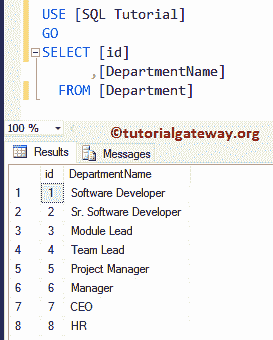

# SQL Server CTE

> 原文：<https://www.tutorialgateway.org/sql-server-cte/>

SQL Server CTE 也称为通用表表达式。这个 SQL CTE 用于生成一个在查询期间存在的临时命名集(类似于临时表)。我们可以在单个 SELECT、INSERT、DELETE 或`UPDATE`语句的执行范围内定义这个 SQL Server CTE。使用此 SQL Server CTE 的基本规则是:

1.  SQL Server CTE 必须后跟一个使用全部或部分通用表表达式列的 SELECT、INSERT、DELETE 或`UPDATE`语句。
2.  使用联合、`UNION ALL`、交集或例外，我们可以定义多重 CTE 定义。
3.  可以引用 CTE 本身，也可以引用以前定义的通用表表达式，但不能引用下一个(前向引用)
4.  在 SQL 通用表表达式中，我们不能引用远程服务器上的表。
5.  在定义中，不能使用以下子句:
    1.  除非您使用的是 `TOP`子句，否则不能使用 `ORDER BY`子句
    2.  带有查询提示的 INTO、FOR BROWSE 和 OPTION 子句。

## CTE 语法

SQL Server 中 CTE 的语法是

```
WITH Expression_Name (Column_Name1, ColumnName2,.....ColumnNameN)
AS
(Define) -- Write a query

SELECT Column_Name1, ColumnName2,.....ColumnNameN
FROM Expression_Name -- Or, CTE Name
```

Sql 公共表表达式的参数有:

*   表达式名称:请为要创建的通用表表达式指定一个有效且唯一的名称。它必须不同于在同一个 WITH 中定义的任何其他名称。
*   Column_Name1，ColumnName2，…..列名:请指定有效且唯一的列名。因为 [SQL Server](https://www.tutorialgateway.org/sql/) 不允许有重名。您在此指定的列数应该与定义的结果集相匹配
*   定义:为此编写您的查询。

对于这个 SQL 通用表表达式演示，我们使用[员工表]和[部门]表。


而【部门】表有八条记录。



## SQL CTE 示例

在这个简单的例子中，我们将向您展示如何在 SQL Server 中编写一个简单的 CTE。

```
WITH Total_Sale 
AS
(
SELECT [Occupation]
      ,[Education]
      ,SUM([YearlyIncome]) AS Income
      ,SUM([Sales]) AS Sale
  FROM [Employee Table]
  GROUP BY [Education], [Occupation]
)
SELECT * FROM Total_Sale
```


在这个 SQL Server CTE 中，我们按职业和教育分组对数字列(年收入和销售额)执行聚合(求和)。我建议你参考 [`GROUP BY`子句](https://www.tutorialgateway.org/sql-group-by-clause/)一文。

```
SELECT [Occupation]
      ,[Education]
      ,SUM([YearlyIncome]) AS Income
      ,SUM([Sales]) AS Sale
  FROM [Employee Table]
  GROUP BY [Education], [Occupation]
```

接下来，我们使用 [`SELECT`语句](https://www.tutorialgateway.org/sql-select-statement/)来选择 Total_Sale 返回的所有记录

```
SELECT * FROM Total_Sale
```

### SQL CTE 列名示例

将列名添加到通用表表达式中始终是一种好的做法。因为即使您在定义中使用了重复的名称，或者没有给列命名，SQL 也不会抛出任何错误。这里，我们向 SQL 公共表表达式添加列名。

```
WITH Total_Sale (Profession, Qualification, Income, Sale)
AS
(
SELECT [Occupation]
      ,[Education]
      ,SUM([YearlyIncome]) -- No Alias Column Name
      ,SUM([Sales]) -- No Alias Column Name
  FROM [Employee Table]
  GROUP BY [Education], [Occupation]
)
SELECT * FROM Total_Sale
```


如果您没有使用列名，那么 SQL Server 将为以下两个语句抛出一个错误。因为它们没有别名列名。因此，它将收入和销售指定为它们的列名。

```
  ,SUM([YearlyIncome]) -- No Alias Column Name
  ,SUM([Sales]) -- No Alias Column Name
```

## SQL Server CTE 在每个组中选择第一行

让我们看看如何在 SQL Server 中使用 CTE 选择每个组中的第一行。

```
WITH Highest_Record AS
(
SELECT [FirstName]
      ,[LastName]
      ,[Education]
      ,[Occupation]
      ,[YearlyIncome]
      ,ROW_NUMBER() OVER (PARTITION BY [Occupation] 
                          ORDER BY [YearlyIncome] DESC) AS Number
      ,[Sales]
      ,[HireDate]
  FROM [Employee Table]
  )
-- It will select all the records whose Rank is 1 (Highest rank)
SELECT [FirstName] + ' ' + [LastName] AS [Full Name]
      ,[Education]
      ,[Occupation]
      ,[YearlyIncome]
      ,[Sales]
      ,[HireDate]
FROM Highest_Record AS hr
-- If you omit this where clause, then all the records are selected.
WHERE hr.Number = 1
```


上面的 SQL 公共表表达式中的以下语句将为 Employee 表中的每一行分配唯一的行号。请参考 [ROW_NUMBER](https://www.tutorialgateway.org/sql-row_number/) 和 [`ORDER BY`子句](https://www.tutorialgateway.org/sql-order-by-clause/)了解以下查询。

```
 ,ROW_NUMBER() OVER (PARTITION BY [Occupation] 
                     ORDER BY [YearlyIncome] DESC) AS Number
```

## SQL Server 中的多 CTE 示例

在本例中，我们向您展示了如何在 WITH 语句的单个查询中使用多个 cte。如前所述，我们可以在一个 WITH 语句中编写多个通用表表达式语句，方法是用逗号分隔它们。

```
WITH Highest_Record AS
(
SELECT Id
      ,[FirstName]
      ,[LastName]
      ,[Education]
      ,[Occupation]
      ,[YearlyIncome]
      ,ROW_NUMBER() OVER (PARTITION BY [Occupation] 
                          ORDER BY [YearlyIncome] DESC) AS Number
      ,[Sales]
      ,[HireDate]
  FROM [Employee Table]
),
-- Use Comma to Separate multiple expressions - Highest_Record and Department_Name
Department_Names AS
(
SELECT *
  FROM [Department]
)
-- We are using LEFT Join to join 
SELECT hr.[FirstName] + ' ' + hr.[LastName] AS [Full Name]
      ,hr.[Education]
      ,hr.[Occupation]
      ,dept.DepartmentName
      ,hr.[YearlyIncome]
      ,hr.[Sales]
      ,hr.[HireDate]
      ,hr.Number AS [Rank]
FROM Highest_Record AS hr
LEFT JOIN 
    Department_Names AS dept ON
	hr.Id = dept.id
```

提示:请参考[左连接](https://www.tutorialgateway.org/sql-left-join/)。


## CTE 递归示例

以下是在 Sql Server 中定义递归 CTEs 的基本准则:

*   递归公用表表达式必须包含至少两个 CTE 查询定义、一个递归成员和一个锚成员。
*   您可以使用任何 Set 运算符: [UNION](https://www.tutorialgateway.org/sql-union-query/) 、 [UNION ALL](https://www.tutorialgateway.org/sql-union-all/) 、 [EXCEPT](https://www.tutorialgateway.org/sql-except/) 或 [INTERSECT](https://www.tutorialgateway.org/sql-intersect/) 来组合 Sql 公共表表达式的锚成员。UNION ALL 运算符是用于组合多个递归成员的唯一运算符。
*   锚定成员和递归成员中的列数和数据类型应该相同。
*   不能在定义的递归成员中使用 [GROUP BY](https://www.tutorialgateway.org/sql-group-by-clause/) 、 [SELECT DISTINCT](https://www.tutorialgateway.org/sql-select-distinct-statement/) 、 [PIVOT](https://www.tutorialgateway.org/sql-pivot/) 、 [HAVING](https://www.tutorialgateway.org/sql-having-clause/) 、 [TOP](https://www.tutorialgateway.org/sql-top-clause/) 、 [LEFT JOIN](https://www.tutorialgateway.org/sql-left-join/) 、 [RIGHT JOIN](https://www.tutorialgateway.org/sql-right-join/) 、 [OUTER JOIN](https://www.tutorialgateway.org/sql-cross-join/) 、[子查询](https://www.tutorialgateway.org/sql-subquery/)和标量[聚合](https://www.tutorialgateway.org/sql-aggregate-functions/)。

这个例子展示了如何在 SQL Server 中编写递归 CTE。对于这个递归通用表表达式 cte 演示，我们使用[Employee 表]表。


递归查询返回以下结果

```
WITH CTE_Recursion AS   
(  
    SELECT [EmployeeID]
      ,[FirstName]
      ,[LastName]
      ,[Education]
      ,[Occupation]
      ,[YearlyIncome]
      ,[Sales]
      ,[ManagerID]
     ,1 AS EmployeeLevel  
    FROM MyEmployees   
    WHERE ManagerID IS NULL  
    UNION ALL  
  SELECT emp.[EmployeeID]
      ,emp.[FirstName]
      ,emp.[LastName]
      ,emp.[Education]
      ,emp.[Occupation]
      ,emp.[YearlyIncome]
      ,emp.[Sales]
      ,emp.[ManagerID]
      ,EmployeeLevel + 1  
    FROM MyEmployees AS emp  
        INNER JOIN CTE_Recursion AS cte  
        ON emp.ManagerID = cte.EmployeeID   
)  
SELECT *  
FROM CTE_Recursion  
ORDER BY EmployeeLevel, ManagerID;  
GO
```


## 显示层次列表的 Sql CTE 递归

这里我们也使用 SQL CTE 递归。但是，我们修改了上面的示例，以直观地显示层次级别。

```
WITH CTE_Recursion
AS 
(
SELECT  EmployeeID,  
        1 AS [Designation Level],
 CONVERT(varchar(255), FirstName + ' ' + LastName) AS Name,
 [DeptID]   
  FROM MyEmployees
  WHERE ManagerID IS NULL  
UNION ALL  
SELECT emp.EmployeeID,  
      [Designation Level] + 1,
      CONVERT(varchar(255), REPLICATE ('|    ' , [Designation Level]) +  
                                        emp.FirstName + ' ' + emp.LastName),
      emp.[DeptID]     
  FROM MyEmployees AS emp  
     JOIN CTE_Recursion AS cte 
           ON emp.ManagerID = cte.EmployeeID  
)  
SELECT cte.EmployeeID, 
       cte.[Designation Level], 
       cte.Name, 
       dept.DepartmentName  
FROM CTE_Recursion AS cte
  INNER JOIN
      Department AS dept
    ON  cte.DeptID = dept.id
ORDER BY [Designation Level]    
GO  
```

