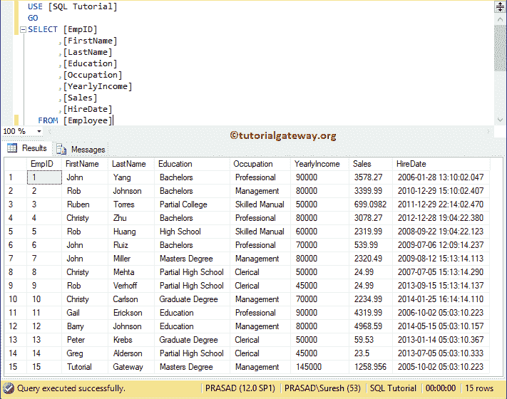
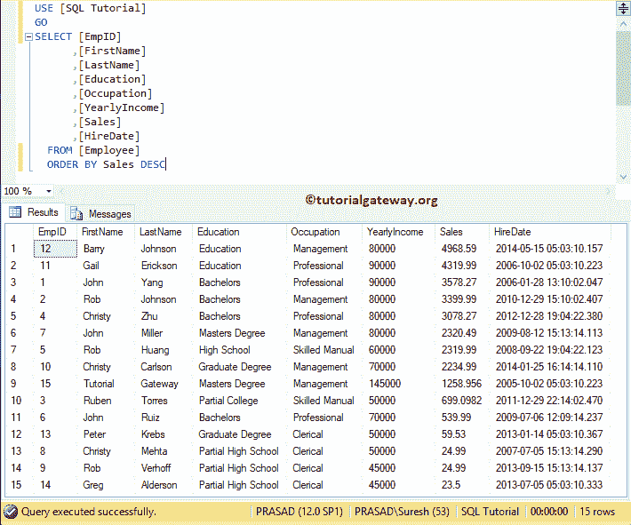
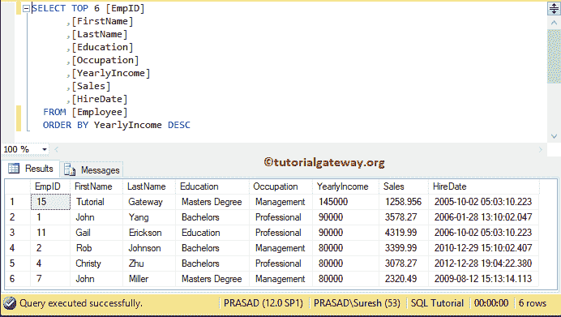
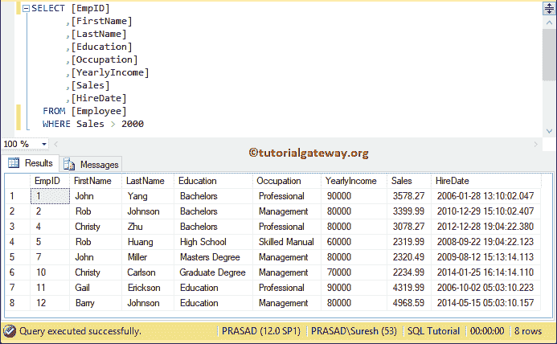
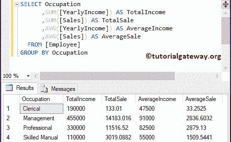
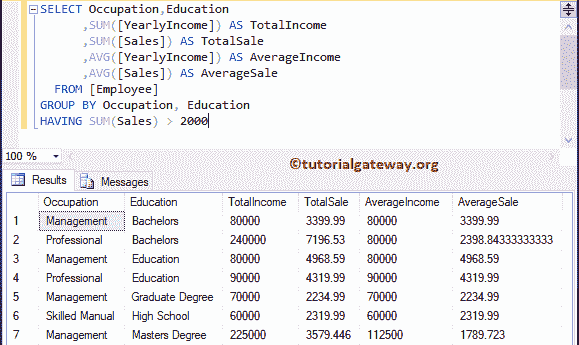

# SQL Server 中的子句

> 原文：<https://www.tutorialgateway.org/clauses-in-sql-server/>

在本文中，我们将通过实例向您展示 SQL Server 中的子句列表。这是你在面试中可能会遇到的基本面试问题之一。

## SQL Server 中的子句

SQL Server 中有五种类型的子句。他们是

*   按条款排序
*   顶条款
*  `WHERE`子句
*   `GROUP BY`条款和
*   有条款



### SQL Server 中的按子句排序

用于按升序或降序对数据进行排序的 SQL Server `ORDER BY`。建议大家参考 [`ORDER BY`子句](https://www.tutorialgateway.org/sql-order-by-clause/)一文，详细了解 [SQL](https://www.tutorialgateway.org/sql/) Order By。在本例中，我们将使用 Sales 按降序对 Employee 表进行排序

```sql
SELECT [EmpID]
      ,[FirstName]
      ,[LastName]
      ,[Education]
      ,[Occupation]
      ,[YearlyIncome]
      ,[Sales]
      ,[HireDate]
  FROM [Employee]
  ORDER BY Sales DESC
```



### SQL Server 中的顶级子句

“SQL Server Top”用于选择前 N 条记录。参考[顶条款](https://www.tutorialgateway.org/sql-top-clause/)。本示例按年收入降序返回雇员表中的前六条记录

```sql
SELECT TOP 6 [EmpID]
      ,[FirstName]
      ,[LastName]
      ,[Education]
      ,[Occupation]
      ,[YearlyIncome]
      ,[Sales]
      ,[HireDate]
  FROM [Employee]
  ORDER BY YearlyIncome DESC
```



### SQL Server 中的`WHERE`子句

SQL Server `WHERE`子句用于限制 [`SELECT`语句](https://www.tutorialgateway.org/sql-select-statement/)返回的记录数。请参考[哪里条款](https://www.tutorialgateway.org/sql-where-clause/)。本示例返回雇员表中销售额大于 2000 的所有记录

```sql
SELECT [EmpID]
      ,[FirstName]
      ,[LastName]
      ,[Education]
      ,[Occupation]
      ,[YearlyIncome]
      ,[Sales]
      ,[HireDate]
  FROM [Employee]
  WHERE Sales > 2000
```



### sql server 中按类分组

`GROUP BY`子句通过对一列或多列进行分组并对其余列应用聚合函数来返回聚合数据。

此[`GROUP BY`子句](https://www.tutorialgateway.org/sql-group-by-clause/)查询按职业对员工表进行分组，并返回年收入总和、销售额总和、销售额平均值和年收入平均值

```sql
-- Group By Clause Example
SELECT Occupation
      ,SUM([YearlyIncome]) AS TotalIncome
      ,SUM([Sales]) AS TotalSale
      ,AVG([YearlyIncome]) AS AverageIncome
      ,AVG([Sales]) AS AverageSale
  FROM [Employee]
GROUP BY Occupation
```



### 有条款

`Having`子句用于限制 `GROUP BY`子句返回的记录数。

此查询首先按职业、教育程度对员工表进行分组，并返回收入、销售、年收入平均值和销售平均值的总和。接下来，[拥有条款](https://www.tutorialgateway.org/sql-having-clause/)将限制销售总和大于 2000 的记录

```sql
SELECT Occupation,Education
 	  ,SUM([YearlyIncome]) AS TotalIncome
      ,SUM([Sales]) AS TotalSale
      ,AVG([YearlyIncome]) AS AverageIncome
      ,AVG([Sales]) AS AverageSale
  FROM [Employee]
GROUP BY Occupation, Education
HAVING SUM(Sales) > 2000
```

