# SQL 分组依据子句

> 原文：<https://www.tutorialgateway.org/sql-group-by-clause/>

SQL GROUP BY 子句通过对一列或多列进行分组来返回聚合数据，并对剩余的列执行聚合函数。例如，如果您想要找出按地区或国家的销售总数，请使用 SQL Group By 子句按地区或国家对销售表进行分类。然后我们可以使用聚合函数 SUM 和来计算总数。

## SQL 分组依据子句语法

`SELECT`语句中的 SQL 分组依据子句语法为

```
SELECT [Column1], [Column2]...[ColumnN],
       Aggregate Function (Expression | Column_Name) 
FROM [Source]
WHERE [Conditions] -- Optional
GROUP BY [Column1], [Column2]...[ColumnN]
ORDER BY Columns
```

从上面的 SQL group by 子句语法中，列允许我们从表中[选择](https://www.tutorialgateway.org/sql-select-statement/)列的数量，并且它可以是一个或多个。我们可以使用任何[聚合函数](https://www.tutorialgateway.org/sql-aggregate-functions/)，如 SUM、MIN、AVG、MAX 和 COUNT。一个源可以是一个或多个，使用[连接](https://www.tutorialgateway.org/sql-inner-join/)连接多个表。

条件:提供过滤器或条件。如果条件为真，则只有`SELECT`语句返回记录。不属于聚合函数的所有选定列都应放在此子句之后。

如果您想向最终用户显示汇总信息，请使用此子句。本文展示了在使用`SELECT`语句提取数据时，如何使用 SQL Server Group By 子句对数据进行分类和聚合。我们用以下数据来解释这一点。

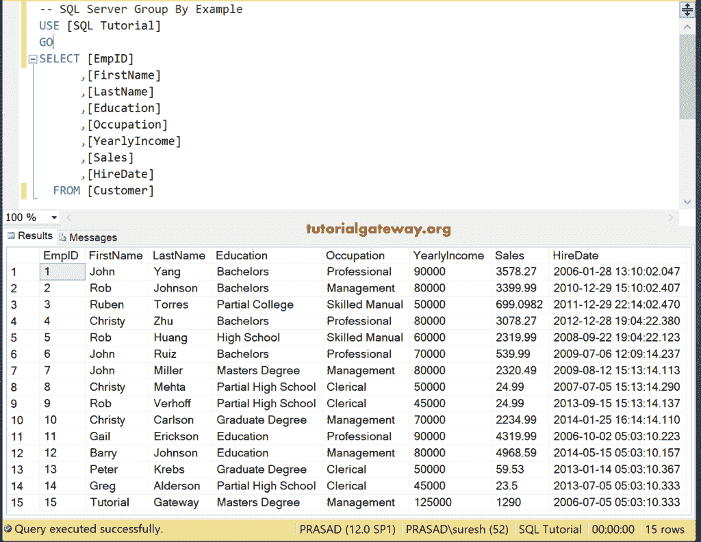

## 按计数单列进行 SQL 分组

在这个例子中，我们在这个子句中使用了一列。以下查询将[统计](https://www.tutorialgateway.org/sql-count-function/)某个教育类别中的员工 id 总数。

```
SELECT Education, 
	COUNT([EmpID]) AS [Total IDs]
FROM [Customer]
GROUP BY Education
```

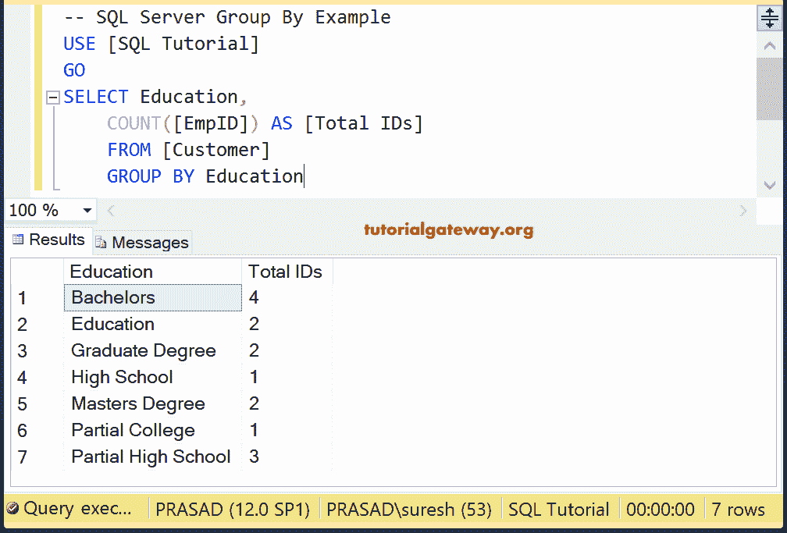

## SQL 多列

在此 transact-SQL 查询中使用多个列，如教育和职业。

```
SELECT Education, 
	[Occupation],
	COUNT([EmpID]) AS [Total IDs]
FROM [Customer]
GROUP BY Education, Occupation
```

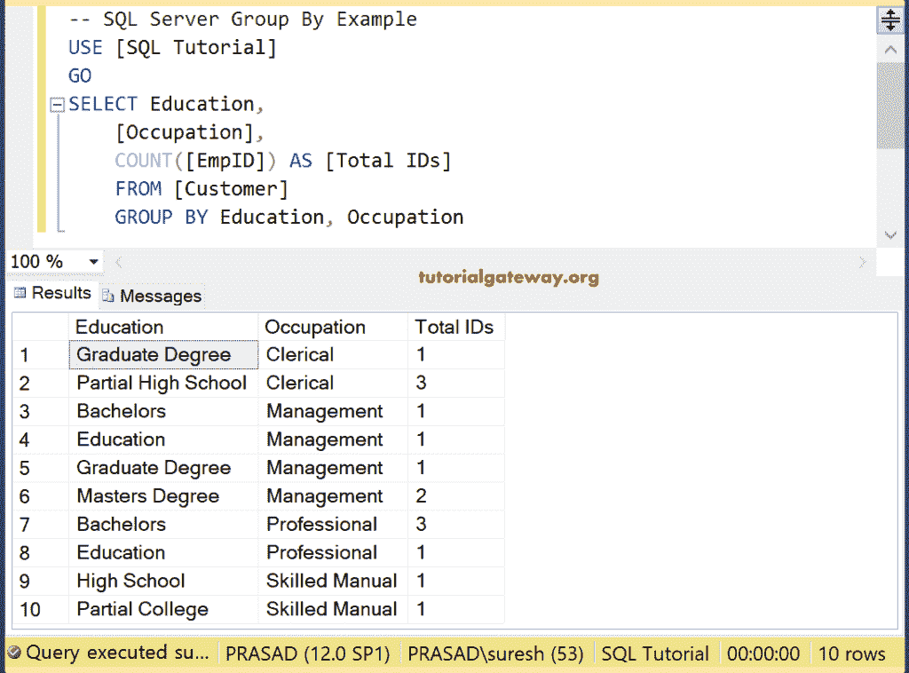

如果观察上面的 [SQL Server](https://www.tutorialgateway.org/sql/) 截图，虽然我们合并了职业，但是列值是重复的。因为在这里我们用了两栏(职业和教育)在这个陈述中。攻读学士学位的人在管理部门工作，很少有人在专业部门工作。

## 按总和分组的 SQL 示例

这里，我们在单个列中使用 [Sum](https://www.tutorialgateway.org/sql-sum-function/) 函数。以下合计交易查询将计算每个部门的总收入。

```
SELECT [Occupation],
	SUM(YearlyIncome) AS [Total Income]
FROM [Customer]
GROUP BY Occupation
```

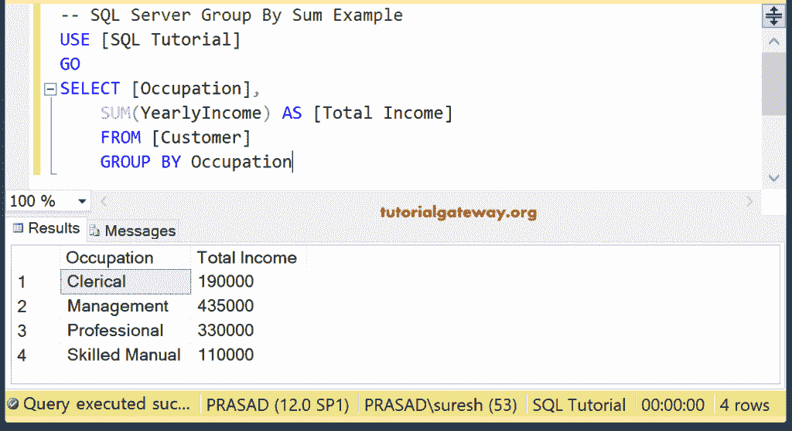

使用求和函数和多列示例。

```
SELECT [Occupation],
	Education,
	SUM(YearlyIncome) AS [Total Income]
FROM [Customer]
GROUP BY Occupation, Education
```

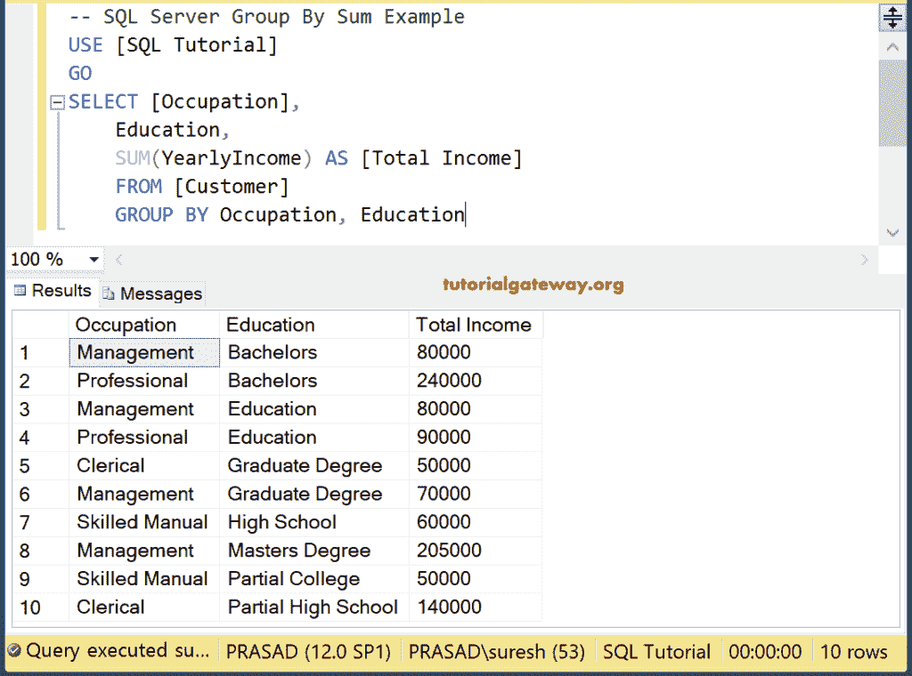

我们也可以把 [Where 子句](https://www.tutorialgateway.org/sql-where-clause/)和这个一起使用。

```
SELECT [Occupation]
      ,[Education]
      ,SUM([YearlyIncome]) AS [Total Income]
  FROM [Customer]
  WHERE [Occupation] <> 'Skilled Manual'
  GROUP BY [Occupation], [Education]
```

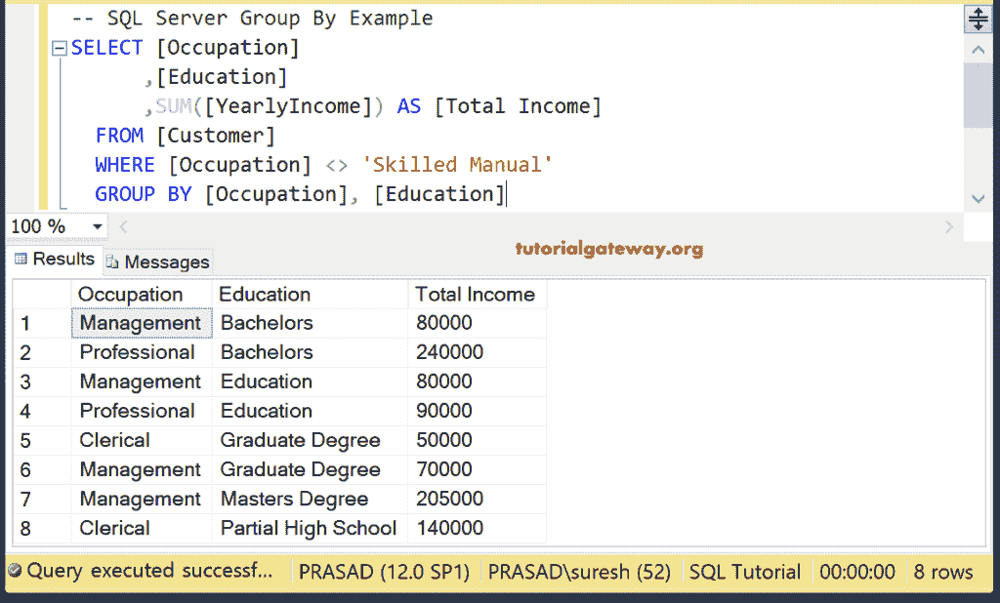

您也可以将 [Order By 子句](https://www.tutorialgateway.org/sql-order-by-clause/)与此子句一起使用。

```
SELECT [Occupation]
      ,[Education]
      ,SUM([YearlyIncome]) AS [Total Income]
	  ,SUM(Sales) AS [Total Sales]
  FROM [Customer]
  WHERE [Occupation] <> 'Skilled Manual'
  GROUP BY [Occupation], [Education]
  ORDER BY SUM([YearlyIncome]) DESC
```

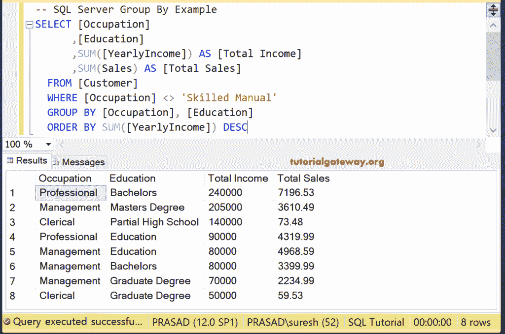

## SQL 聚合函数

在本例中，我们将在单个 [`SELECT`语句](https://www.tutorialgateway.org/sql-select-statement/)中使用 [SUM](https://www.tutorialgateway.org/sql-sum-function/) 、 [AVG](https://www.tutorialgateway.org/sql-avg-function/) 、 [MIN](https://www.tutorialgateway.org/sql-min-function/) 和 [MAX](https://www.tutorialgateway.org/sql-max-function/) 聚合函数。

```
SELECT [Occupation]
      ,SUM([YearlyIncome]) AS [Total Income]
      ,AVG([YearlyIncome]) AS [Average Income]
      ,MIN([YearlyIncome]) AS [Minimum Salery]
      ,MAX([YearlyIncome]) AS [Maximum Salery]
  FROM [Customer]
  GROUP BY [Occupation]
  ORDER BY  [Occupation]
```

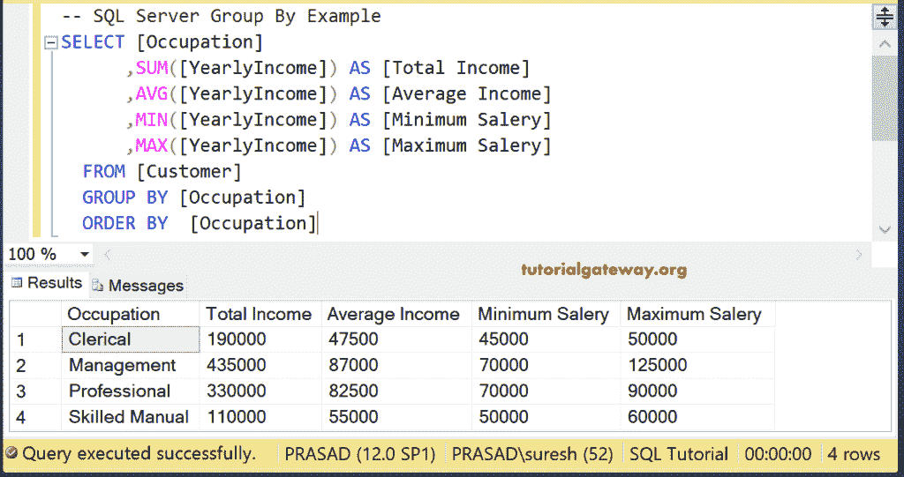

注意:如果您忘记了[别名](https://www.tutorialgateway.org/sql-alias/)列名，那么【无列名】将显示为标题文本。

## SQL 顶子句

这里结合职业教育和[顶条款](https://www.tutorialgateway.org/sql-top-clause/)选择前 6 条记录。

```
SELECT TOP 6 [Occupation],
	Education,
	SUM(YearlyIncome) AS [Total Income],
	SUM(Sales) AS [Total Sales]
FROM [Customer]
GROUPBY Occupation, Education
ORDER BY SUM(YearlyIncome) DESC
```

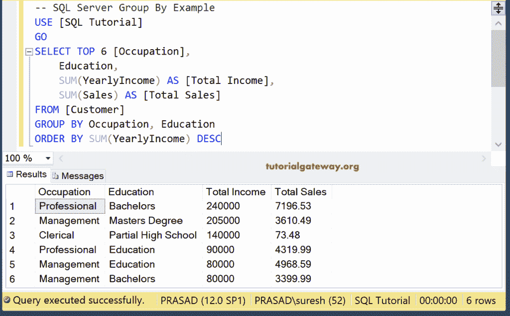

它和上面的一样，但是我们用了下面两行。本陈述将按职业和教育结合客户。接下来， [Having 子句](https://www.tutorialgateway.org/sql-having-clause/)将返回年收入之和大于 60000 的结果。

```
HAVING SUM([YearlyIncome]) > 60000
ORDER BY SUM(YearlyIncome) DESC
```

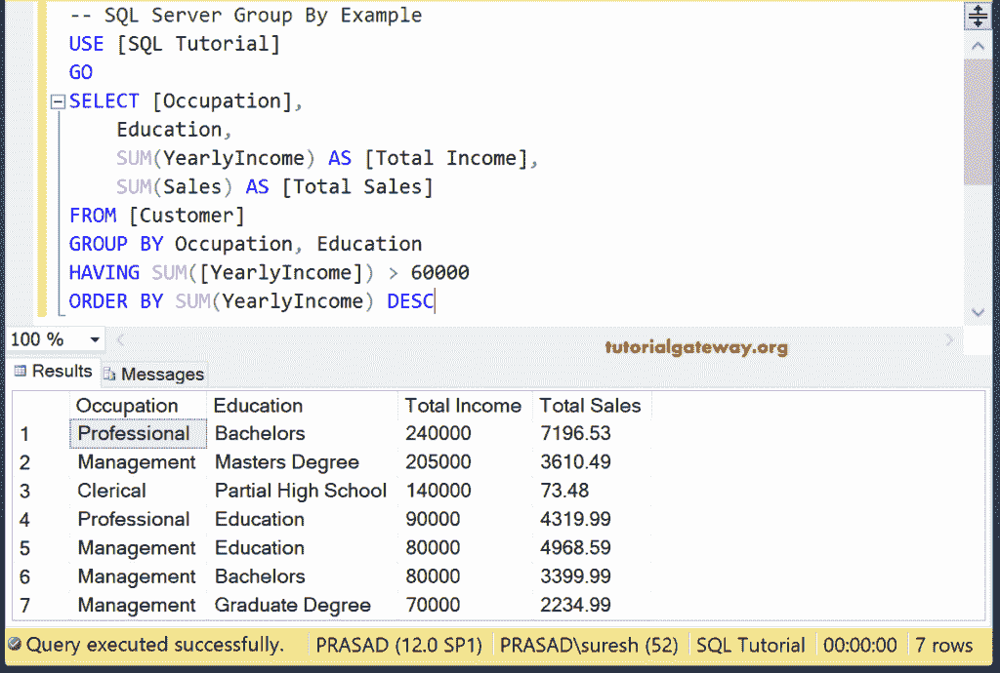

## 复杂的例子

结合所有的可能性，比如 where，having，order by，sum，你可以和这个子句一起使用。

```
SELECT [Occupation],
	Education,
	SUM(YearlyIncome) AS [Total Income],
	SUM(Sales) AS [Total Sales]
FROM [Customer]
WHERE [Education] <> 'Partial High School'
GROUP BY Occupation, Education
HAVING SUM([YearlyIncome]) > 60000
ORDER BY Occupation, Education
```

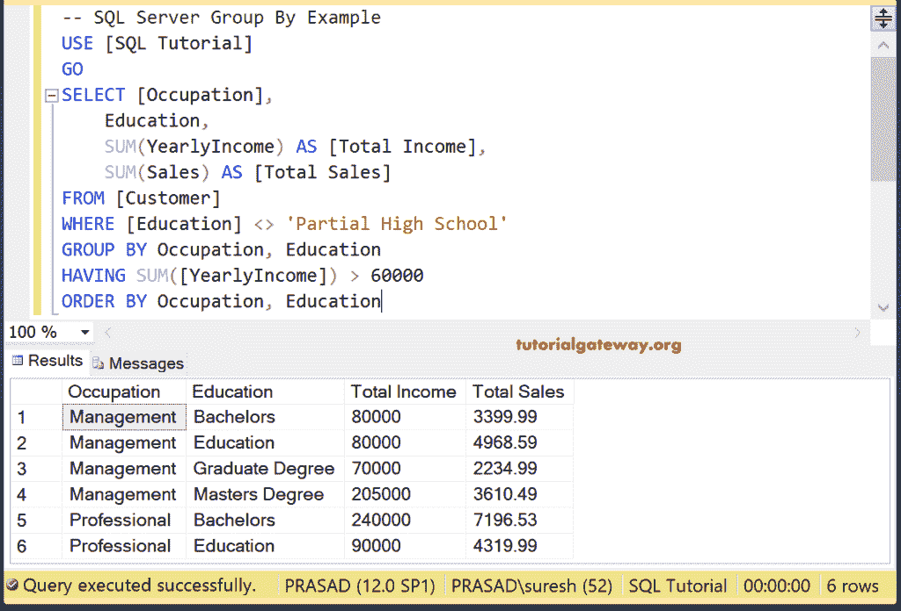