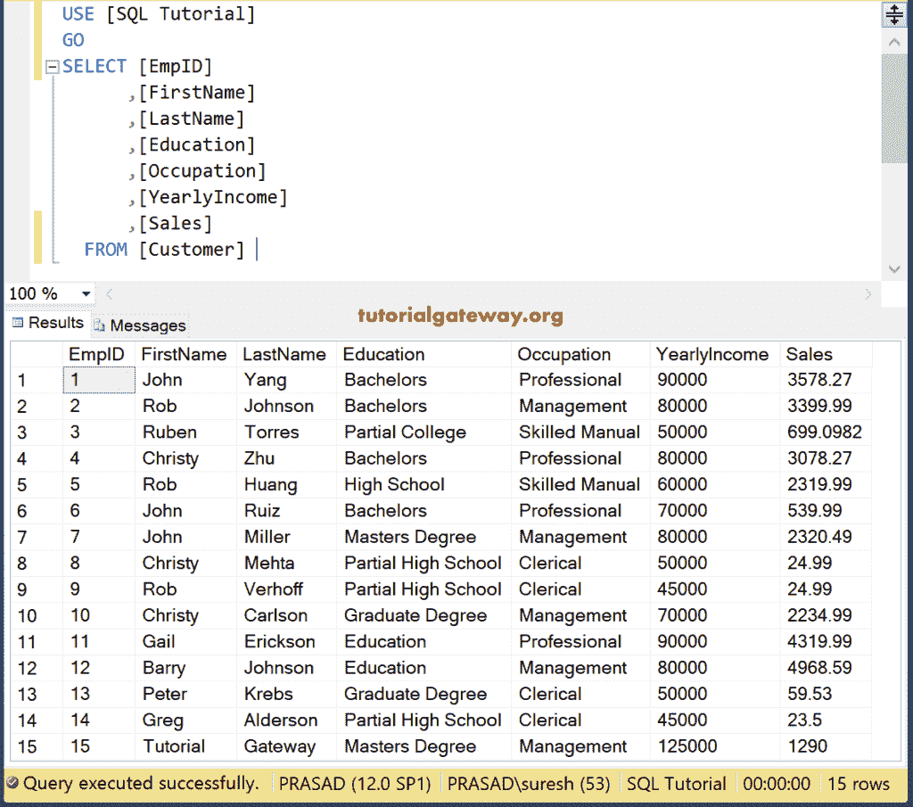
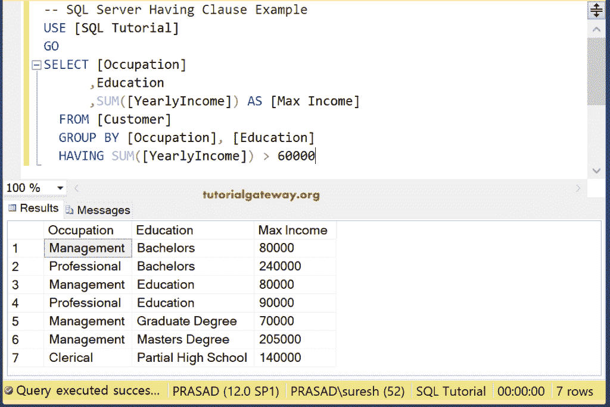
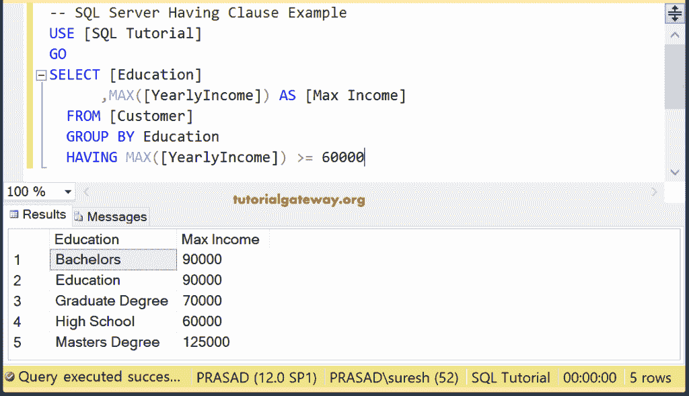
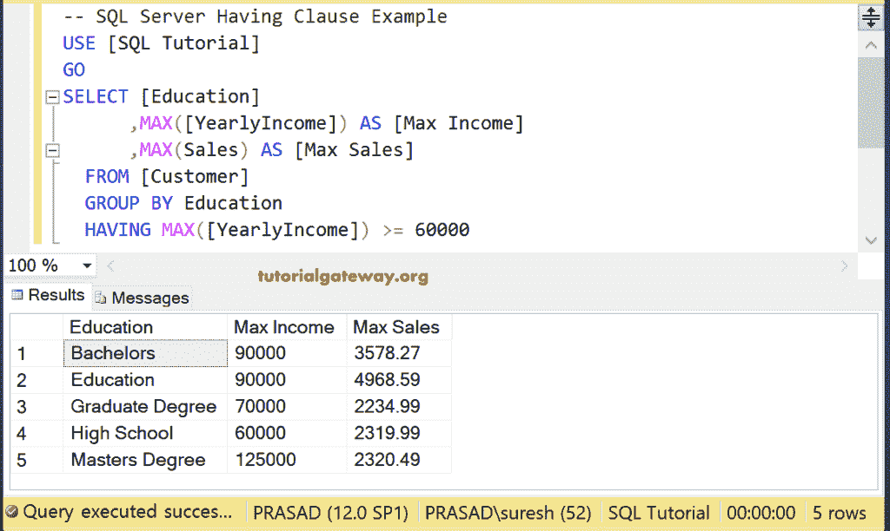
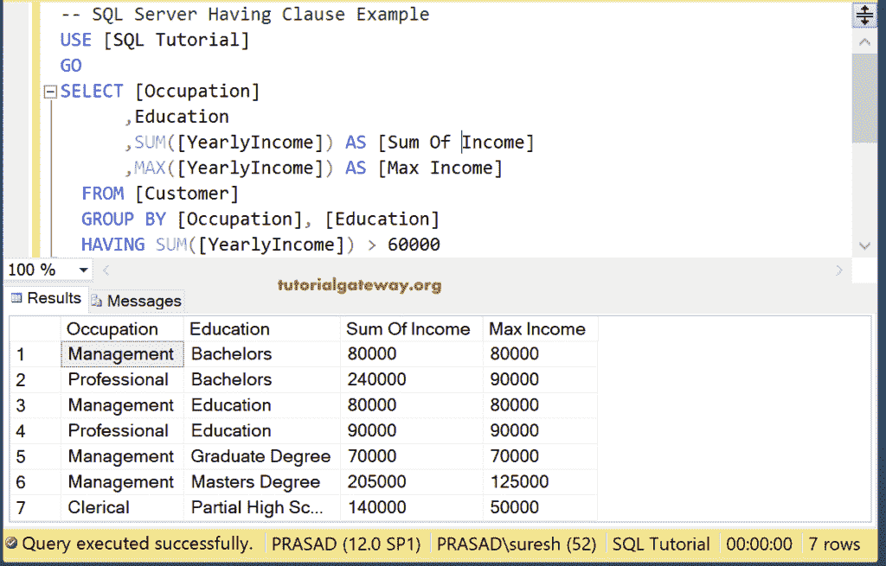
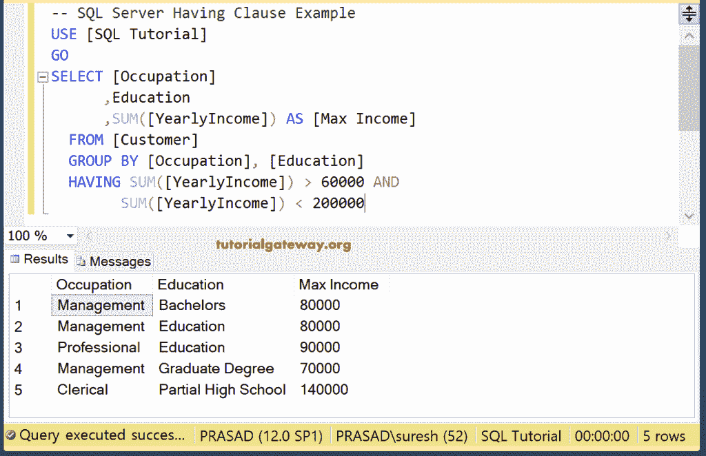
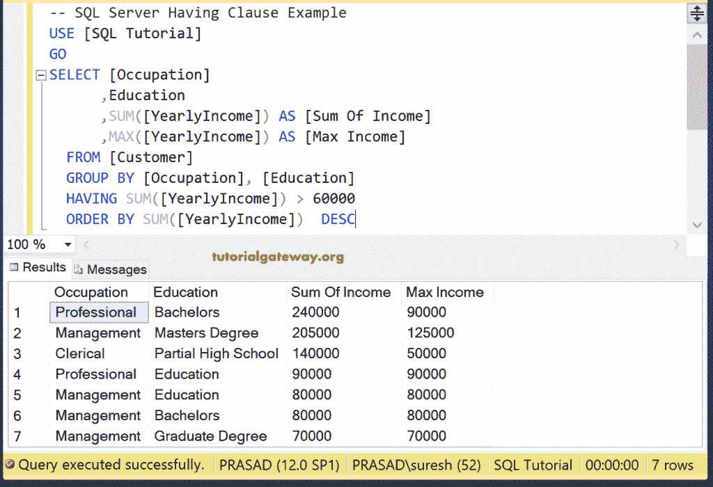
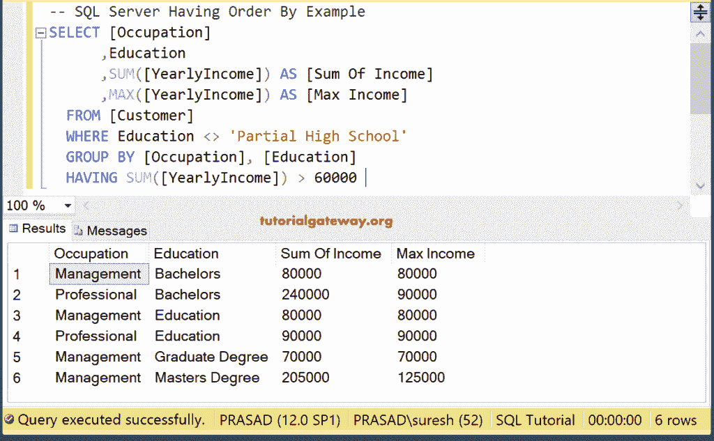
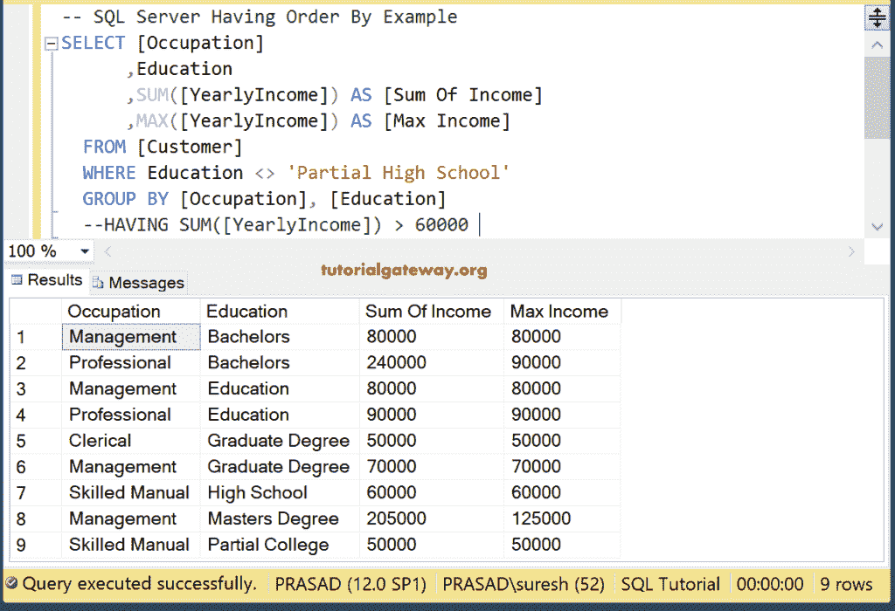
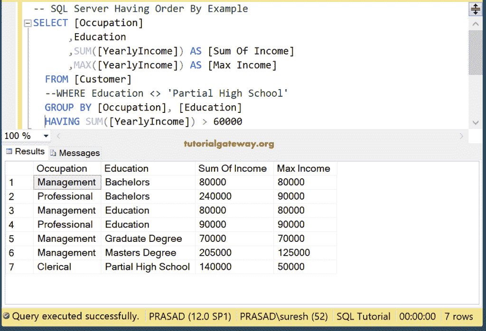

# 有子句的 SQL

> 原文：<https://www.tutorialgateway.org/sql-having-clause/>

SQL Having 子句用于限制由 Group By 子句返回的行数(或记录数)。在本文中，我们展示了如何在组应用聚合函数 by 子句后编写 SQL Having 子句来过滤数据。Where 子句不允许我们根据聚合数据检查任何条件。因此，为了对照聚合数据检查任何条件，我们必须使用 SQL Having 子句。

要使用 Sql Server Having 子句，我们必须使用 Group By，因为 Having 子句过滤我们从该集合中获得的数据。如果我们没有使用 GROUP BY，那么 Having 的行为就像一个 WHERE 子句。

## 具有子句语法的 SQL

Sql Server Having 子句和 Group By 语句的写法如下:

```
SELECT [Column1], [Column2]...[ColumnN],
       Aggregate Function (Expression | Column_Name) 
FROM [Source]
WHERE [Conditions] -- Optional
GROUP BY [Column1], [Column2]...[ColumnN]
HAVING [Conditions] -- This Condition is on Aggregate Function (Expression | Column_Name)
```

我们已经解释了列、[聚合函数](https://www.tutorialgateway.org/sql-aggregate-functions/)、源、条件、分组依据选项。因此，在调查此事之前，请参考[集团](https://www.tutorialgateway.org/sql-group-by-clause/)。这里，它有助于为我们从分组依据中获得的聚合数据提供过滤器或条件。我们用下面的数据来解释 SQL Server 中的 Having 子句。



## 具有单一条件示例的 SQL

让我给你看一下只有一个条件的 Having 子句

### 具有子句和的 SQL 示例

在具有总和的 SQL Server 中使用单个条件。

```
SELECT [Occupation]
      ,Education
   ,SUM([YearlyIncome]) AS [Max Income]
  FROM [Customer] 
  GROUP BY [Occupation], [Education]
  HAVING SUM([YearlyIncome]) > 60000
```

首先，分组将根据职业和教育对客户进行分类。接下来，Having 子句将检查条件 SUM([年收入]) > 60000。



在实现 [SQL Server](https://www.tutorialgateway.org/sql/) 组之前，Where 条件应用于每一行。然而，Having 子句用在它之后。

### 具有最大值示例的 SQL

在这个例子中，我们使用了最大函数。它返回最大年收入大于或等于 60000 的记录。

```
SELECT [Education]
      ,MAX([YearlyIncome]) AS [Max Income]
  FROM [Customer] 
  GROUP BY Education
  HAVING MAX([YearlyIncome]) >= 60000
```



在本例中，在 select 语句中，我们对多列使用了`Max()`函数。

```
SELECT [Education]
      ,MAX([YearlyIncome]) AS [Max Income]
   ,MAX(Sales) AS [Max Sales]
  FROM [Customer] 
  GROUP BY Education
  HAVING MAX([YearlyIncome]) >= 60000
```

在上面的查询中，Group By 语句将按职业和教育对客户进行分组。接下来，SQL Having 子句将检查组最大年收入是否大于 60000。选择语句选择教育、最大年收入和最大销售额。



### 具有子句的 SQL 最大值示例 3

选择语句选择职业、教育、年收入总和和最大销售额。接下来，它按职业和教育对客户进行分组。它将检查条件是否总和([年收入]) > 60000。

```
SELECT [Occupation]
      ,Education
   ,SUM([YearlyIncome]) AS [Sum Of Income]
   ,MAX([YearlyIncome]) AS [Max Income]
  FROM [Customer] 
  GROUP BY [Occupation], [Education]
  HAVING SUM([YearlyIncome]) > 60000 
```



## 具有多个条件的 SQL

此示例中使用了多个条件。首先，查询将按职业和教育组织客户。接下来，它将检查条件 SUM([年收入])是否> 60000 且小于 200000。

```
SELECT [Occupation]
      ,Education
   ,SUM([YearlyIncome]) AS [Max Income]
  FROM [Customer] 
  GROUP BY [Occupation], [Education]
  HAVING SUM([YearlyIncome]) > 60000 AND
 SUM([YearlyIncome]) < 200000
```



## 按示例排序的 SQL

也可以配合使用[按](https://www.tutorialgateway.org/sql-order-by-clause/)排序。以下查询按年收入总和降序对数据进行排序。

```
SELECT [Occupation]
      ,Education
   ,SUM([YearlyIncome]) AS [Sum Of Income]
   ,MAX([YearlyIncome]) AS [Max Income]
  FROM [Customer] 
  GROUP BY [Occupation], [Education]
  HAVING SUM([YearlyIncome]) > 60000 
  ORDER BY SUM([YearlyIncome])  DESC
```



## 有 Vs 在哪里

我们也可以把 [Where 条件](https://www.tutorialgateway.org/sql-where-clause/)和这个一起使用。此示例显示了 Sql Server Having vs Where 子句。以下查询将首先提取教育程度不等于[部分高中]的客户数据。

接下来，分组依据语句用于按职业和教育对客户进行分组。最后，有条款会检查金额([年收入])是否大于 60000。

```
SELECT [Occupation]
      ,Education
   ,SUM([YearlyIncome]) AS [Sum Of Income]
   ,MAX([YearlyIncome]) AS [Max Income]
  FROM [Customer] 
  WHERE Education <> 'Partial High School'
  GROUP BY [Occupation], [Education]
  HAVING SUM([YearlyIncome]) > 60000 
```



为了解释这种差异，我们对查询的最后一行进行注释。现在你可以看到所有教育不是部分高中的记录

```
SELECT [Occupation]
      ,Education
   ,SUM([YearlyIncome]) AS [Sum Of Income]
   ,MAX([YearlyIncome]) AS [Max Income]
  FROM [Customer] 
  WHERE Education <> 'Partial High School'
  GROUP BY [Occupation], [Education]
  --HAVING SUM([YearlyIncome]) > 60000 
```



这次我们评论的是《在哪里》。这就是为什么你会在结果窗口看到部分高中。

```
SELECT [Occupation]
      ,Education
   ,SUM([YearlyIncome]) AS [Sum Of Income]
   ,MAX([YearlyIncome]) AS [Max Income]
  FROM [Customer] 
  --WHERE Education <> 'Partial High School'
  GROUP BY [Occupation], [Education]
  HAVING SUM([YearlyIncome]) > 60000 
```

