# 按子句排序

> 原文：<https://www.tutorialgateway.org/sql-order-by-clause/>

SQL ORDER BY 子句有助于按升序或降序对数据进行排序。在 SQL 表中，默认情况下，数据不会以任何顺序插入，除非您有任何索引。因此，如果您想以任何特定的方式检索数据，那么您必须使用这个 SQL ORDER BY 子句和 Select 语句对数据进行排序。要排序的 SQL Order By 子句的语法是

```
SELECT [Column_Names]
FROM [Table_Name]
ORDER BY {Column, Numerical Position, Alias Columns}[ASC | DESC]
```

从上面的语法中，您可以看到我们可以在语句中使用列名或列名的数字位置或别名列名。我们使用以下数据来解释 SQL ORDER BY 子句。

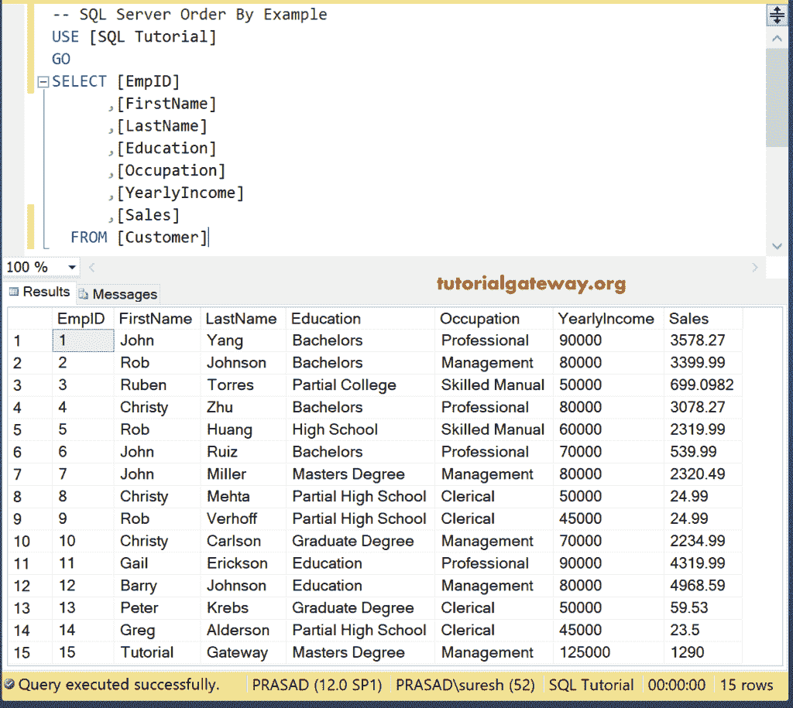

## 按订单排序

要在 SQL Server 中以升序对数据进行排序，我们必须使用以下语句，后跟 ASC 关键字。在 SQL 中，以下是我们可以对数据进行升序排序的几种方法。

例如，如果您是特定地区的销售经理，并且您的工作是识别表现不佳的产品(无销售额或销售额较少的产品)。您可以将查询写成“从产品表中选择产品名称”，以升序对销售额进行分类。

看到结果，就能明白 x 表现不好，y 根本没有销量。利用这些数据，管理人员可以尝试不同的策略来提高他们公司的销售额。

### 按升序单列的 SQL 顺序

这个 SQL Asc 示例使用年收入对数据进行升序排序。

```
SELECT [EmpID]
      ,[FirstName]
      ,[LastName]
      ,[Education]
      ,[Occupation]
      ,[YearlyIncome]
      ,[Sales]
  FROM [Customer]
  ORDER BY [YearlyIncome] ASC
```

如您所见，数据按升序中的[yearly yncome]列排序。

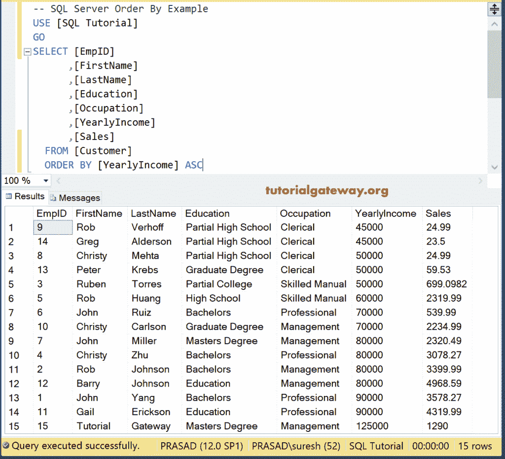

### 不使用 ASC 的升序

ASC 关键字是中的默认关键字，默认情况下，服务器以升序排列记录。这就是为什么使用 ASC 关键字是可选的。这里，我们使用上面没有 ASC 关键字的代码。

```
SELECT [EmpID]
      ,[FirstName]
      ,[LastName]
      ,[Education]
      ,[Occupation]
      ,[YearlyIncome]
      ,[Sales]
  FROM [Customer]
  ORDER BY [YearlyIncome]
```

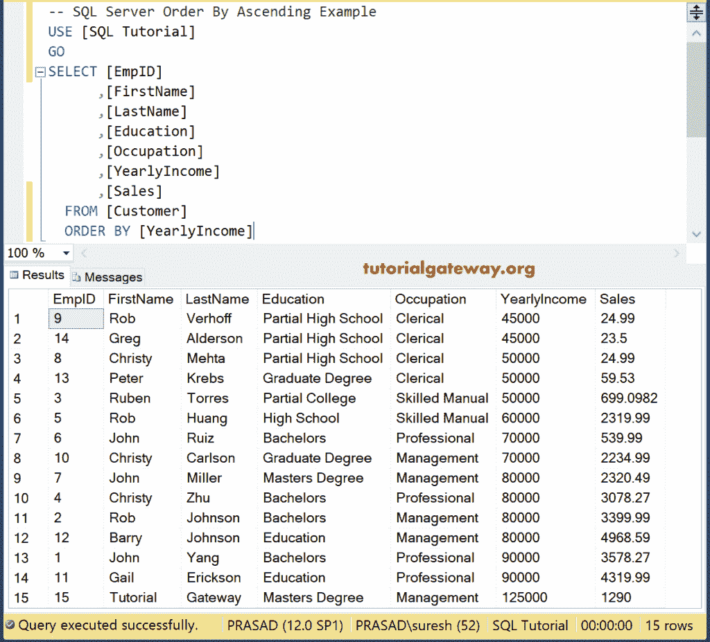

### 按字符串升序排列

在这个按升序排序的 SQL 示例中，我们使用了一个名为“教育”的字符串列来排列数据。它将使用“教育”列对数据进行升序排序。

```
SELECT [EmpID]
      ,[FirstName]
      ,[LastName]
      ,[Education]
      ,[Occupation]
      ,[YearlyIncome]
      ,[Sales]
  FROM [Customer]
  ORDER BY [Education] ASC
```

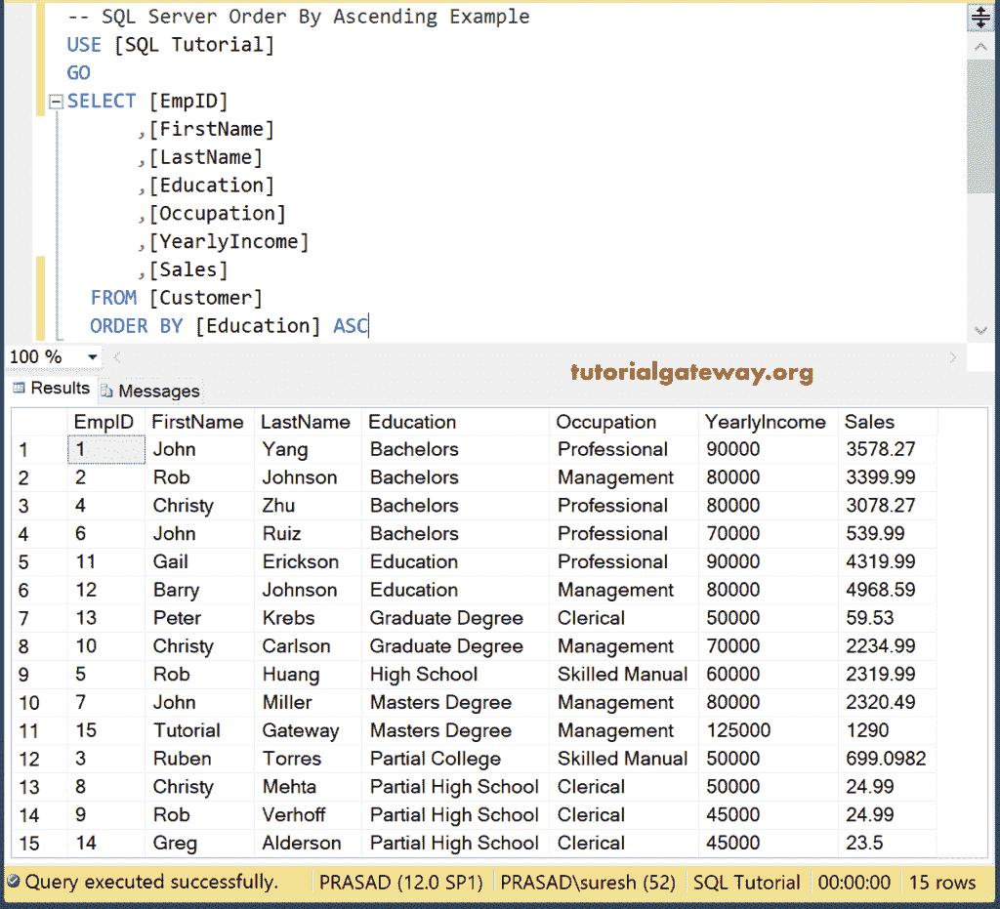

### 按 Asc 中的数字排序(数字位置)

此 SQL 按数字排序示例使用列名的数字位置以升序对客户表进行排序。

```
SELECT [FirstName] -- Numerical Position = 1 
      ,[LastName] -- Numerical Position = 2 
      ,[Education] -- Numerical Position = 3 
      ,[Occupation] -- Numerical Position = 4 
      ,[YearlyIncome]-- Numerical Position = 5 
      ,[Sales] -- Numerical Position = 6 
  FROM [Customer]
  ORDER BY 4 ASC
```

职业列的数字位置为 4，因此 [SQL](https://www.tutorialgateway.org/sql/) 数据将按此职业列排列。

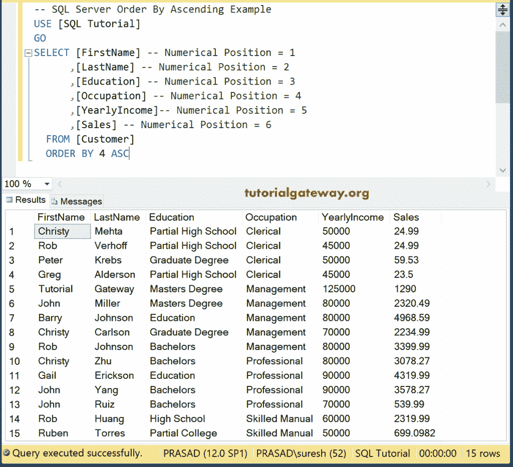

### 使用别名列升序

在这个按升序排序的示例中，我们将使用别名列名以升序排列结果。

```
SELECT [FirstName] + ' ' + [LastName] AS [Full Name]
      ,[Education]
      ,[Occupation]
      ,[YearlyIncome]
      ,[Sales]
  FROM [Customer]
  ORDER BY [Full Name] ASC
```

我们添加了[名字]和[姓氏]列来创建[全名](这是别名)。接下来，我们使用别名。这意味着数据将按[全名]升序排序。

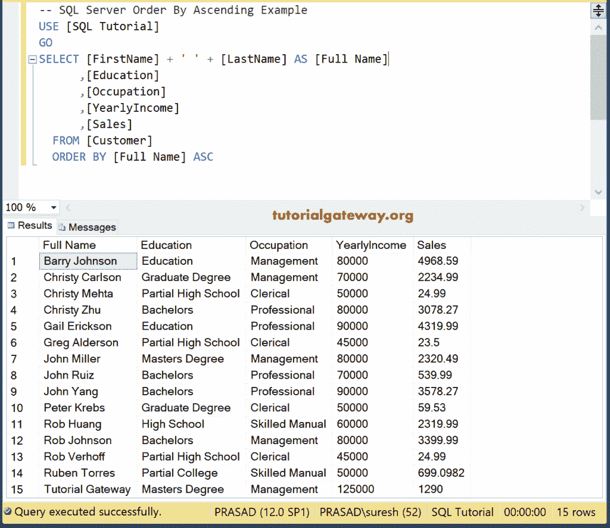

### 按多列升序排列的 SQL 顺序

在这个 SQL 多列排序示例中，我们按照升序按[yearly yncome]对数据进行排序，然后按照升序按[职业]列对数据进行排序

```
SELECT [EmpID]
      ,[FirstName]
      ,[LastName]
      ,[Education]
      ,[Occupation]
      ,[YearlyIncome]
      ,[Sales]
  FROM [Customer]
  ORDER BY [YearlyIncome] ASC, [Occupation] ASC

--OR you can Simply remove the ASC Keywords
```

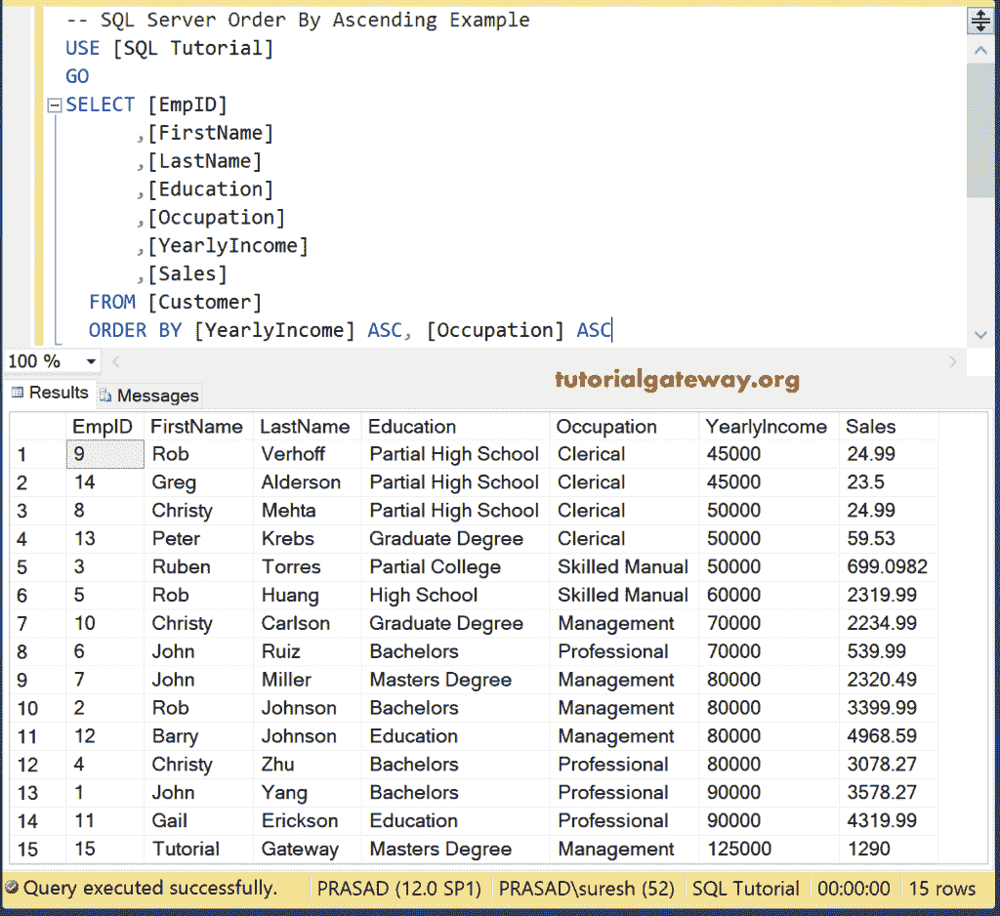

## Desc 的 SQL 订单

要在 SQL Server 中对数据进行降序排序，我们必须使用 ORDER BY 语句，后跟 DESC 关键字。例如，如果您在亚马逊上搜索鞋子，当您在搜索栏中键入鞋子时，它将按等级显示鞋子。意思是按照等级分类的鞋子(技术上，从产品表中选择鞋子，按照产品等级降序排列)。

以下是我们可以使用 SQL 排序以降序显示数据的一些方法总数。

### 按单列降序排列的 SQL 顺序

在这个 SQL Desc 示例中，我们使用了年收入列。这意味着降序中的此列对客户表数据进行排序。

```
SELECT [EmpID]
      ,[FirstName]
      ,[LastName]
      ,[Education]
      ,[Occupation]
      ,[YearlyIncome]
      ,[Sales]
  FROM [Customer]
  ORDER BY [YearlyIncome] DESC
```

从下面的截图中，您可以看到客户表是按照降序中的[yearly yncome]列排序的。

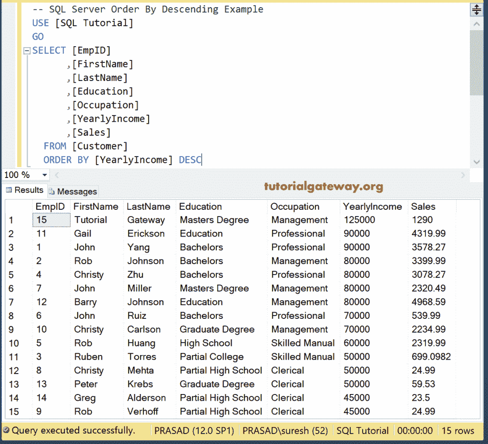

### 按 DESC 字符串列排序以降序排序

在这个以降序按字符串排序的 SQL 示例中，我们使用了占位符(varchar 列)以降序对数据进行排序。下面的代码将客户表中的客户按职业降序排列(反字母顺序)

```
SELECT [EmpID]
      ,[FirstName]
      ,[LastName]
      ,[Education]
      ,[Occupation]
      ,[YearlyIncome]
      ,[Sales]
  FROM [Customer]
  ORDER BY Occupation DESC
```

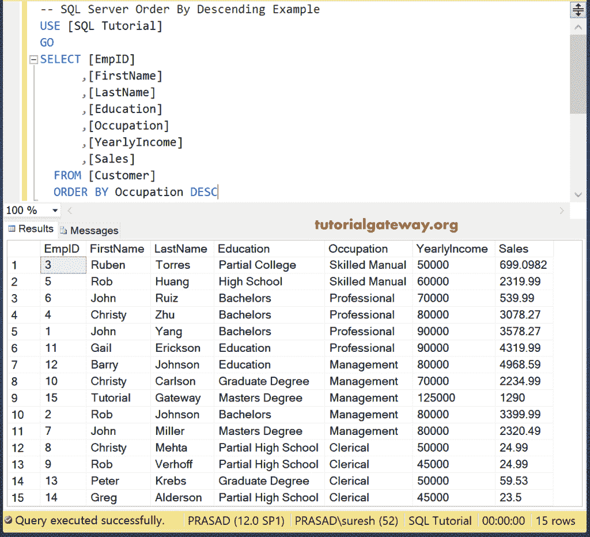

### 降序数字(数字位置)

SQL Server 中的 Desc 允许使用列的数字位置对表进行排序。销售栏的数字位置是 7。所以客户的数据将是<font color="#000000">在降序中按此销售列排列</font> d。

```
SELECT [EmpID]
      ,[FirstName]
      ,[LastName]
      ,[Education]
      ,[Occupation]
      ,[YearlyIncome]
      ,[Sales]
FROM [Customer]
ORDER BY 7 DESC
```

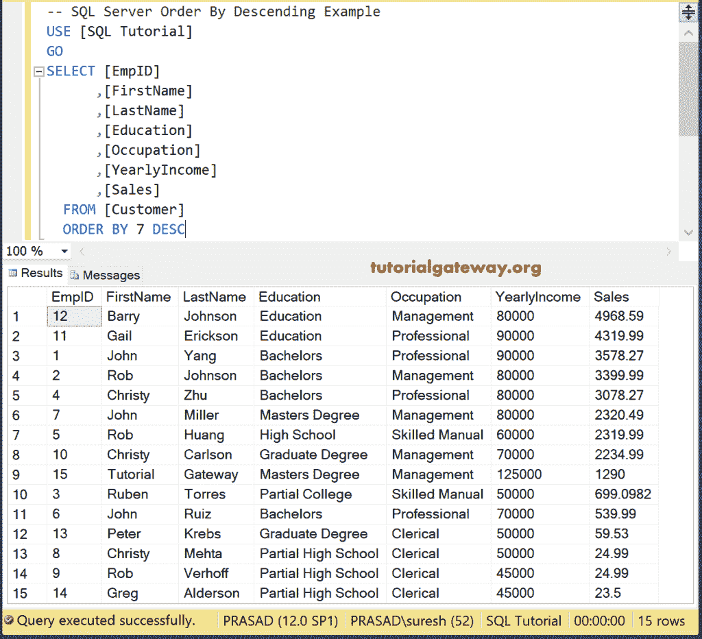

### 使用别名列按 DESC 排序

这个 SQL 排序 Desc 示例使用别名列名来排列降序结果集中的数据。

```
SELECT [EmpID]
      ,[FirstName] + ' ' + [LastName] AS [Full Name]
      ,[Education]
      ,[Occupation]
      ,[YearlyIncome]
      ,[Sales]
  FROM [Customer]
  ORDER BY [Full Name] DESC
```

我们组合了[名字]和[姓氏]列来创建[全名]。接下来，我们使用别名。这意味着数据将按[全名]降序排列。

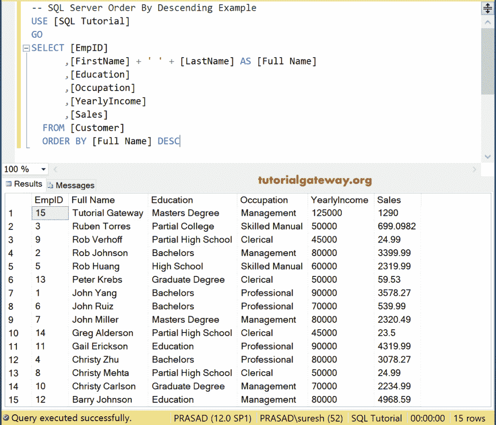

## 同一语句中的升序和降序

它还允许我们将 ASC 和 DESC 关键字组合在一个语句中。在本例中，我们按照升序中的[YearlyIncome]对数据进行排序，然后按照降序中的[职业]对数据进行排序。

```
SELECT [EmpID]
      ,[FirstName]
      ,[LastName]
      ,[Education]
      ,[Occupation]
      ,[YearlyIncome]
      ,[Sales]
  FROM [Customer]
  ORDER BY [YearlyIncome] ASC, [Occupation] DESC
```

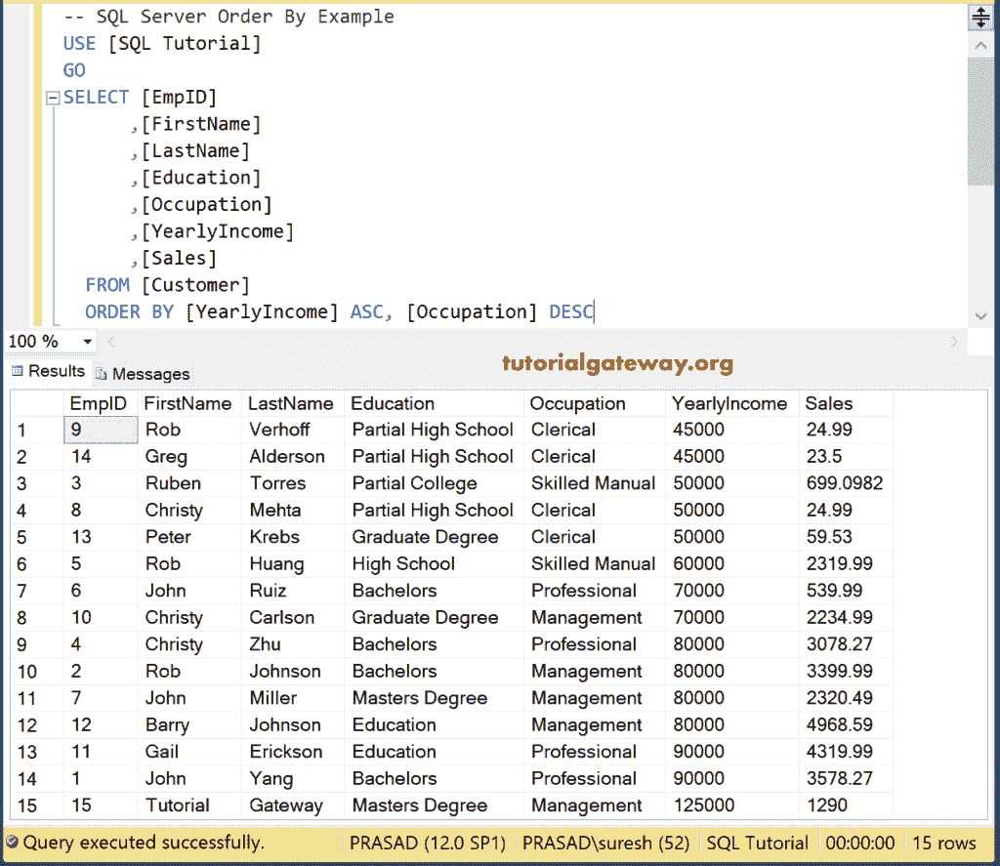

让我们首先使用 SQL DESC 关键字，其次使用 ASC 关键字，以降序和升序排列列。它按照降序中的[年人数]对客户进行排序，然后我们按照升序中的[教育程度]列对数据进行排序。

```
SELECT [EmpID]
      ,[FirstName]
      ,[LastName]
      ,[Education]
      ,[Occupation]
      ,[YearlyIncome]
      ,[Sales]
  FROM [Customer]
  ORDER BY [YearlyIncome] DESC, [Education] ASC
```

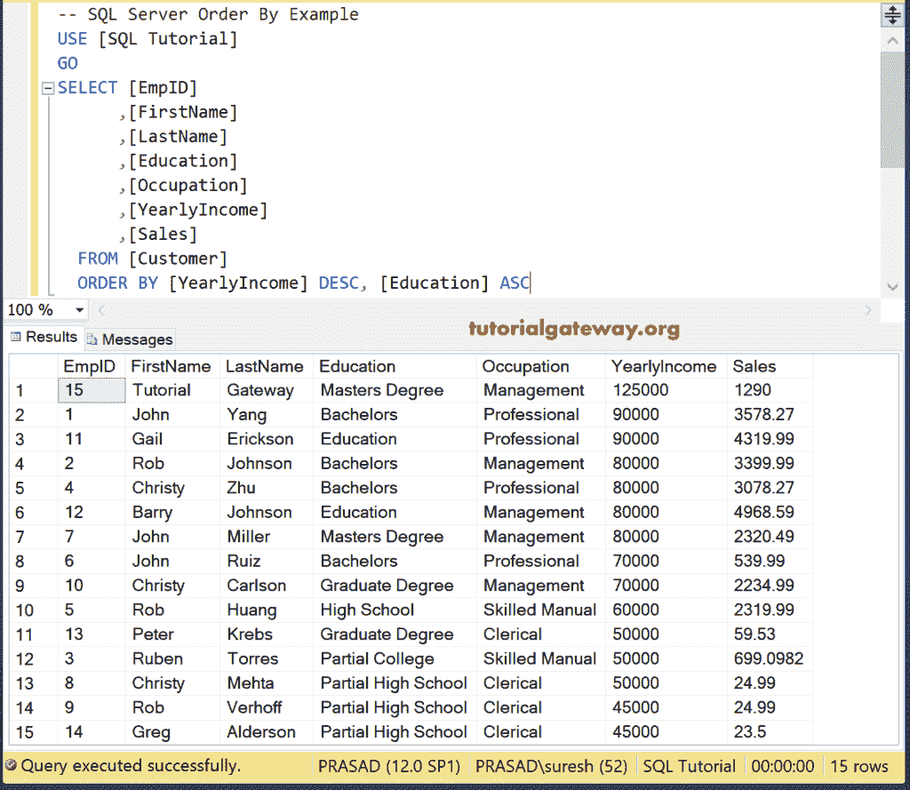

## SQL 按案例排序语句

在这个 SQL 排序案例示例中，我们在 Order By 子句中使用了[案例语句](https://www.tutorialgateway.org/sql-case-statement/)。它将帮助您创建自己的(定制的)。

下面的代码将按职业列排列客户数据。如果职业是管理，那就先来。如果职业是专业的，它将排在第二位，等等。

```
SELECT [EmpID]
      ,[FirstName]
      ,[LastName]
      ,[Education]
      ,[Occupation]
      ,[YearlyIncome]
      ,[Sales]
  FROM [Customer]
  ORDER BY (CASE [Occupation] 
 WHEN 'Management' THEN 1
 WHEN 'Professional' THEN 2
 WHEN 'Skilled Manual' THEN 3
 ELSE 4
 END
 )ASC
```

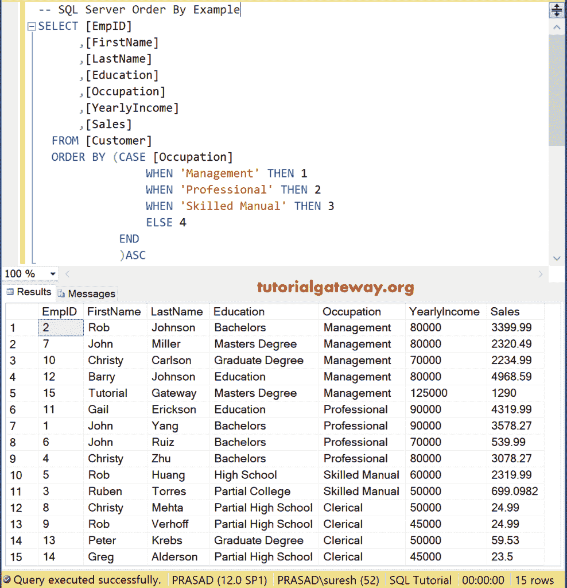

## 按子句分组的 SQL 顺序

在这个 SQL 排序分组示例中，我们使用了分组依据子句。分组依据和此组合可以帮助您排列分组或聚合数据。

它计算年收入和销售额的总和，并按教育程度和职业进行分组。下一条语句根据年收入总和递减返回[分组依据](https://www.tutorialgateway.org/sql-group-by-clause/)结果。

```
SELECT [Education]
      ,[Occupation]
      ,SUM([YearlyIncome]) AS [Total Income]
      ,SUM([Sales]) AS [Total Sales]
  FROM [Customer]
  GROUP BY Education, Occupation
  ORDER BY SUM([YearlyIncome]) DESC
```

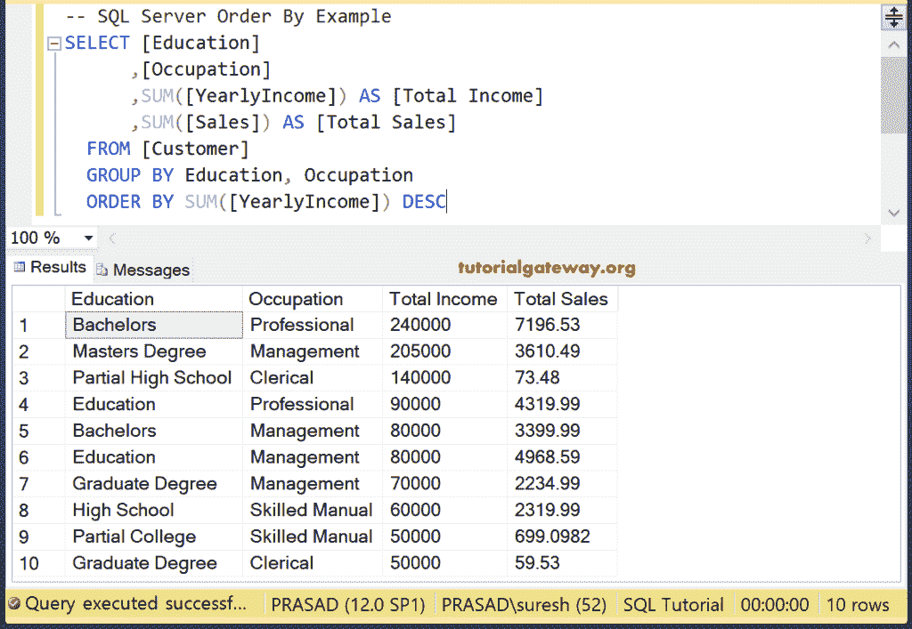

## 按顶子句排序

在这个 SQL 排序顶部的例子中，我们使用了[顶部子句](https://www.tutorialgateway.org/sql-top-clause/)。它选择了前 8 条按年收入降序排列的记录。

```
SELECT TOP 8 [EmpID]
      ,[FirstName]
      ,[LastName]
      ,[Education]
      ,[Occupation]
      ,[YearlyIncome]
      ,[Sales]
  FROM [Customer]
  ORDER BY [YearlyIncome] DESC
```

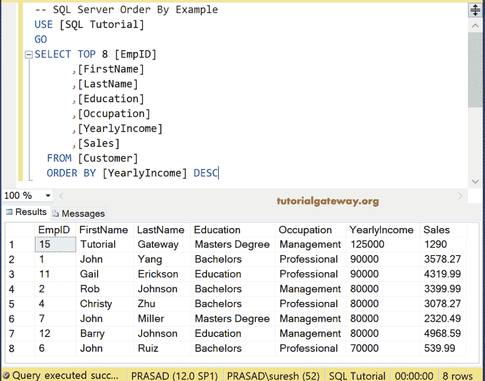