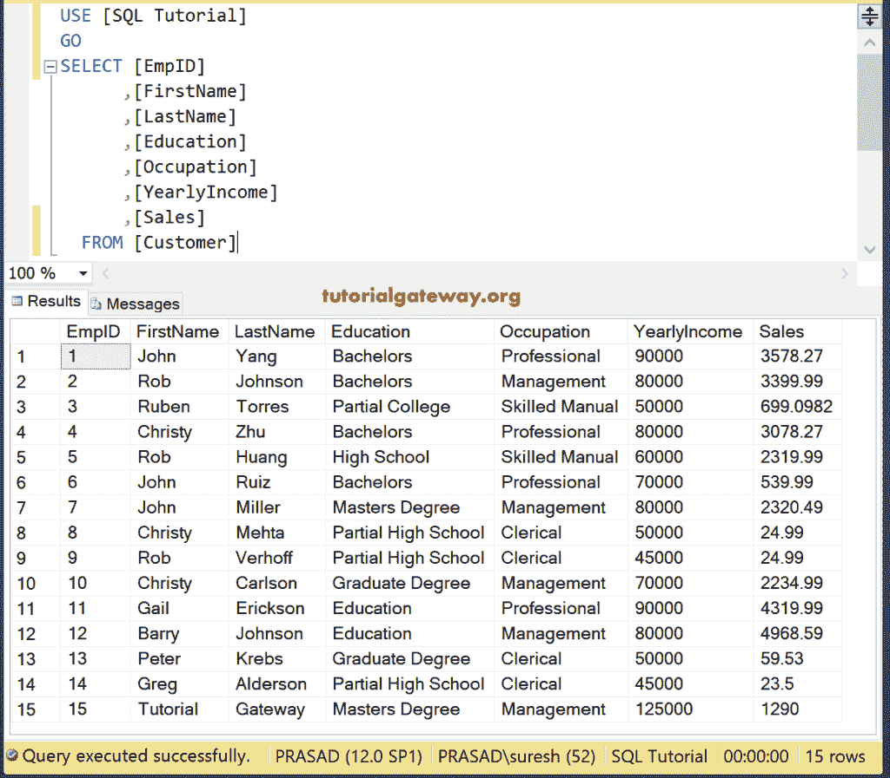
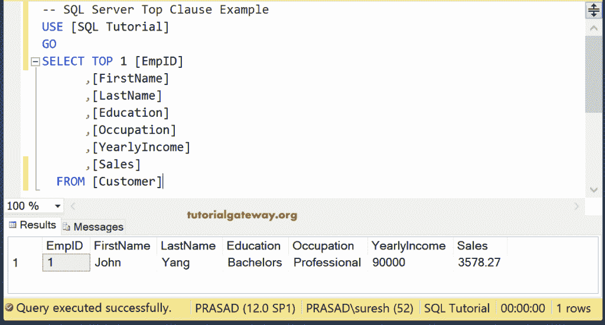
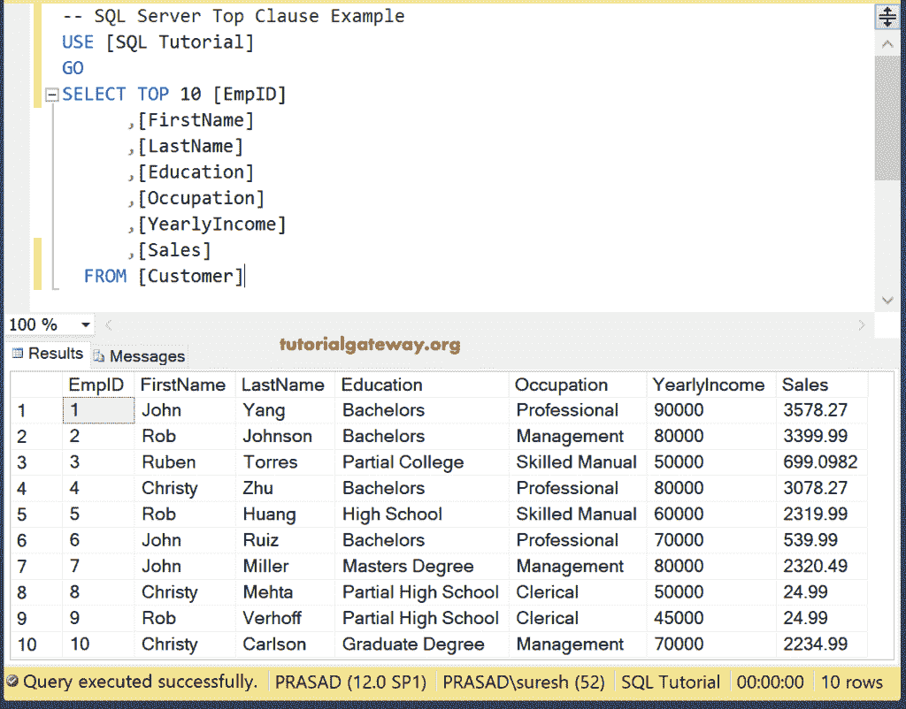
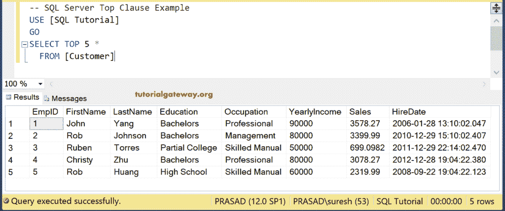
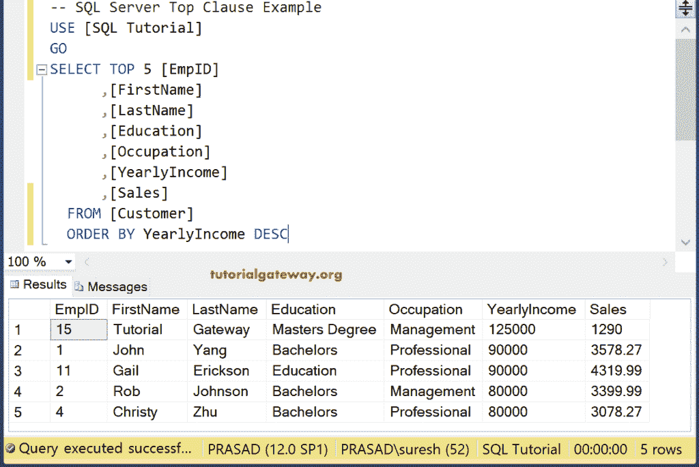
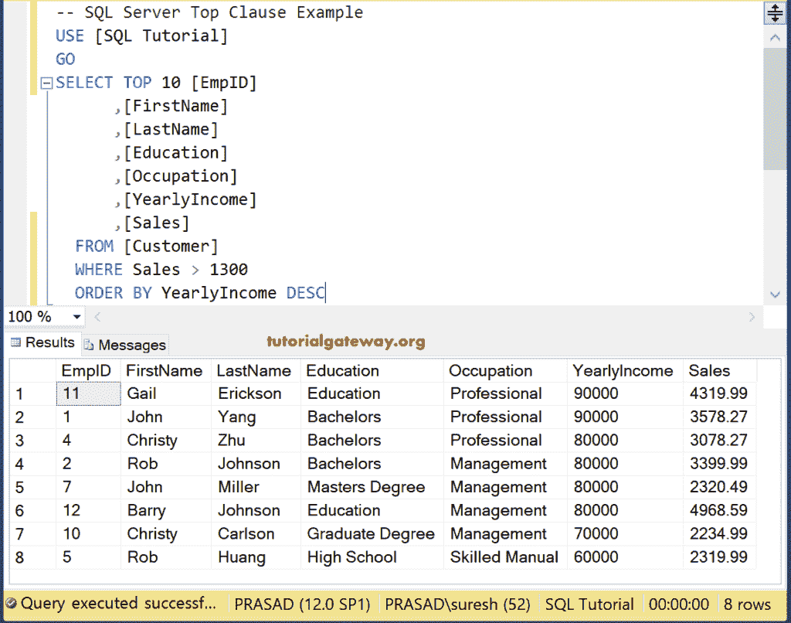
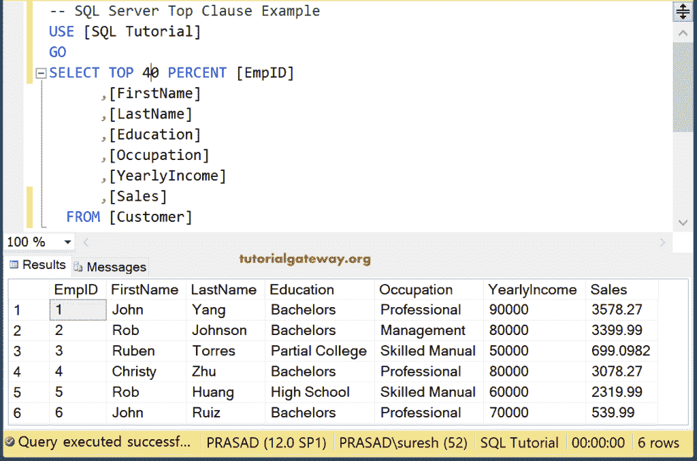
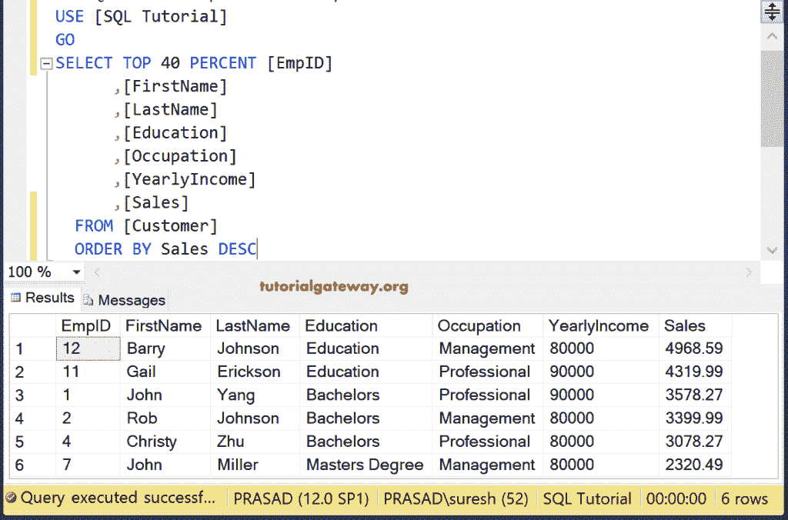
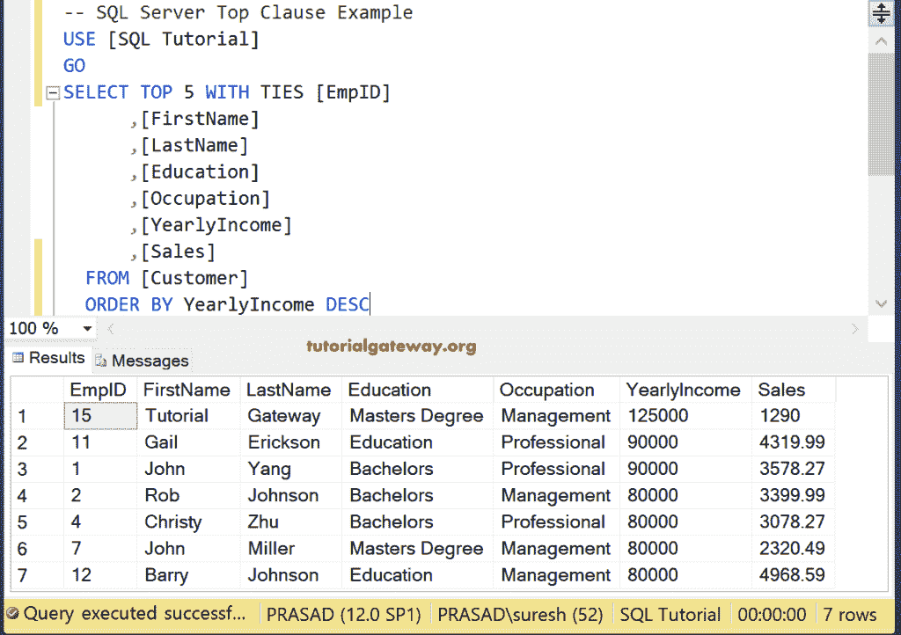

# SQL `TOP`子句

> 原文：<https://www.tutorialgateway.org/sql-top-clause/>

SQL `TOP`子句用于限制查询返回的行数。通常，数据库、表拥有数百万或数十亿条记录。如果您想查看前 10 名产品，我们可以使用 SQL `TOP`子句并提取所需的行数。

## SQL SELECT `TOP`子句语法

为了检索少数记录或限制行数，我们必须使用 SQL `TOP`子句，后跟表达式或百分比。SQL Server `TOP`子句的语法是

```sql
SELECT TOP Expression | Percentage [Column_Names]

FROM [Table_Name]
```

我们可以使用表达式或百分比以及 SQL `TOP`子句。例如，TOP 1 意味着它将检索第一条记录。如果我们写前 10%，那么`SELECT`语句将从总记录中提取 10%的记录。您也可以使用 ORDER BY 语句对数据进行相应的排序。我们使用下面显示的表格数据来解释 SQL Select `TOP`子句。

```sql
SELECT [EmpID]
      ,[FirstName]
      ,[LastName]
      ,[Education]
      ,[Occupation]
      ,[YearlyIncome]
      ,[Sales]
  FROM [Customer]
```



## SQL TOP 1 示例

在这个 SQL `TOP`子句示例中，我们将从客户的表中选择第一行。

```sql
SELECT TOP 1 [EmpID]
      ,[FirstName]
      ,[LastName]
      ,[Education]
      ,[Occupation]
      ,[YearlyIncome]
      ,[Sales]
  FROM [Customer]
```

`TOP`子句正在从表中检索第一行。



## SQL 十大示例

返回客户表中的前 10 行。

```sql
SELECT TOP 10 [EmpID]
      ,[FirstName]
      ,[LastName]
      ,[Education]
      ,[Occupation]
      ,[YearlyIncome]
      ,[Sales]
  FROM [Customer]
```



## SQL TOP *示例

我们也可以使用*符号来代替写所有的列名(不建议)。让我们看看 Top *是如何工作的。

```sql
SELECT TOP 5 *
  FROM [Customer]
```



## SQL 按语句排列的最高顺序

在表中，默认情况下，数据不会以任何顺序插入。因此，如果您想要检索年收入最高的前三个客户，那么您必须使用 ORDER BY 语句对数据进行排序。接下来，您必须使用这个 `TOP`子句来获得前三个客户

```sql
SELECT TOP 5 [EmpID]
      ,[FirstName]
      ,[LastName]
      ,[Education]
      ,[Occupation]
      ,[YearlyIncome]
      ,[Sales]
  FROM [Customer]
  ORDER BY YearlyIncome DESC
```

数据将按[年收入]降序排序，然后检索前五行。



## SQL TOP Where 示例

您也可以使用`WHERE`子句和 `TOP`子句来限制`SELECT`语句选择的记录。以下 [`WHERE`子句](https://www.tutorialgateway.org/sql-where-clause/)查询选择销售额大于 1300 的前 10 条记录。请记住，我们还使用了 [ORDER BY](https://www.tutorialgateway.org/sql-order-by-clause/) 来使用年收入降序对 [SQL Server](https://www.tutorialgateway.org/sql/) 数据进行排序。

```sql
SELECT TOP 10 [EmpID]
      ,[FirstName]
      ,[LastName]
      ,[Education]
      ,[Occupation]
      ,[YearlyIncome]
      ,[Sales]
  FROM [Customer]
  WHERE Sales > 1300
  ORDER BY YearlyIncome DESC
```



## 最高百分比示例

我们使用 SQL TOP PERCENT 来指定查询必须返回的客户数量。这里，我们使用前 40%。它的意思是 6 行，因为我们客户的表中有 15 行。

```sql
SELECT TOP 40 PERCENT [EmpID]
      ,[FirstName]
      ,[LastName]
      ,[Education]
      ,[Occupation]
      ,[YearlyIncome]
      ,[Sales]
  FROM [Customer]
```



让我们使用`ORDER BY`语句和最高百分比。

```sql
SELECT TOP 40 PERCENT [EmpID]
      ,[FirstName]
      ,[LastName]
      ,[Education]
      ,[Occupation]
      ,[YearlyIncome]
      ,[Sales]
  FROM [Customer]
  ORDER BY Sales DESC
```



## 带领带的 SQL TOP

通常，以下示例将返回年收入最高的客户的前 5 行。当我们使用 WITH TIES 后跟 SQL `TOP`子句时，它将返回前 5 条记录。另外，年收入等于`SELECT`语句最后一条记录(第 5 条)的所有记录。

```sql
SELECT TOP 5 WITH TIES [EmpID]
      ,[FirstName]
      ,[LastName]
      ,[Education]
      ,[Occupation]
      ,[YearlyIncome]
      ,[Sales]
  FROM [Customer]
  ORDER BY YearlyIncome DESC
```

虽然我们[选择了](https://www.tutorialgateway.org/sql-select-statement/)前 5 行，但是输出显示的是 7 条记录。因为 5、6、7 张唱片的年收入是一样的。如果这些记录中有更多的[yearyyncome]= 80000，那么它们将显示在结果窗口中。



注意:只有当我们使用 ORDER BY 语句时，使用 TIES 才有效；否则，服务器将抛出一个错误。