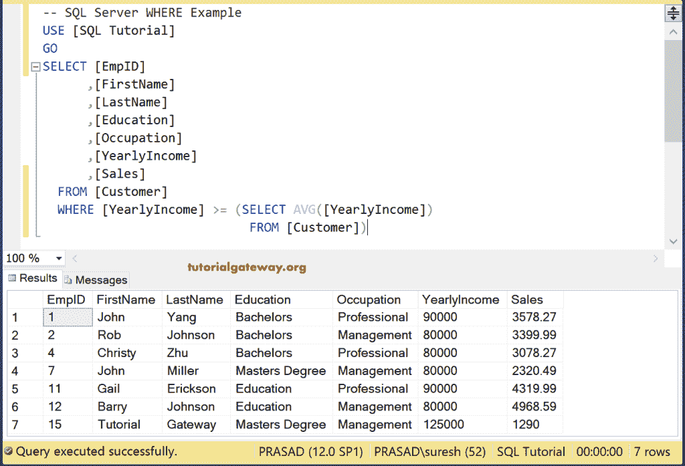
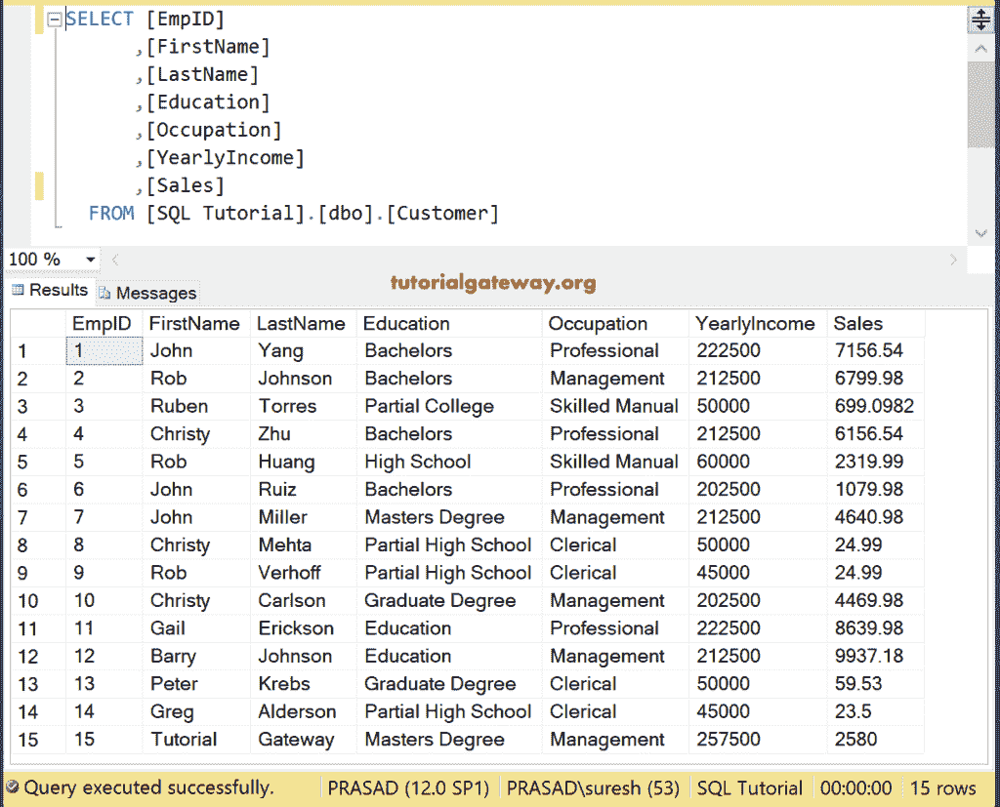

# SQL `WHERE`子句

> 原文：<https://www.tutorialgateway.org/sql-where-clause/>

SQL `WHERE`子句用于限制`SELECT`语句返回的行数(或记录数)。这意味着`SELECT`语句只在 SQL Where 关键字后指定的条件为真时才返回记录。

例如，我们想在亚马逊网站上订购鞋子。当我们在搜索栏中键入鞋子时，它会显示成千上万个不同品牌名称和尺寸的鞋子。然而，为了选择所需的鞋子，我们必须使用过滤器，例如价格范围在 2000 到 2500 之间，颜色=黑色，品牌名称=耐克或阿迪达斯。

如果我们使用上述过滤器，它将只显示符合上述要求的鞋子，以便我们轻松选择。让我们看看内部发生了什么(查询亚马逊数据库)。它使用了 SQL `WHERE`子句，它将会是这样的:

```
SELECT [Product Name], [Size], [Brand], [Price], [Discount]
FROM [Products_table]
WHERE ([Product Name] = 'Shoes') AND 
      (Brand = 'Nike' OR 'Adidas') AND 
      ([Price] BETWEEN 2000 AND 2500)
```

## SQL WHERE 语法

`SELECT`语句和 SQL `WHERE`子句的语法可以写成:

```
SELECT [Column Names]
FROM [Source]
WHERE [Conditions]
```

从上面的 SQL where 语法中

*   列:它允许我们从表中选择列数。它可能是一个或多个。
*   来源:数据库中的一个或多个表。 [JOINS](https://www.tutorialgateway.org/sql-joins/) 用于连接多个表。
*   条件:在这里，我们必须提供过滤器或条件。如果条件为真，则只有`SELECT`语句返回记录。

我们使用下面显示的数据来解释 SQL Server `WHERE`子句，以便在使用`SELECT`语句提取数据之前过滤数据。


## SQL WHERE 单一条件

在 SQL `WHERE`子句中使用单个条件。

```
SELECT [EmpID]
      ,[FirstName]
      ,[LastName]
      ,[Education]
      ,[Occupation]
      ,[YearlyIncome]
      ,[Sales]
  FROM [Customer]
  WHERE [Occupation] = 'Professional'
```

它将检索上述记录，并返回职业与专业完全相同的客户


## 多条件示例

此示例在此子句中使用了多个条件。以下查询返回所有职业等于“专业”或“管理”的客户记录。

```
SELECT [EmpID]
      ,[FirstName]
      ,[LastName]
      ,[Education]
      ,[Occupation]
      ,[YearlyIncome]
      ,[Sales]
  FROM [Customer]
  WHERE [Occupation] = 'Professional' OR
 [Occupation] = 'Management'
```


## 通用表达式

SQL 允许我们测试一般条件，而不是根据列名测试条件。例如，下面的条件是检查 1 是否正好等于 2，这是假的。所以 [`SELECT`语句](https://www.tutorialgateway.org/sql-select-statement/)不会返回 [SQL Server](https://www.tutorialgateway.org/sql/) 中的任何记录。

```
SELECT [EmpID]
      ,[FirstName]
      ,[LastName]
      ,[Education]
      ,[Occupation]
      ,[YearlyIncome]
      ,[Sales]
  FROM [Customer]
  WHERE 1 = 2
```

让我们把条件从(1 = 2)改为(1 = 1)。这里的条件为真，因此它显示客户表中的所有记录

```
SELECT [EmpID]
      ,[FirstName]
      ,[LastName]
      ,[Education]
      ,[Occupation]
      ,[YearlyIncome]
      ,[Sales]
  FROM [Customer]
  WHERE 1 = 1
```


不要在条件中使用[别名](https://www.tutorialgateway.org/sql-alias/)列名。因为条件将首先执行，然后`SELECT`语句将选择列。因此，SQL `WHERE`子句不理解`SELECT`语句中声明的别名列。

## SQL Where 子查询

我们可以使用[子查询](https://www.tutorialgateway.org/sql-subquery/)根据表达式检查列。这里，我们使用 SQL `WHERE`子句和子查询来显示年收入大于或等于平均收入的记录。这里我们用 [AVG](https://www.tutorialgateway.org/sql-avg-function/) 来求年收入栏的平均值。

```
SELECT [EmpID]
      ,[FirstName]
      ,[LastName]
      ,[Education]
      ,[Occupation]
      ,[YearlyIncome]
      ,[Sales]
  FROM [Customer]
  WHERE [YearlyIncome] >= (SELECT AVG([YearlyIncome]) 
			   FROM [Customer])
```



## SQL 按子句排序

我们也可以使用 SQL `WHERE`子句和 [`ORDER BY`子句](https://www.tutorialgateway.org/sql-order-by-clause/)。`ORDER BY`子句将根据收入按降序对这些查询结果进行排序。

```
SELECT [EmpID]
      ,[FirstName]
      ,[LastName]
      ,[Education]
      ,[Occupation]
      ,[YearlyIncome]
      ,[Sales]
  FROM [Customer]
  WHERE [YearlyIncome] >= (SELECT AVG([YearlyIncome]) 
				FROM [Customer])
  ORDER BY [YearlyIncome] DESC
```


## SQL 何处更新示例

此子句并不限制`SELECT`语句选择的记录。事实上，在[`UPDATE`语句](https://www.tutorialgateway.org/sql-update-statement/)中强制使用它是有用的。

下面的查询将 132500 添加到年收入列，并将所有职业为“管理”或“专业”的客户的销售额乘以 2

```
UPDATE [Customer]
	SET	[YearlyIncome] = [YearlyIncome] + 132500
      ,[Sales] = [Sales] * 2
  FROM [Customer]
  WHERE [Occupation] = 'Management' OR 
		[Occupation] = 'Professional'
```

```
Messages
--------
(9 row(s) affected)
```

现在，让我们看看客户表，看看我们是否成功更新了记录



## 删除示例

当我们删除记录时，这将有助于我们限制想要删除的记录数量。在[`DELETE`语句](https://www.tutorialgateway.org/sql-delete-statement/)中有用。以下查询删除了所有职业为文员的客户记录

```
DELETE FROM [Customer]
  WHERE [Occupation] = 'Clerical'
GO

SELECT [EmpID], [FirstName], [LastName], [Education]
		,[Occupation], [YearlyIncome], [Sales]
  FROM [Customer]
```


## 类似示例

我们可以同时使用 [Like 运算符](https://www.tutorialgateway.org/sql-like/)对表执行通配符搜索。下面的代码写入客户表中所有以 l 结尾的记录

```
SELECT [EmpID], [FirstName], [LastName], [Education]
		,[Occupation], [YearlyIncome], [Sales]
  FROM [Customer]
  WHERE [Occupation] LIKE '%l'
```

