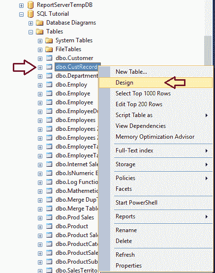

# SQL 主键

> 原文：<https://www.tutorialgateway.org/sql-primary-key/>

SQL 主键约束用于实现 SQL 表中的数据完整性。当您在任一列上设置 SQL Server 主键时，数据库引擎将自动在该列上创建唯一索引。实时地，我们使用这些 SQL 主键列来唯一地标识列，并快速有效地访问数据。

通常，每个表都至少有一列包含唯一值，称为“SQL 主键”列。例如，“员工”表可能有“员工标识”，或者“订单”有“订单标识”列。在我们进入 SQL Server 主键示例之前，您应该记住以下几点:

*   在 SQL Server 中，一个表只能包含一个主键。
*   您不能在 primarykey 列中插入任何重复的内容。
*   SQL 主键列不允许空值。默认情况下，即使您在创建时忘记了，也不会将非空值分配给这些列。
*   如果您忘记将索引称为聚集或非聚集，那么默认情况下，SQL Server 数据库引擎将分配聚集索引。

## 创建 SQL 主键

我们可以使用 Transact SQL 查询和 SSMS 来创建一个 SQL Server 主键。

### 创建表主键

让我们看看如何使用 transact 查询创建一个 SQL 主键。这里我们将在创建表时定义它。

```
CREATE TABLE [CustmerRecords]
(
  [CustomerKey] [int] NOT NULL PRIMARY KEY,
  [FirstName] [varchar](50) NOT NULL ,
  [LastName] [varchar](50) NULL,
  [BirthDate] [date] NULL,
  [EmailAddress] [nvarchar](50) NULL,
  [Yearly Income] [money] NULL,
  [Profession] [nvarchar](100) NULL
)
```

我们刚刚在列声明中添加了主键。SSMS 足够聪明，可以为你创造它。参考 [SQL Server](https://www.tutorialgateway.org/sql/) 中的[创建表](https://www.tutorialgateway.org/sql-create-table/)一文。

查看 SQL 生成的内部代码，通过右键点击表->脚本 as –>创建到新的查询窗口选项


### 在现有表上创建主键

让我们在现有的表上添加 SQL Server 主键。为此，我们创建了一个新表

```
CREATE TABLE [CustmerRecords]
(
  [CustomerKey] [int] NOT NULL,
  [FirstName] [varchar](50) NOT NULL ,
  [LastName] [varchar](50) NULL,
  [BirthDate] [date] NULL,
  [EmailAddress] [nvarchar](50) NULL,
  [Yearly Income] [money] NULL,
  [Profession] [nvarchar](100) NULL
)
```

现在让我将这个约束添加到上表中。对于本例，我们使用 [Alter Table](https://www.tutorialgateway.org/sql-alter-table/) 语句来更改表格内容。然后，我们使用 ADD Constraint 语句来添加这个约束。

```
ALTER TABLE [CustmerRecords]   
ADD CONSTRAINT PK_CustmerRecords_CustomerKey PRIMARY KEY CLUSTERED (CustomerKey);  
GO
```


### 将行插入到 SQL Server 主约束列中

让我[插入](https://www.tutorialgateway.org/sql-insert-statement/)几行来检查功能。

```
INSERT INTO [dbo].[CustmerRecords] 
VALUES (1, 'Imran', 'Khan', '10-08-1985', '[email protected]', 15900, 'Skilled Professional')
      ,(2, 'Doe', 'Lara', '10-08-1985', '[email protected]', 15000, 'Management')
      ,(3, 'Ramesh', 'Kumar', '10-08-1985', '[email protected]', 65000, 'Professional')

```

```
(3 row(s) affected)
```

让我们看看插入的数据。


### 将副本插入到 SQL 主键列中

上面的[`INSERT`语句](https://www.tutorialgateway.org/sql-insert-statement/)可以，因为我们正在为客户密钥插入唯一的记录。让我将重复的值插入到 CustomerKey 列中。请参考[唯一索引](https://www.tutorialgateway.org/sql-unique-constraint/)文章。

```
INSERT INTO [dbo].[CustmerRecords] 
VALUES (1, 'Tutorial', 'Gateway', '10-08-1985', '[email protected]', 15900, 'Skilled Professional')

```


它引发了一个错误:违反了约束“主键 _ 客户记录 _ 客户基”。无法在对象“dbo”中插入重复的键。CustmerRecords 的。重复的键值是(1)。

让我将空值插入主键列。为此，我们添加了新的客户记录，其中除了 CustomerKey 列之外的所有值都为空值..

```
INSERT INTO [dbo].[CustmerRecords] 
VALUES (NULL, 'Tutorial', 'Gateway', '10-08-1995', '[email protected]', 15900, 'Management')
```

它也抛出了一个错误。


### 使用 SSMS 设置约束

要使用[Management Studio](https://www.tutorialgateway.org/sql-server-management-studio/)创建主约束，请转到对象资源管理器。右键单击并选择设计选项



单击设计选项后，它将在设计模式下打开客户记录。它有 7 个不同数据类型的列，我们的工作是向 Customerkey 列添加一个约束。


右键单击客户名称列，然后选择设置主键选项。


选择“设置”选项后，SSMS 将为您设置约束。


### 修改 SQL 主约束

请选择约束所在的表，然后转到“索引”文件夹。接下来，展开“索引”文件夹以查找其上可用的约束，右键单击它将打开上下文菜单。请根据要求选择选项


注意:您不能使用 [SQL](https://www.tutorialgateway.org/sql/) 查询来更改约束。要修改现有的，您必须删除并重新创建它。

### 使用删除约束删除 SQL 主键

如果您知道约束名称，请使用 DROP 约束语句和 ALTER TABLE 语句

```
ALTER TABLE [CustmerRecords]  
DROP CONSTRAINT PK_CustmerRecords_CustomerKey
```

如果不知道名称，使用第一个 [`SELECT`语句](https://www.tutorialgateway.org/sql-select-statement/)获取约束名称。

```
SELECT name  
FROM sys.key_constraints  
WHERE type = 'PK' AND OBJECT_NAME(parent_object_id) = N'CustmerRecords';  
GO  
-- Delete or Drop
ALTER TABLE [CustmerRecords]  
DROP CONSTRAINT PK_CustmerRecords_CustomerKey
```


输出 2


在设计器模式下打开“客户记录”表，检查我们是否成功删除了“客户”列中的记录。如您所见，除了 CustomerKey 列之外，没有约束符号。

