# SQL 外键

> 原文:[https://www.tutorialgateway.org/sql-foreign-key/](https://www.tutorialgateway.org/sql-foreign-key/)

SQL 外键约束用于实现表之间的关系。为了规范化数据，我们使用这个 SQL Server 外键关系来拆分表。在拆分数据时，我们需要一个引用，我们称之为外键关系。转到 SQL Server 中的外键示例之前，您应该记住的要点列表。

*   您可以将 SQL Server 外键列与另一列中的主约束或另一列中的唯一约束链接起来。
*   在约束列中输入的值应该与引用的列相匹配。否则，它将抛出一个错误。
*   您可以用同一数据库和同一服务器中的表定义 SQL Server 外键关系。您可以使用触发器来提供交叉引用完整性。
*   SQL 允许您用同一表中的另一列定义外键关系。这种类型的关系是自我参照。
*   您不能删除具有此关系的表

例如，“员工”表有员工标识，“订单”表有订单信息和员工标识。请记住，此员工标识与“员工”中的“员工标识”列有关系。对于这个 SQL 外键演示，我们使用的是 Department。

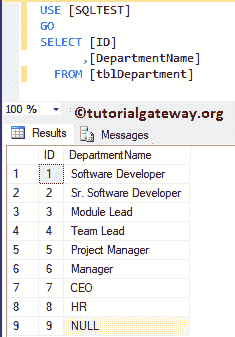

## 创建 SQL 外键

我们可以使用 Transact 查询和管理工作室创建一个 SQL Server 外键。

### 使用 transact 查询创建

如何使用 Transact 语句在 SQL server 中创建外键？。在这里，我们将创建这个约束，它将在创建表时与 tblDepartment 连接。

```
CREATE TABLE [dbo].[tblEmployee](
	[EmpID] [int] IDENTITY(1,1) NOT NULL PRIMARY KEY,
	[FirstName] [nvarchar](255) NULL,
	[LastName] [nvarchar](255) NULL,
	[Education] [nvarchar](255) NULL,
	[YearlyIncome] [float] NULL,
	[Sales] [float] NULL,
	[DeptID] [int] NULL,
	CONSTRAINT [FK_tblDepartment_tblEmployee_DeptID] FOREIGN KEY([DeptID])
		REFERENCES [dbo].[tblDepartment] ([ID])
) 
GO
```

我们在表创建结束时添加了 CONSTRAINT 语句。参考 [SQL Server](https://www.tutorialgateway.org/sql/) 中的[创建表](https://www.tutorialgateway.org/sql-create-table/)、[主](https://www.tutorialgateway.org/sql-primary-key/)、[唯一约束](https://www.tutorialgateway.org/sql-unique-constraint/)、[触发器](https://www.tutorialgateway.org/triggers-in-sql-server/)和[参照完整性](https://www.tutorialgateway.org/referential-integrity-in-sql-server/)。

让我使用 SP_HELP 过程检查表定义和约束

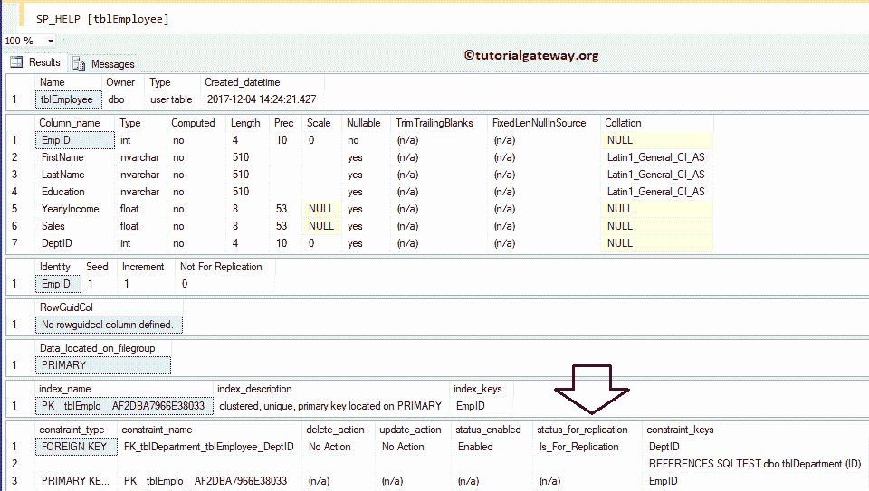

查看我们新创建的外键。您也可以使用对象资源管理器来实现同样的目的。为此，请展开“技术人员”，然后展开“密钥”文件夹

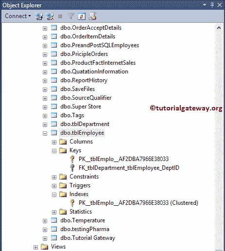

### 在现有表上创建

在本例中，我们向您展示了在现有表中添加外键的步骤。为此，我们将创建一个新表。

```
CREATE TABLE [dbo].[tblEmployee](
	[EmpID] [int] IDENTITY(1,1) NOT NULL PRIMARY KEY,
	[FirstName] [nvarchar](255) NULL,
	[LastName] [nvarchar](255) NULL,
	[Education] [nvarchar](255) NULL,
	[YearlyIncome] [float] NULL,
	[Sales] [float] NULL,
	[DeptID] [int] NULL
) 
GO
```

```
Messages
--------
Command(s) completed successfully.
```

现在让我添加约束。这里，我们使用 [Alter Table](https://www.tutorialgateway.org/sql-alter-table/) 来更改内容，然后使用 ADD Constraint 语句来添加约束。

```
ALTER TABLE [dbo].[tblEmployee]  
ADD CONSTRAINT [FK_tblDepartment_tblEmployee_DeptID] FOREIGN KEY([DeptID])
			REFERENCES [dbo].[tblDepartment] ([ID])
```

```
Messages
--------
Command(s) completed successfully.
```

### 使用 SSMS 创建外键

在本例中，我们将向您展示如何使用 [SQL Server 管理工作室](https://www.tutorialgateway.org/sql-server-management-studio/)在 SQL Server 中创建外键。为此，请转到对象资源管理器。接下来，请展开数据库文件夹，并选择要创建的表。接下来，右键单击它将打开上下文菜单。请选择“设计”选项。

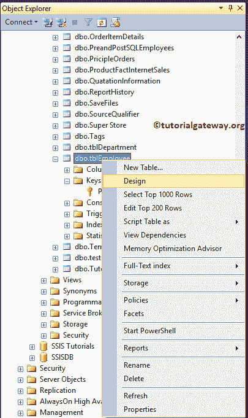

它将在设计模式下打开相应的表格。右键单击部门列并选择关系选项。

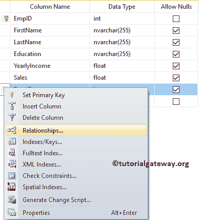

如你所见，没有现存的关系。请单击添加按钮添加新关系。

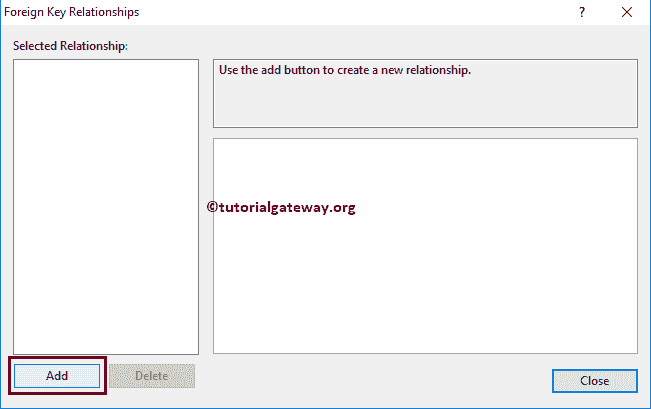

一旦您选择添加选项，SSMS 将为您创建它。

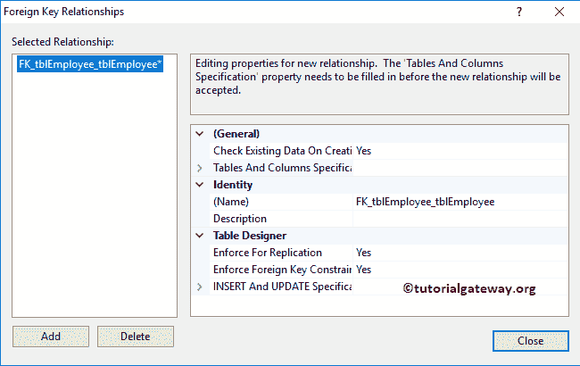

接下来，单击表和列规范选项旁边的浏览按钮。此属性用于指定两者之间的关系。

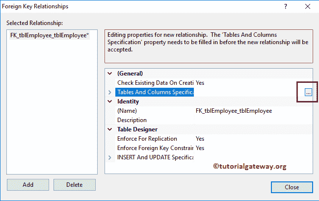

我们选择“主要”作为标签部分，选择“列”作为标识。

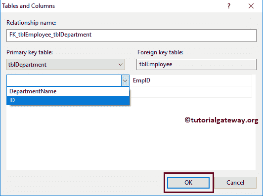

接下来，我们选择了“员工”列作为部门标识

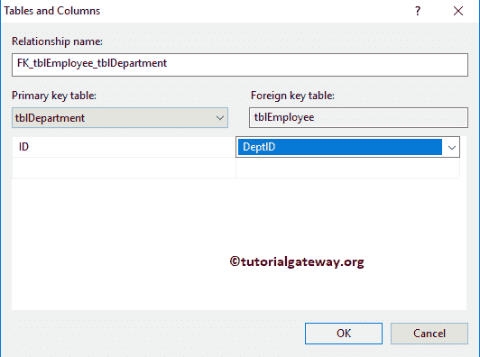

## 修改外键

要修改 SQL Server 外键，请转到“数据库”文件夹并选择表，然后转到“键”文件夹。接下来，右键单击名称并选择修改选项

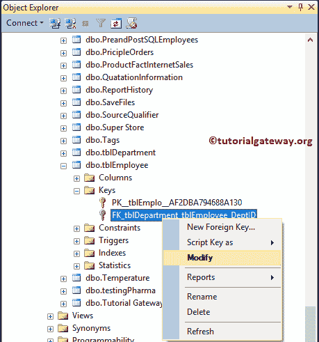

单击“修改”选项将在设计模式下打开相应的表以及“关系”窗口。

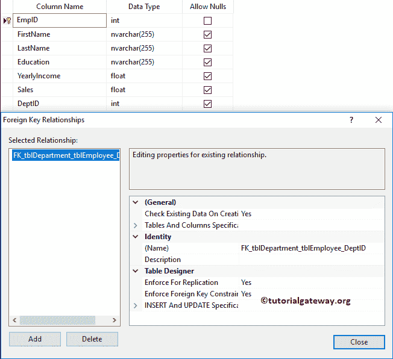

## 使用查询删除外键

请记住，您不能使用查询来更改外部约束。要修改现有的，您必须删除并重新创建它。请使用删除约束语句和更改表语句来删除或删除 Sql Server 中的外键

```
ALTER TABLE [dbo].[tblEmployee]  
DROP CONSTRAINT [FK_tblDepartment_tblEmployee_DeptID]
```

```
Messages
-------
Command(s) completed successfully.
```

### 使用 SSMS 删除外键约束

展开“数据库”文件夹，选择您的<font color="#000000">约束</font>所在的表，然后转到“密钥”文件夹。接下来，右键单击名称并选择删除选项

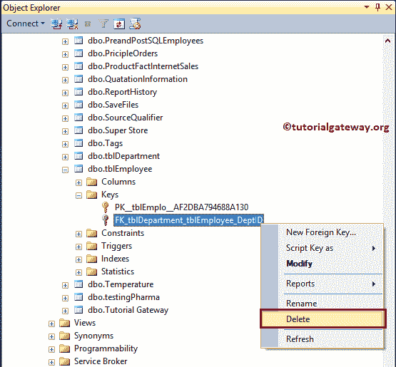

选择删除选项后，将打开删除对象窗口。单击“确定”删除约束。

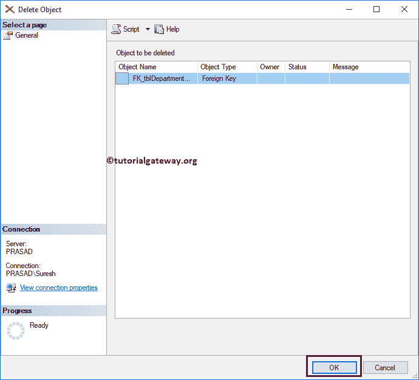

可以看到对象浏览器

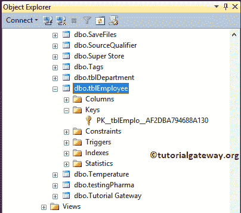

中没有外键

要删除 SQL 外键，请在对象资源管理器中，展开数据库文件夹，右键单击表名，然后单击设计选项。接下来，选择“关系”选项以打开此窗口。现在，请选择它，并点击删除按钮。

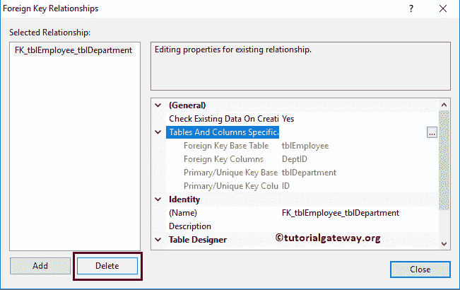