# SQL Server 中的引用完整性

> 原文：<https://www.tutorialgateway.org/referential-integrity-in-sql-server/>

在本节中，我们将介绍 SQL Server 中引用完整性的列表及其优势。以下是 SQL Server 中参考完整性约束选项的可用列表

*   无操作:这是默认行为。如果您创建了一个外键，但没有提到引用完整性，那么 SQL 将自动为它分配“无操作”。如果将“参照完整性”设置为“无操作”，并且在父表中执行更新或删除，则会引发错误消息。
*   级联:如果将 SQL 引用完整性设置为级联。如果您在父表中执行更新或删除，那么这些更改将自动应用于从属表行。
*   设置默认值:如果将 SQL Server 引用完整性设置为默认值。并在父表中执行更新或删除，外键列值将被默认值替换。
*   设置空值:如果将 SQL 参照完整性设置为设置空值，并在父表中执行更新或删除，相关记录将变为空值。

在我们进入示例之前，让我向您展示 tblDepartment 表后面的表定义

```
CREATE TABLE [dbo].[tblDepartment](
	[ID] [int] IDENTITY(1,1) NOT NULL PRIMARY KEY,
	[DepartmentName] [varchar](50) NULL,
)
```

tblEmployee 表后面的表定义如下所示。建议参考[创建表格](https://www.tutorialgateway.org/sql-create-table/)文章

```
CREATE TABLE [dbo].[tblEmployee](
	[EmpID] [int] IDENTITY(1,1) NOT NULL PRIMARY KEY,
	[FirstName] [nvarchar](255) NULL,
	[LastName] [nvarchar](255) NULL,
	[Education] [nvarchar](255) NULL,
	[YearlyIncome] [float] NULL,
	[Sales] [float] NULL,
	[DeptID] [int] NULL CONSTRAINT [DF_tblEmployee_DeptID] DEFAULT (2),
	CONSTRAINT [FK_tblDepartment_tblEmployee_DeptID] FOREIGN KEY([DeptID])
		REFERENCES [dbo].[tblDepartment] ([ID])
) 
GO
```

让我给你看看 T2 分部表

里面的数据

然后

为了演示 Sql Server 引用完整性，我们将一次又一次地重新创建相同的[外键](https://www.tutorialgateway.org/sql-foreign-key/)。为了达到同样的目的，我们使用 DROP Constraint 语句和 ALTER TABLE 语句来删除现有的外键约束

```
ALTER TABLE [dbo].[tblEmployee]  
DROP CONSTRAINT [FK_tblDepartment_tblEmployee_DeptID]
```

## SQL Server 示例中的无操作引用完整性

因为我们从 tblEMployee 中删除了现有的约束。让我在 Sql Server 中添加外键约束和无操作引用完整性。

请记住，这是默认选项，即使您没有提到完整性。默认情况下， [SQL Server](https://www.tutorialgateway.org/sql/) 将不分配任何操作选项。

我们使用[修改表格](https://www.tutorialgateway.org/sql-alter-table/)语句来修改表格内容。然后我们使用 ADD Constraint 语句来添加外键约束。

```
-- No Action Referential Integrity in SQL Server

ALTER TABLE [dbo].[tblEmployee]  
ADD CONSTRAINT [FK_tblDepartment_tblEmployee_DeptID] FOREIGN KEY([DeptID])
        REFERENCES [dbo].[tblDepartment] ([ID])
        ON UPDATE NO ACTION ON DELETE NO ACTION
```

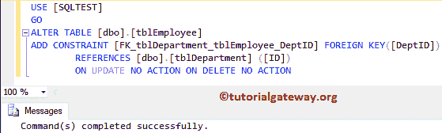

让我在设计器窗口给你看同样的东西。

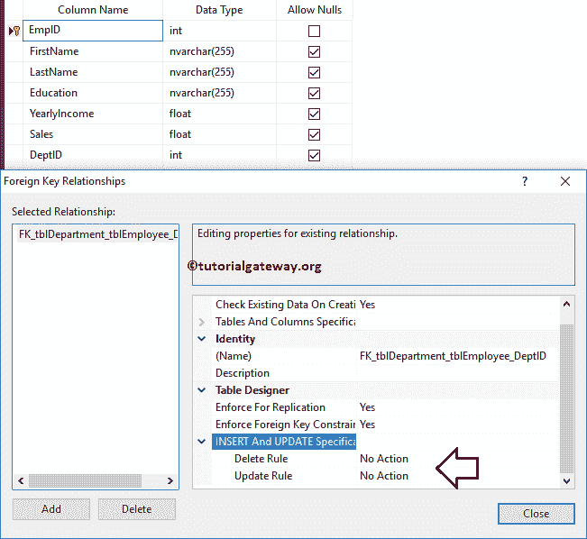

现在让我执行[删除](https://www.tutorialgateway.org/sql-delete-statement/)操作。这意味着删除主表数据(主键值)。从下面的代码片段中，您可以看到，我们正在从标识= 1 的 tblDepartment 中删除一条记录。

```
DELETE FROM [tblDepartment]
WHERE ID = 1
```

从下面的截图可以看出，它抛出了一个错误。这是因为如果存在任何外键依赖关系，无操作引用完整性将不允许您执行删除或更新选项。

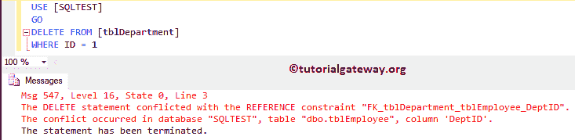

## 在 SQL Server 示例中设置默认引用完整性

在本例中，我们将在 Sql Server 中添加一个带有“设置默认参照完整性”的外键约束。

让我将 SQL Server 引用完整性设置为默认值。这意味着每当我们对主表执行删除或更新时，默认值都会加载到部门标识列中。建议大家参考[默认约束](https://www.tutorialgateway.org/sql-default-constraint/)一文。

```
-- Set Default Referential Integrity in SQL Server

ALTER TABLE [dbo].[tblEmployee]  
ADD CONSTRAINT [FK_tblDepartment_tblEmployee_DeptID] FOREIGN KEY([DeptID])
        REFERENCES [dbo].[tblDepartment] ([ID])
        ON UPDATE SET DEFAULT ON DELETE SET DEFAULT
```

```
Command(s) completed successfully.
```

让我在设计师窗口给你看同样的东西。

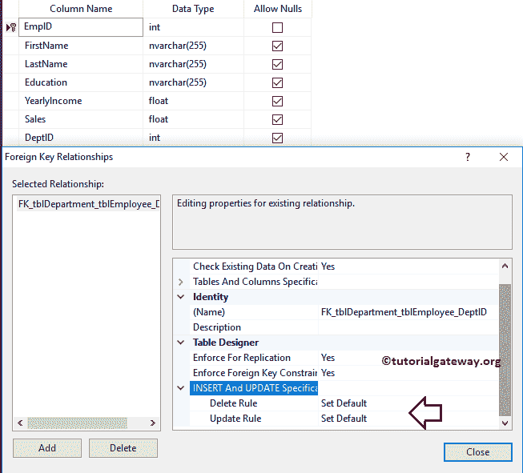

现在让我对零件执行删除操作。让我们从标识= 6 的部门中删除一条记录。

```
DELETE FROM [tblDepartment]
WHERE ID = 6
```

```
(1 row(s) affected)
```

让我们看看 tblEmployee 和 tblDepartment 中的数据。从下面的截图可以看到，从 tblDepartment 中删除了 ID 号 6，tblEmployee 中的所有依赖记录都被替换为默认值(即 2)

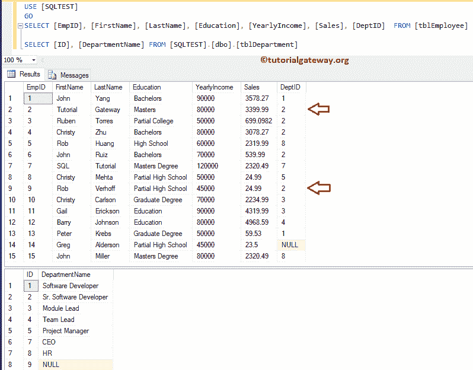

## 在 SQL Server 示例中设置空引用完整性

在本例中，我们将在 Sql Server 中添加一个带有“设置空引用完整性”的外键约束。

这意味着，每当我们对主表执行删除或更新时，将在部门标识列中加载/更新一个空值。

```
-- SET NULL Referential Integrity in SQL Server

ALTER TABLE [dbo].[tblEmployee]  
ADD CONSTRAINT [FK_tblDepartment_tblEmployee_DeptID] FOREIGN KEY([DeptID])
        REFERENCES [dbo].[tblDepartment] ([ID])
        ON UPDATE SET NULL ON DELETE SET NULL
```

```
Command(s) completed successfully.
```

让我在设计器窗口给你看同样的东西。

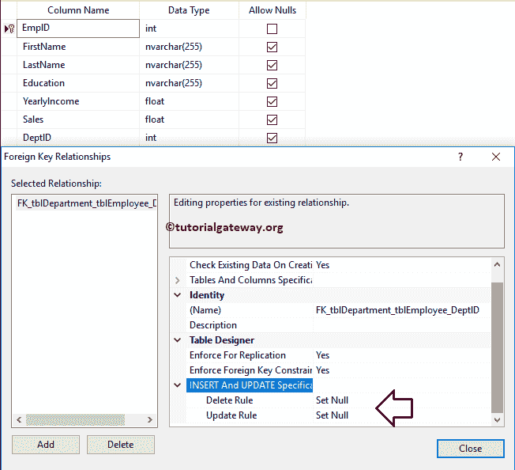

现在让我对零件执行删除操作。意思是删除[主键](https://www.tutorialgateway.org/sql-primary-key/)值。从下面的代码片段中，您可以看到，我们正在从 ID = 1 的 tblDepartment 中删除记录。

```
DELETE FROM [tblDepartment]
WHERE ID = 1
```

```
(1 row(s) affected)
```

让我们看看 tblEmployee 和 tblDepartment 中的数据。从下面的截图中可以看到，ID 号 6 从 tblDepartment 中删除，tblEmployee 中的所有依赖记录都替换为 NULLS(即 Emp ID 1 和 13)

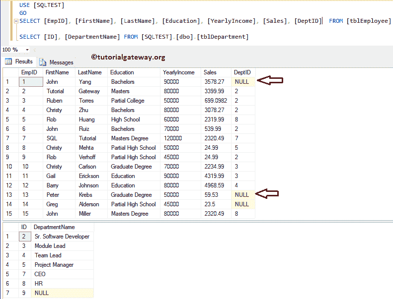

## SQL Server 示例中的级联引用完整性

在本例中，我们将在 SQL Server 中添加一个具有级联引用完整性的外键约束。这意味着，每当我们对主表(tblDepartment)执行删除时，tblEmployee 中相应的或从属的记录将被删除。

```
-- Cascade

ALTER TABLE [dbo].[tblEmployee]  
ADD CONSTRAINT [FK_tblDepartment_tblEmployee_DeptID] FOREIGN KEY([DeptID])
        REFERENCES [dbo].[tblDepartment] ([ID])
        ON UPDATE CASCADE ON DELETE CASCADE
```

```
Command(s) completed successfully.
```

让我在设计器窗口给你看同样的东西。

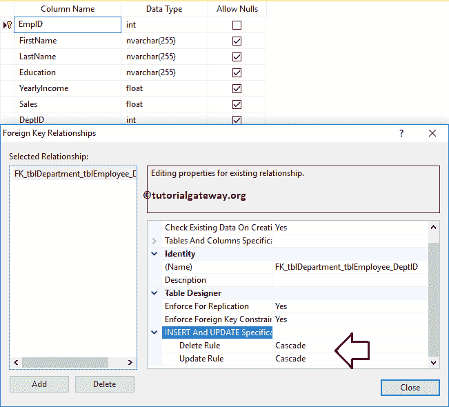

现在让我对零件执行删除操作。从下面的代码片段中，您可以看到，我们正在从标识为 2 的 tblDepartment 中删除一条记录。

```
-- Cascade

DELETE FROM [tblDepartment]
WHERE ID = 2
```

```
(1 row(s) affected)
```

让我们看看 tblEmployee 和 tblDepartment 中的数据。可以看到，身份证号 6 从 tblDepartment 中删除，tblEmployee 中的所有依赖记录也删除了

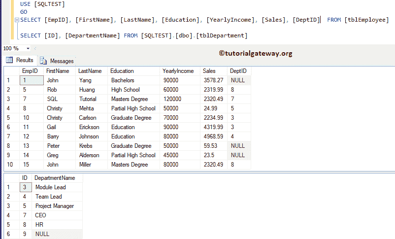

## 使用 SSMS 在 SQL 中设置引用完整性

如果您愿意使用 [SSMS](https://www.tutorialgateway.org/sql-server-management-studio/)，请按照以下步骤设置参照完整性。

在对象资源管理器中，展开表所在的数据库文件夹。请选择存放外键的表，然后转到“键”文件夹。接下来，右键单击键名将打开上下文菜单。请选择【修改】选项

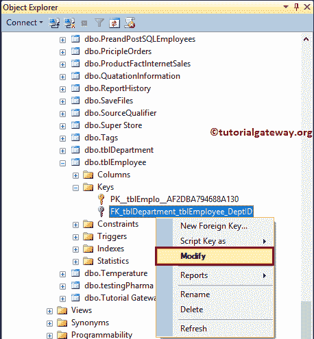

单击“修改”选项后，SQL Management Studio将在设计模式下打开相应的表以及“外键关系”窗口。在此设置删除规则和更新规则属性，以实现 SQL Server 引用完整性。

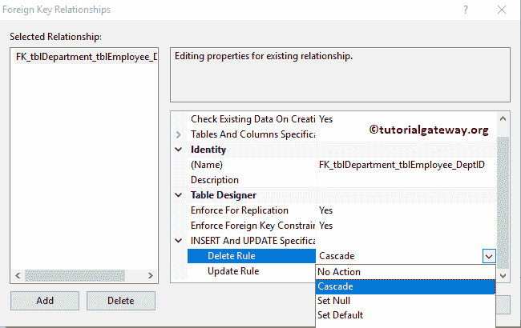