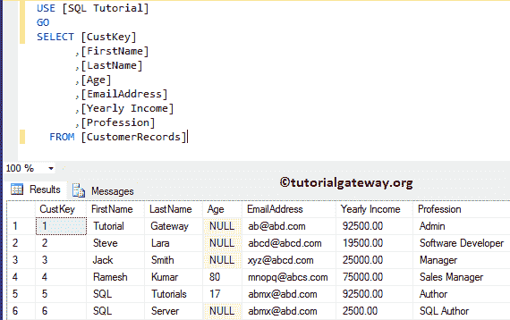
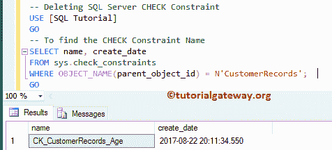

# SQL 检查约束

> 原文：<https://www.tutorialgateway.org/sql-check-constraint/>

SQL 检查约束将限制插入到 SQL 表列中的数据。例如，如果我们想要限制电话号码的位数，或者将客户年龄限制在 18 到 60 岁之间，那么我们可以将 Sql Server Check Constraint 分配给该列。

让我们看看如何使用 transact 查询和 SQL Server Management Studio 分配 SQL 检查约束，并举例说明。对于这个 SQL 检查约束演示，我们使用客户记录表。


让我更新 Custkey 的年龄= 4。请参考[更新语句](https://www.tutorialgateway.org/sql-update-statement/)了解以下 [SQL Server](https://www.tutorialgateway.org/sql/) 语句。

```
UPDATE [dbo].[CustomerRecords]
SET [Age] = -150
WHERE [CustKey] = 4
GO
```

```
Messages
--------
(1 row(s) affected)
```

尽管任何人的年龄在大多数情况下在 0 到 100 岁之间，或者在极少数情况下在 0 到 150 岁之间。我们的年龄栏接受实时不正确的负值。为了处理这种情况，我们必须使用 SQL Server 检查约束。

## 使用 SSMS 创建 SQL 检查约束

在我们开始使用 SQL Check 约束之前，让我向您展示我们表中的最终数据:


在本例中，我们向您展示了如何使用[管理工作室](https://www.tutorialgateway.org/sql/)创建支票。

在对象资源管理器中，展开表所在的数据库文件夹。请选择要创建 SQL 检查的表(这里是客户记录)。接下来，转到约束文件夹，右键单击它将打开上下文菜单。请选择新约束…选项


选择“新建”选项后，管理工作室将在设计模式下打开相应的表格。它将显示一个“检查”弹出窗口。


为了实现这一点，我们必须在表达式属性中提供一个布尔表达式。所以，让我点击表达式旁边的…按钮。


如你所见，我们正在写一个简单的表达年龄> 0 和年龄< 120\. It means Age should be between 0 and 120


接下来，我们将检查约束名称重命名为 CK _ 客户记录 _ 年龄。请根据您的要求更改名称，并提供有效的描述。除了这三个，还有一个更重要的属性:

*   创建或重新启用时检查现有数据:此属性具有布尔“是”或“否”选项。如果将其设置为“是”，检查约束将根据现有记录测试表达式。否则，它将只检查新记录。让我保持默认为是。


让我保存表格设计


它抛出了一个错误。因为客户记录表有一个值不满足表达式(-150 不在 0 和 120 之间)


让我将“创建或重新启用时检查现有数据”属性更改为“否”。这意味着，它不会关心现有记录，检查约束将只测试新记录的表达式。或者您可以[删除](https://www.tutorialgateway.org/sql-delete-statement/)，或者[更新](https://www.tutorialgateway.org/sql-update-statement/)包含-150 值的记录。


现在，您可以在 Sql Server 中看到我们新创建的检查约束。为此，请转到对象资源管理器->数据库–>表名->展开约束文件夹


### 将值插入到 SQL Server 检查约束列中

让我使用 [INSERT 语句](https://www.tutorialgateway.org/sql-insert-statement/)在表格中插入一个值。

```
INSERT INTO [dbo].[CustomerRecords]
          ([CustKey], [FirstName], [LastName], [Age], [EmailAddress], [Yearly Income], [Profession])
   VALUES (5, 'SQL', 'Tutorials',  175, '[email protected]', 92500, 'Author')
```


它正在返回一个错误。这是因为，我们插入的年龄值为 175，而 175 不在 0 到 120 之间。

让我们试着用负值。可以看到，它也抛出了同样的错误。

```
INSERT INTO [dbo].[CustomerRecords]
          ([CustKey], [FirstName], [LastName], [Age], [EmailAddress], [Yearly Income], [Profession])
   VALUES (5, 'SQL', 'Tutorials',  -17, '[email protected]', 92500, 'Author')
```


这次我们将用正确的值进行尝试，您可以看到我们的插入是成功的。

```
INSERT INTO [dbo].[CustomerRecords]
          ([CustKey], [FirstName], [LastName], [Age], [EmailAddress], [Yearly Income], [Profession])
   VALUES (5, 'SQL', 'Tutorials',  17, '[email protected]', 92500, 'Author')
```

```
Messages
--------
(1 row(s) affected)
```

让我们看看表中的总记录。

```
SELECT [CustKey]
      ,[FirstName]
      ,[LastName]
      ,[Age]
      ,[EmailAddress]
      ,[Yearly Income]
      ,[Profession]
  FROM [CustomerRecords]
```


## 使用查询检查现有表的约束

在使用这个之前，让我向您展示我们表中的最终数据:


在本例中，我们展示了如何在现有的表上添加 SQL Server 检查约束。

为了补充这一点，我们使用 [Alter Table](https://www.tutorialgateway.org/sql-alter-table/) 语句来更改表格内容。然后我们使用 ADD CONSTRAINT 语句进行添加。

```
ALTER TABLE[CustomerRecords]
ADD CONSTRAINT CK_CustomerRecords_Age CHECK([Age] > 0 AND [Age] < 120)

GO
```

```
Messages
--------
Command(s) completed successfully.
```

让我插入一个负值

```
INSERT INTO [dbo].[CustomerRecords]
	  ([CustKey], [FirstName], [LastName], [Age], [EmailAddress], [Yearly Income], [Profession])
     VALUES (6, 'SQL', 'Server',  -25, '[email protected]', 92500, 'Author')
```


### 在 SQL 检查约束中插入空值

当我们将空值插入到 SQL 检查约束列中时会发生什么？。让我在年龄地址列中插入空值。

```
INSERT INTO [dbo].[CustomerRecords]
	  ([CustKey], [FirstName], [LastName], [Age], [EmailAddress], [Yearly Income], [Profession])
     VALUES (6, 'SQL', 'Server',  NULL, '[email protected]', 2500, 'SQL Author')
```

```
Messages
--------
(1 row(s) affected)
```

它已经将空值插入到检查约束中。因为空值的表达式结果返回未定义(既不为真，也不为假)，所以它允许记录。



## 在多列上创建 SQL 检查约束

本示例在多列上创建一个 SQL 检查约束。下面的代码将限制用户不能输入年龄小于 18 岁，年收入大于 100000

```
ALTER TABLE[CustomerRecords]
ADD CONSTRAINT CK_CustomerRecords_AgeAndIncome CHECK([Age] >= 18 AND [YearlyIncome] <= 100000)

GO
```

## 在创建表时创建 SQL 检查约束

这里，我们向您展示了如何在创建表时在 SQL server 中创建检查约束。参考[创建表格](https://www.tutorialgateway.org/sql-create-table/)文章。

```
CREATE TABLE [dbo].[CustomerRecords2](
	[CustKey] [int] NOT NULL PRIMARY KEY,
	[FirstName] [varchar](50) NOT NULL,
	[LastName] [varchar](50) NULL,
	[Age] [int] NULL,
	[EmailAddress] [nvarchar](50) NULL,
	[Yearly Income] [money] NULL,
	[Profession] [nvarchar](100) NULL,
	CONSTRAINT CK_CustomerRecords_AgeColumn CHECK([Age] > 0 AND [Age] < 120)
)
GO
```

```
Messages
-------
Command(s) completed successfully.
```

## 使用事务处理查询删除检查约束

如果您知道要删除的名称，请将 DROP Constraint 语句与 [ALTER TABLE](https://www.tutorialgateway.org/sql-alter-table/) 语句一起编写 transact sql 查询。

```
ALTER TABLE [dbo].[CustomerRecords]   
DROP CONSTRAINT CK_CustomerRecords_Age;  
GO
```

```
Messages
-------
Command(s) completed successfully.
```

如果不知道名称，用下面的 [`SELECT`语句](https://www.tutorialgateway.org/sql-select-statement/)得到约束名称。

```
SELECT name, create_date   
FROM sys.check_constraints
WHERE OBJECT_NAME(parent_object_id) = N'CustomerRecords';  
GO
```



获得名称后，可以使用 [ALTER TABLE](https://www.tutorialgateway.org/sql-alter-table/) 语句删除 Check 约束。

## 使用 SSMS 删除检查约束

在对象资源管理器中，展开数据库文件夹，然后展开客户记录表以查找约束文件夹。右键单击文件夹，并选择删除选项。


选择“删除”选项后，将打开一个名为“删除对象”的新窗口。单击确定将其删除。

