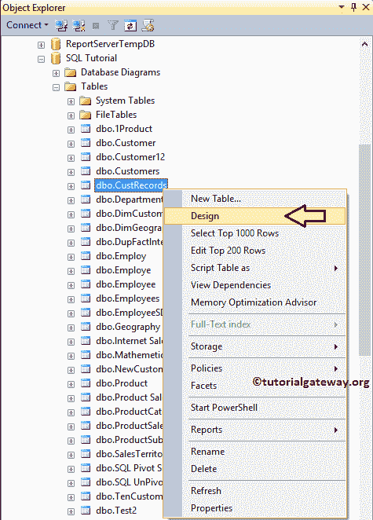
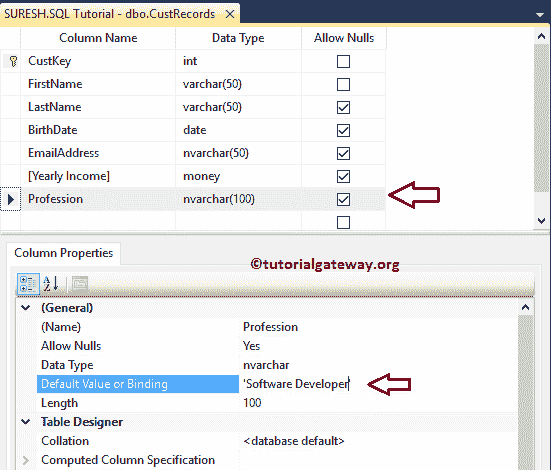
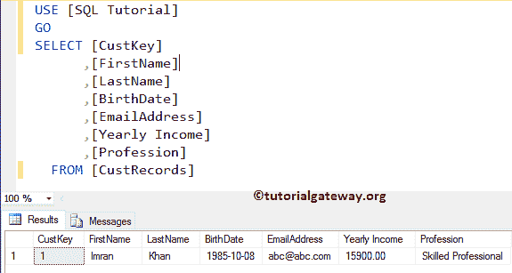
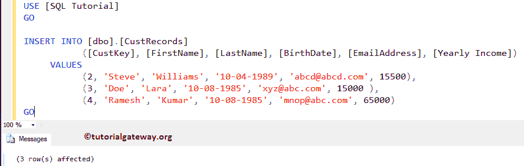
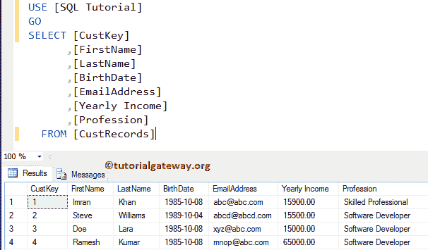
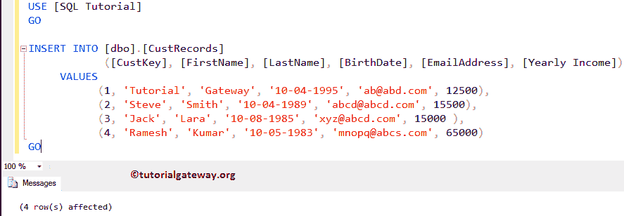
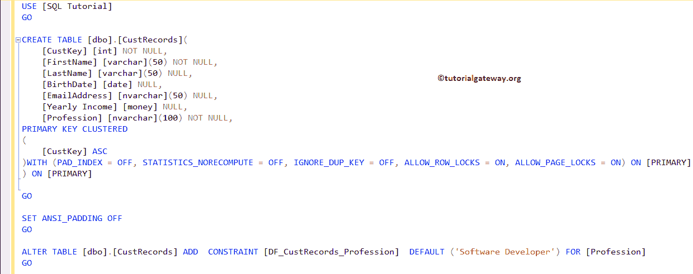
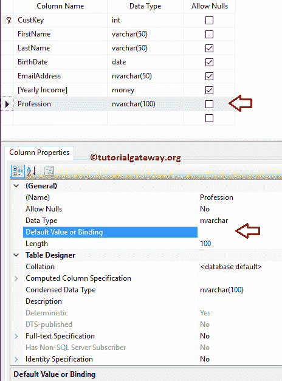
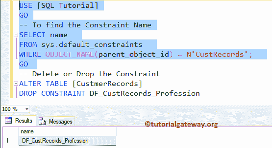

# SQL 默认约束

> 原文：<https://www.tutorialgateway.org/sql-default-constraint/>

SQL 默认约束用于为 SQL 表列分配默认值。通常，每列都接受空值或值。如果用户忘记输入值，那么 SQL Server 将为该列分配一个空值。在这些情况下，我们可以使用 SQL Default 约束来用标准值替换这些空值。

## 创建 SQL 默认约束

我们可以使用 Transact SQL 查询和管理工作室来创建一个 SQL 默认约束。

### 使用 SSMS 设置 SQL 默认约束

要使用管理工作室创建 SQL Server 默认约束，请转到对象资源管理器。展开表所在的数据库文件夹。请选择要创建的表(这里是 Custrecords)，右键单击它将打开上下文菜单。请选择设计选项



单击设计选项后，SQL 管理工作室将在设计模式下打开相应的表。如您所见，表有七个不同数据类型的列，我们的任务是将 SQL 默认约束添加到 Profession 列中。

请选择列名，并在默认值或绑定列属性中提供默认值。对于这个 SQL 默认约束示例，我们将软件开发人员指定为职业列的标准值。



让我使用[`INSERT`语句](https://www.tutorialgateway.org/sql-insert-statement/)在 [SQL Server](https://www.tutorialgateway.org/sql/) 表中插入一个值。

```
INSERT INTO [dbo].[CustRecords]
           ([CustKey], [FirstName], [LastName], [BirthDate], [EmailAddress], [Yearly Income])
     VALUES
           (1, 'Imran', 'Khan', '10-08-1985', '[email protected]', 15900, 'Skilled Professional')
GO
```

```
Messages
--------
(1 row(s) affected)
```

让我给你看看数据



虽然它有默认值，但是 SQL 正在插入我想要插入的数据。现在，让我插入没有专业栏的值

```
INSERT INTO [dbo].[CustRecords]
           ([CustKey], [FirstName], [LastName], [BirthDate], [EmailAddress], [Yearly Income])
     VALUES
           (2, 'Steve', 'Williams', '10-04-1989', '[email protected]', 15500),
    (3, 'Doe', 'Lara', '10-08-1985', '[email protected]', 15000 ),
    (4, 'Ramesh', 'Kumar', '10-08-1985', '[email protected]', 65000)
GO
```



SQL Server 正在将默认值插入专业列。



### 使用查询创建

让我们使用 Transact SQL 语句在 SQL server 中创建一个默认约束。这里，我们将在创建表时设置默认值。请参考[创建表格](https://www.tutorialgateway.org/sql-create-table/)一文。

```
CREATE TABLE [dbo].[CustRecords](
	[CustKey] [int] NOT NULL PRIMARY KEY,
	[FirstName] [varchar](50) NOT NULL,
	[LastName] [varchar](50) NULL,
	[BirthDate] [date] NULL,
	[EmailAddress] [nvarchar](50) NULL,
	[Yearly Income] [money] NULL,
	[Profession] [nvarchar](100) NOT NULL DEFAULT ('Software Developer'),
)
GO
```

运筹学

```
CREATE TABLE [dbo].[CustRecords](
	[CustKey] [int] NOT NULL PRIMARY KEY,
	[FirstName] [varchar](50) NOT NULL,
	[LastName] [varchar](50) NULL,
	[BirthDate] [date] NULL,
	[EmailAddress] [nvarchar](50) NULL,
	[Yearly Income] [money] NULL,
	[Profession] [nvarchar](100) NULL CONSTRAINT [DF_CustRecords_Profession]  DEFAULT ('Software Developer'),
)
GO
```

```
Messages
--------
Command(s) completed successfully.
```

作为软件开发人员，我们用标准值添加了它。这与我们创建任何其他约束相同。SSMS 足够聪明，可以为你设置默认值。

让我插入没有专业栏的值

```
INSERT INTO [dbo].[CustRecords]
	  ([CustKey], [FirstName], [LastName], [BirthDate], [EmailAddress], [Yearly Income])
     VALUES
           (1, 'Tutorial', 'Gateway', '10-04-1995', '[email protected]', 12500),
	   (2, 'Steve', 'Smith', '10-04-1989', '[email protected]', 15500),
	   (3, 'Jack', 'Lara', '10-08-1985', '[email protected]', 15000 ),
	   (4, 'Ramesh', 'Kumar', '10-05-1983', '[email protected]', 65000)
GO
```



### 在现有表中添加 SQL 默认约束

如何在现有表上添加？。为此，我们创建了一个新表。

```
CREATE TABLE [dbo].[CustRecords](
	[CustKey] [int] NOT NULL PRIMARY KEY,
	[FirstName] [varchar](50) NOT NULL,
	[LastName] [varchar](50) NULL,
	[BirthDate] [date] NULL,
	[EmailAddress] [nvarchar](50) NULL,
	[Yearly Income] [money] NULL,
	[Profession] [nvarchar](100) NOT NULL
)
GO
```

现在让我补充上表。从下面可以看到，我们使用 [Alter Table](https://www.tutorialgateway.org/sql-alter-table/) 语句来更改表格内容。然后使用 ADD Constraint 语句添加默认约束。

```
ALTER TABLE [dbo].[CustRecords]   
ADD CONSTRAINT DF_CustRecords_Profession DEFAULT ('Software Developer') FOR Profession;  
GO
```

让我向您展示由 SQL 生成的内部代码，通过右键单击表->脚本 as –>创建到新的查询窗口选项



### 使用 SSMS 删除 SQL Server 中的默认约束

请选择要添加的表->列，然后转到列属性，并删除默认值。



### 删除或删除 SQL 中的默认约束

如果您知道名称，请使用 DROP Constraint 语句和 ALTER TABLE 语句

```
ALTER TABLE [dbo].[CustRecords]   
DROP CONSTRAINT DF_CustRecords_Profession;  
GO
```

如果不知道名称，使用第一个 [`SELECT`语句](https://www.tutorialgateway.org/sql-select-statement/)获取所有约束名称。

```
-- To find the Name
SELECT name  
FROM sys.default_constraints  
WHERE OBJECT_NAME(parent_object_id) = N'CustRecords';  
GO  
-- Delete or Drop
ALTER TABLE [CustmerRecords]  
DROP CONSTRAINT DF_CustRecords_Profession
```

