# SQL 唯一约束

> 原文：<https://www.tutorialgateway.org/sql-unique-constraint/>

SQL 唯一约束将确保没有重复的值插入到 SQL 表列中。例如，如果我们想确保员工或客户必须使用单个电子邮件地址登录。然后，我们可以为该列分配一个 SQL 唯一约束。

## 创建 SQL 唯一约束

它将接受一个空值。我们可以使用 Transact SQL 查询和管理工作室来创建一个 SQL Server 唯一约束。

要使用管理工作室创建 SQL 唯一约束，请转到对象资源管理器。右键单击要创建的表格(这里是客户记录)，选择设计选项

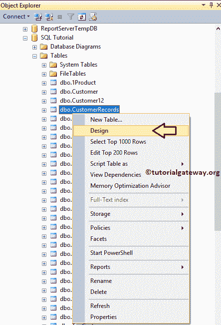

单击设计选项后，客户记录表将在设计模式下打开。如您所见，该表有 7 列不同的数据类型，我们的任务是将唯一约束添加到电子邮件地址列。

要创建 SQL 唯一约束，请右键单击列名，然后选择索引/键..选项。

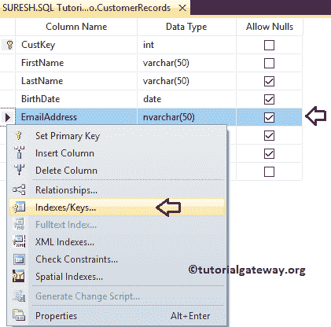

一旦选择了 [SQL Server](https://www.tutorialgateway.org/sql/) 索引/键..选项，将会打开一个新窗口。要创建新密钥，请单击添加按钮

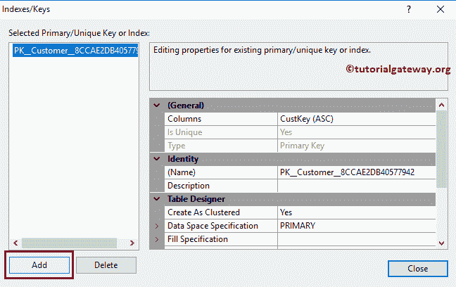

单击添加按钮后，SQL 将使用默认名称创建一个索引。请导航至“常规”部分，选择要应用唯一约束

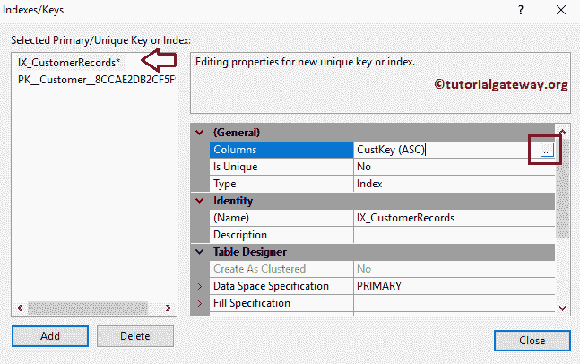

的列

在这里，我们想使用电子邮件地址列上的唯一键，这就是为什么我们选择相同的。

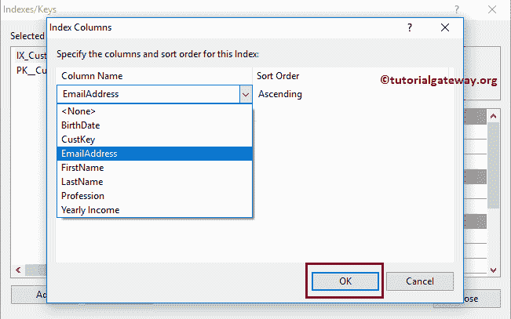

接下来，请将类型从默认索引更改为唯一键

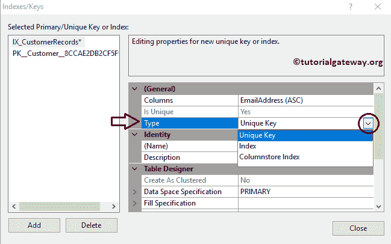

最后，如果要更改身份名称，请使用“名称”属性进行更改。完成后，单击关闭按钮，这将为您在客户记录表上创建一个唯一键。

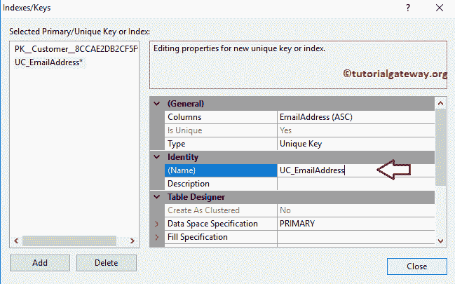

让我们看看 [SQL Management Studio](https://www.tutorialgateway.org/sql-server-management-studio/) 生成的内部代码，通过右键单击表- >脚本为–>创建到新的查询窗口选项

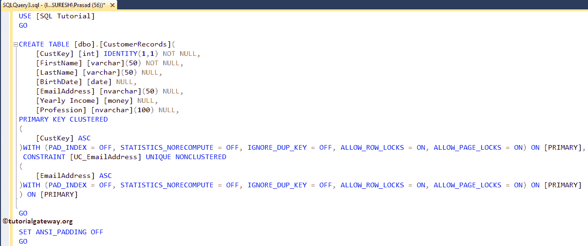

### 使用 T-SQL 创建 SQL 唯一约束

如何使用 Transact-SQL 语句在 SQL 服务器中创建唯一键。我们有多个选项可以使用查询来创建它。如果您不想为密钥指定任何特定的名称，请使用以下选项。请参考[创建表格](https://www.tutorialgateway.org/sql-create-table/)一文。

```
CREATE TABLE [dbo].[CustomerRecords](
	[CustKey] [int] NOT NULL UNIQUE,
	[FirstName] [varchar](50) NOT NULL,
	[LastName] [varchar](50) NULL,
	[BirthDate] [date] NULL,
	[EmailAddress] [nvarchar](50) NULL,
	[Yearly Income] [money] NULL,
	[Profession] [nvarchar](100) NULL
)
GO
```

```
Messages
-------
Command(s) completed successfully.
```

它允许您为 SQL 唯一键分配有意义的名称

```
CREATE TABLE [dbo].[CustomerRecords](
	[CustKey] [int] NOT NULL,
	[FirstName] [varchar](50) NOT NULL,
	[LastName] [varchar](50) NULL,
	[BirthDate] [date] NULL,
	[EmailAddress] [nvarchar](50) NULL,
	[Yearly Income] [money] NULL,
	[Profession] [nvarchar](100) NULL,
	CONSTRAINT UC_CustomerRecords_CustKey UNIQUE (CustKey)
)
GO
```

我们刚刚将其添加到 CustKey 列中。

```
Messages
-------
Command(s) completed successfully.
```

让我使用 [INSERT 语句](https://www.tutorialgateway.org/sql-insert-statement/)将值插入表中。

```
-- Inserting Values
INSERT INTO [dbo].[CustomerRecords]
	  ([CustKey], [FirstName], [LastName], [BirthDate], [EmailAddress], [Yearly Income], [Profession])
     VALUES
           (1, 'Tutorial', 'Gateway', '10-04-1995', '[email protected]', 92500, 'Admin'),
	   (2, 'Steve', 'Lara', '10-04-1989', '[email protected]', 19500, 'Software Developer'),
	   (3, 'Jack', 'Smith', '10-08-1985', '[email protected]', 25000, 'Manager' ),
	   (4, 'Ramesh', 'Kumar', '10-05-1983', '[email protected]', 75000, 'Sales Manager')
GO
```

```
Messages
-------
(4 row(s) affected)
```

看到我们插入的数据

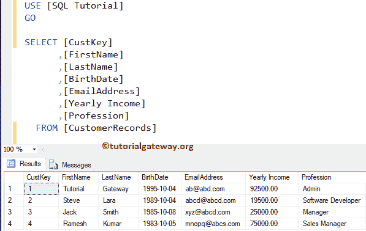

让我将重复值添加到键列(CustKey)

```
INSERT INTO [dbo].[CustomerRecords]
	  ([CustKey], [FirstName], [LastName], [BirthDate], [EmailAddress], [Yearly Income], [Profession])
     VALUES
       (1, 'Gateway', 'Tutorial', '10-04-1995', '[email protected]', 92500, 'Admin')
GO
```

它抛出了一个错误。

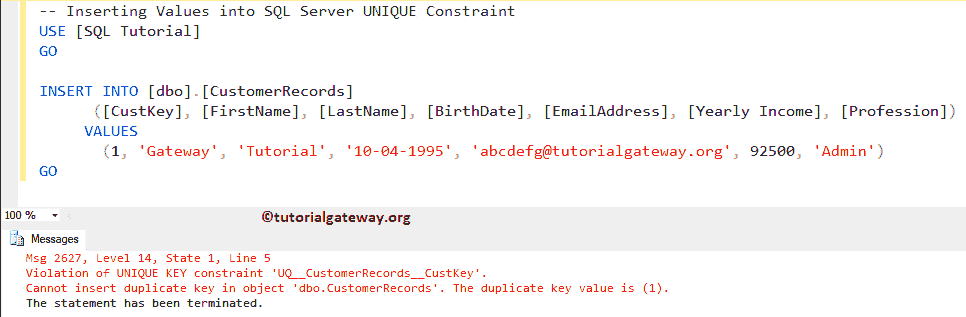

### 现有表的唯一约束

要在现有表中添加 SQL Server 唯一约束，我们使用 [Alter Table](https://www.tutorialgateway.org/sql-alter-table/) 语句来更改表内容。然后使用 ADD UNIQUE 语句添加这个约束。

```
ALTER TABLE[CustomerRecords]
ADD UNIQUE([EmailAddress])
```

或者，使用以下 SQL 唯一约束方法来添加有意义的名称

```
ALTER TABLE[CustomerRecords]
ADD CONSTRAINT UC_CustomerRecords_EmailAddress UNIQUE([EmailAddress])
```

让我们看看 SQL 生成的内部代码，通过右键单击表->脚本 as –>创建到新的查询窗口选项

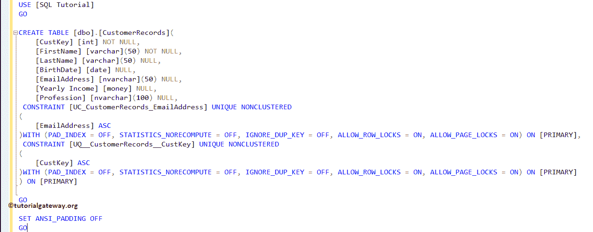

### 插入 NULLS

让我们看看当我们将空值插入到 SQL 唯一键列时会发生什么

```
-- Inserting Values
INSERT INTO [dbo].[CustomerRecords]
	  ([CustKey], [FirstName], [LastName], [BirthDate],  [Yearly Income], [Profession])
     VALUES
       (5, 'Gateway', 'Tutorial', '10-04-1995', 92500, 'Admin')
GO
```

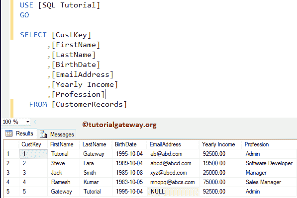

让我在有约束的电子邮件地址列中再插入一个空值。

```
INSERT INTO [dbo].[CustomerRecords]
	  ([CustKey], [FirstName], [LastName], [BirthDate],  [Yearly Income], [Profession])
     VALUES
       (6, 'TutorialGateway', 'Website', '12-05-1995', 92500, 'Admin')
GO
```

它抛出了一个错误，因为 Sql Server 唯一键将只接受一个空值

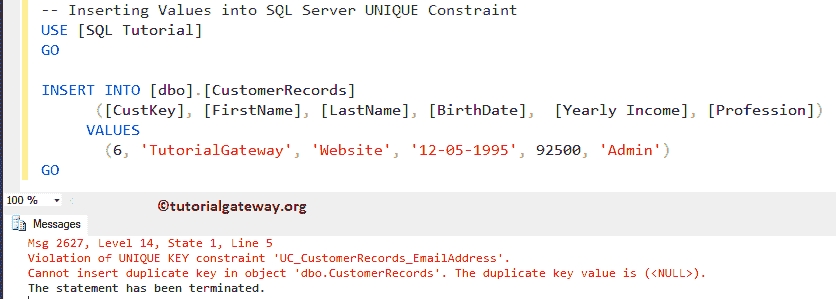

### 使用 SSMS 删除 SQL 唯一约束

右键单击表名，然后单击“设计”选项。接下来，选择索引/键..选项并选择要删除的约束，然后单击“删除”按钮。

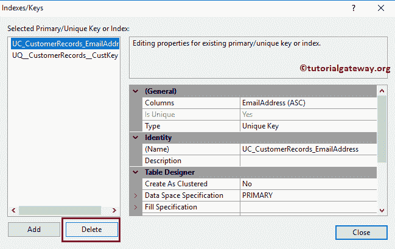

### 使用删除约束删除 SQL 唯一约束

如果您知道 SQL 唯一约束名称，请将 DROP Constraint 语句与 [ALTER TABLE](https://www.tutorialgateway.org/sql-alter-table/) 语句一起使用

```
ALTER TABLE [dbo].[CustomerRecords]   
DROP CONSTRAINT UC_CustomerRecords_CustKey;  
GO
```

如果不知道名称，使用下面的 [`SELECT`语句](https://www.tutorialgateway.org/sql-select-statement/)获取约束名称。

```
-- To find the Name
SELECT name  
FROM sys.key_constraints
WHERE OBJECT_NAME(parent_object_id) = N'CustomerRecords';  
GO  
-- Delete or Drop
ALTER TABLE [CustomerRecords]   
DROP CONSTRAINT UC_CustomerRecords_CustKey;  
GO
```

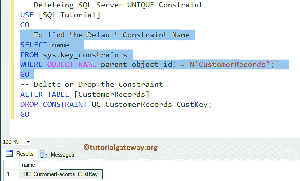

然后可以使用[改变表](https://www.tutorialgateway.org/sql-alter-table/)语句删除约束。

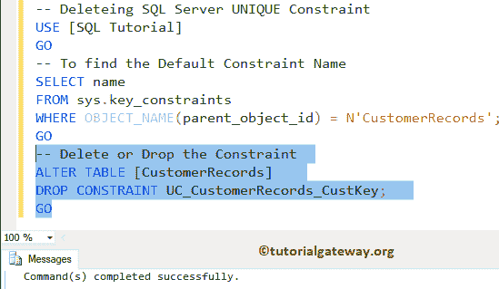

### 在多列上插入

您可以使用此查询在多列上添加 SQL 唯一键。

```
CREATE TABLE [dbo].[CustomerRecords](
	[CustKey] [int] NOT NULL,
	[FirstName] [varchar](50) NOT NULL,
	[LastName] [varchar](50) NULL,
	[BirthDate] [date] NULL,
	[EmailAddress] [nvarchar](50) NULL,
	[Yearly Income] [money] NULL,
	[Profession] [nvarchar](100) NULL,
	CONSTRAINT UC_CustomerRecords_CustKeyEmailID UNIQUE (CustKey, EmailAddress)
)
GO
```