# SQL Server 中的聚集索引

> 原文：<https://www.tutorialgateway.org/clustered-index-in-sql-server/>

SQL Server 中的聚集索引定义了数据在表中的物理存储顺序。这意味着 SQL 集群索引将首先对记录进行排序，然后存储它们。

通常，创建主键时，该主键会自动创建 SQL 聚集索引。但是，您可以使用 SQL Server CREATE CLUSTER INDEX 语句显式创建它。让我们看看如何使用事务处理查询和 Management Studio 在 SQL Server 中创建和删除聚集索引

## 如何在 SQL Server 中创建聚集索引

当您在列上创建主键约束时，它将自动为您在该列上创建聚集索引。只有当表中不存在集群时，才会发生这种情况。请记住，每个表只能创建一个 SQL Server 集群索引

在本例中，我们将向您展示如何使用 Transact 语句在 SQL 中创建聚集索引。这里我们将在创建表时创建一个[主键](https://www.tutorialgateway.org/sql-primary-key/)。参考[创建表格](https://www.tutorialgateway.org/sql-create-table/)一文。

```
 CREATE TABLE [CustomerRecord]
(
  [CustomerKey] [int] NOT NULL PRIMARY KEY,
  [FirstName] [varchar](50) NOT NULL ,
  [LastName] [varchar](50) NULL,
  [EmailAddress] [nvarchar](50) NULL,
  [Profession] [nvarchar](100) NULL,
  [Yearly Income] [money] NULL
)
```

```
Messages
--------
Command(s) completed successfully.
```

让我使用 sp_helpindex 存储过程在 CustomerRecord 表中检查它。

```
EXECUTE SP_HELPINDEX CustomerRecord
```

如您所见，主键在客户键列上创建了一个聚集和唯一索引。

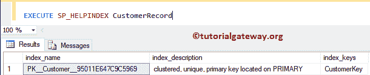

您也可以使用 SP_HELP 存储过程来检查这一点。

```
EXECUTE SP_HELP CustomerRecord
```

它将显示关于该表的所有信息。

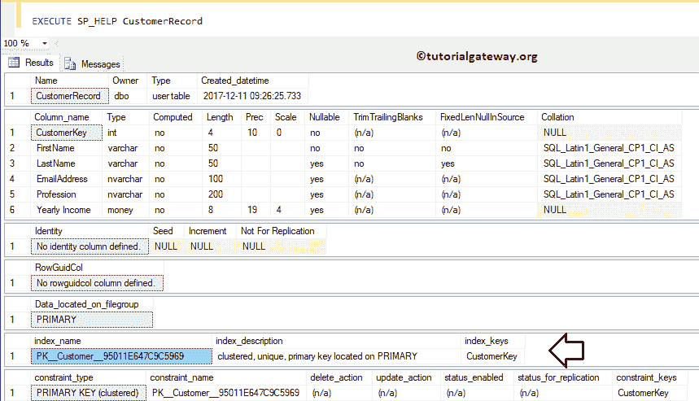

或者，您可以展开我们在其上创建它的表，并展开“索引”文件夹

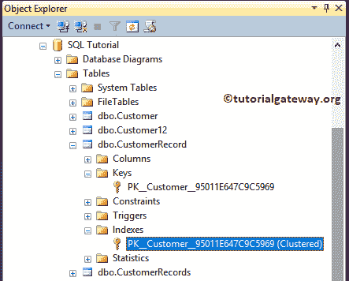

### 将行插入聚集索引列

让我插入几行来检查 SQL 集群索引功能。如您所见，我们在表中插入了五条记录，而客户关键字值的顺序不正确。

```
INSERT INTO [dbo].[CustomerRecord] 
VALUES (4, 'Imran', 'Khan', '[email protected]', 'Skilled Professional', 15900)
      ,(2, 'Doe', 'Lara', '[email protected]', 'Management', 15000)
      ,(5, 'Ramesh', 'Kumar', '[email protected]', 'Professional', 65000)
      ,(1, 'SQL', 'Tutorial', '[email protected]', 'CEO', 654500)
      ,(3, 'Tutorial', 'Gateway', '[email protected]', 'HR', 95000)
```

```
Messages
--------
(5 row(s) affected)
```

让我[选择](https://www.tutorialgateway.org/sql-select-statement/)我们之前插入的记录。从下图中，可以看到记录是按照[升序](https://www.tutorialgateway.org/sql-order-by-clause/)按客户关键字排序的。因为，它会重新排序(重新排列)记录。

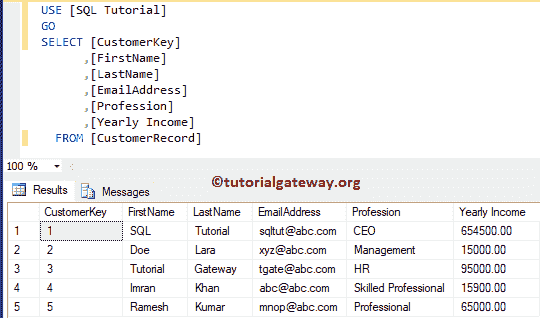

### 删除或删除 SQL Server 中的聚集索引

请使用 DROP INDEX 语句删除或删除。

```
DROP INDEX CustomerRecord.PK__Customer__95011E647C9C5969
```

这里，我们的聚集索引是由主键自动创建的，所以我们不能简单地使用这个语句删除。但是对于显式创建的，这将是可行的。

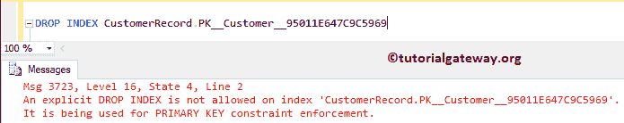

### 使用 SSMS 删除 SQL Server 中的聚集索引

在对象资源管理器中，展开数据库文件夹并选择它所在的表。接下来，展开“索引”文件夹，右键单击键名选择删除选项

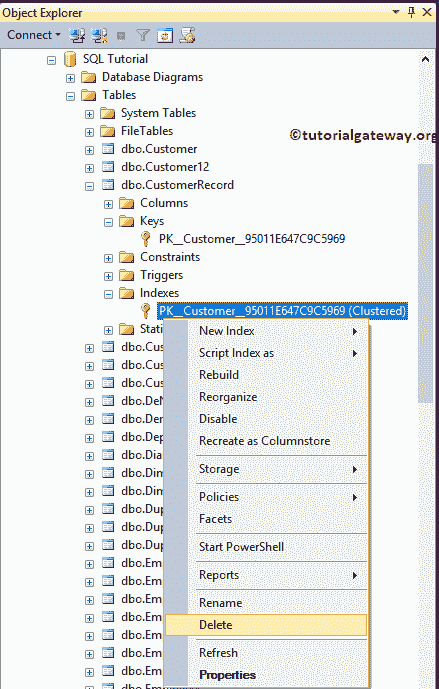

选择删除选项后，将打开删除对象窗口。单击确定将其删除。

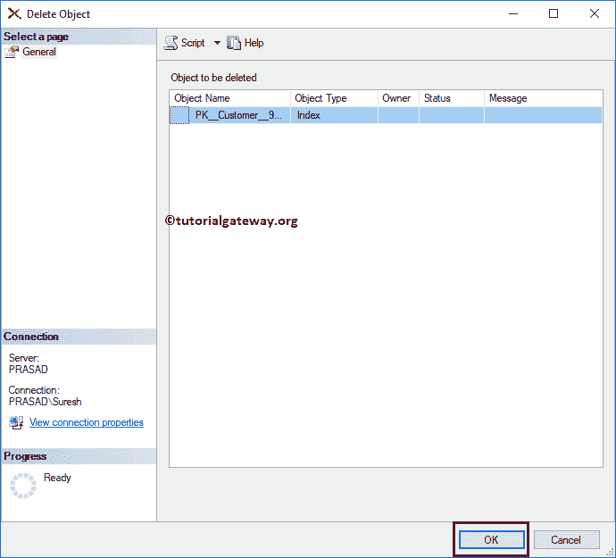

### 在现有表上创建 SQL 聚集索引

在这种情况下，我们将向您展示如何在现有的表上添加。语法是:

```
CREATE CLUSTERED INDEX Index_Name
ON Table_Name (Column_Name(s) ASC/DESC)
```

它将在客户记录表中的年收入列上创建

```
CREATE CLUSTERED INDEX IX_CustomerRecord_YearlyIncome
ON CustomerRecord ([Yearly Income] ASC)
```

现在你可以看到年收入栏按照升序

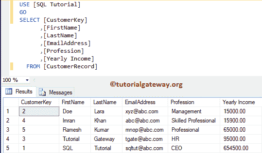

对数据进行排序

这次我们明确地创建了它。因此，让我尝试使用 DROP INDEX 语句删除它。

```
DROP INDEX CustomerRecord.IX_CustomerRecord_YearlyIncome
```

我们使用 SQL Server 删除索引语句成功删除了聚集索引。

```
Messages
--------
Command(s) completed successfully.
```

### 在 SQL Server 中创建复合聚集索引

[SQL](https://www.tutorialgateway.org/sql/) 允许您在多个列上创建它，但不能在多个聚集索引上创建。因此，您可以将同一个聚集索引指向多个列。为了演示 SQL Server 中的复合聚集索引，我们向客户记录表

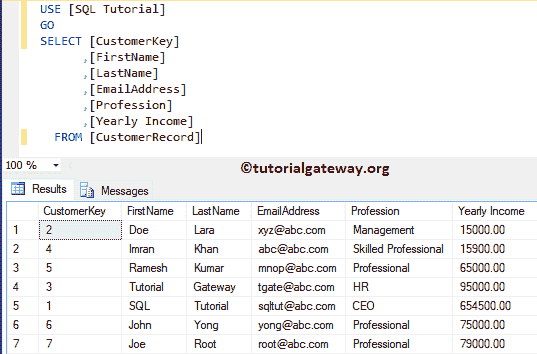

中添加了两条记录

在本例中，我们在专业列和年收入列上添加了一个 SQL 聚集索引

```
CREATE CLUSTERED INDEX IX_CustomerRecord_YearlyIncome
ON CustomerRecord ([Profession] ASC, [Yearly Income] DESC)
```

```
Messages
--------
Command(s) completed successfully.
```

现在你可以看到，数据是按专业人员升序排序，然后按年收入降序排序。

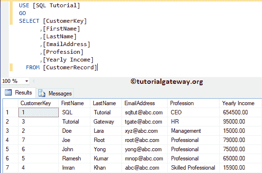

## 在 SSMS 中创建聚集索引

本节介绍使用 management studio 创建 it

### 使用对象资源管理器

在这个例子中，我们展示了如何使用[Management Studio](https://www.tutorialgateway.org/sql-server-management-studio/)来创建它。为此，请转到对象资源管理器并展开表所在的数据库文件夹。

请展开要创建的表，右键单击“索引”文件夹将打开上下文菜单。请选择新建，然后选择聚集索引..选项

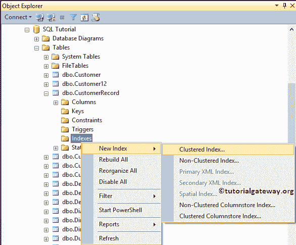

选择该选项后，将会打开一个新窗口。请更改名称。

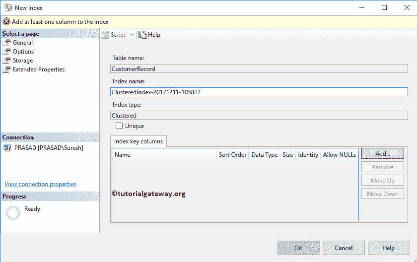

单击添加按钮，并选择要指定 SQL Server 聚集索引的列名。现在，我们选择年收入栏。

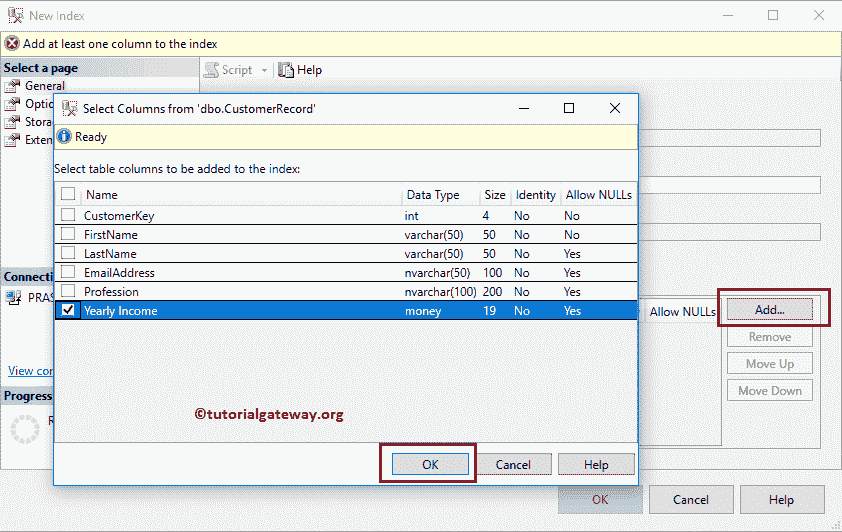

请更改排序顺序

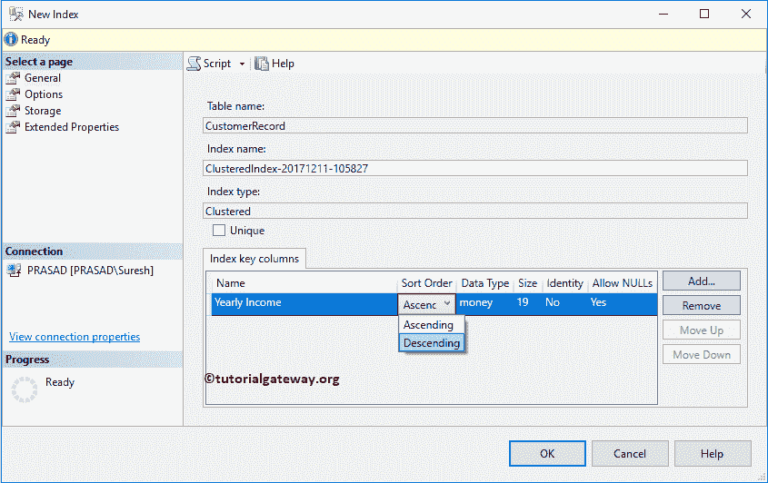

现在，您可以看到该表是按年收入降序排列的

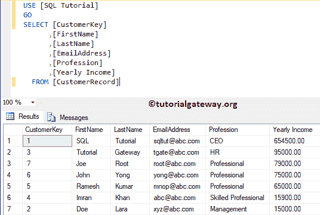

### 使用表设计器

请展开要在 SQL Server 对象资源管理器中创建聚集索引的表。接下来，右键单击它并选择“设计”选项，在“设计器”窗口中打开该表。接下来，右键单击该列并选择设置索引/键…选项。

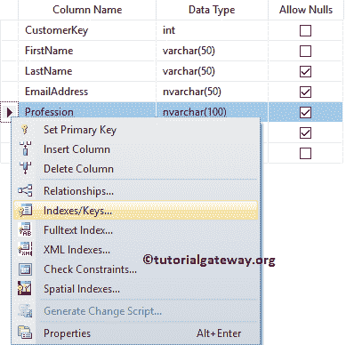

请点击添加按钮添加新的。一旦您选择添加选项，SSMS 将为您创建它。

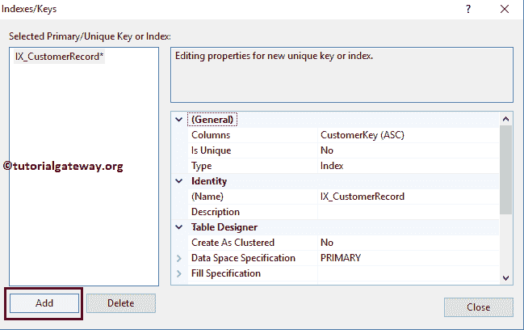

接下来，单击“列”选项旁边的“浏览”按钮来更改列。接下来，我们选择专业作为列名，降序是排序顺序。

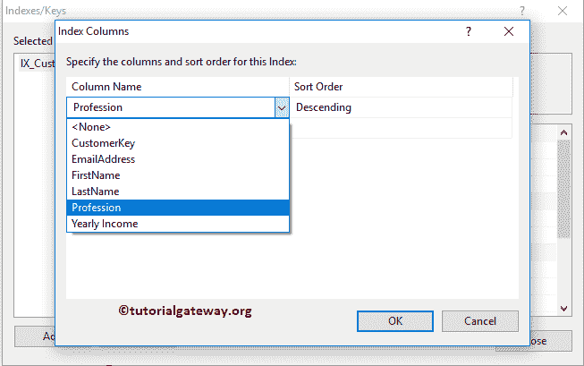

在表设计器下，请将“创建为集群”选项从默认的“否”更改为“是”

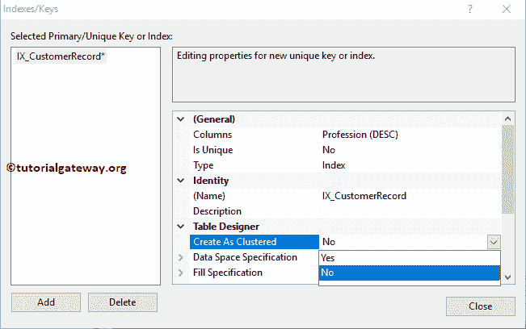

就这样！我们创造了它。现在，您可以看到数据是按收入降序排序的。

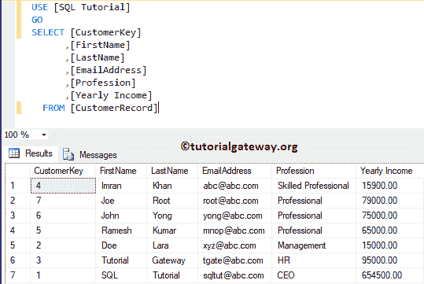