# SQL Server 中的非聚集索引

> 原文：<https://www.tutorialgateway.org/non-clustered-index-in-sql-server/>

SQL Server 中的非聚集索引将索引结构与物理存储在表中的数据分开存储。SQL Server 允许您为每个表创建几乎 999 个非聚集索引。SQL Server 中的非聚集索引对于提高查询性能非常有用。比方说，您想要按销售情况检索员工(这是一个常规报告)，那么您可以在销售中使用它来快速检索记录。

让我向您展示一下，如果您在 SQL Server 中创建一个非聚集索引，会发生什么。例如，如果您有一个包含以下记录的客户表。假设客户键是主键(意味着聚集索引)，但您需要按年收入检索记录。

在这种情况下，您必须在年收入列上创建一个非聚集索引。它会将年收入记录与行地址一起存储在不同的位置。当你询问收入= 79000 的客户记录时。首先，SQL 将在第二个表中查找 79000，在找到记录后，它将检查行地址。其次，它将在该行地址

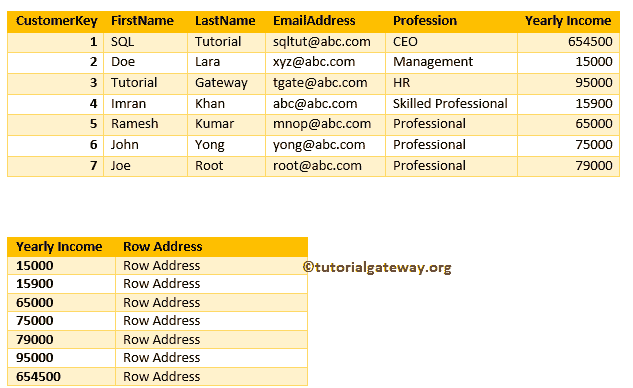

检索记录(从第一个表中)

在本章中，我们将向您展示如何使用 Transact SQL Query 和 SSMS

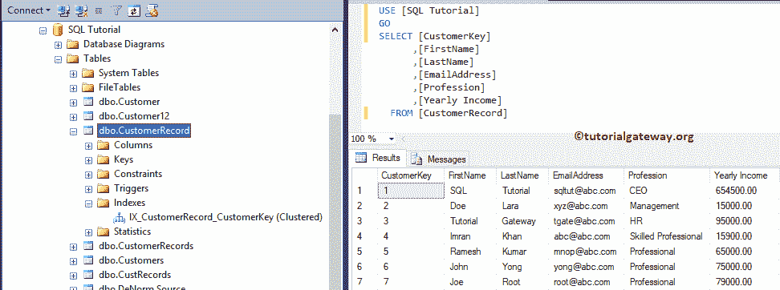

在 SQL Server 中创建和删除非聚集索引

## 在 SQL Server 中创建非聚集索引

本示例向您解释如何向现有表添加。语法是:

```
CREATE NONCLUSTERED INDEX Index_Name
ON Table_Name (Column_Name(s) ASC/DESC)
```

它将对客户记录表中的年收入列创建 SQL 非聚集索引

```
-- Create Non Clustered Indexes
CREATE NONCLUSTERED INDEX IX_CustomerRecord_YearlyIncome
ON CustomerRecord ([Yearly Income] ASC)
```

```
Messages
--------
Command(s) completed successfully.
```

让我使用 sp_helpindex 存储过程来检查客户记录表上的索引。

```
EXECUTE SP_HELPINDEX CustomerRecord
```

如您所见，年收入列有非聚集索引。

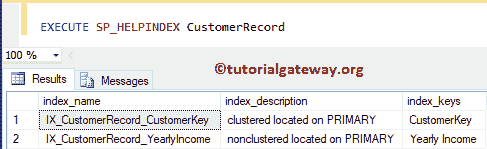

也可以使用 [SQL Server](https://www.tutorialgateway.org/sql/) 中的 [SP_HELP](https://www.tutorialgateway.org/useful-system-stored-procedures-in-sql/) 存储过程进行检查。

```
EXECUTE SP_HELP CustomerRecord
```

它显示关于该表的所有信息。

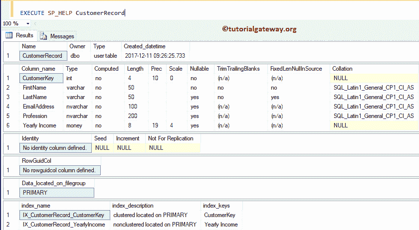

### 在 SQL Server 中创建复合非聚集索引

您需要在多列上创建非聚集索引。因此，您可以将同一个 SQL 非聚集索引指向多个列。在本例中，我们在专业列和年收入列上添加了复合 SQL 非聚集索引

```
CREATE NONCLUSTERED INDEX IX_CustomerRecord_ProfessionIncome
ON CustomerRecord ([Profession] DESC, [Yearly Income] ASC)
```

```
Messages
--------
Command(s) completed successfully.
```

现在你可以看到他们了。

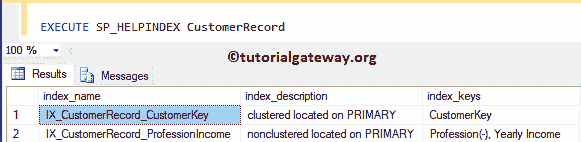

### 在 SQL Server 中创建多个非聚集索引

[SQL](https://www.tutorialgateway.org/sql/) 允许您为每个表创建多个非聚集索引。在本例中，我们在专业列中添加了非聚集索引，在年收入列中添加了另一个索引

```
CREATE NONCLUSTERED INDEX IX_CustomerRecord_Profession
ON CustomerRecord ([Profession] ASC)

CREATE NONCLUSTERED INDEX IX_CustomerRecord_Income
ON CustomerRecord ([Yearly Income] DESC)
```

```
Messages
--------
Command(s) completed successfully.
```

现在你可以看到多个指数

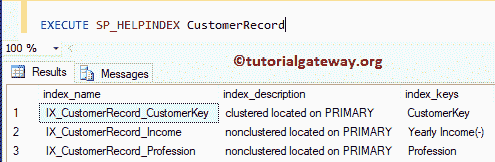

## 在 SSMS 中创建非聚集索引

让我告诉你，如何创建一个非聚集索引，如何使用 Management Studio 删除它

### 使用对象资源管理器在 SQL Server 中创建非聚集索引

在本例中，我们解释如何使用[Management Studio](https://www.tutorialgateway.org/sql-server-management-studio/)创建非聚集索引。

为此，请转到对象资源管理器并展开数据库文件夹。请展开要创建的表，右键单击索引文件夹将打开上下文菜单。请选择新建，然后选择非聚集索引..

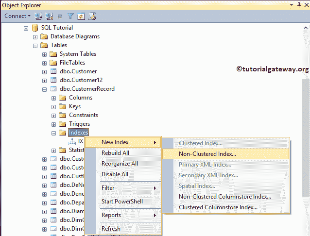

选择该选项后，将会打开一个新窗口，如下所示。请根据您的要求更改名称

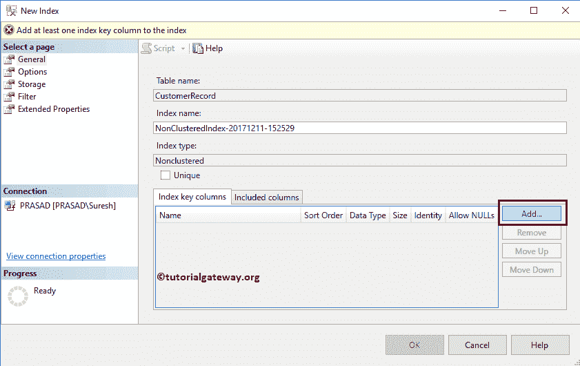

单击添加按钮，并选择要指定的列名。现在，我们选择姓氏列。

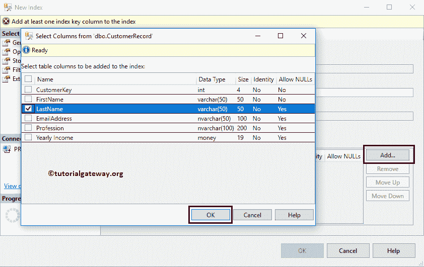

请更改排序顺序。

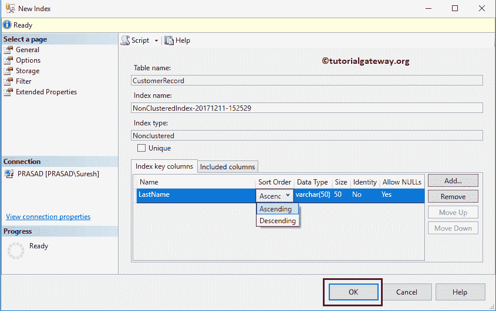

现在你可以看到

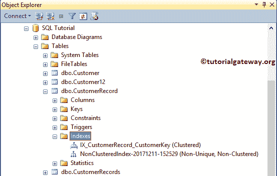

### 使用表设计器

请扩展您需要创建的表格，右键单击它将打开上下文菜单。请选择“设计”选项，在“设计器”窗口中打开该表。

接下来，右键单击该列并选择设置索引/键…选项。

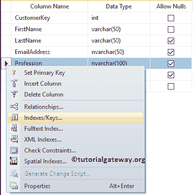

请点击添加按钮添加新的。选择添加选项后，SSMS 将为您创建一个索引。

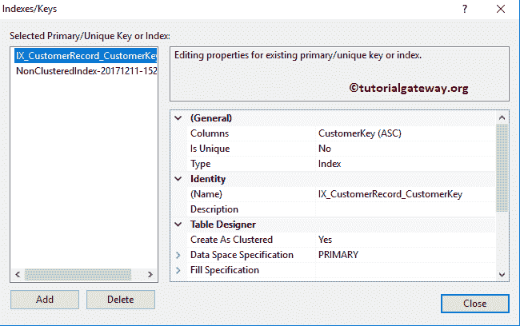

接下来，单击“列”选项旁边的“浏览”按钮来更改列。接下来，我们选择专业作为列名，降序是排序顺序。

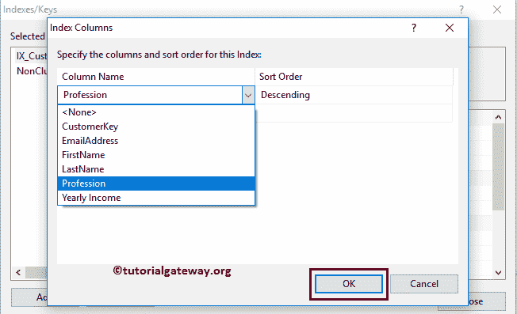

在表设计器下，请将“创建为集群”选项更改为“否”

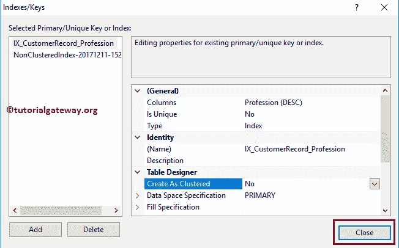

见新创建的

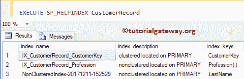

## 删除或删除 SQL Server 中的非聚集索引

请使用 DROP INDEX 语句删除或删除。

```
DROP INDEX CustomerRecord.IX_CustomerRecord_Profession
```

```
Messages
--------
Command(s) completed successfully.
```

### 使用 Management Studio 示例

在对象资源管理器中，展开数据库文件夹并选择它所在的表。接下来，展开“索引”文件夹，右键单击该名称将打开上下文菜单。请选择删除选项

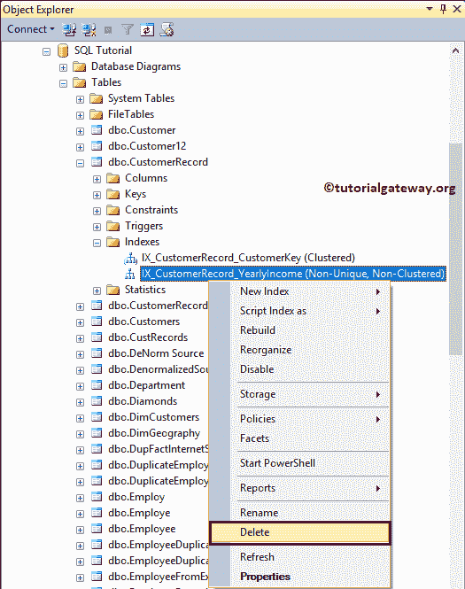

选择删除选项后，将打开删除对象窗口。单击“确定”删除 SQL Server 中的非聚集索引。

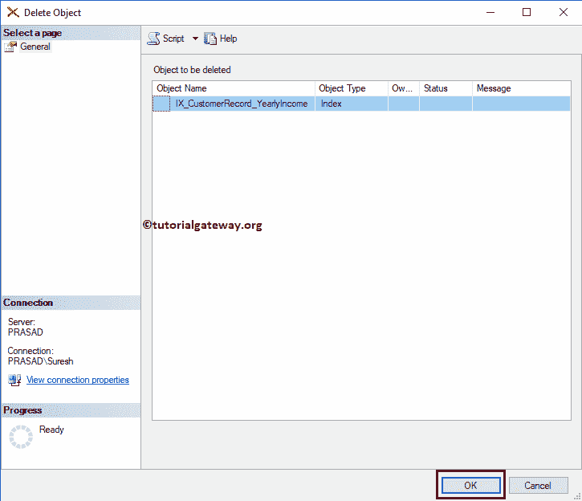