# SQL 中的过滤索引

> 原文：<https://www.tutorialgateway.org/filtered-indexes-in-sql/>

SQL 过滤索引是 SQL Server 2008 中引入的一项新功能。SQL Server 中的过滤索引只不过是一个带有`WHERE`子句的非聚集索引。由于`WHERE`子句，它将在一部分记录上执行(记录匹配 where 条件)。

在我们讨论在 SQL Server 中创建和删除过滤索引的示例之前，请记住以下几点

*   SQL 过滤索引将显著提高查询性能，因为它比[非聚集](https://www.tutorialgateway.org/non-clustered-index-in-sql-server/)小(适用于全表)
*   过滤索引的维护成本非常低，因为它很小。
*   SQL 过滤索引将减少磁盘存储空间。所以，只要有可能，就试一试。

我们创建了三个表员工 1、员工 2 和员工 3，如下所示 [SQL Server](https://www.tutorialgateway.org/sql/) 数据:

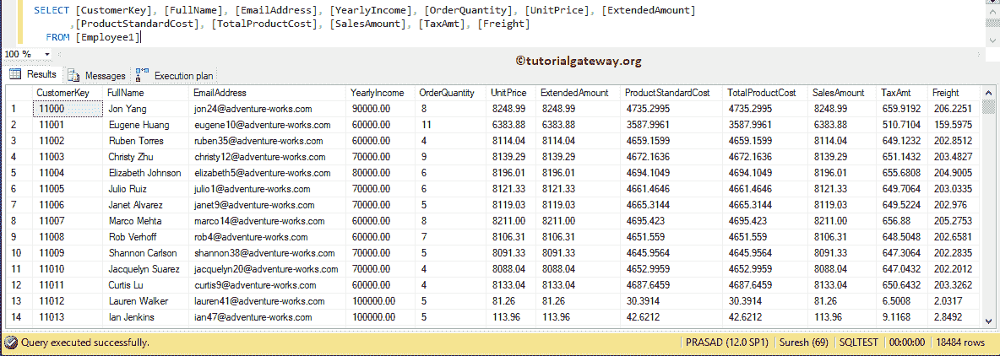

如果您想使用与我们在此过滤索引示例中使用的相同的数据，请使用下面的查询

```sql
USE [AdventureWorksDW2014]
GO
SELECT Cust.CustomerKey, 
	  Cust.[FirstName] + ' ' + Cust.[LastName] AS [FullName]
      ,Cust.[EmailAddress]
      ,Cust.[YearlyIncome]
      ,SUM([OrderQuantity]) AS [OrderQuantity] 
      ,SUM([UnitPrice]) AS [UnitPrice]
      ,SUM([ExtendedAmount]) AS [ExtendedAmount]
      ,SUM([ProductStandardCost]) AS [ProductStandardCost]
      ,SUM([TotalProductCost]) AS  [TotalProductCost] 
      ,SUM([SalesAmount]) AS [SalesAmount]
      ,SUM([TaxAmt]) AS [TaxAmt]
      ,SUM([Freight]) AS [Freight]
  FROM DimCustomer AS Cust
  JOIN  [FactInternetSales] on
  Cust.CustomerKey = FactInternetSales.CustomerKey
  GROUP BY Cust.CustomerKey, Cust.[FirstName], Cust.[LastName] 
      ,Cust.[EmailAddress], Cust.[YearlyIncome]
   ORDER BY Cust.CustomerKey
```

## 在 SQL Server 中创建过滤索引

在我们开始创建 SQL Server 过滤索引之前，让我向您展示查询的执行计划。以下语句将从员工 1 表

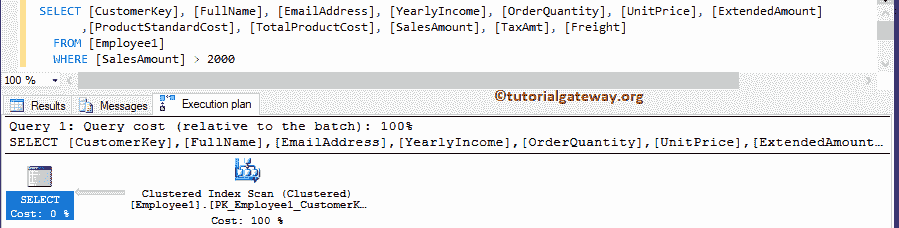

中选择所有记录

### 在 SQL Server 中创建非聚集索引

在开始创建过滤之前，让我在“销售额”列上创建一个基本的非聚集。我们在上一篇文章中已经解释了[非集群](https://www.tutorialgateway.org/non-clustered-index-in-sql-server/)的创建。所以，请参考相同的。

以下语句将在员工 2 表中的销售额列上创建一个 SQL Server 非聚集索引

```sql
CREATE NONCLUSTERED INDEX IX_Employee2_SalesAmount
ON Employee2 (SalesAmount)
```

```sql
Messages
--------
Command(s) completed successfully.
```

现在，我们将比较没有非聚集(员工 1)和有非聚集(员工 2)的查询的性能。下面的 [`WHERE`子句](https://www.tutorialgateway.org/sql-where-clause/)语句从“员工 1”和“员工 2”表中选择客户关键字和销售金额

```sql
SELECT [CustomerKey],  [SalesAmount]  FROM [Employee1]
WHERE [SalesAmount] > 2000;

SELECT [CustomerKey],  [SalesAmount]  FROM [Employee2]
WHERE [SalesAmount] > 2000;
```

如果观察执行计划，在我们创建非集群后，性能会有很大的不同。

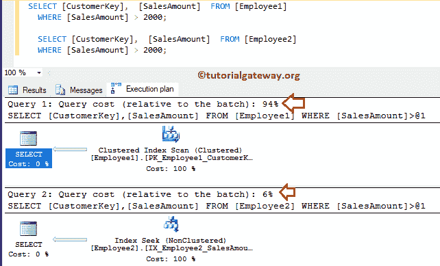

### 在 SQL Server 中创建过滤索引

在本例中，我们将向您展示如何将它们添加到现有的表中。语法是:

```sql
CREATE NONCLUSTERED INDEX Index_Name
ON Table_Name (Column_Name(s) ASC/DESC)
WHERE Some_Condition
```

下面的语句将在 Sql Server 中对员工 3 表中的销售额列创建一个过滤索引

```sql
CREATE NONCLUSTERED INDEX IX_Employee3_SalesAmount
ON Employee3 (SalesAmount)
WHERE [SalesAmount] > 1000
```

```sql
Messages
---------
Command(s) completed successfully.
```

这次，我们将比较没有非聚集(员工 1)、有非聚集(员工 2)和有过滤的查询的性能。以下语句将从员工 1、员工 2 和员工 3 表

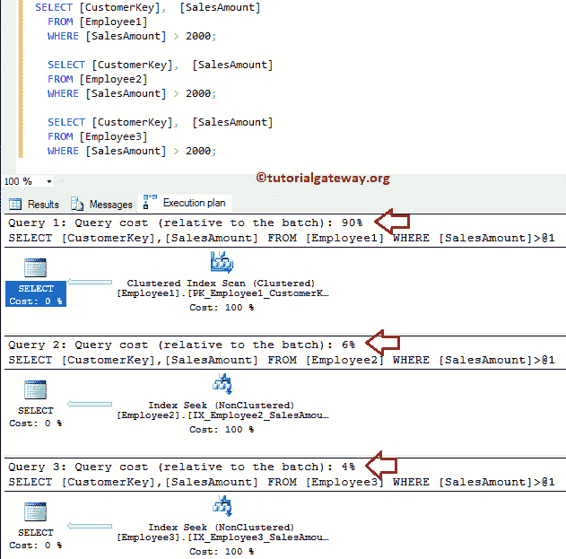

中选择客户关键字和销售金额

如果观察上面截图中的执行计划，我们在 SQL 中创建了 Filtered Index 之后，性能会有很大的差异。

下面的截图将向您展示我们到目前为止创建的所有文件。

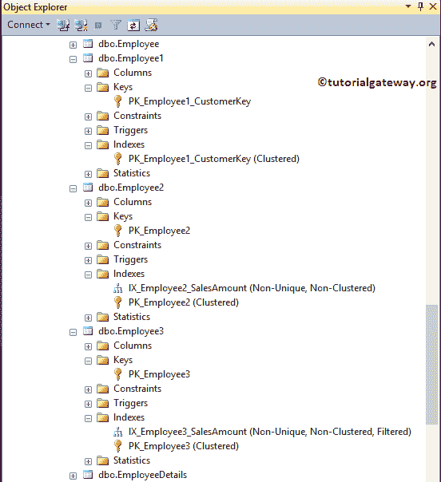

### 在 SQL Server 中创建复合过滤索引

[SQL](https://www.tutorialgateway.org/sql/) 允许您在多个称为复合的列上创建。因此，您可以将同一个索引指向多个列。在本例中，我们将其添加到“销售额”列和“年收入”列中

```sql
CREATE NONCLUSTERED INDEX IX_Employee4_SalesAmount
ON Employee4 ([YearlyIncome], SalesAmount)
WHERE [SalesAmount] > 1000
```

```sql
Messages
-------
Command(s) completed successfully.
```

### 如何找到关于他们的信息？

您可以使用 sp_helpindex 存储过程获取表中所有索引的信息。

```sql
EXECUTE SP_HELPINDEX Table_Name
```

让我使用 sp_helpindex 存储过程检查 Employee1、Employee2、Employee3 和 Employee4 表上的索引。

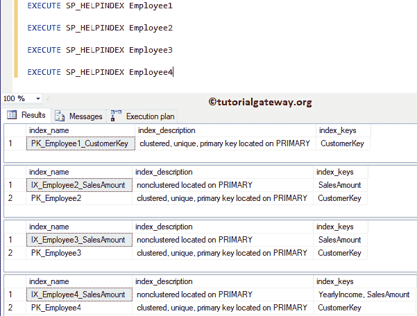

## 使用 SSMS 创建过滤索引

在这个示例中，我们向您展示了如何使用[Management Studio](https://www.tutorialgateway.org/sql-server-management-studio/)创建 SQL 过滤索引。为此，请展开要创建的表，右键单击文件夹将打开上下文菜单。接下来，请选择新建，然后选择非群集..选择权

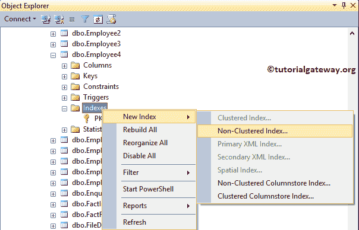

选择该选项后，将会打开一个新窗口。

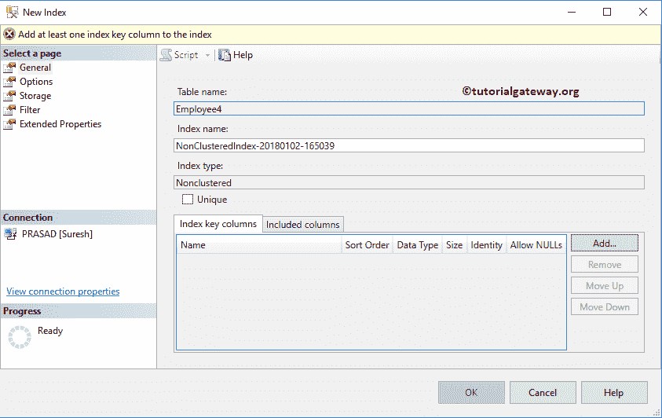

请根据您的要求更改名称。点击添加按钮选择栏目

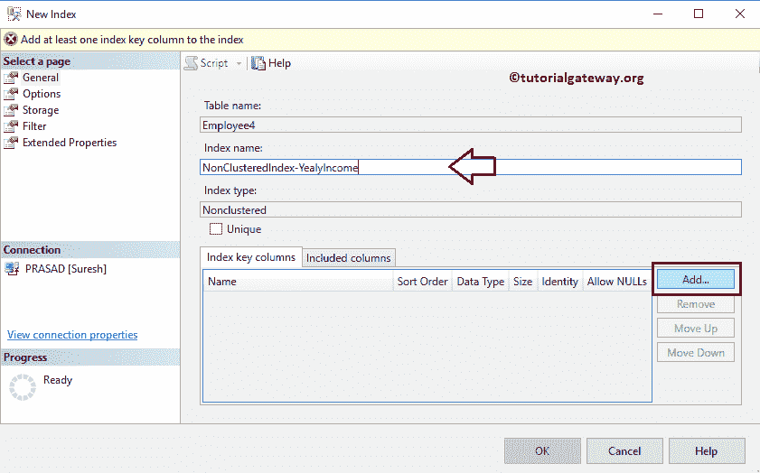

接下来，选择要指定的列名。现在，我们选择年收入栏。

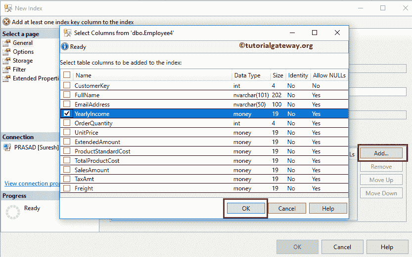

请更改排序顺序。

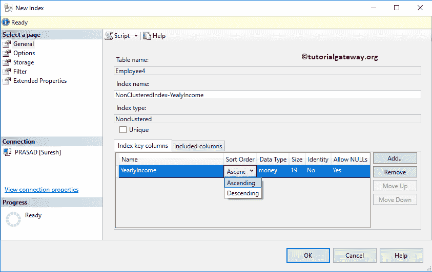

接下来，进入过滤页面，写下你的条件

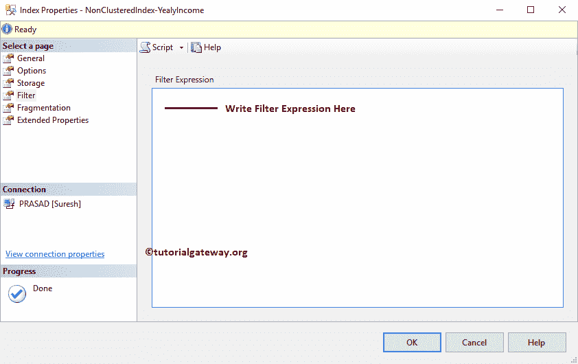

## 删除 SQL Server 中的过滤索引

请使用删除索引语句删除或删除 SQL Server 中的非聚集过滤索引

```sql
DROP INDEX Employee3.IX_Employee3_SalesAmount
```

```sql
Messages
--------
Command(s) completed successfully.
```

### 使用 SSMS 删除

要在 SQL Server 中删除，请选择过滤索引所在的表。接下来，展开“索引”文件夹，右键单击键名，选择删除选项

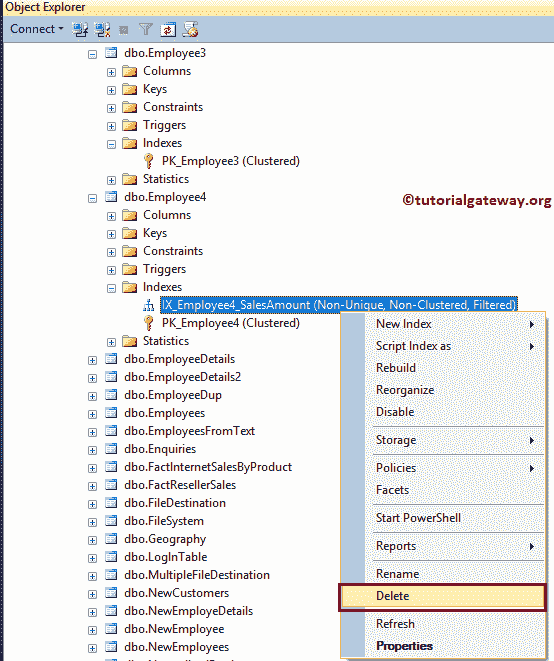

选择删除选项后，将打开删除对象窗口。单击确定删除。

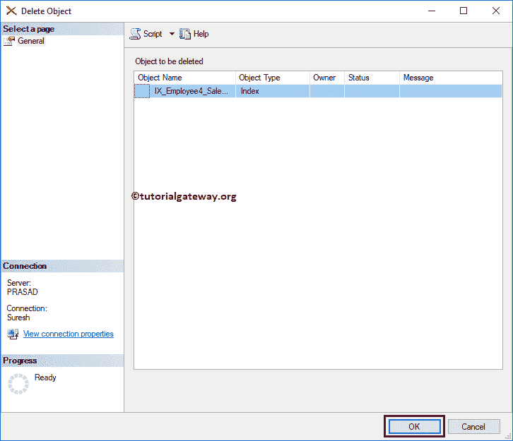