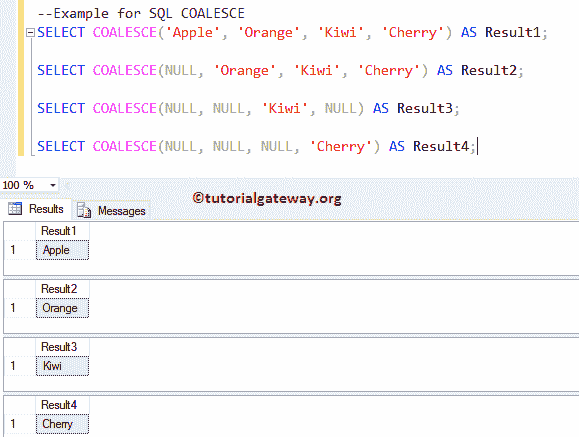
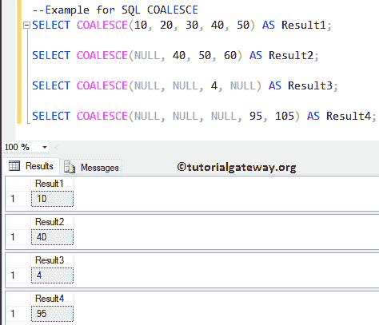
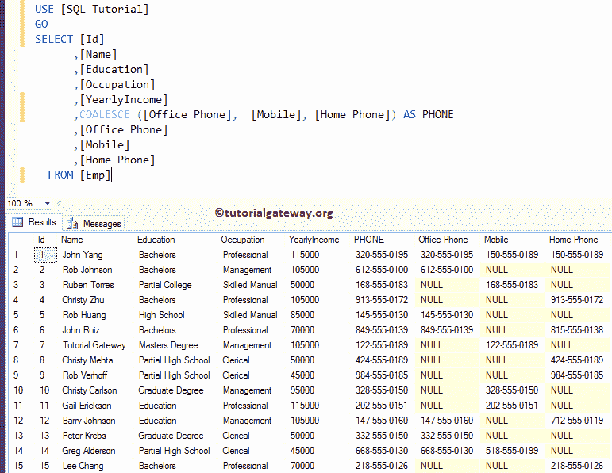

# SQL `COALESCE`函数

> 原文：<https://www.tutorialgateway.org/sql-coalesce-function/>

SQL `COALESCE`函数用于从一系列表达式中返回第一个非空值。让我们通过一个例子来看看如何使用 SQL Server 联合。这个`COALESCE`函数背后的基本语法是:

```sql
COALESCE (expression1, expression2, ......, expressionN)
```

## SQL 合并示例

对字符串数据使用此选项。

第一条语句返回 Apple 作为输出，因为该函数将返回第一个非空值

第二条 [SQL Server](https://www.tutorialgateway.org/sql/) 语句返回橙色作为输出。因为第一个为空，函数总是返回第一个非空值。

```sql
SELECT COALESCE('Apple', 'Orange', 'Kiwi', 'Cherry') AS Result1;

SELECT COALESCE(NULL, 'Orange', 'Kiwi', 'Cherry') AS Result2;

SELECT COALESCE(NULL, NULL, 'Kiwi', NULL) AS Result3;

SELECT COALESCE(NULL, NULL, NULL, 'Cherry') AS Result4;
```



数值合并的工作功能

```sql
SELECT COALESCE(10, 20, 30, 40, 50) AS Result1;

SELECT COALESCE(NULL, 40, 50, 60) AS Result2;

SELECT COALESCE(NULL, NULL, 4, NULL) AS Result3;

SELECT COALESCE(NULL, NULL, NULL, 95, 105) AS Result4;
```



## Sql Server 联合实例

如何在表上写这个函数？在本演示中，我们使用[Emp]表。

```sql
SELECT [Id]
      ,[Name]
      ,[Education]
      ,[Occupation]
      ,[YearlyIncome]
      ,[Office Phone]
      ,[Mobile]
      ,[Home Phone]
  FROM [Emp]
```

下面的截图显示了 Emp 表中的数据。如你所见，它有 15 张唱片。


在本例中，我们将使用 sql server 中的联合来找出每个员工的联系号码:

1.  如果员工有办公室号码，该函数将返回办公室号码。
2.  如果员工没有办公室号码，但他/她有手机，此功能显示手机。
3.  此外，如果 Emp 表中的员工没有办公室或移动电话号码，但他/她有家庭电话，则会显示家庭电话号码。
4.  如果员工有办公室、手机和家庭，那么它将返回第一个非空的，即办公室号码。

```sql
SELECT [Id]
      ,[Name]
      ,[Education]
      ,[Occupation]
      ,[YearlyIncome]
      ,COALESCE ([Office Phone],  [Mobile], [Home Phone]) AS PHONE
      ,[Office Phone]
      ,[Mobile]
      ,[Home Phone]
  FROM [Emp]
```

