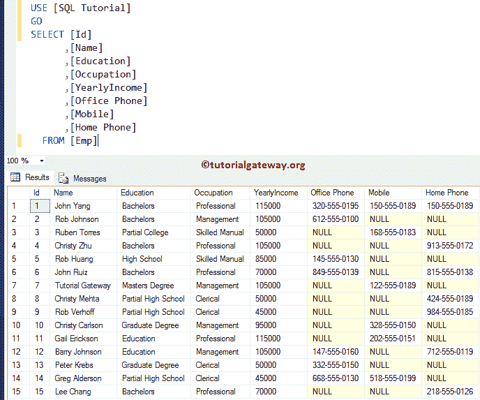

# SQL 是空函数

> 原文：<https://www.tutorialgateway.org/sql-is-null-function/>

SQL IS NULL 测试用户指定的表达式是否为空，如果为空，则返回 TRUE。否则，它返回 FALSE。这个 SQL IS NULL 的基本语法是

```
SELECT Column_Names 
FROM Table
WHERE Expression IS NULL
```

## 简单 SQL 为空示例

对于这个 SQL Server 为空的演示，我们将使用[TenCustomers]表，表内数据为


在本例中，我们使用该函数返回姓氏为空值的所有记录

```
USE [SQL Tutorial]
GO
SELECT [CustomerKey]
      ,[FirstName]
      ,[LastName]
      ,[EmailAddress]
      ,[YearlyIncome]
      ,[EnglishOccupation]
      ,[AddressLine1]
      ,[Phone]
  FROM [TenCustomers]
  WHERE [LastName] IS NULL
```


### 例 2

下图是 [SQL Server](https://www.tutorialgateway.org/sql/) Emp 表内部的数据，有 15 条记录。



以下为空查询返回办公室电话号码为空值的所有员工记录

```
SELECT [Id]
      ,[Name]
      ,[Education]
      ,[Occupation]
      ,[YearlyIncome]
      ,[Office Phone]
      ,[Mobile]
      ,[Home Phone]
  FROM [Emp]
  WHERE [Office Phone] IS NULL
```


它返回办公室电话和手机号码为空的员工。

```
SELECT [Id]
      ,[Name]
      ,[Education]
      ,[Occupation]
      ,[YearlyIncome]
      ,[Office Phone]
      ,[Mobile]
      ,[Home Phone]
  FROM [Emp]
  WHERE [Office Phone] IS NULL AND 
	[Mobile] IS NULL
```

