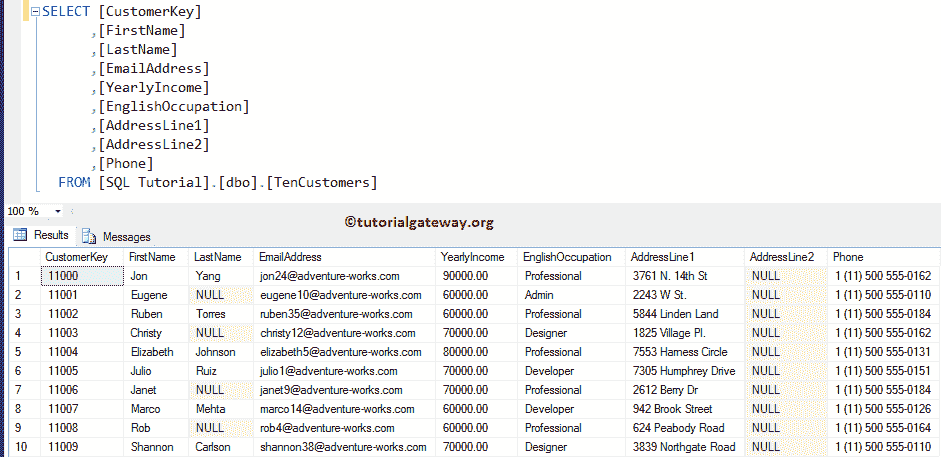
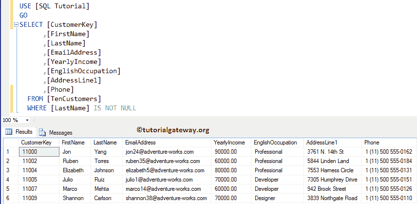
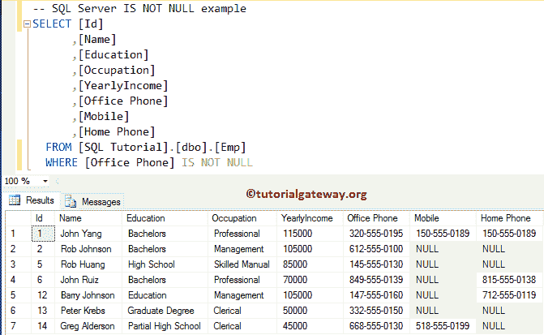
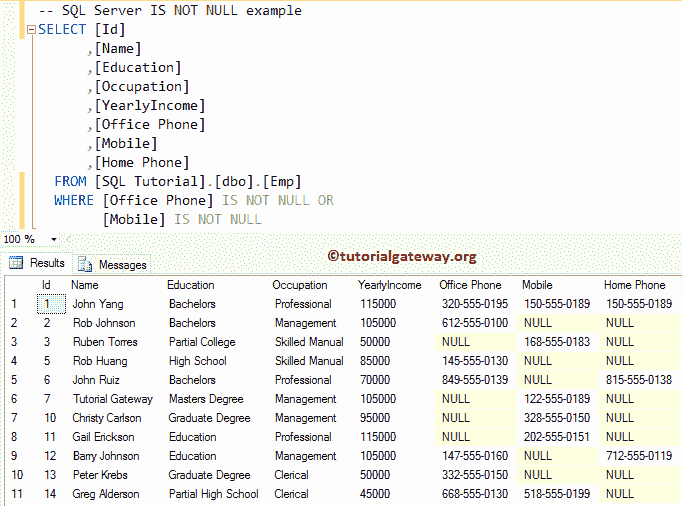

# SQL 不是空的

> 原文：<https://www.tutorialgateway.org/sql-is-not-null/>

用于查找指定表达式是否可为空，如果不可为空，则返回真。否则，它返回 FALSE。使用“不查找空值”总是明智的。这背后的语法是

```
SELECT Column_Names 
FROM Table
WHERE Expression IS NOT NULL
```

## SQL 不为空示例

下面的截图将显示表格中的数据。



在本例中，我们将使用它来选择并返回[客户]表中的所有客户记录，这些记录的姓氏不可为空值

```
SELECT [CustomerKey]
      ,[FirstName]
      ,[LastName]
      ,[EmailAddress]
      ,[YearlyIncome]
      ,[EnglishOccupation]
      ,[AddressLine1]
      ,[Phone]
  FROM [TenCustomers]
  WHERE [LastName] IS NOT NULL
```



这是另一个例子。这里，我们使用的是【Emp】表，这个 [SQL Server](https://www.tutorialgateway.org/sql/) 表里面的数据是


以下查询返回所有员工记录，其办公室电话号码为非空值

```
SELECT [Id]
      ,[Name]
      ,[Education]
      ,[Occupation]
      ,[YearlyIncome]
      ,[Office Phone]
      ,[Mobile]
      ,[Home Phone]
  FROM [Emp]
  WHERE [Office Phone] IS NOT NULL
```



下面的代码[选择](https://www.tutorialgateway.org/sql-select-statement/)所有办公室号码或手机号码不是空值的记录

```
SELECT [Id]
      ,[Name]
      ,[Education]
      ,[Occupation]
      ,[YearlyIncome]
      ,[Office Phone]
      ,[Mobile]
      ,[Home Phone]
  FROM [Emp]
  WHERE [Office Phone] IS NOT NULL OR 
	[Mobile] IS NOT NULL
```

