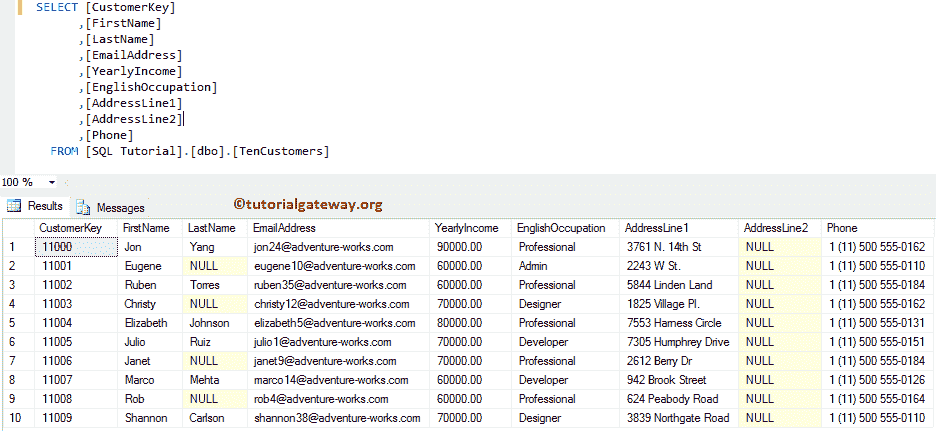
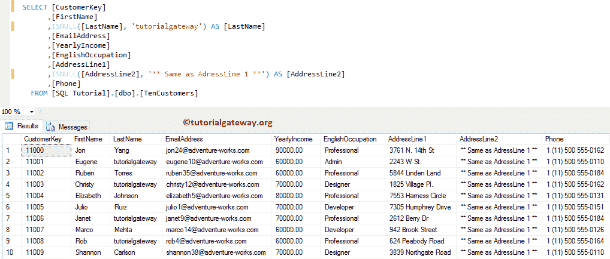

# SQL `ISNULL()`

> 原文：<https://www.tutorialgateway.org/sql-isnull/>

SQL `ISNULL()`函数验证表达式是否为空。如果为空，则 SQL `ISNULL()`函数将使用替换值替换空值。否则，它将返回原始值。

例如，当您选择所有产品和的折扣价时，如果您的结果返回几个空值怎么办。为了摆脱这些情况，我们可以在 SQL Server 中使用 ISNULL。

## SQL `ISNULL()`函数语法

SQL Server `ISNULL()`函数的语法是

```sql
SELECT ISNULL ([Check_Expression], [Replace_Expression])
FROM [Source]
```

如果观察以上语法，SQL `ISNULL()`函数通过接受两个参数返回结果:

*   Check_Expression:请指定要检查空值的有效表达式或列名。该函数将检查该列中的空值。
*   替换表达式:请指定要替换空值的有效表达式。此函数将使用此替换表达式替换检查表达式中的空值。

提示:如果检查表达式为空，则返回替换表达式。否则，Check_Expression 将返回。

对于这个 SQL `ISNULL()`函数示例，我们使用如下所示的数据



## SQL `ISNULL()`函数

如果观察上面的截图，LastName 列中几乎没有空值，[AddressLine2]只保存空值。在本例中，我们将使用此函数将 Lastname 列替换为“tutorialgateway”，将[AdressLine2]列替换为“**与 AdressLine 1 **相同”

```sql
SELECT [CustomerKey]
      ,[FirstName]
      ,ISNULL([LastName], 'tutorialgateway') AS [LastName]
      ,[EmailAddress]
      ,[YearlyIncome]
      ,[EnglishOccupation]
      ,[AddressLine1]
      ,ISNULL([AddressLine2], '** Same as AdressLine 1 **') AS [AddressLine2]
      ,[Phone]
  FROM [TenCustomers]
```



在下面的语句中，我们使用`ISNULL()`函数将[Lastname]列中的空值替换为“tutorialgateway”字符串。我们还使用[别名](https://www.tutorialgateway.org/sql-alias/)列将旧名称“姓氏”重新分配给该结果。您也可以使用 [SQL Server](https://www.tutorialgateway.org/sql/) 变量，而不是直接将字符串值作为第二个参数。

```sql
ISNULL([LastName], 'tutorialgateway') AS [LastName]
```

在下面的语句中，我们使用函数将[AdressLine2]列中的空值替换为“**与 AdressLine 1 相同**”字符串。我们还使用[别名](https://www.tutorialgateway.org/sql-alias/)列将旧名称【地址行 2】重新分配给该结果。

```sql
ISNULL([AddressLine2], '** Same as AdressLine 1 **') AS [AddressLine2]
```